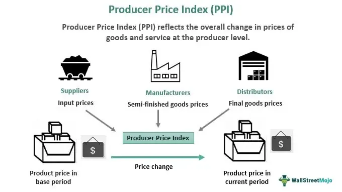

The Producer Price Index (PPI) is an essential economic indicator that reflects the average changes in prices received by domestic producers for their goods and services over time. By offering a detailed measure of wholesale inflation, the PPI becomes a crucial tool for economists and traders who utilize this data for a variety of applications, including economic forecasting and developing market strategies. This metric provides insight into price fluctuations at the production level rather than at the retail level, distinguishing it from the Consumer Price Index (CPI).

Understanding the PPI is imperative for those interested in economic trends and behaviors, as it serves as an early indicator of inflation. Changes in producer prices often preempt shifts in consumer prices, granting economists and investors the ability to forecast future market movements more accurately. By analyzing PPI data, stakeholders can gain valuable insights into potential inflationary pressures and adjust their economic and market strategies accordingly.



Moreover, the PPI plays a significant role in algorithmic trading, where automated systems utilize economic indicators to enhance decision-making processes. Traders leverage PPI data in combination with other economic indicators to predict financial market trends and movements, particularly those related to inflation expectations and interest rate adjustments. Recognizing the importance of the PPI in both national and global contexts enables more informed decision-making by integrating data that reflects the economic health and competitive positions of different countries.

## Table of Contents

## What is the Producer Price Index (PPI)?

The Producer Price Index (PPI) measures the average change over time in the selling prices received by domestic producers for their output. Functioning as an essential economic indicator, the PPI helps in understanding wholesale inflation by tracking price variations at the producer level, prior to reaching the consumer market. This index is published monthly by the U.S. Bureau of Labor Statistics (BLS) [^1].

The PPI differs from the Consumer Price Index (CPI), which centers on the prices consumers pay at the retail level. While CPI provides a view of price changes affecting consumers directly, PPI focuses on the cost changes faced by the producers of goods and services. This perspective allows for an earlier signal of inflation trends, as shifts in production costs often precede changes in retail pricing.

By reflecting the price trajectory of commodities, services, and construction activities from the producer's standpoint, the PPI serves as a critical indicator for assessing economic conditions and potential inflationary pressures within an economy. Furthermore, the index encompasses various industry-specific and commodity-based indices, offering a comprehensive overview of price dynamics across different sectors of the economy.

---

[^1]: Bureau of Labor Statistics. "Producer Price Indexes." U.S. Department of Labor. https://www.bls.gov/ppi/

## How PPI is Calculated

The Producer Price Index (PPI) is calculated by gathering and analyzing price data from a sample of approximately 25,000 producers across diverse industries. This data collection is conducted by the U.S. Bureau of Labor Statistics (BLS), which seeks to establish a comprehensive overview of price changes at the production level. 

The PPI encompasses both goods and services, allowing for the creation of industry-specific and commodity-specific indexes. To ensure these indexes accurately reflect the economic significance of various sectors, the calculation process involves assigning weights to different goods and services. These weights are determined based on the relative importance of each item within the overall economy.

The methodology for constructing the PPI is akin to that used for the Consumer Price Index (CPI), albeit with a production-oriented focus. The calculation involves using a fixed set of goods and services, known as the market basket, and periodically adjusting the sample and weights to represent current economic conditions accurately.

Mathematically, the index for a particular industry or commodity is calculated as follows:

$$

\text{PPI} = \left( \frac{\sum (P_{t} \times Q_{0})}{\sum (P_{0} \times Q_{0})} \right) \times 100 
$$

Where:
- $P_{t}$ is the current period price.
- $P_{0}$ is the base period price.
- $Q_{0}$ is the base period quantity.

This formula reflects the price change of a set quantity over time, allowing economists and analysts to trace cost variations from the perspective of producers.

Overall, the PPI provides a detailed measure of wholesale inflation, helping stakeholders understand cost dynamics across the economy’s production sectors.

## Understanding PPI as an Economic Indicator

The Producer Price Index (PPI) serves as a vital indicator for predicting inflationary trends, capturing price changes from producers' perspectives. PPI's role in economic analysis is critical because it provides an early signal of inflationary pressures that can eventually manifest in consumer-level prices as measured by the Consumer Price Index (CPI). By tracking PPI, economists and analysts can anticipate changes in CPI, as cost changes faced by producers are often passed on to consumers, influencing the overall price level in the economy.

Mathematically, if $PPI_t$ is the PPI at time $t$ and $CPI_{t+1}$ is the expected CPI at some future time $t+1$, the relationship can be approximated as:

$$
\Delta CPI \approx f(\Delta PPI)
$$

where $f$ is a function that incorporates various factors such as the degree of cost pass-through and the time lag between changes in PPI and their impact on CPI.

Moreover, the PPI is fundamental for understanding macroeconomic stability as it captures wholesale level price changes, providing insights into input cost fluctuations that affect economic sectors differently. By evaluating PPI shifts, policymakers can infer potential inflationary trends, enabling preemptive adjustments in monetary policies to maintain macroeconomic equilibrium. These insights are particularly important in setting [interest rate](/wiki/interest-rate-trading-strategies) policies and guiding decisions on inflation targeting.

In summary, PPI is a crucial tool for predicting inflation and understanding economic stability by highlighting price dynamics at the production level, reflecting broader economic trends that are significant for policymakers and economic strategists.

## Comparing PPI with CPI

The Producer Price Index (PPI) and the Consumer Price Index (CPI) are both crucial metrics used to evaluate inflation but serve different purposes due to their distinct methodologies and focal points. The PPI measures changes in the selling prices received by domestic producers for their output, essentially capturing price movements at the wholesale level. In contrast, the CPI focuses on retail prices experienced by consumers, measuring changes in the cost of a fixed basket of goods and services over time.

The difference in the calculation of these indices lies in their approach and scope. The PPI reflects price changes from the perspective of the producer, encompassing goods at various stages of production. It provides a broad view of how prices are evolving over the supply chain before goods reach the consumer. Conversely, the CPI concentrates on the final prices paid by consumers, heavily influenced by items like housing costs and consumer services, which are not included in the PPI.

The complementary nature of these indices offers a comprehensive understanding of inflation dynamics. While the PPI can give early indications of inflationary pressures by highlighting price changes at the production level, the CPI shows how these pressures translate to the consumer market. This dual insight helps circumvent the potential pitfalls of analyzing inflation based on a singular perspective. The absence of housing costs and consumer services in the PPI makes it particularly useful for identifying sector-specific inflation trends that might not readily appear in the CPI's broader analysis.

For instance, rapid increases in the PPI might suggest rising costs for other sectors subject to later pass-through to consumers, presaging similar movements in the CPI. Together, the PPI and CPI form a foundational basis for understanding the inflationary pipeline from production to consumption, enabling policymakers and economists to craft informed fiscal and monetary strategies.

## Algorithmic Trading and PPI

Algorithmic trading has transformed modern financial markets by integrating economic indicators such as the Producer Price Index (PPI) into sophisticated trading algorithms. These strategies utilize PPI data for predictive analytics and trend forecasting, enabling traders to anticipate and react swiftly to market movements. The PPI serves as a reliable indicator of inflationary pressures within the economy, influencing expectations about future interest rate adjustments and subsequently impacting asset prices.

Traders employ PPI data to gauge inflation trends, which directly affect interest rate decisions made by central banks. For instance, a rising PPI suggests increasing production costs, which might lead to inflationary pressures. Consequently, central banks may consider raising interest rates to curb inflation, affecting bond yields and equity prices. By analyzing PPI trends, traders can forecast these events and align their trading strategies accordingly.

Automated trading systems are designed to handle large datasets and execute trades instantaneously in response to PPI changes. These systems can integrate PPI alongside other economic indicators to refine decision-making processes. For instance, a trading algorithm might use the following simplified Python code to make trading decisions based on PPI data:

```python
def trading_strategy(ppi_current, ppi_previous):
    trend = ppi_current - ppi_previous

    if trend > 0:
        print("Inflation expected to rise. Consider shorting bonds.")
    elif trend < 0:
        print("Inflation expected to decrease. Consider buying bonds.")
    else:
        print("No significant change in inflation. Market remains neutral.")

# Example PPI values
ppi_previous_month = 120.5
ppi_current_month = 122.0

trading_strategy(ppi_current_month, ppi_previous_month)
```

Such algorithms evaluate the difference between current and past PPI values to signal potential trading actions, assessing whether inflation is likely to influence market behavior. By doing so, they not only enhance decision-making processes but also identify profitable opportunities across various asset classes.

In summary, the integration of PPI data into [algorithmic trading](/wiki/algorithmic-trading) strategies allows traders to capitalize on inflation dynamics and optimize their portfolios. These data-driven systems, equipped with robust analytical tools, enable market participants to navigate complex economic environments and enhance their trading outcomes.

## The Role of PPI in Global Markets

The Producer Price Index (PPI) provides critical insights into the competitive positioning of economies by facilitating the comparison of producer trends across different countries. This index measures changes in the prices that domestic producers receive for their goods and services, offering a clear picture of industry-specific inflation rates and overall economic health. For international investors and policymakers, understanding these trends is crucial in assessing the economic vitality and competitiveness of various sectors within an economy.

PPI data aids in evaluating how price changes at the production level affect global supply chains and influence international trade competitiveness. When producers in one country experience rising costs due to increasing PPI, this can lead to higher export prices, affecting the country's trade balance and potentially its currency valuation. Conversely, lower PPI values might indicate cost advantages that enhance export competitiveness.

In global markets, differential changes in PPI across countries present opportunities for currency and commodity traders. For instance, if the PPI in a major exporting country increases significantly compared to its trading partners, traders might anticipate changes in exchange rates due to expected shifts in monetary policy or foreign exchange interventions. Additionally, commodity traders can leverage PPI data to forecast price movements in raw materials and resources, as changes in producer prices often ripple through the entire supply chain, affecting commodity pricing.

Thus, PPI serves as a vital tool in global economic analysis, helping stakeholders to make informed decisions regarding investments, policy-making, and market strategies. Understanding its nuances allows for a deeper appreciation of cross-country economic dynamics and facilitates better financial and economic forecasting.

## Conclusion

The Producer Price Index (PPI) serves as a crucial instrument for comprehending domestic economic dynamics and crafting strategies in financial markets. By measuring average changes in prices from the producer's perspective, the PPI offers a granular view of inflationary trends before they reach the consumer level. This early insight into inflationary pressures allows traders to anticipate potential market movements and adjust their strategies accordingly.

The methodology behind PPI calculation—factoring in a comprehensive range of goods and services and their respective economic weights—ensures a detailed depiction of sector-specific inflation. This approach provides an informative backdrop for economic forecasting and policymaking. For traders, integrating PPI data with other economic indicators such as GDP growth rates and employment [statistics](/wiki/bayesian-statistics) can refine predictive analytics and enhance decision-making processes. 

To effectively utilize PPI in market predictions, stakeholders should consider its implications in tandem with other key economic metrics. This holistic analysis aids in identifying trends that could affect interest rates, commodity prices, and currency valuations. In sum, the PPI is an indispensable tool that, when combined with other data, supports informed decision-making across both domestic and international markets.

## References & Further Reading

[1]: U.S. Bureau of Labor Statistics. ["Producer Price Indexes."](https://www.bls.gov/pPI/) U.S. Department of Labor.

[2]: Jones, Charles I., and Dietrich Vollrath. ["Introduction to Economic Growth."](https://www.amazon.com/Introduction-Economic-Growth-Third-Charles/dp/039391917X) W.W. Norton & Company, 2013.

[3]: Lopez de Prado, Marcos. ["Advances in Financial Machine Learning."](https://www.amazon.com/Advances-Financial-Machine-Learning-Marcos/dp/1119482089) Wiley, 2018.

[4]: International Monetary Fund. ["Inflation and Deflation."](https://www.imf.org/en/Publications/fandd/issues/Series/Back-to-Basics/Inflation)

[5]: Investopedia. ["Understanding the Consumer Price Index."](https://www.investopedia.com/terms/c/consumerpriceindex.asp)