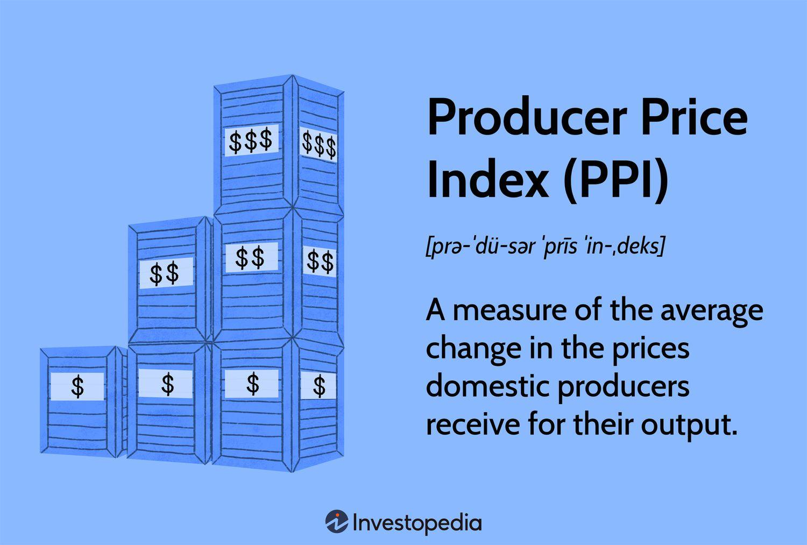

## Table of Contents

## What is the Producer Price Index (PPI)?

The Producer Price Index (PPI) is a measure that shows how the average prices that producers get for their goods and services change over time. It's like a report card for businesses, showing if they are getting more or less money for what they sell. The PPI is important because it can tell us if inflation is happening, which means prices are going up. Governments and businesses use this information to make decisions about the economy.

The PPI looks at prices at different stages of production. It can track prices from when raw materials are first sold, to when they are turned into finished products. This helps everyone understand where price changes are happening in the economy. For example, if the price of steel goes up, the PPI can show that, and then we can see if this affects the price of cars or buildings later on. By keeping an eye on these prices, the PPI helps us predict future price changes and plan accordingly.

## Why is the PPI important for the economy?

The Producer Price Index (PPI) is important for the economy because it helps us understand if prices are going up or down for businesses. When businesses sell their products, the PPI tracks these prices. If the PPI goes up, it means businesses are getting more money for what they sell. This can be a sign of inflation, which is when prices for everything start to rise. Knowing this helps governments and businesses plan for the future. They can adjust their prices, wages, and budgets to keep up with changes.

The PPI also helps us see where price changes are happening in the economy. It looks at prices at different stages, from raw materials to finished products. For example, if the price of oil goes up, the PPI can show that. Then, we can watch to see if this affects the price of gasoline or plastics later on. By tracking these changes, the PPI gives us a heads-up on what might happen next. This helps everyone from big companies to small businesses make smarter decisions about buying, selling, and investing.

## How does the PPI differ from the Consumer Price Index (CPI)?

The Producer Price Index (PPI) and the Consumer Price Index (CPI) are both important ways to measure price changes, but they look at different parts of the economy. The PPI focuses on the prices that businesses get for their goods and services before they reach the consumer. It tracks prices at different stages of production, from raw materials to finished products. This helps us understand how costs are changing for businesses and can signal if inflation is starting at the producer level.

On the other hand, the CPI measures the average change over time in the prices paid by urban consumers for a market basket of consumer goods and services. It looks at what people actually pay for things like food, housing, and transportation. The CPI is more about the end price that consumers see, and it helps us understand how inflation affects everyday life. While the PPI can give early warnings about price changes, the CPI shows how those changes impact the cost of living for consumers.

## What are the main components of the PPI?

The Producer Price Index (PPI) is made up of different parts that help us understand how prices change for businesses. One main part is the stage of processing, which looks at prices at different steps of making things. This includes raw materials, like steel or oil, that businesses buy to make their products. It also includes intermediate goods, which are partly finished products that go into making other things. Finally, it tracks finished goods, which are ready to sell to customers. By looking at these stages, the PPI helps us see where price changes are happening in the economy.

Another important part of the PPI is the industry classification. This part groups businesses by what they do, like farming, manufacturing, or services. It helps us see how prices are changing in different parts of the economy. For example, if prices for farming products are going up, but prices for manufacturing are staying the same, the PPI can show that. This information is useful because it helps us understand how different industries are doing and how they might affect each other.

## How is the PPI calculated?

The Producer Price Index (PPI) is calculated by looking at the prices of a bunch of different products and services that businesses sell. The U.S. Bureau of Labor Statistics, which is the group in charge of this, picks a big list of these items and keeps track of their prices over time. They use something called a "basket" of goods, which is just a way to say they look at a lot of different things all together. To figure out the PPI, they compare the prices of this basket from one time to another. If the total price of the basket goes up, the PPI goes up, showing that prices for businesses are rising.

The calculation of the PPI involves a few steps. First, they collect price data from businesses all over the country. They ask these businesses how much they are charging for their products and services. Then, they use a special math formula to turn all these prices into one number, the PPI. This formula takes into account how important each item is in the basket. Some items might be more important than others, so their prices have a bigger effect on the final number. By doing all this, the PPI gives us a good idea of how prices are changing for businesses across the economy.

## What data sources are used to compute the PPI?

The Producer Price Index (PPI) is calculated using price data collected from businesses all across the country. The U.S. Bureau of Labor Statistics, which is in charge of the PPI, gathers this information by reaching out to companies in different industries. They ask these businesses about the prices they charge for their products and services. This includes everything from raw materials like steel and oil to finished goods like cars and electronics. The more businesses they talk to, the better picture they get of what's happening with prices.

Once the Bureau of Labor Statistics has all this price data, they use it to figure out the PPI. They put all the prices into a big "basket" of goods and services, which helps them see the overall change in prices. They then use a special math formula to turn all these prices into one number, the PPI. This formula takes into account how important each item in the basket is. For example, if a certain product is really important to a lot of businesses, its price will have a bigger effect on the final PPI number. By doing this, the PPI gives us a clear idea of how prices are changing for businesses across the whole economy.

## What are the different stages of processing in PPI calculation?

The Producer Price Index (PPI) looks at prices at different stages of making things. The first stage is raw materials. These are things like steel, oil, or wood that businesses buy to make their products. The PPI tracks how the prices of these raw materials change over time. This helps us see if the cost of starting to make something is going up or down.

The second stage is intermediate goods. These are things that are partly finished and used to make other products. For example, car parts or fabric for clothes are intermediate goods. The PPI keeps an eye on their prices too. This shows us how the cost of making things changes as they move from raw materials to something more finished.

The final stage is finished goods. These are ready to sell to customers, like cars or clothes. The PPI looks at the prices of these finished goods to see if they are going up or down. By looking at all these stages, the PPI gives us a full picture of how prices change through the whole process of making things.

## How often is the PPI updated and reported?

The Producer Price Index (PPI) is updated and reported every month. This means that once a month, the U.S. Bureau of Labor Statistics looks at all the new price data they've collected and uses it to calculate a new PPI number. They do this to give us the most recent information about how prices for businesses are changing.

The monthly report comes out around the middle of the following month. For example, the PPI for January is usually released in the middle of February. This regular schedule helps everyone from businesses to government officials keep track of price changes and make plans based on the latest information.

## What are the common uses of the PPI in economic analysis?

The Producer Price Index (PPI) is really helpful for understanding the economy. It tells us if the prices businesses get for their goods and services are going up or down. When the PPI goes up, it might mean that inflation is starting because businesses are getting more money for what they sell. Governments and big companies use this information to make plans. For example, if the PPI is going up a lot, the government might decide to change interest rates to slow down inflation. Businesses might also use the PPI to decide if they should raise their prices or look for cheaper ways to make their products.

Another way the PPI is used is to see where price changes are happening in the economy. It looks at prices at different stages, like when raw materials are first bought, when they are partly finished, and when they are ready to sell. This helps everyone understand if price changes are starting at the beginning of the production process or later on. For instance, if the price of oil goes up, the PPI can show that early on. Then, we can watch to see if this makes the price of gasoline or plastics go up later. By tracking these changes, the PPI helps predict what might happen next in the economy and helps businesses and governments make smarter decisions.

## How does the PPI affect monetary policy decisions?

The Producer Price Index (PPI) is important for people who make decisions about money, like those at the central bank. When the PPI goes up, it means that businesses are getting more money for what they sell. This can be a sign that inflation is starting. If inflation is going up too fast, the central bank might decide to change interest rates to slow it down. Higher interest rates can make borrowing money more expensive, which can make people spend less and help keep prices from going up too fast.

The PPI also helps the central bank understand where price changes are happening in the economy. It looks at prices at different stages, from raw materials to finished products. If the PPI shows that prices for raw materials are going up a lot, it might mean that costs for businesses will go up soon. This information can help the central bank decide if they need to do something to keep the economy stable. By watching the PPI, they can make better choices about interest rates and other money policies to keep inflation under control and help the economy grow in a healthy way.

## What are the limitations and criticisms of the PPI?

The Producer Price Index (PPI) has some problems that people talk about. One big issue is that it doesn't always show the whole picture of the economy. The PPI only looks at the prices businesses get for what they sell, but it doesn't think about how much it costs them to make those things. This can make it hard to understand if businesses are really making more money or if their costs are going up too. Another problem is that the PPI can change a lot from month to month. This makes it tricky to use the PPI to predict what will happen in the future because the numbers can jump around.

Also, some people say the PPI doesn't include everything it should. For example, it might not cover all the new services that are becoming important in today's economy, like online stuff. This means the PPI might miss out on big changes in prices that are happening in these areas. Critics also worry that the PPI can be affected by one-time events, like a big jump in oil prices because of a problem in another country. These events can make the PPI numbers look different, even if they don't really show what's going on with prices in the long run.

## How can advanced statistical methods improve PPI accuracy?

Advanced statistical methods can make the Producer Price Index (PPI) more accurate by helping to smooth out the ups and downs that happen from month to month. These methods, like something called "seasonal adjustment," take out the changes that happen at the same time every year, like higher prices in the winter for heating oil. By doing this, the PPI can show us a clearer picture of what's really happening with prices, without being thrown off by these regular changes. Another method, called "hedonic regression," looks at how the quality of products changes over time. If a computer gets better but costs the same, this method can help the PPI see that the price is actually going down because you're getting more for your money.

Also, using more advanced data collection and analysis techniques can help make the PPI more accurate. For example, instead of just asking a few businesses about their prices, big data can be used to look at prices from a lot more places. This gives a better idea of what's happening all over the economy. Machine learning can also be used to find patterns in the data that might be hard for people to see. This can help predict price changes better and make the PPI more useful for understanding and planning for the future. By using these advanced methods, the PPI can give us a more reliable and detailed view of how prices are changing for businesses.

## How is PPI Calculated?

The Producer Price Index (PPI) is calculated by gathering and analyzing price data from a sample of approximately 25,000 producers across diverse industries. This data collection is conducted by the U.S. Bureau of Labor Statistics (BLS), which seeks to establish a comprehensive overview of price changes at the production level. 

The PPI encompasses both goods and services, allowing for the creation of industry-specific and commodity-specific indexes. To ensure these indexes accurately reflect the economic significance of various sectors, the calculation process involves assigning weights to different goods and services. These weights are determined based on the relative importance of each item within the overall economy.

The methodology for constructing the PPI is akin to that used for the Consumer Price Index (CPI), albeit with a production-oriented focus. The calculation involves using a fixed set of goods and services, known as the market basket, and periodically adjusting the sample and weights to represent current economic conditions accurately.

Mathematically, the index for a particular industry or commodity is calculated as follows:

$$

\text{PPI} = \left( \frac{\sum (P_{t} \times Q_{0})}{\sum (P_{0} \times Q_{0})} \right) \times 100 
$$

Where:
- $P_{t}$ is the current period price.
- $P_{0}$ is the base period price.
- $Q_{0}$ is the base period quantity.

This formula reflects the price change of a set quantity over time, allowing economists and analysts to trace cost variations from the perspective of producers.

Overall, the PPI provides a detailed measure of wholesale inflation, helping stakeholders understand cost dynamics across the economy’s production sectors.

## What is the understanding of PPI as an economic indicator?

The Producer Price Index (PPI) serves as a vital indicator for predicting inflationary trends, capturing price changes from producers' perspectives. PPI's role in economic analysis is critical because it provides an early signal of inflationary pressures that can eventually manifest in consumer-level prices as measured by the Consumer Price Index (CPI). By tracking PPI, economists and analysts can anticipate changes in CPI, as cost changes faced by producers are often passed on to consumers, influencing the overall price level in the economy.

Mathematically, if $PPI_t$ is the PPI at time $t$ and $CPI_{t+1}$ is the expected CPI at some future time $t+1$, the relationship can be approximated as:

$$
\Delta CPI \approx f(\Delta PPI)
$$

where $f$ is a function that incorporates various factors such as the degree of cost pass-through and the time lag between changes in PPI and their impact on CPI.

Moreover, the PPI is fundamental for understanding macroeconomic stability as it captures wholesale level price changes, providing insights into input cost fluctuations that affect economic sectors differently. By evaluating PPI shifts, policymakers can infer potential inflationary trends, enabling preemptive adjustments in monetary policies to maintain macroeconomic equilibrium. These insights are particularly important in setting [interest rate](/wiki/interest-rate-trading-strategies) policies and guiding decisions on inflation targeting.

In summary, PPI is a crucial tool for predicting inflation and understanding economic stability by highlighting price dynamics at the production level, reflecting broader economic trends that are significant for policymakers and economic strategists.

## References & Further Reading

[1]: U.S. Bureau of Labor Statistics. ["Producer Price Indexes."](https://www.bls.gov/pPI/) U.S. Department of Labor.

[2]: Jones, Charles I., and Dietrich Vollrath. ["Introduction to Economic Growth."](https://www.amazon.com/Introduction-Economic-Growth-Third-Charles/dp/039391917X) W.W. Norton & Company, 2013.

[3]: Lopez de Prado, Marcos. ["Advances in Financial Machine Learning."](https://www.amazon.com/Advances-Financial-Machine-Learning-Marcos/dp/1119482089) Wiley, 2018.

[4]: International Monetary Fund. ["Inflation and Deflation."](https://www.imf.org/en/Publications/fandd/issues/Series/Back-to-Basics/Inflation)

[5]: Investopedia. ["Understanding the Consumer Price Index."](https://www.investopedia.com/terms/c/consumerpriceindex.asp)