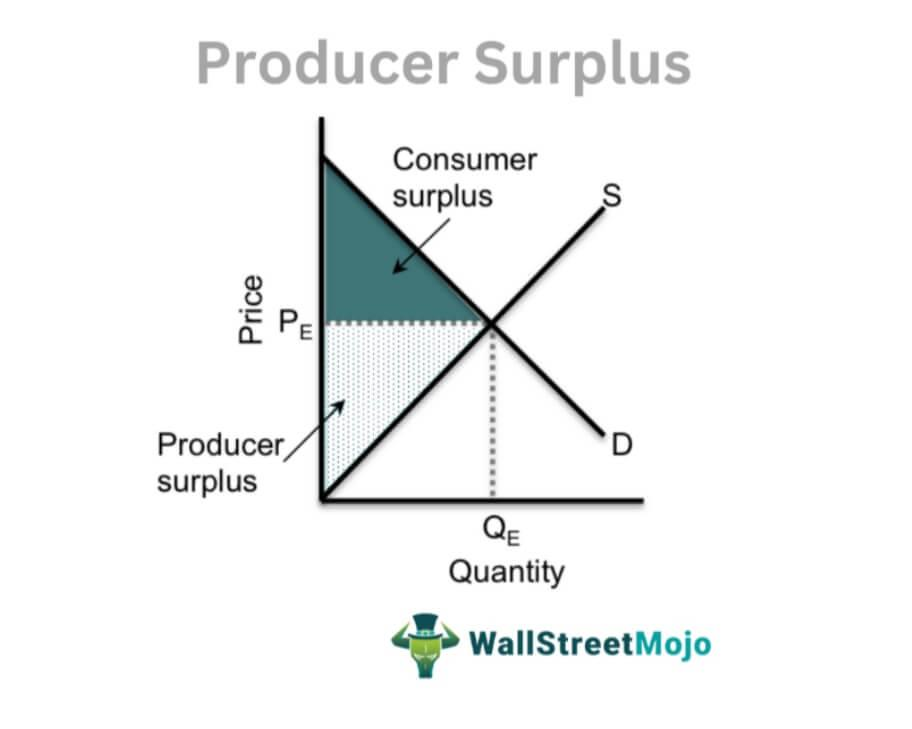

Understanding economic concepts such as surplus is essential in navigating the complexities of today's market dynamics and technological innovations. Economic surplus, which encompasses both consumer and producer surplus, reflects the additional benefits accrued by participants in a market transaction beyond the minimal acceptable price for producers or the maximum willingness to pay for consumers. These concepts are pivotal in assessing market efficiency and gauging economic welfare.

Algorithmic trading—an emerging technological advancement—utilizes computer algorithms to execute trades based on predetermined criteria. This trading method significantly influences market operations by optimizing strategies, enhancing liquidity, and reducing transaction costs. It leverages surplus management to exploit pricing advantages, leading to improved financial outcomes and resource allocation.



With the integration of economic surplus analysis and algorithmic trading, a deeper comprehension of market transactions emerges, offering insights into their broader financial implications. A harmonious blend of economic theories and advanced technologies is essential for achieving sustained market efficiency and supporting economic growth and welfare.

## Table of Contents

## Understanding Economic Surplus

Economic surplus is a fundamental concept in economics that quantifies the additional benefits accruing to participants in a market transaction. It is split into two main components: consumer surplus and producer surplus. These surpluses provide valuable insights into market efficiency and economic welfare.

Consumer surplus measures the benefit consumers receive when they pay a price lower than the maximum they're willing to pay for a good or service. It is calculated as the difference between what consumers are eager to pay and what they actually pay. Mathematically, consumer surplus can be represented by the area above the market price and below the demand curve on a supply and demand graph. This surplus highlights the value or utility that consumers derive from purchasing goods at market price, offering a critical measure of consumer welfare.

Producer surplus, conversely, is the benefit that producers gain when they sell a product at a market price higher than the minimum price at which they are willing to sell. It is calculated as the area above the supply curve and below the market price. This surplus serves as an indicator of the economic condition of producers, reflecting their operational efficiency and cost management. Producer surplus not only indicates profitability but also impacts decisions regarding resource allocation, production, and pricing strategies.

Together, consumer and producer surplus help assess market efficiency. In an efficient market, the allocation of resources maximizes total surplus, which is the sum of consumer and producer surplus. Markets reaching equilibrium—where supply equals demand—tend to achieve such optimal conditions, thus maximizing economic welfare. These concepts are pivotal in understanding how markets function and in evaluating the broader economic implications of market transactions.

## Supply and Demand Dynamics

The interplay between supply and demand is fundamental in establishing market equilibrium, where consumer and producer surplus are maximized. In an ideal scenario, the market equilibrium price corresponds to the point where the quantity demanded by consumers equals the quantity supplied by producers. This equilibrium ensures an efficient allocation of resources, where consumer and producer interests converge.

However, market dynamics can frequently lead to deviations from this equilibrium. An excess supply, where the quantity of goods exceeds consumer demand, often results in downward pressure on prices. This price adjustment increases consumer surplus as products become cheaper for buyers, but may reduce producer surplus since sellers receive less revenue. Conversely, when demand exceeds supply, prices tend to rise, enhancing producer surplus while potentially diminishing consumer surplus due to higher costs for buyers.

These dynamics are crucial for assessing economic health because they signal potential imbalances in resource allocation. For governments and businesses, understanding these shifts helps in making informed decisions on interventions, investments, and policies. For instance, during a demand surge, a business might choose to expand production or explore price adjustments to maximize revenue while maintaining consumer satisfaction.

In mathematical terms, the supply and demand model can be expressed as:

$$
Q_d = f(P)
$$
$$
Q_s = g(P)
$$

Where $Q_d$ is the quantity demanded, $Q_s$ is the quantity supplied, and $P$ is the price. The equilibrium is found where $Q_d = Q_s$.

To model these dynamics in Python, one may use a simple linear approximation:

```python
import numpy as np
import matplotlib.pyplot as plt

# Define demand and supply functions
def demand(price):
    return 100 - 2 * price

def supply(price):
    return 30 + 2 * price

# Calculate equilibrium
prices = np.linspace(0, 50, 100)
quantity_demanded = demand(prices)
quantity_supplied = supply(prices)

equilibrium_price = (100 - 30) / (2 + 2)  # Solve demand(price) = supply(price)
equilibrium_quantity = demand(equilibrium_price)

# Plot
plt.plot(prices, quantity_demanded, label='Demand')
plt.plot(prices, quantity_supplied, label='Supply')
plt.plot(equilibrium_price, equilibrium_quantity, 'ro', label='Equilibrium')
plt.xlabel('Price')
plt.ylabel('Quantity')
plt.title('Supply and Demand Dynamics')
plt.legend()
plt.show()
```

This code snippet visualizes how demand and supply curves intersect at the equilibrium point, aiding in the comprehension of how prices adjust toward balance. Understanding these concepts is essential for evaluating economic policies' impact, planning business strategies, and predicting market trends.

## Producer Surplus and Economic Welfare

Producer surplus represents the additional benefit producers receive when they sell goods at a market price that exceeds their minimum acceptable price. This surplus is a crucial aspect of understanding producers' economic position, as it reflects their production efficiency and ability to manage costs. The producer surplus is calculated as the area above the supply curve and below the market price on a supply and demand graph. Mathematically, it can be represented as:

$$
\text{Producer Surplus} = \int_{P_{\text{min}}}^{P_{\text{market}}} S(p) \, dp
$$

where $P_{\text{min}}$ is the minimum acceptable price, $P_{\text{market}}$ is the market price, and $S(p)$ is the supply function.

The producer surplus serves as a key indicator of economic welfare for producers since it signifies the profit over and above the costs incurred. A higher producer surplus typically indicates that producers are in a stronger economic position, allowing them to invest in more efficient production technologies or expand operations, thereby enhancing overall productivity. 

From a policy-making perspective, the relationship between producer surplus and economic welfare is critical. Policies aimed at increasing producer surplus can lead to improved economic conditions for producers, fostering job creation, and contributing to economic growth. For instance, reducing production costs through subsidies, improving access to markets, or investing in infrastructure can enhance producer surplus. 

Optimal resource allocation is another important aspect linked to producer surplus. Efficient market outcomes are achieved when resources are allocated in a manner that maximizes total surplus, which is the sum of consumer and producer surplus. Policymakers use this understanding to achieve economic objectives such as price stability, market efficiency, and equity. 

In summary, producer surplus not only measures the excess benefits received by producers but also drives critical economic policies aimed at improving market efficiency and economic welfare. By leveraging producer surplus insights, policymakers can devise strategies that support producers and contribute to sustainable economic development.

## Algorithmic Trading: A Modern Approach

Algorithmic trading, often referred to as algo trading, is a trading method that utilizes computer algorithms to execute trades automatically according to pre-set rules and conditions. This innovative approach has revolutionized the financial markets by allowing traders to respond swiftly to changes, thus executing trades with precision and speed that are unattainable with manual trading.

One of the primary advantages of [algorithmic trading](/wiki/algorithmic-trading) is its ability to enhance market [liquidity](/wiki/liquidity-risk-premium). By automating the process of trade execution, algorithms can quickly match buyers with sellers, thereby reducing the bid-ask spread. This improved liquidity facilitates smoother and more efficient market operations, contributing to an overall healthier financial environment.

Moreover, algorithmic trading is instrumental in reducing transaction costs. Traditional trading involves various costs, including slippage, commissions, and market impact costs, which can be significantly minimized through algo trading. Algorithms are designed to optimize the timing, price, and quantity of trades, which helps in minimizing the impact on the market and costs associated with trading activities.

Algorithmic trading also aids in effectively managing economic surplus by exploiting small price discrepancies in the market. These algorithms are capable of executing high-frequency trades to take advantage of transient undervaluations or overvaluations, thereby efficiently reallocating resources in the financial markets. For instance, [arbitrage](/wiki/arbitrage) strategies utilize price differences of similar or identical financial instruments across different markets to generate profit without risk.

However, algorithmic trading introduces significant risks, such as potential market misinterpretations. Since algorithms rely heavily on historical data and deterministic rules, there is always a possibility that unforeseen market conditions or anomalies can lead to suboptimal trading decisions. This risk underscores the need for robust risk management frameworks and adaptive algorithms that can adjust to new data patterns and market variables.

Additionally, the rapid and automated nature of algorithmic trading can exacerbate market [volatility](/wiki/volatility-trading-strategies) if not properly managed. Large volumes of trades executed in a short period can lead to price fluctuations that may not reflect the true economic value of the traded assets, potentially leading to market instability.

In conclusion, while algorithmic trading offers substantial benefits in terms of market efficiency, liquidity, and cost reduction, the implementation of comprehensive risk management strategies is critical. By addressing these challenges, market participants can harness the full potential of algorithmic trading, thus contributing to a more stable and efficient financial system.

## Intersections: Surplus and Algorithmic Strategies

Algorithmic trading strategies have become a transformative force in optimizing surplus management, leveraging both economic theories and advanced technologies. These strategies analyze market data to detect patterns, thereby exploiting trading opportunities that arise in conditions of economic surplus. This approach not only facilitates better resource allocation but also contributes to market stability.

Economic surplus is inherently linked to market conditions, where imbalances between supply and demand create opportunities for traders. Algorithmic trading employs sophisticated algorithms that can process vast amounts of data faster than human capabilities. These algorithms identify price discrepancies, arbitrage opportunities, and optimal trading times that can maximize the economic surplus.

For instance, consider a situation where a producer faces excess supply. Instead of letting this surplus result in unsold inventory, they can utilize algorithmic strategies to dynamically adjust pricing. By analyzing real-time market data, algorithms can determine the ideal price that aligns with current demand levels, thereby maximizing revenue. Additionally, these algorithms can suggest entering alternative markets where the surplus could be better absorbed, thus reducing waste and enhancing overall economic welfare.

Furthermore, algorithms can be employed to hedge against market price declines. Through techniques such as [statistical arbitrage](/wiki/statistical-arbitrage), algorithms can identify and execute trades that counterbalance potential losses from price drops. For example, if a producer detects a downward trend in prices, an algorithm could automatically initiate trades in correlated assets whose value might increase, thereby offsetting potential losses.

Below is a simple Python code snippet that demonstrates how an algorithm might dynamically adjust prices based on real-time demand data:

```python
# Sample Python code for dynamic pricing based on demand
class MarketData:
    def __init__(self, supply, demand):
        self.supply = supply
        self.demand = demand

def dynamic_pricing(market_data):
    base_price = 100  # Base price of the product
    price_adjustment_factor = 0.01  # Price adjustment per unit of demand

    # Adjust price based on demand-supply ratio
    if market_data.demand > market_data.supply:
        price = base_price + (market_data.demand - market_data.supply) * price_adjustment_factor
    else:
        price = base_price - (market_data.supply - market_data.demand) * price_adjustment_factor

    return max(price, 0)  # Ensures price doesn't drop below zero

# Example usage
market_data = MarketData(supply=1000, demand=1200)
adjusted_price = dynamic_pricing(market_data)
print(f"The dynamically adjusted price is: {adjusted_price}")
```

In summary, algorithmic trading strategies enhance surplus management by dynamically aligning prices with market conditions, improving resource allocation, and ensuring market equilibrium. These strategies provide a competitive edge by leveraging economic principles through technological advancements, thus stabilizing markets and fostering economic health.

## Future Directions: AI and Machine Learning in Algorithmic Trading

Advancements in [artificial intelligence](/wiki/ai-artificial-intelligence) (AI) and [machine learning](/wiki/machine-learning) (ML) are rapidly transforming algorithmic trading strategies, offering immense potential to enhance market performance and surplus management. AI and ML technologies provide sophisticated tools to improve market forecasts by analyzing vast datasets, identifying patterns, and predicting market trends with higher accuracy than traditional methods. These technologies enable trading algorithms to adapt in real-time, mitigating risks and capitalizing on short-lived opportunities.

AI and ML facilitate the refinement of surplus management strategies by processing a multitude of market signals and dynamically adjusting trading positions. This ensures that trades are executed not only based on static historical data but also on evolving market conditions. Machine learning models, particularly those utilizing [reinforcement learning](/wiki/reinforcement-learning), enable trading algorithms to learn from historical and real-time data, optimizing decision-making processes for maximizing economic surplus.

Continual technological innovation supports the development of more resilient trading strategies. AI-driven algorithms can simulate numerous market scenarios, estimating potential impacts on consumer and producer surplus. This capability allows for better risk assessment and strategic planning, ensuring efficient allocation of resources in fluctuating markets.

Python, as a preferred language in this domain, offers numerous libraries such as TensorFlow and PyTorch for implementing AI and ML models in trading. For instance, the following Python code snippet demonstrates a simple use case of linear regression for predicting stock prices based on historical data:

```python
import pandas as pd
from sklearn.model_selection import train_test_split
from sklearn.linear_model import LinearRegression

# Load the dataset
data = pd.read_csv('historical_stock_prices.csv')

# Feature selection
X = data[['Previous_Close', 'Trade_Volume']]
y = data['Next_Close']

# Split the data
X_train, X_test, y_train, y_test = train_test_split(X, y, test_size=0.2, random_state=42)

# Train the model
model = LinearRegression()
model.fit(X_train, y_train)

# Predict prices
predictions = model.predict(X_test)

# Output predicted prices
print(predictions)
```

As AI and ML continue to evolve, trading strategies will progressively integrate these technologies to enhance surplus management through improved predictive analytics, real-time adaptation, and robust risk strategies, steering financial markets toward greater efficiency and sustainability.

## Conclusion

Economic surplus, coupled with the adoption of algorithmic trading, plays a significant part in molding today's financial and market landscapes. By efficiently managing surplus through technological advancements, companies can improve market efficiency and drive sustainable growth. This benefit arises from the ability of algorithmic systems to respond swiftly to market fluctuations, adjusting pricing and resource allocation dynamically to optimize the balance between supply and demand.

Harnessing algorithmic trading not only reduces transaction costs but also enhances liquidity in markets, contributing to overall economic welfare. The intelligent integration of economic theories and computational methods such as artificial intelligence (AI) and machine learning enables sophisticated analyses of market conditions, which can improve prediction accuracy. Enhanced predictive capabilities facilitate more precise adjustments in trading strategies, helping firms and investors to capitalize on market inefficiencies and surplus opportunities.

As the symbiosis between economic theory and computing technology deepens, it is expected to dictate future market dynamics and economic strategies. Technological innovations are continuously refining approaches to surplus management, ensuring that the advantages of economic surplus are maximized. Simultaneously, these innovations create safeguards to mitigate potential volatility introduced by algorithmic practices. Thus, entities capable of effectively navigating this landscape are poised to secure competitive advantages and promote economic resilience.

Looking forward, the ongoing innovation in AI and machine learning is set to further reshape the ways surplus and market strategies are managed. By harnessing these tools, financial entities can expect enhanced agility and robustness in adapting to ever-changing market conditions. This blend of economic insights and technological prowess promises a future of more efficient and stable financial markets.

## References & Further Reading

[1]: Mas-Colell, A., Whinston, M. D., & Green, J. R. (1995). ["Microeconomic Theory."](https://archive.org/details/microeconomic-theory-mas-colell-whinston-green-1995) Oxford University Press.

[2]: ["Algorithmic Trading and DMA: An Introduction to Direct Access Trading Strategies"](https://archive.org/details/algorithmictradi0000john) by Barry Johnson

[3]: Varian, H. R. (1992). ["Microeconomic Analysis."](https://archive.org/details/microeconomicana00vari_0) W.W. Norton & Company.

[4]: "The Impact of Algorithmic Trading on Market Dynamics: Evidence from the New York Stock Exchange" by Hendershott, T., Jones, C. M., & Menkveld, A. J. (2011). ["The Journal of Finance."](https://www.jstor.org/stable/pdf/26652722.pdf?addFooter=false)

[5]: Friedman, M. (1976). ["Price Theory."](https://en.wikipedia.org/wiki/Price_Theory_(Milton_Friedman)) Aldine Transaction. 

[6]: Lo, A. W. (2017). ["Adaptive Markets: Financial Evolution at the Speed of Thought."](https://www.jstor.org/stable/j.ctvc77k3n) Princeton University Press.