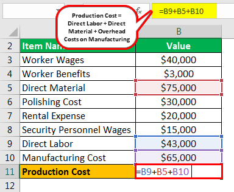

Understanding the intricacies of production costs and manufacturing expenses is crucial for any business involved in manufacturing and trading. These financial elements serve as the backbone for determining pricing strategies, operational efficiency, and overall profitability. In particular, the dynamic field of algorithmic trading has heightened the importance of precise cost management, necessitating a deeper exploration of how these costs interact. In this article, we explore the intersection of production costs, manufacturing expenses, and algorithmic trading, providing insights into how businesses can optimize their financial strategies.

At the heart of managing production costs lies the accurate calculation of both direct and indirect expenses. Direct costs, such as labor and raw materials, are easily identifiable and directly attributable to the production process. Conversely, indirect costs encompass overhead expenses like facility maintenance and utility costs, which require sophisticated allocation techniques to accurately reflect their impact on production. Proper management of these costs ensures efficient resource utilization, which can directly influence a company's financial health.



Algorithmic trading can benefit significantly from principles of cost calculation used in manufacturing. By applying these, traders can refine their cost analysis to differentiate between explicit costs, such as commissions, and implicit costs, like bid-ask spreads. This precise cost understanding aids in aligning trading strategies with financial expenditures, ultimately fostering profitability. 

The focus of this article will be on understanding these costs in the context of algorithmic trading and finding ways to optimize them. By exploring how production and trading costs intersect, businesses can leverage these insights to enhance decision-making processes and ultimately achieve greater financial success. Through strategic cost management and informed resource allocation, companies are better positioned to withstand market fluctuations and maintain a competitive edge.

## Table of Contents

## Understanding Production and Manufacturing Costs

Production costs encompass a variety of direct and indirect expenses required to manufacture a product. These costs are essential to understand for businesses involved in production or manufacturing, as they influence budgeting, pricing, and resource allocation strategies.

The primary components of production costs include labor, raw materials, and manufacturing overhead:

1. **Labor Costs**: These are the wages paid to employees who are directly involved in the manufacturing process. Labor costs can be categorized into direct labor (workers on the production line) and indirect labor (supervisors and maintenance staff). Accurate estimation and management of labor costs are vital as they directly affect the overall production expenditure.

2. **Raw Materials**: These refer to the tangible inputs used in the creation of a product. The cost of raw materials is a direct expense and varies depending on market conditions, availability, and procurement processes. Efficient management of raw material costs involves strategic sourcing and inventory control to avoid wastage and reduce expenses.

3. **Manufacturing Overhead**: This includes all other costs that are not directly linked to production but still essential for the manufacturing process. Examples include utility costs, depreciation of equipment, factory rent, and maintenance expenses. Overhead can be further divided into fixed and variable costs, where fixed are stable over time and variable change with the level of production.

**Manufacturing Costs vs. Production Costs**

Manufacturing costs are specifically associated with the direct costs involved in the creation of a product, such as raw materials and direct labor. On the other hand, production costs include both direct manufacturing costs and indirect costs or overheads. Understanding the distinction between these cost categories helps businesses allocate resources more effectively and develop strategic pricing decisions.

To manage finances effectively, businesses must categorize these costs properly:

- **Direct Costs**: These are directly tied to the product itself and include raw materials and direct labor. Accurate tracking of direct costs ensures each product line's profitability can be analyzed accurately.

- **Indirect Costs**: These are not directly attributable to a specific product but are necessary for the overall production process, such as utilities or facility rents. Indirect costs need to be allocated across different product lines based on logical and systematic methodologies.

Proper categorization and understanding of these costs enable businesses to conduct a detailed cost analysis. This analysis aids in optimizing resource allocation by ensuring that expenditures align with business strategy and market demands. Additionally, strategic pricing based on comprehensive cost data can improve competitive positioning in the market.

In conclusion, understanding the nuances of production and manufacturing costs is critical for businesses seeking to optimize their operations and enhance profitability. By distinguishing between different types of costs and implementing effective cost management practices, businesses can achieve more efficient financial planning and stable economic growth.

## Cost Calculation in Manufacturing

Calculation of manufacturing costs is a fundamental component of financial planning and resource management in manufacturing industries. It encompasses both direct and indirect expenses and serves as a basis for establishing competitive pricing strategies.

Direct expenses in manufacturing cost calculations are composed of materials and labor costs. These are expenses that can be directly attributed to the production process. Material costs involve the purchase and transportation of raw materials and components used in production. Labor costs include wages and benefits directly related to the production workforce.

Indirect costs, also known as manufacturing overhead, represent expenses that cannot be directly traced to a single product. These include costs associated with electricity, depreciation of equipment, quality control, and machinery maintenance. Allocating these indirect costs accurately to products is crucial, as they contribute significantly to the overall production expenses.

An essential aspect of manufacturing cost calculation is determining the cost per unit, which aids in developing a pricing strategy. The cost per unit is calculated by dividing the total manufacturing costs by the number of units produced:

$$
\text{Cost per unit} = \frac{\text{Total Manufacturing Costs}}{\text{Number of Units Produced}}
$$

This calculation helps manufacturers price their products competitively while ensuring their costs are covered. Moreover, it provides insights into the cost structure, enabling more strategic decisions in pricing and resource allocation.

Manufacturers face the challenge of balancing fixed and variable costs to maintain efficiency. Fixed costs, such as rent and salaries, remain constant irrespective of production output levels. Variable costs, such as raw materials and direct labor, fluctuate with production [volume](/wiki/volume-trading-strategy). Efficient production levels are achieved when manufacturers optimize the mix of these costs to streamline operations without compromising productivity.

Effective cost calculation in manufacturing can lead to significant reductions in waste and improvements in operational efficiency. By accurately tracking and analyzing costs, businesses can identify areas where resources may be wasted and implement strategies to reduce such inefficiencies. For example, adopting lean manufacturing principles or investing in automation technologies can lead to improved cost structures.

In Python, data analysis and simulations can help manufacturers model various cost scenarios to arrive at the most efficient production strategies. A simple Python snippet might look like this:

```python
# Example Python code for calculating cost per unit
def calculate_cost_per_unit(total_cost, units_produced):
    if units_produced == 0:
        return float('inf')  # Avoid division by zero
    return total_cost / units_produced

total_cost = 50000  # Example total manufacturing cost in currency units
units_produced = 1000  # Example number of units produced
cost_per_unit = calculate_cost_per_unit(total_cost, units_produced)
print(f"Cost per Unit: {cost_per_unit:.2f}")
```

In summary, diligent calculation and analysis of manufacturing costs underpin successful financial management and profitability in manufacturing sectors. By understanding both direct and indirect costs, manufacturers can strategically price their products, optimize resource use, and achieve superior operational efficiency.

## Algorithmic Trading and Cost Analysis

Algorithmic trading has revolutionized the financial markets by leveraging algorithms to automate trading strategies. A critical component of successful [algorithmic trading](/wiki/algorithmic-trading) is the precise analysis of trading costs to optimize profitability. Understanding the various types of costs involved is vital, as they directly impact the net returns of trading activities.

Traders encounter two main types of costs: explicit and implicit.

1. **Explicit Costs**: These are direct costs, easily quantifiable, such as brokerage fees and transaction commissions. For instance, when executing a trade, a trader pays a commission to the broker for facilitating the transaction. These costs are typically fixed per transaction and can be calculated straightforwardly using the formula:
$$
   \text{Total Explicit Cost} = \text{Commission per trade} \times \text{Number of trades}

$$

2. **Implicit Costs**: These are indirect costs, often less visible, such as the bid-ask spread. The bid-ask spread is the difference between the highest price a buyer is willing to pay and the lowest price a seller is willing to accept. It represents a cost to traders because it needs to be overcome for a trade to be profitable. The impact of implicit costs can be significant, especially in high-frequency trading scenarios where the number of trades is substantial. 

Cost analysis in algorithmic trading allows traders to evaluate past market behaviors to identify trading patterns and cost implications. By analyzing historical data, traders can discern correlations between trading volumes, market [volatility](/wiki/volatility-trading-strategies), and cost fluctuations. This analysis supports informed decision-making and enhances the trader's ability to optimize their strategies.

Integrating robust cost analysis frameworks is essential for aligning financial expenditures with trading strategies. Tools such as transaction cost analysis (TCA) can be employed to assess the efficacy of trades by comparing the costs incurred to execution benchmarks. Advanced data analytics and [machine learning](/wiki/machine-learning) models are increasingly used to refine these analyses, offering predictive insights into cost behaviors under varying market conditions.

To minimize trading costs, traders can employ strategies such as:

- **Strategic Order Placement**: Timing trades to avoid peak market volatility can reduce the impact of bid-ask spreads.
- **Algorithmic Execution**: Utilizing algorithms that intelligently route orders to venues with the best liquidity and lowest spreads.
- **Cost Simulation**: Using programming languages like Python to simulate different market scenarios and their associated costs can provide valuable pre-trade insights. For example:

  ```python
  import numpy as np

  def simulate_costs(num_trades, avg_spread, commission_per_trade):
      # Simulating total costs incurred by executing multiple trades
      total_commission = num_trades * commission_per_trade
      total_spread_cost = num_trades * avg_spread
      total_cost = total_commission + total_spread_cost
      return total_cost

  # Example usage
  cost = simulate_costs(num_trades=100, avg_spread=0.05, commission_per_trade=2)
  print(f'Total Estimated Trading Cost: {cost}')
  ```

Understanding and minimizing trading costs not only enhances strategic execution but also ensures alignment with broader financial goals, ultimately driving enhanced profitability for algorithmic traders.

## Practical Strategies for Cost Optimization

Implementing cost management strategies is essential for enhancing financial performance in both manufacturing and algorithmic trading. Businesses that focus on optimizing resources, timing, and integrating technology can achieve substantial improvements in efficiency and profitability.

One fundamental technique for cost optimization is the efficient use of resources. This involves streamlining processes, reducing waste, and ensuring that both human and material resources are utilized to their fullest potential. For example, in manufacturing, adopting lean manufacturing principles can minimize waste and enhance productivity. This includes practices such as Just-In-Time (JIT) inventory management, which reduces holding costs and prevents overproduction.

Strategic timing is another critical component in reducing costs. For manufacturers, aligning production schedules with market demand can prevent excess inventory and reduce storage expenses. In trading, timing strategies such as execution algorithms are vital in minimizing transaction costs. For instance, using VWAP (Volume Weighted Average Price) algorithms can help in distributing large orders throughout the trading day, thus achieving better average prices and reducing market impact.

Technology integration plays a pivotal role in cost optimization across various sectors. In manufacturing, automating repetitive processes can decrease labor costs and improve precision. The adoption of Industry 4.0 technologies, such as the Internet of Things (IoT) and data analytics, facilitates real-time monitoring and predictive maintenance, thus reducing downtime and repair costs.

In algorithmic trading, leveraging programming languages like Python allows for detailed cost simulations and scenario analyses. Python’s robust libraries, such as `pandas` for data manipulation and `numpy` for numerical computations, enable traders to assess various cost scenarios and determine optimal trading strategies. An example of a Python code snippet for analyzing trading costs could involve using historical market data to evaluate the impact of different execution algorithms on trading costs.

```python
import pandas as pd
import numpy as np

# Sample data for simulation
trade_data = pd.DataFrame({
    'datetime': pd.date_range(start='2023-01-01', periods=100, freq='T'),
    'price': np.random.random(100) * 100,
    'volume': np.random.randint(1, 100, size=100)
})

# Calculate potential costs using a simple transaction cost model
trade_data['transaction_cost'] = trade_data['price'] * 0.001  # Example commission rate

# Simulate different execution strategies
def calculate_total_cost(data, strategy):
    """ Simulate total trading cost based on a given strategy """
    if strategy == 'aggressive':
        # Higher market impact but faster execution
        market_impact_cost = data['volume'] * data['price'] * 0.0005
    elif strategy == 'passive':
        # Lower market impact
        market_impact_cost = data['volume'] * data['price'] * 0.0001
    else:
        # Default strategy
        market_impact_cost = data['volume'] * data['price'] * 0.0003

    return data['transaction_cost'].sum() + market_impact_cost.sum()

print("Total cost with aggressive strategy:", calculate_total_cost(trade_data, 'aggressive'))
print("Total cost with passive strategy:", calculate_total_cost(trade_data, 'passive'))
```

By understanding the cost structures and performing strategic analysis, businesses can further optimize operations. Critical examination of cost components allows identification of areas where costs can be reduced without compromising quality or performance.

Case studies have consistently shown that targeted cost analysis leads to enhanced profitability. For instance, companies that successfully implement lean production techniques often report significant reductions in operational costs and increases in customer satisfaction. Similarly, trading firms that adopt sophisticated cost analysis and optimization frameworks are more likely to achieve superior financial outcomes, as they can better execute trading strategies that maximize returns while mitigating risks.

Overall, adopting practical strategies for cost optimization allows businesses to align their operational practices with financial goals, fostering long-term growth and competitive advantage.

## Conclusion

Both manufacturing and algorithmic trading achieve substantial benefits from rigorous cost analysis and control. In manufacturing, a clear comprehension of production costs plays a vital role in establishing competitive pricing and enabling effective resource allocation. By accurately categorizing direct and indirect expenses, businesses can make informed decisions that enhance operational efficiency, ensuring that labor, raw materials, and overheads are optimally utilized. This strategic allocation not only reduces waste but also maximizes productivity, leading to enhanced profitability.

In algorithmic trading, meticulous cost management is crucial for executing strategies efficiently and maintaining profitability. Traders encounter both explicit costs, such as commissions, and implicit costs, like bid-ask spreads. By analyzing these costs, traders can refine their strategies to minimize unnecessary expenditures, thereby improving their overall trading performance. The integration of sophisticated cost analysis frameworks allows for more accurate predictions of market behavior, leading to better strategic alignment with financial goals.

Incorporating cost analysis into business strategy fosters both growth and a competitive advantage. By understanding and optimizing cost structures, businesses can streamline their operations, thereby enhancing their market position. Effective cost analysis provides insights that support strategic decision-making, allowing businesses to remain agile and responsive to changing market dynamics.

The insights gained from analyzing costs have the potential to drive sustainable financial success. By continuously evaluating and adjusting cost strategies, businesses can ensure long-term profitability and stability. As both sectors face increasingly competitive landscapes, the ability to manage and optimize costs effectively sets the foundation for enduring success and growth.

## References & Further Reading

[1]: Bogle, J. C. (2007). ["The Little Book of Common Sense Investing: The Only Way to Guarantee Your Fair Share of Stock Market Returns"](https://en.wikipedia.org/wiki/The_Little_Book_of_Common_Sense_Investing). Wiley. 

[2]: Hargrave, Marshall. (2020). ["Production Cost"](https://www.coursehero.com/file/89384081/IP1docx/) on Investopedia. 

[3]: Pyle, D., & San José California, C. (1999). ["Data Preparation for Data Mining"](https://archive.org/details/datapreparationf0000pyle). Morgan Kaufmann.

[4]: Neely, C. J., Weller, P. A., & Ulrich, J. (2009). ["The Adaptive Markets Hypothesis: Evidence from the Foreign Exchange Market"](https://www.cambridge.org/core/journals/journal-of-financial-and-quantitative-analysis/article/abs/adaptive-markets-hypothesis-evidence-from-the-foreign-exchange-market/9D336CDCA83233819EB5CDD0F4BC0DAA). Journal of Financial and Quantitative Analysis, 44(2), 245-269.

[5]: Fabozzi, F. J., Focardi, S. M., & Kolm, P. N. (2010). ["Quantitative Equity Investing: Techniques and Strategies"](https://www.semanticscholar.org/paper/Quantitative-Equity-Investing%3A-Techniques-and-Fabozzi-Focardi/1c49a2a53919f7e65cb96f16691b8ff726fd3cd7). Wiley.

[6]: Plummer, J. (2019). ["Beyond the Basics - Properly Implementing Transaction Cost Analysis"](https://www.researchgate.net/publication/346146907_Transaction_Cost_Theory_Past_Progress_Current_Challenges_and_Suggestions_for_the_Future). CFA Institute. 

[7]: "Understanding Bid-Ask Spread" on [NASDAQ](https://www.nasdaqprivatemarket.com/understanding-the-bid-ask-spread/).

[8]: Pring, M. J. (2002). ["Technical Analysis Explained"](https://www.amazon.com/Technical-Analysis-Explained-Fifth-Successful/dp/0071825177). McGraw-Hill.