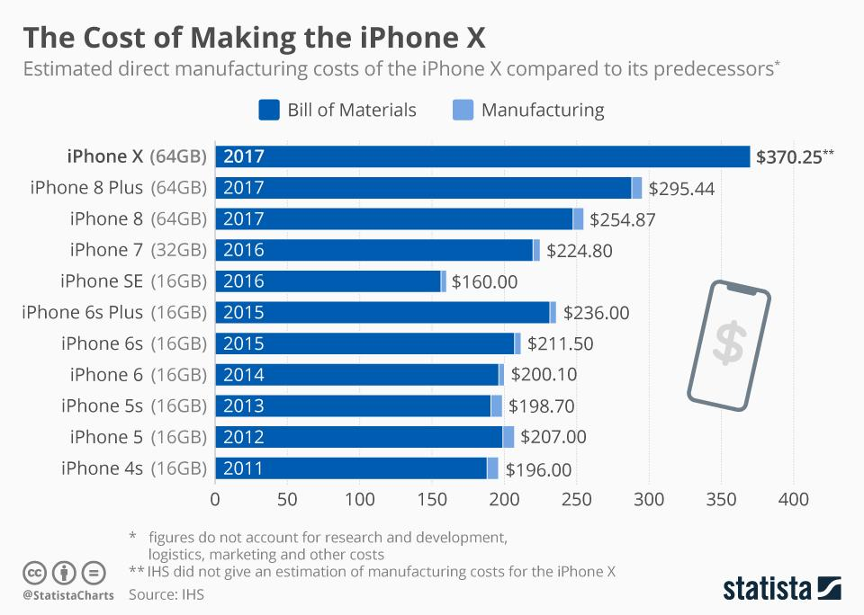

In today's global economy, understanding the production costs associated with high-value consumer electronics like the iPhone is crucial. As a leading innovator in the tech industry, Apple Inc. meticulously manages its manufacturing processes to optimize costs, ensuring both competitiveness and profitability. This article examines how Apple determines its iPhone production costs through a strategic approach, involving various factors such as raw materials, labor, manufacturing, and logistics.

Apple's meticulous cost management encompasses a wide range of techniques aimed at reducing expenses without compromising quality. The company achieves this by negotiating component prices and maintaining a diversified supply chain. These tactics enable Apple to manage financial requirements effectively and sustain its market position amidst fluctuations in cost and demand.



Moreover, the role of algorithmic trading in Apple's cost management strategy is significant. By harnessing sophisticated algorithms, Apple can predict market trends and adjust its purchasing strategies accordingly. This automated trading capability proves instrumental in stabilizing costs and ensuring consistent supply chain operations, further solidifying Apple's competitive edge.

Finally, the relationship between Apple's production costs and consumer pricing is profound, influencing the brand's overall market strategy. By maintaining a balance between cost efficiency and innovation, Apple is able to command premium pricing for its products. This strategy not only sustains healthy profit margins but also reinforces the brand's reputation for quality and reliability.

In summary, Apple's approach to managing iPhone production costs is multifaceted, blending traditional cost-saving measures with innovative financial strategies. This comprehensive methodology underscores Apple's commitment to excellence and continuous innovation in the tech industry.

## Table of Contents

## Breakdown of iPhone Production Costs

The production costs of the iPhone are a multifaceted combination of elements, each playing a crucial role in the overall expenditure associated with manufacturing these high-demand consumer electronics. The foremost components contributing to these costs include raw materials, labor, manufacturing, shipping, and overhead expenses.

Firstly, raw materials form a significant portion of iPhone production costs. These include high-quality glass for the display, sophisticated semiconductor materials for chipsets, and various metals used in the construction of the device's casing and internal components. Apple strategically sources these materials from a broad range of suppliers worldwide to mitigate risk and manage costs effectively. By fostering relationships with multiple suppliers, Apple can negotiate favorable prices and ensure a stable supply chain even amid market [volatility](/wiki/volatility-trading-strategies).

Labor is another critical [factor](/wiki/factor-investing), encompassing both the direct labor involved in assembly and the indirect labor associated with design and engineering. Apple's manufacturing operations widely utilize skilled labor, particularly in China, where the assembly of iPhones predominantly takes place in facilities such as those operated by Foxconn. The choice of manufacturing location allows Apple to capitalize on lower labor costs while maintaining the high standards of quality expected from their products.

The manufacturing process itself involves advanced technology and significant investment in precision equipment. Apple deploys state-of-the-art robotics and fabrication technologies to ensure the efficiency and reliability of its production lines, reducing waste and minimizing defects. This investment in technology not only enhances product quality but also contributes to cost efficiencies in the long run.

Shipping and logistics are equally vital in the breakdown of production costs. Apple engages in meticulous logistical planning to ensure that components and finished products are transported efficiently to minimize delays and expenses. The global distribution network must operate seamlessly to meet demand across various markets, which requires investment in reliable shipping partners and sophisticated tracking systems.

Additionally, overhead expenses, which include costs related to research and development, marketing, and administrative functions, are integral to the overall budget. Apple's commitment to innovation necessitates substantial R&D spending, a cost that is factored into the price of each iPhone. Marketing and brand management also incur significant costs, ensuring that the iPhone remains a leading product in the consumer electronics space.

Apple's strategic approach to managing these diverse cost components involves rigorous negotiation and diversification. By maintaining a wide-ranging supply chain and cultivating relationships with multiple suppliers, Apple can stabilize costs and protect against supply disruptions. This strategic cost management is key to understanding how Apple prices its products, allowing the company to maintain a competitive position in the market while delivering high-quality products to consumers.

## Manufacturing Process of the iPhone

Apple's manufacturing process for the iPhone is distinguished by its meticulous attention to detail and steadfast commitment to innovation and quality. This process integrates advanced technology and rigorous quality control to ensure that each iPhone meets Apple's high standards. The production of iPhones occurs primarily in factories located across various countries, with a notable concentration in China. This strategic geographical distribution enables Apple to capitalize on regional manufacturing strengths and maintain flexibility in its operations.

Complex logistics planning is central to Apple's manufacturing strategy, ensuring seamless coordination across its extensive supply chain. Each iPhone component is sourced and delivered in a timely manner, minimizing production delays. To achieve this, Apple employs sophisticated logistics algorithms and tracking systems. These technologies facilitate the prediction of supply chain needs and the adjustment of production schedules, ensuring components arrive precisely when needed.

Apple's logistics efficiency is augmented by just-in-time (JIT) manufacturing principles, which reduce inventory costs and waste. By receiving components only as they are required for production, Apple lowers overhead and enhances the responsiveness of its supply chain. This approach allows Apple to adapt quickly to changes in customer demand and technology trends, maintaining a competitive edge in the market.

Furthermore, the constant refinement of Apple's manufacturing processes contributes significantly to waste reduction and cost management. Through continuous process improvements and the adoption of lean manufacturing practices, Apple is able to optimize resource use. This includes implementing energy-efficient technologies and sourcing sustainable materials, reducing the environmental impact of production.

Apple's commitment to high product quality is bolstered by its rigorous quality control mechanisms. Each iPhone undergoes extensive testing phases to identify potential defects or performance issues. These quality checks utilize cutting-edge tools and techniques, such as automation and [machine learning](/wiki/machine-learning), to ensure precision and reliability.

Overall, Apple's methodical approach to manufacturing, characterized by sophisticated logistics planning, efficient resource management, and rigorous quality assurance, plays a crucial role in maintaining the high standard and market reputation of the iPhone. Through these efforts, Apple consistently delivers products that embody its brand values of innovation, quality, and sustainability.

## Impact of Algorithmic Trading on Apple's Cost Management

Algorithmic trading has significantly impacted Apple's cost management strategy, particularly in hedging against commodity price fluctuations. By utilizing advanced algorithms, Apple can anticipate market trends with greater accuracy, allowing for more informed purchasing strategies. This proactive approach aids in stabilizing costs, thereby ensuring consistent supply chain operations.

The algorithms employed by Apple analyze large datasets from global markets, identifying patterns and anomalies that would be challenging to detect through traditional methods. These sophisticated algorithms perform tasks such as forecasting commodity prices, optimizing procurement schedules, and adjusting financial positions in real time. For instance, if the algorithm predicts a rise in the price of a key raw material, Apple can make preemptive purchases to lock in lower prices, thus avoiding increased costs.

Furthermore, the integration of [algorithmic trading](/wiki/algorithmic-trading) into Apple's financial strategy enhances its ability to maintain a competitive edge within the tech industry. By leveraging data analytics, Apple can fine-tune its financial operations, optimizing cash flow and managing inventory costs more efficiently. This data-driven approach facilitates reduced exposure to volatile market conditions, which is crucial in the fast-paced tech sector.

For example, Python's libraries such as Pandas and NumPy can be used to perform data analysis and generate predictive models. Here's a simple Python snippet illustrating how Apple might use data to predict prices:

```python
import pandas as pd
from sklearn.linear_model import LinearRegression
from sklearn.model_selection import train_test_split

# Hypothetical dataset
data = pd.DataFrame({
    'Commodity Index': [95, 97, 102, 100, 105, 103, 108],
    'Price': [100, 102, 105, 103, 110, 107, 112]
})

# Splitting the dataset
X_train, X_test, y_train, y_test = train_test_split(data[['Commodity Index']], data['Price'], test_size=0.2)

# Creating and training the model
model = LinearRegression()
model.fit(X_train, y_train)

# Predicting future prices
future_index = pd.DataFrame({'Commodity Index': [109, 110]})
future_price_prediction = model.predict(future_index)

print(future_price_prediction)
```

This example demonstrates how machine learning models can be applied to forecast price movements based on historical data. Implementing such models allows Apple to make data-backed decisions that optimize its procurement and price-hedging strategies.

In summary, algorithmic trading is an integral component of Apple's cost management, providing the company with the tools necessary to navigate the complexities of global markets. This ensures continued stability in their operational costs, ultimately helping Apple maintain its reputation for delivering high-quality products in a consistent and reliable manner.

## The Role of Cost Management in Consumer Pricing

Apple's cost management strategies are integral to its ability to maintain a premium pricing structure while ensuring robust profit margins. This strategic cost management allows Apple to derive significant value from its products, which is especially crucial in the high-value consumer electronics sector where competition is fierce.

Understanding production costs is essential for consumers as it provides insight into the intrinsic value of an iPhone. The cost structure of an iPhone encompasses numerous elements, including component acquisition, assembly, logistics, and quality control measures. Each of these contributes to the overall expenditure associated with bringing an iPhone to market. By understanding these components, consumers can better appreciate the factors influencing the price tag of an iPhone, beyond just brand value.

Apple excels in balancing cost efficiency with innovation. The company is known for its significant investment in research and development, which is reflected in the technological advancements of each new iPhone model. This commitment ensures that each iteration offers improvements and added value, whether through enhanced performance, better durability, or novel features. Apple's ability to incorporate cutting-edge technology while managing costs efficiently is central to its strategy of offering innovative and desirable products at a premium price point.

Effective cost control also plays a significant role in maintaining Apple's reputation for producing high-quality, reliable devices. Apple's meticulous approach to manufacturing—emphasizing precision, control, and sustainability—ensures consistency and excellence in its products. The company's cost management extends to its quality assurance processes, which reduce defects and enhance longevity, further justifying the premium price paid by consumers.

Therefore, Apple's strategic cost management not only supports its premium pricing strategy but also underpins its market leadership and reputation for quality and innovation.

## Conclusion

In summary, iPhone production costs are influenced by a complex interplay of materials, manufacturing processes, and financial strategies. Apple's strategic approach to managing these factors ensures that they remain a leader in the global smartphone market. Through meticulous management of supply chain components and manufacturing processes, Apple optimizes costs while maintaining high product quality. This strategy includes negotiating favorable terms with suppliers and ensuring a diversified supply chain capable of absorbing shocks and fluctuations in component prices.

The integration of algorithmic trading into cost management is a testament to Apple's commitment to leveraging technology in its operations. By employing sophisticated algorithms, Apple can predict market trends and adjust its purchasing strategies accordingly. This allows the company to mitigate risks associated with commodity price volatility, ensuring stable cost structures and consistent supply chain operations. The use of data analytics in these processes not only stabilizes costs but also strengthens Apple's competitive position in an industry characterized by rapid technological advancements.

As a result, consumers can expect continuous innovation and quality in Apple's offerings, reflecting the brand's dedication to excellence. Apple's focus on cost efficiency, without compromising on quality or innovation, allows the company to maintain its reputation for producing high-quality, reliable devices. This strategic balance ensures that each iPhone model introduces meaningful improvements, meeting consumer expectations while securing Apple’s standing as a frontrunner in the technology sector.

## References & Further Reading

[1]: Kahney, L. (2019). ["Inside Apple's Factories."](https://www.cultofmac.com/news/inside-apples-factories-cook-book-outtakes) Wired.

[2]: Cass, S. (2017). ["Foxconn by the Numbers: A Look at the World's Largest Electronics Contract Manufacturer."](https://link.springer.com/chapter/10.1007/978-981-15-2067-9_2) IEEE Spectrum.

[3]: Rawlinson, N. (2022). ["How Apple Squeezes its Suppliers."](https://www.thestreet.com/apple/other-products/how-apple-supply-chain-has-transformed-since-2019) Macworld.

[4]: Porter, M. E. (1985). ["Competitive Advantage: Creating and Sustaining Superior Performance."](https://www.hbs.edu/faculty/Pages/item.aspx?num=193) Free Press.

[5]: Gans, J. (2018). ["The Microeconomics of Apple’s Products and Pricing."](https://books.google.com/books/about/Principles_of_Microeconomics.html?id=zDP6DwAAQBAJ) Harvard Business Review.

[6]: ["The Genius Behind Apple’s Supply Chain."](https://www.apple.com/supply-chain/) Supply Chain Digital, 2021.