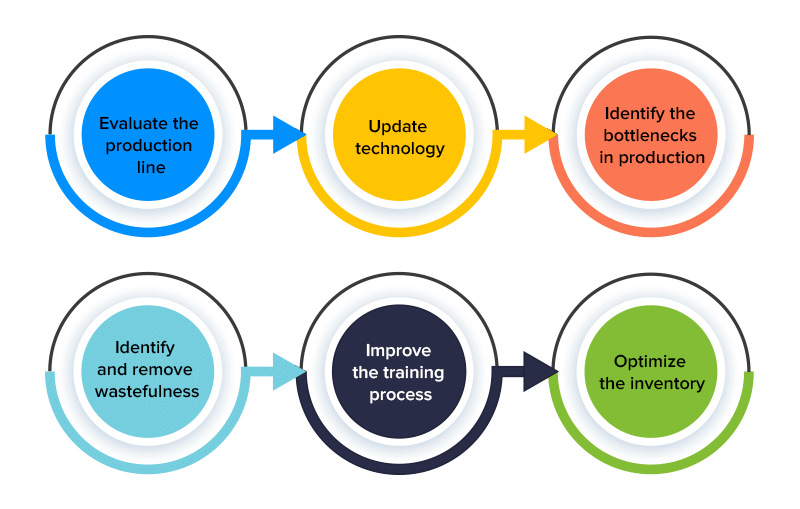

In today's highly competitive global market, achieving optimal manufacturing productivity and production efficiency is crucial for businesses to maintain profitability and competitiveness. As industries vie for market share, they must ensure that their manufacturing processes are as effective and streamlined as possible. Manufacturing productivity refers to the ratio of output produced to the input used in production. A higher productivity level indicates that more goods are produced with fewer resources, reducing costs and increasing profitability. Conversely, production efficiency is achieved when an enterprise operates along its production possibility frontier, producing maximum output from a given set of inputs. This means that production processes are optimized to deliver the highest possible output without wasted resources or excess cost.

Understanding and measuring these components are essential for companies to optimize their operations. Various metrics and methodologies exist to help quantify and enhance productivity and efficiency, such as output/input ratios, operational efficiency ratios, and capacity utilization. Techniques like lean manufacturing, Six Sigma, and Just-In-Time (JIT) production play significant roles in reducing waste and improving overall process efficiency.

In addition to traditional manufacturing sectors, the financial industry has embraced technological advancements to enhance efficiency, with algorithmic trading being a prime example. Algorithmic trading leverages computer algorithms to execute trades at such a speed and frequency that human traders cannot match. This technology significantly impacts market efficiency by improving liquidity and narrowing bid-ask spreads, ultimately leading to more competitive and efficient financial markets. Through this analysis, the article will highlight how principles of efficiency applied in manufacturing also resonate with and benefit financial markets, suggesting a broader application of these strategies across various sectors.

## Table of Contents

## Understanding Manufacturing Productivity and Production Efficiency

Manufacturing productivity is a critical measure in assessing the efficiency of production processes. It is defined as the ratio of output to input in the production process, indicating how effectively resources are utilized to generate products. The formula for manufacturing productivity can be expressed as:

$$
\text{Productivity} = \frac{\text{Total Output}}{\text{Total Input}}
$$

This metric is fundamental to understanding the effectiveness of production operations, as higher productivity signifies more efficient use of resources, including labor, materials, and machinery.

Production efficiency is closely related to productivity and refers to the state of achieving the optimal production level where resources are utilized to their fullest potential. This is when an entity operates along its production possibility frontier (PPF), a curve depicting the maximum possible output combinations that can be achieved with a given set of inputs. Operating on the PPF means that the production process cannot increase the output of one product without decreasing the output of another, thus indicating full efficiency.

In distinguishing between productivity and efficiency, it is essential to recognize their distinct yet interconnected roles in optimizing operations. Productivity focuses on the rate of output relative to input, emphasizing the quantitative aspect of production. Efficiency, on the other hand, highlights the qualitative aspect, ensuring that inputs are used in the best possible way to maximize output without waste.

In practical terms, a manufacturing process can achieve high productivity by producing a large [volume](/wiki/volume-trading-strategy) of goods. However, if this output is achieved through excessive input or waste, the process might not be operating efficiently. Conversely, a process can be highly efficient, employing optimal methods and minimal waste, but if the output rate is low, productivity might not meet desired standards.

These two concepts work together to optimize manufacturing operations. By increasing productivity and enhancing efficiency, businesses can reduce costs, improve product quality, and maintain competitiveness in the market. Strategies to optimize these metrics include implementing advanced production technologies, refining operational processes, and continuously monitoring input-output ratios. These efforts can lead to improved financial performance and strengthen a company's market position.

## Measuring Efficiency in Manufacturing

Efficiency measurement is a pivotal aspect of manufacturing, enabling businesses to assess and enhance their production processes. Several key metrics are used to measure efficiency in manufacturing, including the output/input ratio, operational efficiency ratio, and capacity utilization.

The output/input ratio serves as a fundamental metric that quantifies productivity by dividing the total output produced by the total inputs utilized in the manufacturing process. This ratio provides a straightforward way to gauge how effectively resources are being converted into finished goods. For example, if a factory produces 1000 units of a product using 500 units of raw materials, the output/input ratio is calculated as:

$$
\text{Output/Input Ratio} = \frac{\text{Total Output}}{\text{Total Input}} = \frac{1000}{500} = 2
$$

The operational efficiency ratio further refines productivity measurement by considering the ratio of actual output to potential output within a given timeframe. This metric takes into account variables such as downtime and equipment efficiency, providing a more nuanced understanding of a production system's performance.

Capacity utilization measures the extent to which a manufacturing entity uses its installed productive capacity. High capacity utilization indicates that production facilities are being employed effectively, whereas low utilization suggests unexploited potential. This metric is expressed as:

$$
\text{Capacity Utilization} = \left(\frac{\text{Actual Output}}{\text{Maximum Possible Output}}\right) \times 100\%
$$

Incorporating methodologies like Lean Manufacturing, Six Sigma, and Just-In-Time (JIT) are instrumental in enhancing manufacturing efficiency. Lean Manufacturing focuses on minimizing waste and optimizing processes, ensuring that every step adds value and resources are used judiciously. Six Sigma aims to reduce variability and defects, thereby increasing efficiency and quality by employing data-driven techniques and statistical analysis. JIT emphasizes inventory reduction and efficient resource use by producing goods in response to demand, thereby minimizing storage costs and enhancing workflow efficiency.

These methodologies, when applied effectively, enable businesses to maintain competitiveness by reducing production costs, improving quality, and enhancing overall operational excellence. In real-world scenarios, the application of these efficiency metrics and methodologies can be observed in diverse manufacturing industries, leading to significant improvements in productivity and cost-effectiveness. For example, companies adopting Lean and Six Sigma practices have reported reduced lead times and increased customer satisfaction, translating to substantial gains in market share and profitability.

## Algorithmic Trading and Its Role in Efficiency

Algorithmic trading, often known as algo trading, involves the use of predefined algorithms to execute trades at speeds and frequencies beyond human capacity. This trading method leverages powerful computational tools to analyze a multitude of market variables and make swift trading decisions. The introduction of algo trading has markedly improved the efficiencies within financial markets by facilitating faster and more accurate order execution.

Key efficiency metrics are paramount in evaluating the success and effectiveness of [algorithmic trading](/wiki/algorithmic-trading). The Order-to-Trade Ratio (OTR) is one such metric, representing the number of order messages sent to an exchange in relation to the number of trades executed. It is crucial for maintaining market stability as a high OTR might suggest excessive order cancellations, potentially signaling manipulation or inefficiencies. 

Execution efficiency is another critical parameter, referring to the ability of an algorithm to execute orders at the desired price point effectively while minimizing slippage—the difference between the expected price of a trade and the actual price. Minimizing slippage is crucial as it directly impacts profitability. Cost efficiency is measured by the reduction in transaction costs achieved through algorithmic strategies, encompassing both explicit costs like fees and commissions and implicit costs such as market impact.

The utilization of algo trading significantly enhances market [liquidity](/wiki/liquidity-risk-premium), characterized by the ease with which assets can be bought or sold without affecting their price. By providing continuous order flows, algorithms contribute to increased trading volumes and narrower bid-ask spreads—the difference between the highest price a buyer is willing to pay and the lowest price a seller is willing to accept. This tightening of spreads is beneficial as it lowers transaction costs for market participants and contributes to greater market efficiency.

Furthermore, algo trading promotes price discovery, the process through which market prices adjust to reflect new information, by swiftly incorporating vast amounts of market data. As a result, prices become more reflective of the true value of securities, providing a fairer and more efficient marketplace for all participants. This efficacy in securing competitive market positions highlights the profound role of algorithmic trading in advancing financial market efficiency.

## Challenges and Considerations in Measuring Efficiency

In the evaluation of manufacturing and trading efficiency, several challenges and considerations must be addressed to ensure accurate measurement and differentiation between productive and detrimental practices. 

In algorithmic trading, distinguishing between beneficial and harmful practices often presents a challenge. Beneficial practices include strategies that enhance market liquidity, reduce transaction costs, and improve price discovery, while harmful practices might involve market manipulation or excessive trading that distorts market prices. The difficulty lies in the identification of these practices, as their impact can vary significantly based on market conditions and the algorithms deployed. The use of detailed analysis and sophisticated algorithms can help in filtering such practices, but the development of these tools requires ongoing research and the establishment of regulatory frameworks to clearly define and monitor market behaviors.

Data limitations pose another significant challenge in accurately measuring efficiency. Efficient algorithmic trading and manufacturing processes require extensive datasets to refine models and operations. However, acquiring high-quality data can be challenging due to restrictions in availability and accuracy. Moreover, proprietary data, often needed for gaining a competitive edge, can be costly and difficult to obtain. Establishing partnerships or investing in technology that allows for real-time data collection and analysis is crucial, yet it can also be resource-intensive.

The measurement of manufacturing efficiency further necessitates substantial capital investment and workforce training. Implementing advanced technologies such as automation, IoT, and AI requires not only financial investment but also a skilled workforce capable of operating and maintaining these systems. Training existing employees to adapt to new technologies involves both time and costs, but it is essential to ensure that these technologies are utilized to their full potential. Organizations may choose to implement structured training programs and continuous education initiatives to overcome this barrier.

In conclusion, while measuring efficiency within manufacturing and trading platforms is challenging, addressing these considerations through investment in technology, workforce development, and regulatory oversight can lead to significant improvements in efficiency. This, in turn, can enhance market dynamics and operational productivity.

## Technological Advancements Enhancing Efficiency

Automation, the Internet of Things (IoT), Artificial Intelligence (AI), and blockchain are pivotal in transforming manufacturing processes, leading to significant enhancements in productivity and efficiency. These technologies are not only modernizing traditional manufacturing techniques but also ensuring products are delivered with higher quality and at lower costs.

**Automation** facilitates the reduction of manual intervention, minimizing human error, and accelerating production cycles. Automated systems can efficiently handle repetitive tasks, allowing human workers to focus on more complex activities. This shift not only increases productivity but also improves precision and consistency across production lines. For instance, robotic arms in a car assembly line can perform welding and painting with high precision, reducing the need for rework and wastage.

**Internet of Things (IoT)** connects devices and machinery, enabling real-time monitoring and data collection across the manufacturing floor. IoT devices can track equipment performance, predict maintenance needs, and optimize resource usage. By analyzing data from IoT sensors, manufacturers can identify inefficiencies, reduce downtime, and enhance decision-making processes. For example, IoT-enabled smart factories can automatically adjust lighting and climate controls based on real-time occupancy and environmental conditions, optimizing energy consumption.

**Artificial Intelligence (AI)** plays a critical role in predictive maintenance, quality control, and supply chain management. Machine learning algorithms can analyze historical production data to predict equipment failures before they occur, reducing unexpected downtime. AI systems can also detect defects in real-time, using image recognition technology to ensure products meet quality standards. In supply chain management, AI optimizes inventory levels, forecasts demand, and suggests the most efficient logistics routes.

**Blockchain** technology enhances traceability and security in manufacturing processes. By providing a transparent and immutable record of transactions, blockchain can verify the authenticity of raw materials and track product provenance across the supply chain. This ability is vital in industries such as pharmaceuticals and food manufacturing, where product safety and regulatory compliance are paramount. Blockchain also facilitates secure and efficient contract execution through smart contracts, reducing administrative costs and errors.

These technological advances collectively contribute to reducing errors, optimizing resource allocation, and improving traceability. For example, by integrating IoT and AI, manufacturers can create digital twins—virtual replicas of physical entities—that simulate and optimize processes before they are executed on the factory floor. This integration allows manufacturers to test and refine operations, leading to more effective resource allocation and higher-quality outputs.

Moreover, these technologies foster a culture of continuous improvement, where data-driven insights drive incremental enhancements in efficiency. As manufacturers adopt these advancements, they position themselves for greater competitiveness in an evolving market landscape, enabling quicker adaptation to changing consumer demands and regulatory requirements.

## Market Implications of Increased Efficiency

Improved production efficiency directly impacts market competitiveness and the strategic pricing approaches businesses adopt. As firms enhance their production processes, they can achieve significant cost reductions, allowing them to offer more competitive pricing without sacrificing profit margins. This advantage in pricing can lead to increased market share and a stronger competitive position.

One crucial aspect of increased efficiency is economies of scale. Economies of scale occur when the cost per unit of output decreases as the volume of production increases. This cost advantage arises from factors such as the ability to spread fixed costs over a larger number of units, improved labor productivity, and the use of more efficient technologies. The formula for economies of scale can be expressed as:

$$
\text{Average Cost (AC)} = \frac{\text{Total Fixed Costs (TFC) + Total Variable Costs (TVC)}}{\text{Total Output (Q)}}
$$

As total output (Q) increases, the average cost (AC) typically decreases, thereby enhancing the firm's market positioning by enabling it to lower prices or increase margins.

Toyota and Tesla serve as exemplary cases illustrating the market implications of improved production efficiency. Toyota's implementation of the Toyota Production System (TPS), which emphasizes Just-In-Time (JIT) manufacturing and continuous improvement (Kaizen), has been instrumental in achieving remarkable efficiency gains. These methodologies have enabled Toyota to reduce waste, streamline operations, and lower production costs, positioning themselves as one of the leading automobile manufacturers globally.

Similarly, Tesla's innovative production techniques, such as the use of advanced automation and a high degree of vertical integration, have set new benchmarks in the automotive industry. Tesla's Gigafactory, for instance, focuses on mass production of batteries and electric vehicles by optimizing manufacturing processes and scale. This approach has enabled Tesla to significantly reduce production costs and increase output, contributing to its competitive edge in the electric vehicle market.

The market implications of such efficiency gains are profound, as they allow companies not only to reduce costs but also to reinvest in R&D, enhance product quality, and expand market presence. Furthermore, improved efficiency can facilitate entry into new markets and enhance the company’s resilience to economic fluctuations, ultimately contributing to long-term sustainability and profitability.

## Conclusion

In today's manufacturing landscape, achieving high levels of productivity and production efficiency is essential for businesses seeking sustained profitability. Manufacturing productivity is crucial because it directly affects the cost structure and pricing strategies of a company, allowing for better market positioning. Production efficiency, which involves operating at optimal levels using the least amount of resources, ensures that companies can maximize their output without incurring unnecessary costs. Together, these elements form the backbone of competitive strategy in modern industry.

Algorithmic trading, though primarily associated with financial markets, shares efficiency principles relevant to manufacturing. It uses algorithms to enhance market liquidity and ensure cost-efficient trades. Similarly, in manufacturing, leveraging algorithms can optimize processes, reduce waste, and increase throughput, a parallel that highlights the universal applicability of efficiency principles across sectors.

Advanced technologies such as automation, the Internet of Things (IoT), [artificial intelligence](/wiki/ai-artificial-intelligence) (AI), and blockchain are at the forefront of transforming manufacturing processes. These technologies enhance production efficiency by reducing manual errors, optimizing resource allocation, and improving traceability throughout the supply chain. For instance, AI algorithms can predict maintenance needs, preventing downtime, while IoT devices monitor machinery in real time to ensure optimal performance.

Continued exploration and adoption of these technologies are encouraged for modern manufacturers. By doing so, companies can not only meet contemporary efficiency benchmarks but also set new standards in productivity. Embracing technological advancements will enable manufacturers to sustain profitability while maintaining a competitive edge in global markets.

## References & Further Reading

[1]: Womack, J. P., Jones, D. T., & Roos, D. (1990). ["The Machine That Changed the World: The Story of Lean Production"](https://books.google.com/books/about/The_Machine_That_Changed_the_World.html?id=9NHmNCmDUUoC). Simon & Schuster.

[2]: Montgomery, D. C. (2004). ["Introduction to Statistical Quality Control"](https://books.google.com/books/about/Introduction_to_Statistical_Quality_Cont.html?id=oh7zDwAAQBAJ). Wiley.

[3]: Rother, M., & Shook, J. (1999). ["Learning to See: Value Stream Mapping to Add Value and Eliminate Muda."](https://books.google.com/books/about/Learning_to_See.html?id=mrNIH6Oo87wC) The Lean Enterprise Institute.

[4]: Fabozzi, F. J., & Markowitz, H. M. (2002). ["The Theory and Practice of Investment Management"](https://onlinelibrary.wiley.com/doi/book/10.1002/9781118267028). Wiley.

[5]: Goldratt, E. M. (1992). ["The Goal: A Process of Ongoing Improvement"](https://www.amazon.com/Goal-Process-Ongoing-Improvement/dp/0884271951). North River Press.

[6]: Sutton, R.,"Learning Patterns: The Blending of Process and Insight in Algorithmic Trading Development," [Journal of Trading](https://onlinelibrary.wiley.com/doi/pdf/10.1002/%28SICI%291099-131X%281998090%2917%3A5/6%3C441%3A%3AAID-FOR707%3E3.0.CO%3B2-%23).

[7]: Singh, S. & Singh, N. (2009). ["Internet of Things (IoT): Security Challenges, Business Opportunities & Reference Architecture for E-commerce"](https://ieeexplore.ieee.org/document/7380718).