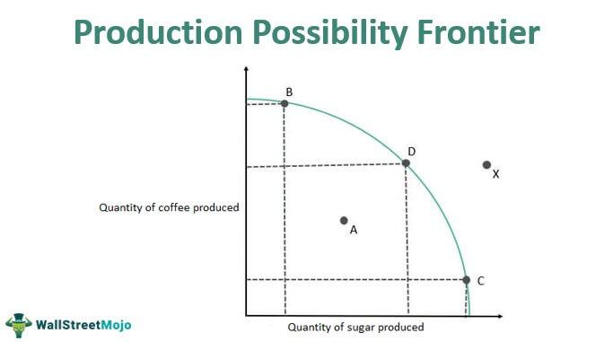

In today's interconnected economic landscape, comprehending complex concepts such as the Production Possibility Frontier (PPF) and their application in diverse fields like algorithmic trading is essential. The PPF is a foundational tool in economics that illustrates the trade-offs and opportunity costs inherent in production decisions, providing a graphical representation of the maximum feasible combinations of two goods that an economy can produce with limited resources.

This article investigates how economic theory interfaces with modern finance technology, specifically focusing on ways the PPF can be utilized to make informed decisions in algorithmic trading. Algorithmic trading involves using automated, pre-programmed trading instructions to execute orders in financial markets. The intricacies of the PPF, including its representation of efficient resource use, opportunity costs, and potential for economic growth, present valuable insights that can be translated into optimizing trading strategies.



Understanding the fundamentals of the PPF not only aids in grasping economic efficiency but also serves as a strategic framework for algorithmic traders. By analyzing how resources are allocated and the trade-offs between different options, traders can enhance their strategies to maximize returns and minimize risks. As the article will explore, the integration of PPF principles into trading algorithms can result in more efficient decision-making processes, analogous to achieving optimal production levels in economics.

Through its application in algorithmic trading, the PPF demonstrates its broad relevance beyond traditional economic sectors, underscoring the benefit of integrating economic theories with cutting-edge financial technologies. The examination of these concepts will reveal how traders can leverage the insights from the PPF to better navigate the complexities of modern financial markets and achieve greater efficiency in allocating resources.

## Table of Contents

## Understanding the Production Possibility Frontier

The Production Possibility Frontier (PPF) represents a pivotal concept in economic theory, visually encapsulating the trade-offs that an economy encounters while producing two distinct goods. This curve is vital in understanding the limitations imposed by finite resources and the resulting choices a society must make between alternative outputs.

**Definition and Functionality**

The PPF is a graphical depiction where each point on the curve signifies potential output levels of two goods that can be produced, assuming full and efficient use of resources. Points inside the curve indicate inefficient use of resources, while points beyond the curve are unattainable with current resources and technology.

**Efficiency and Opportunity Cost**

Efficiency is one of the primary aspects demonstrated by the PPF. An economy operates efficiently when it is operating on the PPF, indicating that resources are employed in the best possible manner without underutilization or waste. Opportunity cost, another crucial economic concept, is effectively illustrated by the PPF. It refers to the trade-off of obtaining more of one good at the expense of producing less of another. Mathematically, opportunity cost is expressed as the slope of the PPF, highlighting the rate at which one good must be sacrificed to produce additional units of another.

**Economic Growth and Shifts in the PPF**

Economic growth can lead to shifts in the PPF. Technological advancements or an increase in resources can push the frontier outward, indicating an economy's enhanced capacity to produce more goods. Conversely, a decrease in available resources or technology regression would shift the PPF inward.

**Assumptions Underlying the PPF**

The PPF is predicated on several key assumptions:
- Fixed resources: The total amounts of available resources do not change.
- Fixed technology: The PPF assumes that there is no change in the technology used to produce the goods.
- Focus on two goods: For simplicity, the model considers only two goods, although in reality, economies produce a multitude of goods and services.

These simplifying assumptions allow economists to analyze complex trade-offs and opportunity costs in a manageable way, offering insights into how best to allocate scarce resources for optimal production efficiency.

In essence, the PPF stands as a critical analytical tool, guiding decisions about resource allocation, highlighting the efficiencies attainable in production, and illustrating the implications of economic growth. This makes it indispensable for economists seeking to understand resource limitations and the trade-offs inherent in production processes.

## Applications of PPF in Algorithmic Trading

Algorithmic trading has revolutionized financial markets by allowing traders to execute high-speed transactions using pre-programmed strategies. A useful lens through which to examine [algorithmic trading](/wiki/algorithmic-trading) is the Production Possibility Frontier (PPF), a key economic concept illustrating trade-offs, efficiency, and opportunity cost. The PPF serves as an analytical framework that can enhance understanding and optimization of trading strategies.

In algorithmic trading, the notion of opportunity cost is directly applicable. Traders must evaluate the cost of resources used for specific trades against potential benefits. Analogous to choosing between two goods on a PPF, traders face decisions about prioritizing certain financial instruments or trades over others. The concept of efficient resource allocation central to the PPF can be mirrored in algorithmic models, where inputs such as capital, computational power, and time must be distributed effectively to optimize trading outcomes.

For example, consider a trader who must allocate a finite amount of capital ($C$) across multiple trading strategies ($S_1, S_2, \ldots, S_n$). The goal is to maximize the return ($R$) while keeping within the constraints of capital. This can be formulated as:

$$

\text{maximize} \quad R = \sum_{i=1}^n r_i \cdot S_i 
$$

subject to:

$$

\sum_{i=1}^n c_i \cdot S_i \leq C 
$$

where $r_i$ is the expected return of strategy $S_i$ and $c_i$ is the capital required for each strategy. This optimization problem mirrors the trade-offs on a PPF, where each strategy's execution represents a point on the frontier reflecting a balance of risk and reward.

Moreover, the PPF framework can improve decision-making through better risk management. By visualizing a frontier of possible trading outcomes, traders can identify and minimize inefficiencies. This leads to the configuration of portfolios that are either on or near the efficient frontier, ensuring that for any given level of risk, the return is maximized.

The PPF's principles assist in the strategic allocation of resources, prompting traders to continually reassess the efficiency and opportunity costs of their algorithms. When conditions change, such as a shift in market [volatility](/wiki/volatility-trading-strategies), algorithmic models may be re-adjusted to maintain positions on their respective efficient frontiers. Overall, employing PPF insights enables traders to maximize potential returns while effectively managing risks inherent in financial markets.

## The Intersection of PPF and Trading Algorithms

Just as the Production Possibility Frontier (PPF) demonstrates the trade-offs and opportunity costs in traditional economic settings, algorithmic trading requires a careful balance between risk and reward. This balance is essential for financial market participants who seek to optimize their portfolios and improve trading performance.

In algorithmic trading, understanding how to navigate concepts found in the PPF is critical for strategizing resource allocation among various trading options. The fundamental principles of economic production efficiency can be effectively translated into market dynamics. By applying these principles, traders can develop strategies that ensure efficient allocation of their capital and resources, ultimately leading to optimized trading outcomes. 

The PPF is typically depicted as a concave curve, which represents the increasing opportunity costs as more of one good is produced. This concave shape is not just a feature of traditional economics; it also mirrors the volatility and risk transitions found in market environments. The curvature of the PPF can be conceptually linked to financial markets, where sharp increases in risk are often observed with substantial shifts in returns. Understanding this relationship can help traders better anticipate and manage such risk transitions.

In mathematical terms, consider a simplified model where a trader needs to allocate capital between two strategies, $S_1$ and $S_2$, each with different risk-return profiles. Similar to a PPF, we define a function for potential returns, $R(S_1, S_2)$, subject to certain constraints that reflect the properties of diminishing returns:

$$
R(S_1, S_2) = a \cdot \sqrt{S_1} + b \cdot \sqrt{S_2} - c \cdot (S_1 + S_2)^2
$$

Where $a, b,$ and $c$ are constants that influence the trade-offs between the strategies. The task of the algorithmic trader is to determine the optimal allocation of resources, represented by $S_1$ and $S_2$, that maximizes $R(S_1, S_2)$ while managing the associated risks. 

This function’s structure echoes the economic principle of increasing opportunity costs, and the concave nature of the PPF curve demonstrates that as more resources are allocated to one trading strategy, the additional return from allocating further resources diminishes while the risk increases. This principle aids in identifying efficient frontiers where financial resources are deployed in a manner that maximizes potential returns for a given level of risk, paralleling the optimal production levels depicted by a PPF in economics.

## Enhancing Trading Strategies with PPF Insights

Algorithmic traders can harness the Production Possibility Frontier (PPF) to gauge market efficiency and uncover new trading frontiers. The PPF, with its inherent focus on optimizing resource allocation, serves as a valuable framework for understanding how to balance risk and return in financial markets. By utilizing the core principles of the PPF, traders can effectively evaluate the trade-offs between different investment opportunities to achieve their desired outcomes.

One primary approach to applying PPF insights in algorithmic trading is through portfolio optimization. Strategies grounded in PPF models can help traders identify portfolios that either maximize returns or minimize risks. In economic terms, this is comparable to reaching optimal levels of production where resources are allocated most efficiently. By quantifying opportunity costs—the cost of forgoing the next best investment option—traders can make informed decisions that align with their financial goals.

To illustrate, consider a trader tasked with allocating capital between two asset classes: stocks and bonds. The PPF can represent various combinations of potential returns and associated risks. Using principles from the PPF, a trader can apply efficient frontier analysis to determine the optimal portfolio allocation that maximizes expected returns for a given level of risk, or alternatively, minimizes risk for an expected level of return. This involves calculating the expected returns and variances of individual assets, followed by solving optimization problems to derive the efficient frontier.

Furthermore, exploring the PPF can facilitate better portfolio diversification by leveraging comparative advantages across different trading instruments. This is akin to realizing the benefits of specialization in economics—leveraging assets that perform better under specific conditions. By diversely spreading investments across various asset classes, traders can reduce unsystematic risk—the risk specific to a particular asset or sector—and enhance the robustness of their portfolios against market volatility.

In practical terms, traders can implement these strategies computationally using programming languages like Python. For instance, the following Python code snippet demonstrates how to perform a basic portfolio optimization using historical returns of two assets to construct an efficient frontier:

```python
import numpy as np
import pandas as pd
import matplotlib.pyplot as plt
from scipy.optimize import minimize

# Load historical returns
returns = pd.DataFrame({
    'Stocks': np.random.normal(0.1, 0.20, 1000),
    'Bonds': np.random.normal(0.03, 0.10, 1000),
})

# Calculate expected returns and covariance matrix
expected_returns = returns.mean() * 252  # Annualized expected return
cov_matrix = returns.cov() * 252  # Annualized covariance

# Portfolio optimization
def portfolio_annualized_performance(weights, expected_returns, cov_matrix):
    returns = np.sum(expected_returns * weights)
    std = np.sqrt(np.dot(weights.T, np.dot(cov_matrix, weights)))
    return std, returns

# Negating returns for minimization (maximizing returns)
def neg_sharpe_ratio(weights, expected_returns, cov_matrix, risk_free_rate=0.03):
    p_var, p_ret = portfolio_annualized_performance(weights, expected_returns, cov_matrix)
    return -(p_ret - risk_free_rate) / p_var

# Portfolio constraints and bounds
cons = ({'type': 'eq', 'fun': lambda x: np.sum(x) - 1})
bounds = tuple((0, 1) for asset in range(len(expected_returns)))

# Initial guesses
init_guess = np.array([0.5, 0.5])

# Optimization
opt_results = minimize(neg_sharpe_ratio, init_guess, args=(expected_returns, cov_matrix),
                       method='SLSQP', bounds=bounds, constraints=cons)

# Optimal portfolio weights
opt_weights = opt_results.x

# Display results
print(f"Optimal Portfolio Allocation:\nStocks: {opt_weights[0]:.2f}, Bonds: {opt_weights[1]:.2f}")

# Visualize the efficient frontier
portfolio_returns = []
portfolio_volatilities = []

for _ in range(1000):
    weights = np.random.random(2)
    weights /= np.sum(weights)
    p_var, p_ret = portfolio_annualized_performance(weights, expected_returns, cov_matrix)
    portfolio_volatilities.append(p_var)
    portfolio_returns.append(p_ret)

plt.scatter(portfolio_volatilities, portfolio_returns, c=(np.array(portfolio_returns)-0.03)/np.array(portfolio_volatilities), marker='o')
plt.xlabel('Volatility')
plt.ylabel('Expected Returns')
plt.colorbar(label='Sharpe Ratio')
plt.title('Efficient Frontier')
plt.show()
```

Therefore, integrating PPF insights within algorithmic trading frameworks offers a structured approach to portfolio management, enabling traders to harness economic theories for advanced financial modeling and decision-making.

## Challenges and Limitations

While the Production Possibility Frontier (PPF) provides a robust framework for evaluating economic efficiency and guiding resource allocation, applying these models to specific trading scenarios presents several challenges. The primary difficulty lies in the inherent static nature of traditional PPF models, which contrasts sharply with the dynamic and often unpredictable environment of financial markets. 

One major challenge is the rapid pace of technological advancements. Trading algorithms and platforms are consistently evolving, necessitating traders to adapt their strategies frequently. For instance, the introduction of high-frequency trading ([HFT](/wiki/high-frequency-trading-strategies)) algorithms has compressed the time frames for decision-making, thereby limiting the applicability of static economic models which assume fixed resources and technology. To address this, traders might utilize real-time data analysis and [machine learning](/wiki/machine-learning) models to create adaptive PPF simulations that can accommodate technological shifts.

Regulations also play a pivotal role in shaping market dynamics and can hinder the direct application of PPF models. Regulatory changes, such as new trading laws or modifications in tax policies, can alter the feasibility of certain trading strategies, shifting the opportunity cost landscape. Traders need to develop agile frameworks that incorporate regulatory scenarios, potentially employing stochastic modeling techniques to [factor](/wiki/factor-investing) in regulatory uncertainties.

Market conditions further complicate the direct application of PPF principles. Markets are subject to volatility, resulting from geopolitical events, economic indicators, and investor sentiment, which can all cause substantial deviations from expected outputs modeled by a PPF. Traders must construct models that incorporate risk management measures, allowing them to account for market volatility. For example, implementing Monte Carlo simulations could provide a variety of potential outcomes and risk assessments that enrich the static PPF model.

Here’s an example of how one might adapt traditional PPF concepts with Python to consider changing resources:

```python
import numpy as np

# Define a function for a dynamic PPF model
def dynamic_ppf(resources, efficiency, tech_growth_rate, time):
    """ Simulate a dynamic PPF over time considering tech growth. """
    production_alpha = resources[0] * (efficiency[0] * (1 + tech_growth_rate) ** time)
    production_beta = resources[1] * (efficiency[1] * (1 + tech_growth_rate) ** time)
    return production_alpha, production_beta

# Example configuration
resources = [100, 150]  # Initial resources for goods alpha and beta
efficiency = [0.3, 0.5]  # Efficiency factors for both goods
tech_growth_rate = 0.02  # Annual technological growth rate
time_period = 5  # Years

# Calculate production possibilities
alpha_output, beta_output = dynamic_ppf(resources, efficiency, tech_growth_rate, time_period)
print(f"Production of Alpha: {alpha_output}, Production of Beta: {beta_output}")
```

Furthermore, traders must continuously refine and update their models to align with the changing financial landscapes, which is similar to updating the PPF when there are shifts in resource availability or technological growth. This ongoing adaptation underscores the need for flexible, responsive strategies that can seamlessly integrate new information and variables into trading decisions.

## Conclusion

The Production Possibility Frontier (PPF) serves as a vital analytical tool for understanding the efficient allocation of resources, applicable in both economic theory and modern algorithmic trading. Within economics, the PPF illustrates the trade-offs between differing combinations of two goods or services that an economy can produce, given its available resources and technology. Similarly, in trading, this concept aids in balancing risk and return, helping traders optimize their strategies.

By harnessing the principles of the PPF, traders can refine their decision-making processes, allowing for more judicious allocation of resources in the ever-fluctuating financial markets. This can involve evaluating the opportunity costs of different strategies or identifying the most efficient combination of trading instruments to achieve desired outcomes, akin to maximizing production in an economic context.

As the landscape of financial markets continues to evolve, propelled by advancements in technology and complex market dynamics, integrating economic theories like the PPF with cutting-edge financial technologies will be paramount. This integration not only enhances the efficacy of trading strategies but also fosters innovation, enabling traders to respond adeptly to challenges and capitalize on new opportunities.

In conclusion, the PPF offers invaluable insights that, when applied to algorithmic trading, facilitate the navigation of complex market environments. As traders look to the future, the convergence of economic principles and technological advancements will likely remain a central theme, driving the development of increasingly sophisticated and efficient trading strategies.

## References & Further Reading

[1]: Bergstra, J., Bardenet, R., Bengio, Y., & Kégl, B. (2011). ["Algorithms for Hyper-Parameter Optimization."](https://papers.nips.cc/paper/4443-algorithms-for-hyper-parameter-optimization) Advances in Neural Information Processing Systems 24.

[2]: ["Advances in Financial Machine Learning"](https://www.amazon.com/Advances-Financial-Machine-Learning-Marcos/dp/1119482089) by Marcos Lopez de Prado

[3]: ["Evidence-Based Technical Analysis: Applying the Scientific Method and Statistical Inference to Trading Signals"](https://www.amazon.com/Evidence-Based-Technical-Analysis-Scientific-Statistical/dp/0470008741) by David Aronson

[4]: ["Machine Learning for Algorithmic Trading"](https://github.com/stefan-jansen/machine-learning-for-trading) by Stefan Jansen

[5]: ["Quantitative Trading: How to Build Your Own Algorithmic Trading Business"](https://www.amazon.com/Quantitative-Trading-Build-Algorithmic-Business/dp/1119800064) by Ernest P. Chan