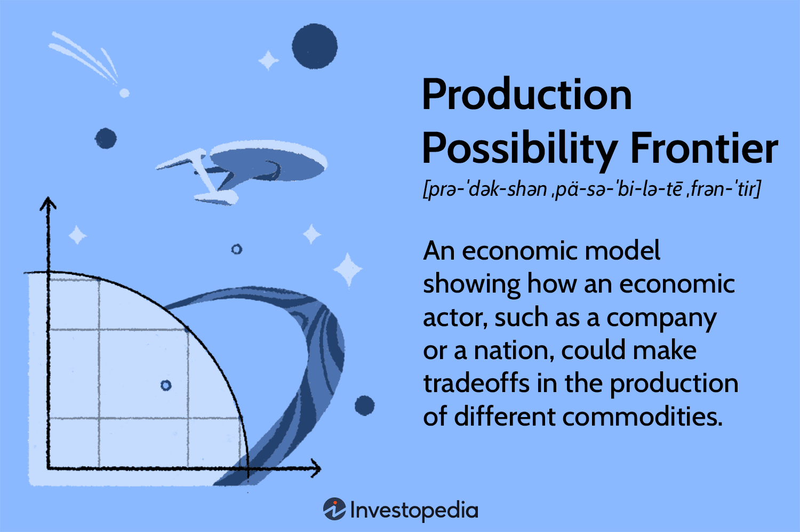

## Table of Contents

## What is a Production Possibility Frontier (PPF)?

A Production Possibility Frontier (PPF) is a graph that shows all the possible combinations of two goods or services that an economy can produce when it uses all its resources efficiently. Imagine you have a limited amount of time and resources. The PPF helps you see how you can divide these resources between making two different things, like apples and oranges. If you choose to make more apples, you'll have fewer resources left for making oranges, and vice versa. The curve on the graph represents the maximum output you can achieve, showing the trade-offs you have to make.

The shape of the PPF is usually a curve that bows outward, which means that as you produce more of one good, you have to give up increasing amounts of the other good. This happens because resources are not equally good at producing both goods. For example, some workers might be better at picking apples than oranges. The PPF also helps to show the concept of opportunity cost, which is what you give up when you choose to produce more of one good over another. If the economy is operating inside the curve, it means resources are not being used efficiently, and there's room for improvement. If it's on the curve, resources are being used to their fullest potential.

## How is a PPF represented graphically?

A Production Possibility Frontier, or PPF, is shown on a graph with two axes. One axis represents the quantity of one good, like apples, and the other axis represents the quantity of another good, like oranges. The curve on the graph shows all the different ways you can use your resources to make these two goods. If you want to make more apples, you move up along the curve, but then you'll have to make fewer oranges. If you want more oranges, you move to the right along the curve, but then you'll have fewer apples.

The PPF curve usually looks like a bowed-out line. This shape happens because as you make more of one good, you have to give up more and more of the other good. It's not a straight line because resources are better at making one thing than the other. If you're on the curve, you're using all your resources as well as you can. If you're inside the curve, you're not using all your resources, and you could make more of both goods. If you're outside the curve, that's not possible with the resources you have.

## What are the key assumptions underlying a PPF?

A PPF is based on a few key ideas. One big idea is that resources are limited. This means you can't make everything you want because you only have so much time, money, or materials. Another idea is that you have to choose how to use these resources. You can't make more of one thing without making less of something else. This choice shows the trade-offs you face. Also, we assume that the technology and resources stay the same. If technology or resources change, the PPF would change too.

Another important assumption is that all resources are used efficiently. This means you're getting the most out of what you have. If you're not using resources efficiently, you'll be inside the PPF curve, not on it. We also assume that only two goods are being made. This makes it easier to show the trade-offs on a simple graph. In real life, economies make many different things, but the PPF helps us understand the basic ideas of choice and limits.

## What does a point on the PPF represent?

A point on the PPF shows a specific mix of two goods that an economy can make when it uses all its resources in the best way. For example, if you're making apples and oranges, a point on the curve might show that you can make 10 apples and 5 oranges. This means you're using all your time, money, and materials to get the most out of what you have.

If you choose a different point on the curve, you'll get a different mix of apples and oranges. For instance, another point might show you can make 8 apples and 7 oranges. Each point on the curve represents a different way to use your resources, and you have to pick the one that works best for you.

## What does a point inside the PPF indicate?

A point inside the PPF means that an economy is not using all its resources in the best way. It's like having some workers sitting around doing nothing or using machines that could be working harder. When you see a point inside the curve, it shows that you could make more of both goods if you used your resources better.

For example, if you're making apples and oranges, a point inside the PPF might show you're only making 5 apples and 3 oranges. But if you used your resources more efficiently, you could make more, like 7 apples and 4 oranges. Being inside the PPF means there's room to improve how you use what you have.

## What does a point outside the PPF signify?

A point outside the PPF means that you want to make more of both goods than what's possible with the resources you have. It's like wishing to have 15 apples and 10 oranges when your farm can only produce up to 10 apples and 8 oranges at the same time. This point is not reachable because you don't have enough time, workers, or tools to make that much.

To get to a point outside the PPF, you would need more resources or better technology. For example, if you got a new machine that helps you pick apples faster, or if more workers joined your farm, you could move the PPF outward. Until then, a point outside the curve stays a dream because it's beyond what you can do right now.

## How does the concept of opportunity cost relate to the PPF?

Opportunity cost is what you give up when you choose to do one thing instead of another. When you look at a PPF, it shows you all the different ways you can use your resources to make two things, like apples and oranges. If you decide to make more apples, you have to make fewer oranges. The opportunity cost of making more apples is the oranges you could have made but didn't.

The PPF helps you see this trade-off clearly. Every point on the curve shows a different mix of apples and oranges, and moving from one point to another means you're choosing to make more of one thing and less of the other. The shape of the PPF, which usually curves outward, shows that as you make more of one good, the opportunity cost of making even more of that good goes up. This happens because resources are better at making one thing than the other, so you have to give up more and more of the second good to get a little more of the first one.

## What causes the PPF to shift outward or inward?

A PPF can shift outward if an economy gets more resources or better technology. Imagine you have a farm and you buy more land or get a new machine that helps you pick apples faster. With more land or better tools, you can make more apples and oranges than before. The same goes for a whole country: if it finds new oil fields or invents new ways to make things, it can produce more of everything. This makes the PPF move outward, showing that the economy can now make more of both goods.

On the other hand, the PPF can shift inward if an economy loses resources or if technology gets worse. If a natural disaster destroys part of your farm, you'll have less land to grow apples and oranges. Or if a country loses workers because of a war or a disease, it can't make as much as before. When this happens, the PPF moves inward, showing that the economy can now make less of both goods.

## How can the PPF be used to illustrate economic growth?

The PPF can show economic growth by moving outward. Imagine the PPF as a line that shows how much of two things, like apples and oranges, a country can make. If the country gets more workers, finds new resources, or invents better ways to make things, it can produce more apples and more oranges than before. This makes the PPF line move outward, showing that the country can now make more of everything. It's like the country's ability to produce stuff has grown bigger.

Economic growth can also be shown on the PPF by comparing points from different times. If you look at where the country was on the PPF last year and where it is this year, and you see it's moved to a point further out on the curve, that means the country has grown. It's making more of both apples and oranges because it's using its resources better or has more resources now. So, the PPF helps us see how an economy can grow over time by showing how its ability to produce things changes.

## What role does the PPF play in understanding trade-offs and efficiency in resource allocation?

The PPF helps us see the trade-offs we have to make when we use our resources. Imagine you're choosing between making apples and oranges. If you want more apples, you have to make fewer oranges because you only have so much time and stuff to work with. The PPF shows all the different ways you can mix apples and oranges. Every point on the curve is a different choice, and moving from one point to another means you're giving up some oranges to get more apples, or vice versa. This shows the opportunity cost, which is what you lose when you choose one thing over another.

The PPF also helps us understand how well we're using our resources. If you're on the PPF curve, you're using everything as well as you can. You're getting the most apples and oranges possible with what you have. But if you're inside the curve, it means you're not using your resources to their fullest. You could make more of both apples and oranges if you worked smarter or used your stuff better. So, the PPF shows us where we are and where we could be, helping us see if we're being efficient or if we could do better.

## How can the PPF be applied to analyze the effects of technological changes on an economy?

The PPF is a great tool to see how new technology can change what an economy can make. Imagine you have a farm where you grow apples and oranges. If you invent a new machine that helps you pick apples faster, you can make more apples without needing more workers or land. This means the PPF curve will move outward because you can now make more apples and still have the same amount of oranges. If the new technology helps with both apples and oranges, like a better irrigation system, the whole PPF curve shifts outward, showing that you can make more of both things.

But technology doesn't always affect both goods the same way. If the new machine only helps with apples and not oranges, the PPF will still move outward, but it might get steeper. This shows that you can make a lot more apples, but the trade-off for oranges stays the same. So, you have to decide if you want to focus more on apples now that you can make so many more of them. The PPF helps you see these choices clearly and understand how new technology can change what you can do with your resources.

## In what ways can the PPF be used to model and analyze international trade scenarios?

The PPF can help us understand how countries can benefit from trading with each other. Imagine two countries, one good at making apples and the other good at making oranges. Each country has its own PPF, showing what it can make with its resources. If they trade, they can both end up with more apples and oranges than if they didn't trade. For example, the country good at apples can make lots of apples and trade some to the other country for oranges. This way, both countries can be on a point outside their own PPFs, getting more of both goods than they could make alone.

The PPF also shows us the idea of comparative advantage, which is when a country can make something more efficiently than another country. If one country can make apples with fewer resources than the other, it should focus on making apples and trade them for oranges. The PPF helps us see how much each country can gain from this trade. By focusing on what they're best at and trading, countries can move to points outside their individual PPFs, showing how trade can make everyone better off.

## What are the applications of PPF in algorithmic trading?

Algorithmic trading has revolutionized financial markets by allowing traders to execute high-speed transactions using pre-programmed strategies. A useful lens through which to examine [algorithmic trading](/wiki/algorithmic-trading) is the Production Possibility Frontier (PPF), a key economic concept illustrating trade-offs, efficiency, and opportunity cost. The PPF serves as an analytical framework that can enhance understanding and optimization of trading strategies.

In algorithmic trading, the notion of opportunity cost is directly applicable. Traders must evaluate the cost of resources used for specific trades against potential benefits. Analogous to choosing between two goods on a PPF, traders face decisions about prioritizing certain financial instruments or trades over others. The concept of efficient resource allocation central to the PPF can be mirrored in algorithmic models, where inputs such as capital, computational power, and time must be distributed effectively to optimize trading outcomes.

For example, consider a trader who must allocate a finite amount of capital ($C$) across multiple trading strategies ($S_1, S_2, \ldots, S_n$). The goal is to maximize the return ($R$) while keeping within the constraints of capital. This can be formulated as:

$$

\text{maximize} \quad R = \sum_{i=1}^n r_i \cdot S_i 
$$

subject to:

$$

\sum_{i=1}^n c_i \cdot S_i \leq C 
$$

where $r_i$ is the expected return of strategy $S_i$ and $c_i$ is the capital required for each strategy. This optimization problem mirrors the trade-offs on a PPF, where each strategy's execution represents a point on the frontier reflecting a balance of risk and reward.

Moreover, the PPF framework can improve decision-making through better risk management. By visualizing a frontier of possible trading outcomes, traders can identify and minimize inefficiencies. This leads to the configuration of portfolios that are either on or near the efficient frontier, ensuring that for any given level of risk, the return is maximized.

The PPF's principles assist in the strategic allocation of resources, prompting traders to continually reassess the efficiency and opportunity costs of their algorithms. When conditions change, such as a shift in market [volatility](/wiki/volatility-trading-strategies), algorithmic models may be re-adjusted to maintain positions on their respective efficient frontiers. Overall, employing PPF insights enables traders to maximize potential returns while effectively managing risks inherent in financial markets.

## What is the Intersection of PPF and Trading Algorithms?

Just as the Production Possibility Frontier (PPF) demonstrates the trade-offs and opportunity costs in traditional economic settings, algorithmic trading requires a careful balance between risk and reward. This balance is essential for financial market participants who seek to optimize their portfolios and improve trading performance.

In algorithmic trading, understanding how to navigate concepts found in the PPF is critical for strategizing resource allocation among various trading options. The fundamental principles of economic production efficiency can be effectively translated into market dynamics. By applying these principles, traders can develop strategies that ensure efficient allocation of their capital and resources, ultimately leading to optimized trading outcomes. 

The PPF is typically depicted as a concave curve, which represents the increasing opportunity costs as more of one good is produced. This concave shape is not just a feature of traditional economics; it also mirrors the volatility and risk transitions found in market environments. The curvature of the PPF can be conceptually linked to financial markets, where sharp increases in risk are often observed with substantial shifts in returns. Understanding this relationship can help traders better anticipate and manage such risk transitions.

In mathematical terms, consider a simplified model where a trader needs to allocate capital between two strategies, $S_1$ and $S_2$, each with different risk-return profiles. Similar to a PPF, we define a function for potential returns, $R(S_1, S_2)$, subject to certain constraints that reflect the properties of diminishing returns:

$$
R(S_1, S_2) = a \cdot \sqrt{S_1} + b \cdot \sqrt{S_2} - c \cdot (S_1 + S_2)^2
$$

Where $a, b,$ and $c$ are constants that influence the trade-offs between the strategies. The task of the algorithmic trader is to determine the optimal allocation of resources, represented by $S_1$ and $S_2$, that maximizes $R(S_1, S_2)$ while managing the associated risks. 

This function’s structure echoes the economic principle of increasing opportunity costs, and the concave nature of the PPF curve demonstrates that as more resources are allocated to one trading strategy, the additional return from allocating further resources diminishes while the risk increases. This principle aids in identifying efficient frontiers where financial resources are deployed in a manner that maximizes potential returns for a given level of risk, paralleling the optimal production levels depicted by a PPF in economics.

## References & Further Reading

[1]: Bergstra, J., Bardenet, R., Bengio, Y., & Kégl, B. (2011). ["Algorithms for Hyper-Parameter Optimization."](https://papers.nips.cc/paper/4443-algorithms-for-hyper-parameter-optimization) Advances in Neural Information Processing Systems 24.

[2]: ["Advances in Financial Machine Learning"](https://www.amazon.com/Advances-Financial-Machine-Learning-Marcos/dp/1119482089) by Marcos Lopez de Prado

[3]: ["Evidence-Based Technical Analysis: Applying the Scientific Method and Statistical Inference to Trading Signals"](https://www.amazon.com/Evidence-Based-Technical-Analysis-Scientific-Statistical/dp/0470008741) by David Aronson

[4]: ["Machine Learning for Algorithmic Trading"](https://github.com/stefan-jansen/machine-learning-for-trading) by Stefan Jansen

[5]: ["Quantitative Trading: How to Build Your Own Algorithmic Trading Business"](https://www.amazon.com/Quantitative-Trading-Build-Algorithmic-Business/dp/1119800064) by Ernest P. Chan