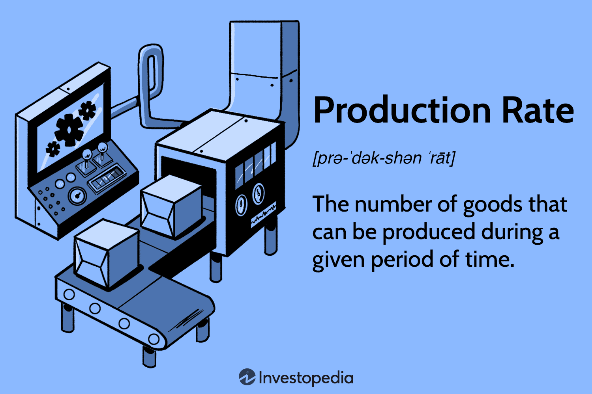

In today’s dynamic industrial and financial landscape, efficiency has become a crucial determinant of success. This article examines the intersecting domains of manufacturing efficiency and algorithmic trading, highlighting how principles from the former are applied to the latter to enhance operational performance within financial markets.

Manufacturing efficiency revolves around producing more output with fewer inputs, thereby optimizing productivity and minimizing waste. In the context of algorithmic trading, similar concepts are applied, whereby algorithms strive to execute trades with maximum effectiveness and minimal resource expenditure. By drawing parallels between these two fields, businesses can identify strategies that improve overall performance, lower costs, and retain a competitive advantage.

The article will explore the key metrics used to measure efficiency, both in manufacturing and trading settings. In manufacturing, metrics such as the Output/Input Ratio and Capacity Utilization help quantify productivity. In financial markets, metrics such as Execution Efficiency and Order-to-Trade Ratio assess the effectiveness of algorithmic strategies. By understanding these metrics, organizations can better tailor their operations to increase efficiency and sustainability across various sectors.

## Table of Contents

## Understanding Manufacturing Productivity and Production Efficiency

Manufacturing productivity is a critical metric that measures the amount of output generated per unit of input in a manufacturing process. This concept is vital for companies aiming to produce more goods using fewer resources, thereby enhancing cost efficiency. By increasing productivity, manufacturers can achieve higher output levels, decrease waste, and optimize resource allocation, which is crucial for maintaining profitability and staying competitive in the market.

Production efficiency, on the other hand, refers to a company's ability to produce maximum output without incurring additional resource expenditure. It is often visualized as a point located on a company's production possibility frontier (PPF), which represents the most efficient production levels a firm can achieve given its available resources. Production efficiency ensures that firms are utilizing their resources in the best possible manner to maximize output.

To differentiate between productivity and efficiency: productivity focuses on the relationship between inputs and outputs, aiming to increase the former's ratio, while efficiency emphasizes achieving maximum output with given resources, ensuring that no additional inputs lead to waste. Both concepts are vital in optimizing industrial operations as they help identify areas where processes can be streamlined, costs can be reduced, and outputs can be maximized.

For example, in the automotive manufacturing sector, firms often adopt lean manufacturing techniques that focus on eliminating waste, enhancing workflow, and improving productivity. By applying methods such as Just-In-Time (JIT) inventory management, manufacturers can reduce holding costs and minimize waste, thus driving productivity. At the same time, technologies such as Computer Numerical Control (CNC) machines allow manufacturers to achieve high precision and minimal resource utilization, pushing them closer to the efficiency frontier.

A practical illustration can be seen in the electronics manufacturing industry, where companies utilize automation and robotics to enhance efficiency. Automated assembly lines can execute repetitive tasks with precision and speed, significantly boosting productivity. This automation ensures that production is optimized to achieve maximum output, aligning closely with the concept of production efficiency.

By understanding and applying these principles, industries can align their operations to optimize productivity and efficiency, ensuring they remain competitive and sustainable in the rapidly-evolving industrial landscape.

## Calculating Production Efficiency and Rate

Calculating production efficiency and rate is integral to optimizing manufacturing processes. These calculations often rely on metrics such as the Output/Input Ratio and Capacity Utilization, which provide quantifiable measures of how effectively resources are being used to produce goods.

The Output/Input Ratio is a basic measure of productivity, signifying the quantity of goods produced relative to the amount of resources consumed. It is calculated using the formula:

$$
\text{Output/Input Ratio} = \frac{\text{Total Output}}{\text{Total Input}}
$$

For example, if a factory produces 200 units using 100 units of input, the Output/Input Ratio would be 2, indicating efficient resource use.

Capacity Utilization examines how effectively a facility uses its production capacity. The formula is:

$$
\text{Capacity Utilization} = \left( \frac{\text{Actual Output}}{\text{Potential Output}} \right) \times 100\%
$$

This metric helps identify underused resources or bottlenecks in production. A facility producing 800 units out of a potential 1000 has an 80% capacity utilization rate, highlighting areas for potential improvement.

Production efficiency (Ep) is a comprehensive metric that focuses on minimizing waste while maximizing output. It can be defined as:

$$
Ep = \left( \frac{\text{Value-Added Output}}{\text{Total Input}} \right) \times 100\%
$$

Utilizing these metrics, manufacturers can pinpoint inefficiencies and streamline operations. For example, a study in the automotive sector revealed that by optimizing the production line configuration based on capacity utilization data, a manufacturer reduced downtime and increased throughput by 15%.

Case studies have demonstrated the practical application of these metrics. A textile company, for example, applied the Output/Input Ratio analysis to restructure its resource allocation, which led to a 10% reduction in fabric waste. Similarly, a beverage manufacturer used capacity utilization data to reschedule production, aligning more closely with peak demand periods and achieving a 20% boost in overall production efficiency.

In conclusion, precise measurement and analysis using these key metrics not only enhance production efficiency but also lead to significant resource savings and improved process optimization across manufacturing settings. By employing data-driven decision-making, businesses can maintain a competitive edge in the industrial landscape.

## Algorithmic Trading and Its Role in Efficiency

Algorithmic trading leverages computer algorithms to improve market efficiency by executing trades at speeds unmatched by human traders. These algorithms are designed to follow set instructions for trading, ranging from decision-making processes to trade execution without human intervention. This rapid execution capability contributes significantly to market efficiency, as orders are placed, executed, and settled swiftly, reducing the time lag and human error typically associated with manual trading.

One critical metric for assessing the efficiency of [algorithmic trading](/wiki/algorithmic-trading) is Execution Efficiency. This measures how well an algorithm achieves its intended trading objectives, such as minimizing the market impact of a trade or optimizing the execution cost relative to a benchmark price. Various performance benchmarks, such as implementation shortfall and slippage, are often used to evaluate Execution Efficiency. Implementation shortfall represents the difference between the execution price and the price at the time the order was decided, indicating the cost of trade execution.

The Order-to-Trade Ratio is another vital metric that quantifies the efficiency of algo trading systems. This ratio reflects the number of orders placed to the number of trades actually executed. A high Order-to-Trade Ratio might suggest inefficiency, as it implies that many orders are being sent but few are being executed, potentially due to poor algorithm design or suboptimal market conditions. 

Cost Efficiency evaluates the economic effectiveness of trades, accounting for factors like transaction fees, market impact, and indirect costs associated with timing. Algorithms that demonstrate high cost efficiency often utilize sophisticated strategies to minimize these expenses, thereby maximizing net returns.

By enhancing [liquidity](/wiki/liquidity-risk-premium), algorithmic trading also narrows bid-ask spreads—the difference between the highest price a buyer is willing to pay for an asset and the lowest price a seller will accept. Narrower spreads reduce the cost for traders to enter and [exit](/wiki/exit-strategy) positions, contributing to a more liquid and accessible market where participants of all sizes can engage efficiently. This increase in market liquidity helps democratize financial markets by allowing a more diverse range of investors to participate, thus fostering a more competitive and equitable trading environment.

Algorithmic trading's impact on market dynamics has reshaped the competitive landscape, necessitating continuous advancements in algorithm design to maintain competitive advantage. Strategies such as market-making, [arbitrage](/wiki/arbitrage), and [trend following](/wiki/trend-following) are implemented through algorithms to exploit various market conditions and inefficiencies. It's essential for traders and firms to consistently refine these strategies, utilizing data analytics and [machine learning](/wiki/machine-learning) to adapt to the evolving financial environment. Through these practices, algorithmic trading not only boosts operational efficiency in financial markets but also contributes to overall market stability and transparency.

## Challenges and Considerations in Measuring Efficiency

Measuring efficiency across manufacturing and algorithmic trading environments is complex, influenced by various factors, such as data limitations and the distinction between advantageous and detrimental practices. Accurate measurement is crucial for optimizing processes and maintaining competitiveness, yet several challenges impede precise evaluation.

Data limitations pose a significant barrier to accurate efficiency measurement. In manufacturing, incomplete or inaccurate data can lead to misguided assessments of production efficiency, as the collected data may not fully represent the nuances of the production environment. In algorithmic trading, data accuracy is paramount; latency and incomplete data can skew trading algorithms' effectiveness, leading to losses or misjudged market positions.

Distinguishing between beneficial and harmful trading practices further complicates efficiency measurement. Harmful practices, such as high-frequency trading that amplifies market [volatility](/wiki/volatility-trading-strategies), can appear effective in the short term but undermine long-term market stability. In manufacturing, efficiency gains should not come at the cost of product quality or worker safety, as these can lead to reputational damage and financial losses.

To overcome these challenges, a robust regulatory framework is necessary. Regulations ensure that efficiency metrics capture true performance without compromising ethical standards. For instance, in algorithmic trading, compliance with regulations helps maintain market integrity by curbing manipulative practices.

Sophisticated analytical tools, powered by advancements in [artificial intelligence](/wiki/ai-artificial-intelligence) (AI) and the Internet of Things (IoT), also play a pivotal role. AI algorithms can process vast datasets efficiently, identifying patterns and insights that human analysis might miss. In manufacturing, IoT devices provide real-time data from production lines, enhancing the accuracy of efficiency measurements and enabling timely interventions.

AI can also aid in distinguishing beneficial practices by employing machine learning models that learn from historical data to predict outcomes of various strategies. For example, AI models can rank trading strategies based on historical performance, helping identify approaches that sustainably enhance efficiency.

Incorporating AI and IoT technology requires a well-structured approach. Implementing AI models, such as those written in Python, can leverage libraries like TensorFlow or PyTorch to build predictive algorithms for efficiency optimization. Furthermore, IoT systems can be integrated via edge computing devices that monitor production metrics and communicate with centralized systems for comprehensive analysis. The interaction between these technologies enhances decision-making processes, enabling organizations to refine their strategies towards sustained efficiency improvements.

Addressing these challenges leads to more precise efficiency metrics, driving informed decisions that balance productivity with ethical and sustainable practices, fostering a stable and prosperous industrial and financial landscape.

## Technological Advancements Enhancing Efficiency

Technological advancements have significantly improved efficiency across manufacturing and trading sectors. Automation, the Internet of Things (IoT), Artificial Intelligence (AI), and Blockchain stand out as crucial technologies driving these improvements.

Automation streamlines tasks through the use of machines and computerized systems, minimizing human intervention. This not only speeds up production but also reduces errors, leading to higher quality outputs. In manufacturing, automated assembly lines allow for precise, repetitive production processes that improve product consistency and reduce defect rates. In trading, automation through algorithmic trading systems enables rapid transaction execution, maximizing return on investment by capitalizing on minute market movements that are not perceptible to human traders.

The IoT connects devices and systems, facilitating seamless communication and real-time data exchange. In manufacturing, IoT sensors monitor equipment performance and product quality, reducing downtime through predictive maintenance. This connectivity allows for immediate adjustments to optimize production processes. Similarly, in trading, IoT provides data feeds and insights that can be analyzed to make informed trading decisions quickly.

AI enhances efficiency by processing large volumes of data to identify patterns and make predictions. Machine learning algorithms, a subset of AI, can predict equipment failures in manufacturing, allowing for proactive maintenance scheduling. AI-driven supply chain optimization enhances inventory management and reduces waste. In financial markets, AI algorithms analyze historical and real-time data to forecast market trends, improving trade outcomes and decision-making speed.

Blockchain technology improves efficiency by ensuring secure and transparent transaction records. In manufacturing, blockchain can track the provenance of raw materials and final products, boosting traceability and ensuring product authenticity. This is particularly significant in industries where provenance guarantees, such as pharmaceuticals or food, are crucial. In trading, blockchain facilitates faster and more secure transactions by eliminating intermediaries and reducing the potential for fraud.

Several case studies highlight the successful integration of these technologies. For instance, a leading automobile manufacturer incorporated IoT with AI algorithms to create a smart production system. This system reduced assembly line downtime by 30% and increased output quality by monitoring and adjusting operations in real-time. Similarly, in the financial industry, a trading firm using AI-driven algorithmic trading software reported a 20% increase in trading efficiency, attributing gains to improved decision-making and faster execution.

In summary, the convergence of Automation, IoT, AI, and Blockchain is transforming manufacturing and trading by enhancing efficiency, reducing errors, optimizing processes, and improving traceability. These advancements enable companies to achieve higher output quality and maintain a competitive edge in their respective markets.

## Market Implications of Increased Efficiency

Enhanced production efficiency plays a critical role in shaping competitive pricing strategies and influencing market dynamics. As companies streamline their production processes, they achieve economies of scale, leading to significant cost advantages. Economies of scale occur when the cost per unit decreases as the [volume](/wiki/volume-trading-strategy) of production increases, allowing firms to benefit from operational efficiencies and lower input prices, thereby reducing overhead per unit. The formula for economies of scale can be expressed as:

$$
\text{Average Cost per Unit} = \frac{\text{Total Cost}}{\text{Total Output}}
$$

As production scales up, the total cost increases, but at a decreasing rate, resulting in a lower average cost per unit.

This increase in efficiency often translates into competitive advantages in pricing strategies. By lowering production costs, companies can offer competitive pricing to consumers without sacrificing profit margins. This pricing flexibility can help capture a larger market share, enhance customer loyalty, and create barriers to entry for competitors.

Toyota and Tesla serve as prime examples of how enhanced efficiency can be leveraged to gain market superiority. Toyota's implementation of lean manufacturing techniques, known as the Toyota Production System, has allowed it to minimize waste and optimize production workflows. This system's success has manifested in reduced lead times, lower inventory costs, and improved product quality, enabling Toyota to maintain competitive pricing and reinforce its market position globally.

Similarly, Tesla has revolutionized automotive manufacturing by integrating advanced technologies and automation in its production processes. Tesla's Gigafactories exemplify how scaling production efficiently can lead to cost reductions and higher output rates. The company's focus on innovation and efficiency in production has not only bolstered its profitability but also its market valuation, giving it a competitive edge in the electric vehicle market.

In summary, increased production efficiency fosters a favorable impact on competitive pricing and market dynamics. By achieving economies of scale, companies can reduce unit costs, enhance profitability, and strengthen their market positions. The examples of Toyota and Tesla highlight the tangible benefits of optimizing production efficiency, demonstrating how it can serve as a key driver in achieving long-term business success.

## Conclusion

Achieving efficiency and productivity in both manufacturing and trading is essential for sustaining profitability and securing a competitive position in the global marketplace. The application of algorithmic efficiency metrics, originally developed for trading, to manufacturing processes highlights universal principles that transcend industry boundaries. These metrics provide a quantitative framework that allows for the measurement and enhancement of performance across diverse operational domains.

The parallel drawn between algorithmic trading and manufacturing shows that data-driven approaches can lead to significant improvements in operations. In algorithmic trading, efficiency is achieved through precise execution, cost reduction, and enhanced market liquidity. Similarly, the manufacturing sector can benefit from adopting similar techniques: using algorithms to optimize production schedules, reduce waste, and improve supply chain management.

Adopting emerging technologies will be crucial for organizations seeking to exceed current efficiency benchmarks. Technologies such as Artificial Intelligence (AI), the Internet of Things (IoT), and Blockchain play a pivotal role in advancing operational efficiency. AI and machine learning algorithms can optimize everything from predictive maintenance schedules to real-time quality control, reducing downtime and minimizing defects. IoT devices provide real-time data that enhance visibility and control over manufacturing and trading processes. Blockchain ensures transparency and traceability in supply chains, improving trust and efficiency in transactions.

A sustained focus on technological integration is expected to drive industry evolution. Organizations that embrace these technologies will likely see dramatic improvements in operational metrics, such as production output, time-to-market, and overall cost efficiency. These developments are not just trends; they represent a fundamental shift in how businesses operate, encouraging a culture of continuous improvement and innovation.

In conclusion, by applying universal principles of efficiency drawn from diverse fields, businesses can not only achieve current benchmarks but also pave the way for future advancements. This holistic approach to efficiency will undoubtedly contribute to the long-term viability and success of organizations within the manufacturing and trading landscapes.

## References & Further Reading

- Womack, J. P., Jones, D. T., & Roos, D. (1990). *The Machine That Changed the World: The Story of Lean Production*. This book outlines the principles of lean manufacturing and the revolutionary impact it has had on production efficiency, providing a crucial understanding of streamlined processes that minimize waste.

- Montgomery, D. C. (2008). *Introduction to Statistical Quality Control*. This text provides comprehensive insights into the application of statistical methods for quality improvement in manufacturing processes, highlighting essential strategies for sustaining high production standards.

- Rother, M., & Shook, J. (1999). *Learning to See: Value Stream Mapping to Add Value and Eliminate Muda*. This book introduces value stream mapping as a tool for visualizing and optimizing operations, crucial for improving production efficiency by eliminating non-value-adding activities.

- Fabozzi, F. J., & Markowitz, H. M. (2002). *The Theory and Practice of Investment Management*. This work discusses foundational concepts in investment management, including strategies to optimize portfolio performance and manage risks effectively.

- Sutton, R. (2013). *Learning Patterns: The Blending of Process and Insight in Algorithmic Trading Development*. This publication examines the development of algorithmic trading systems, focusing on combining technical processes with innovative insights to enhance market efficiency and trading effectiveness.

