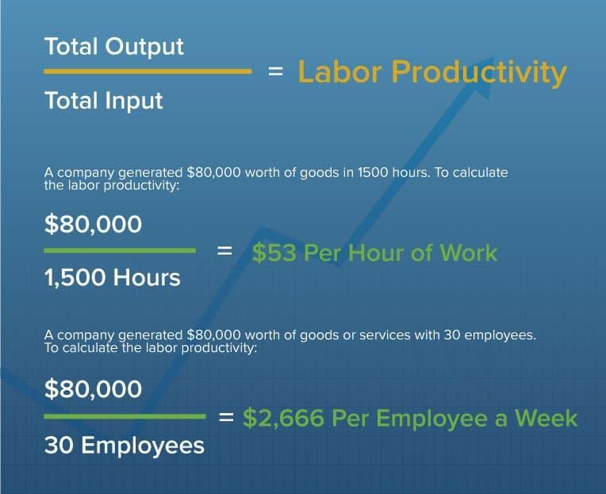

## Table of Contents

## What is production rate?

Production rate is how fast a company can make things. It's important because it shows how efficient a company is at turning materials into products. If a company can make more products in less time, it can sell more and make more money.

To find the production rate, you look at how many items are made in a certain amount of time. For example, if a factory makes 100 cars in one day, the production rate is 100 cars per day. Companies always try to improve their production rate to stay competitive and meet customer demands.

## Why is production rate important in manufacturing?

Production rate is really important in manufacturing because it tells us how quickly a company can make its products. If a company can make more products faster, it can sell more and make more money. This is good for the company because it can meet the needs of its customers better and stay ahead of other companies that make similar things.

Also, knowing the production rate helps companies find ways to work better. If they see that they are not making things as fast as they could, they can change their methods or use new technology to speed up. This can save time and money, and make sure the company keeps making good products without wasting anything.

## How do you calculate the basic production rate?

To calculate the basic production rate, you need to know two things: how many items are made and how much time it took to make them. For example, if a factory makes 200 toys in one hour, the production rate is 200 toys per hour. You find this by dividing the number of items made by the time it took. So, 200 toys divided by 1 hour gives you 200 toys per hour.

This calculation helps companies understand how fast they are working. If they want to make more toys in the same amount of time, they need to find ways to speed up their work. By knowing their production rate, they can see if they are doing a good job or if they need to make changes to work better.

## What are the key factors that affect production rate?

Several things can change how fast a company makes things. One big thing is the machines and tools they use. If the machines are old or break a lot, it slows everything down. But if they use new, fast machines, they can make more in less time. Another thing is how well the workers know their jobs. If workers are trained well and know what to do, they can work faster and make more. Also, having enough workers is important. If there aren't enough people, work can pile up and slow down the whole process.

The way things are set up in the factory also matters a lot. If everything is organized and materials are easy to get, workers can move quickly from one task to another. But if the factory is messy or things are hard to find, it takes longer to make stuff. Another factor is how well the company plans and manages its work. Good planning means knowing how much to make and when to make it, so there's no waiting around. If the company can keep a steady flow of work, it helps keep the production rate high.

## Can you explain the difference between production rate and productivity?

Production rate and productivity are two different things, but they are related. Production rate is about how fast a company can make things. It's like counting how many items are made in a certain amount of time. For example, if a factory makes 100 cars in one day, the production rate is 100 cars per day. This tells us how quickly the factory can turn materials into finished products.

Productivity, on the other hand, looks at how well resources are used to make things. It's not just about speed; it's about efficiency. Productivity measures how much output (like the number of cars) you get from a certain amount of input (like the time and money spent). If a factory can make 100 cars with less time or fewer resources than before, its productivity has gone up, even if the production rate stays the same. So, while production rate focuses on speed, productivity focuses on getting the most out of what you have.

## How does production rate vary across different industries?

Production rate can be very different depending on what industry you're looking at. For example, in the car-making industry, the production rate might be measured in how many cars a factory can make in a day. This can be a lot because car factories often use big machines and have a lot of workers. But in the jewelry industry, where each piece might be made by hand, the production rate is much slower. They might only make a few pieces a day because it takes time to do everything carefully.

Different industries also have different ways of working that affect their production rate. In the food industry, like making cookies, the production rate can be high because machines can quickly mix, shape, and bake the cookies. They can make thousands of cookies in an hour. But in the furniture industry, making a couch or a table takes more time because it involves cutting wood, assembling parts, and maybe even adding fabric. So, the production rate here would be lower, maybe just a few pieces a day. Each industry has its own challenges and ways of doing things, which is why their production rates can be so different.

## What are some common methods to increase production rate?

One way to increase production rate is by using better technology and machines. If a factory gets new machines that work faster and don't break down as often, they can make more things in less time. Another way is by training workers better. When workers know their jobs well and understand how to do things quickly and correctly, they can make more products. Also, having enough workers is important. If there aren't enough people, work can pile up and slow everything down. So, hiring more workers or making sure everyone is working can help speed up production.

Another method is by organizing the factory better. If everything is set up so that workers can easily find what they need and move from one task to another without wasting time, the production rate can go up. Good planning is also key. If the company knows exactly how much to make and when to make it, they can keep a steady flow of work going. This means less waiting around and more time making products. By focusing on these things, companies can make more in less time and keep their customers happy.

## How can production rate be optimized using lean manufacturing techniques?

Lean manufacturing is all about making things better by cutting out waste. One way to use lean techniques to optimize production rate is by looking at the whole process and finding things that slow it down. For example, if workers have to wait for materials or if machines are not working right, that's waste. By fixing these problems, like making sure materials are always ready and machines are well-maintained, the production rate can go up. Another part of lean is making sure workers are doing tasks that add value. If they're doing things that don't help make the product, like moving things around a lot, that's also waste. By organizing the work so that every step adds value, the production rate can be faster.

Another important lean technique is continuous improvement, which means always looking for ways to do things better. This can involve small changes, like rearranging the factory floor so workers can move more easily, or big changes, like using new technology that speeds up production. By always trying to improve, companies can keep their production rate high. Lean also focuses on making sure the right amount of products are made at the right time. This means not making too much or too little, which can slow things down. By keeping a steady flow of work and making just what is needed, the production rate can be optimized and kept high.

## What role does technology play in enhancing production rate?

Technology plays a big role in making things faster in factories. New machines and tools can do jobs quicker and better than old ones. For example, a new machine might be able to cut, shape, and assemble parts much faster than people can do by hand. This means more products can be made in less time. Also, technology like robots can work all the time without getting tired, so they can keep the production going even when people need to take breaks. Computers and software help too, by making it easier to plan and keep track of everything, so there's less waiting around and more time making things.

Another way technology helps is by making it easier to find and fix problems. Sensors and smart machines can tell when something is going wrong, so it can be fixed before it causes a big delay. This means less time is wasted on fixing things, and more time can be spent on making products. Technology also helps with communication and teamwork. Workers can use devices to talk to each other and share information quickly, which helps keep everything moving smoothly. By using technology in these ways, factories can make more things faster and keep their customers happy.

## How do you account for downtime and maintenance in production rate calculations?

When figuring out the production rate, you need to think about downtime and maintenance. Downtime is when the machines aren't working because they're broken or being fixed. Maintenance is when workers stop the machines to clean them or make sure they're working right. These things can slow down how fast you make things. So, when you calculate the production rate, you need to take away the time the machines were not working. For example, if a factory can make 100 toys in an hour when everything is working, but there was an hour of downtime, you might only make 100 toys in two hours instead of one.

To get a good idea of the real production rate, you can look at the total time the machines were working and the total number of items made. If a factory worked for 8 hours but had 2 hours of downtime, you would only count the 6 hours it was actually working. If it made 600 toys in those 6 hours, the production rate would be 100 toys per hour. This way, you get a clear picture of how fast things are being made when everything is running smoothly. It's important to keep track of downtime and maintenance so you can plan better and make sure the factory is as efficient as possible.

## What advanced statistical models can be used to predict and improve production rate?

Advanced statistical models like regression analysis can help predict and improve production rate. Regression analysis looks at past data to find patterns and relationships between different things that affect how fast things are made. For example, it can show how changes in the number of workers or the type of machines used can change the production rate. By understanding these patterns, factories can make better decisions about what to change to make things faster. This model can also help predict future production rates based on planned changes, so factories can plan better and avoid surprises.

Another useful model is time series analysis, which looks at how production rates change over time. This model can help spot trends and seasonal changes that might affect how fast things are made. For example, it can show if production rates go up or down at certain times of the year. By understanding these patterns, factories can adjust their work to keep production rates high. Time series analysis can also help predict future production rates, so factories can prepare for busy times and make sure they have enough resources to keep up with demand.

## How can real-time data analytics be utilized to monitor and adjust production rate dynamically?

Real-time data analytics can help factories keep an eye on how fast they are making things and make changes quickly if needed. By using special software and sensors, factories can see what's happening right now. For example, if a machine starts to slow down or break, the data can show this right away. This means workers can fix the problem before it gets worse and slows down the whole factory. Also, real-time data can show if there are too many or too few workers at certain times, so the factory can adjust the number of people working to keep the production rate steady.

This kind of data can also help factories make smart decisions about what to do next. If the data shows that one part of the factory is working faster than another, the factory can move workers or resources around to balance things out. This helps keep everything moving smoothly and makes sure the production rate stays high. By using real-time data, factories can react quickly to changes and keep making things as fast as possible, which is good for meeting customer needs and staying ahead of other companies.

## How do you calculate production efficiency and rate?

Calculating production efficiency and rate is integral to optimizing manufacturing processes. These calculations often rely on metrics such as the Output/Input Ratio and Capacity Utilization, which provide quantifiable measures of how effectively resources are being used to produce goods.

The Output/Input Ratio is a basic measure of productivity, signifying the quantity of goods produced relative to the amount of resources consumed. It is calculated using the formula:

$$
\text{Output/Input Ratio} = \frac{\text{Total Output}}{\text{Total Input}}
$$

For example, if a factory produces 200 units using 100 units of input, the Output/Input Ratio would be 2, indicating efficient resource use.

Capacity Utilization examines how effectively a facility uses its production capacity. The formula is:

$$
\text{Capacity Utilization} = \left( \frac{\text{Actual Output}}{\text{Potential Output}} \right) \times 100\%
$$

This metric helps identify underused resources or bottlenecks in production. A facility producing 800 units out of a potential 1000 has an 80% capacity utilization rate, highlighting areas for potential improvement.

Production efficiency (Ep) is a comprehensive metric that focuses on minimizing waste while maximizing output. It can be defined as:

$$
Ep = \left( \frac{\text{Value-Added Output}}{\text{Total Input}} \right) \times 100\%
$$

Utilizing these metrics, manufacturers can pinpoint inefficiencies and streamline operations. For example, a study in the automotive sector revealed that by optimizing the production line configuration based on capacity utilization data, a manufacturer reduced downtime and increased throughput by 15%.

Case studies have demonstrated the practical application of these metrics. A textile company, for example, applied the Output/Input Ratio analysis to restructure its resource allocation, which led to a 10% reduction in fabric waste. Similarly, a beverage manufacturer used capacity utilization data to reschedule production, aligning more closely with peak demand periods and achieving a 20% boost in overall production efficiency.

In conclusion, precise measurement and analysis using these key metrics not only enhance production efficiency but also lead to significant resource savings and improved process optimization across manufacturing settings. By employing data-driven decision-making, businesses can maintain a competitive edge in the industrial landscape.

## What are the market implications of increased efficiency?

Enhanced production efficiency plays a critical role in shaping competitive pricing strategies and influencing market dynamics. As companies streamline their production processes, they achieve economies of scale, leading to significant cost advantages. Economies of scale occur when the cost per unit decreases as the [volume](/wiki/volume-trading-strategy) of production increases, allowing firms to benefit from operational efficiencies and lower input prices, thereby reducing overhead per unit. The formula for economies of scale can be expressed as:

$$
\text{Average Cost per Unit} = \frac{\text{Total Cost}}{\text{Total Output}}
$$

As production scales up, the total cost increases, but at a decreasing rate, resulting in a lower average cost per unit.

This increase in efficiency often translates into competitive advantages in pricing strategies. By lowering production costs, companies can offer competitive pricing to consumers without sacrificing profit margins. This pricing flexibility can help capture a larger market share, enhance customer loyalty, and create barriers to entry for competitors.

Toyota and Tesla serve as prime examples of how enhanced efficiency can be leveraged to gain market superiority. Toyota's implementation of lean manufacturing techniques, known as the Toyota Production System, has allowed it to minimize waste and optimize production workflows. This system's success has manifested in reduced lead times, lower inventory costs, and improved product quality, enabling Toyota to maintain competitive pricing and reinforce its market position globally.

Similarly, Tesla has revolutionized automotive manufacturing by integrating advanced technologies and automation in its production processes. Tesla's Gigafactories exemplify how scaling production efficiently can lead to cost reductions and higher output rates. The company's focus on innovation and efficiency in production has not only bolstered its profitability but also its market valuation, giving it a competitive edge in the electric vehicle market.

In summary, increased production efficiency fosters a favorable impact on competitive pricing and market dynamics. By achieving economies of scale, companies can reduce unit costs, enhance profitability, and strengthen their market positions. The examples of Toyota and Tesla highlight the tangible benefits of optimizing production efficiency, demonstrating how it can serve as a key driver in achieving long-term business success.

## References & Further Reading

- Womack, J. P., Jones, D. T., & Roos, D. (1990). *The Machine That Changed the World: The Story of Lean Production*. This book outlines the principles of lean manufacturing and the revolutionary impact it has had on production efficiency, providing a crucial understanding of streamlined processes that minimize waste.

- Montgomery, D. C. (2008). *Introduction to Statistical Quality Control*. This text provides comprehensive insights into the application of statistical methods for quality improvement in manufacturing processes, highlighting essential strategies for sustaining high production standards.

- Rother, M., & Shook, J. (1999). *Learning to See: Value Stream Mapping to Add Value and Eliminate Muda*. This book introduces value stream mapping as a tool for visualizing and optimizing operations, crucial for improving production efficiency by eliminating non-value-adding activities.

- Fabozzi, F. J., & Markowitz, H. M. (2002). *The Theory and Practice of Investment Management*. This work discusses foundational concepts in investment management, including strategies to optimize portfolio performance and manage risks effectively.

- Sutton, R. (2013). *Learning Patterns: The Blending of Process and Insight in Algorithmic Trading Development*. This publication examines the development of algorithmic trading systems, focusing on combining technical processes with innovative insights to enhance market efficiency and trading effectiveness.

