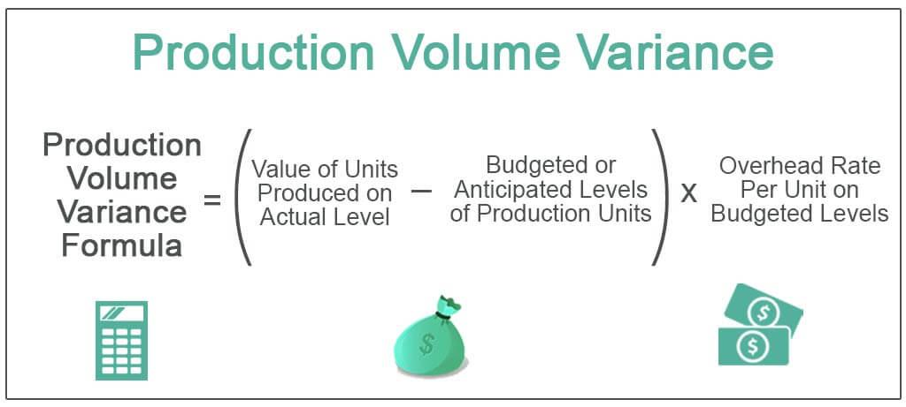

Understanding the intricacies of production volume variance is crucial for both accounting and trading professionals as it serves as a fundamental metric for assessing operational efficiency and informing decision-making processes. In the domain of management accounting, production volume variance aids businesses in evaluating the disparity between expected and actual production output, subsequently guiding strategies to optimize resource allocation and expenditure. Likewise, in the field of algorithmic trading, variance analysis enables traders to fine-tune algorithms by measuring performance deviations and adjusting strategies in response to market dynamics. 

This article amalgamates key components from both management accounting and algorithmic trading, highlighting how variance analysis can enhance decision-making in production and trading operations. By integrating these methodologies, professionals can attain a holistic view of performance metrics and develop strategies that bolster efficiency and profitability. Through a detailed exploration of production volume variance, readers will gain insights into its applications and benefits, ultimately fostering improved decision-making capabilities for businesses and traders alike.



## Table of Contents

## What is Production Volume Variance?

Production volume variance quantifies the discrepancy between the expected and actual number of units produced. This metric serves as a vital indicator of a company’s operational efficiency and has a direct correlation with its profitability. A positive production volume variance occurs when the actual production exceeds the budgeted figures. This scenario suggests higher efficiency in operations, potentially leading to increased sales and profits if demand conditions are favorable. Conversely, a negative production volume variance indicates that fewer units were produced than planned, often highlighting potential operational inefficiencies, bottlenecks, or demand forecasting issues that could adversely affect company profitability.

Operational efficiency is closely tied to how well production volumes align with expectations. Efficient operations typically result in favorable variances and enhanced profitability as fixed costs are spread over more units, reducing the cost per unit. Therefore, the production volume variance becomes a critical metric for management to monitor, allowing them to identify areas requiring attention and adjustment to improve overall performance and align with strategic objectives.

## Calculating Production Volume Variance

Production [volume](/wiki/volume-trading-strategy) variance is calculated using a straightforward formula: 

$$
\text{Production Volume Variance} = (\text{Actual Units Produced} - \text{Budgeted Production Units}) \times \text{Budgeted Overhead Rate per Unit}
$$

This formula quantifies the difference between the actual number of units produced and the number that was budgeted, multiplied by the budgeted overhead rate for each unit.

Understanding this variance is critical for businesses as it offers a lens into operational efficiency. When the actual production exceeds the budgeted amount, signified by a positive variance, it indicates that a company is producing more than anticipated, which might suggest efficiency gains or increased demand fulfillment. On the other hand, a negative variance signals underproduction relative to the plan, pointing to potential inefficiencies or issues such as equipment downtimes, labor shortages, or inaccurate forecasting.

For practical application, consider the following Python code to calculate production volume variance:

```python
def calculate_production_volume_variance(actual_units, budgeted_units, budgeted_overhead_rate):
    return (actual_units - budgeted_units) * budgeted_overhead_rate

actual_units_produced = 1050
budgeted_production_units = 1000
budgeted_overhead_rate_per_unit = 10

variance = calculate_production_volume_variance(actual_units_produced, budgeted_production_units, budgeted_overhead_rate_per_unit)
print(f"Production Volume Variance: {variance}")
```

This code snippet shows a simple function that computes the production volume variance based on actual production numbers versus budgeted figures, incorporating the budgeted overhead rate per unit. 

By understanding whether a variance is favorable or unfavorable, businesses can make empirically driven decisions to adjust production levels, allocate resources more efficiently, and ultimately enhance both productivity and profitability.

## The Role of Variance Analysis in Management Accounting

Variance analysis serves as an essential tool in management accounting by breaking down the differences between anticipated and actual financial outcomes. By evaluating these variances, organizations can gain insights into the performance of their operations, pinpoint areas of inefficiency, and subsequently refine their strategies to improve cost control.

A primary focus of variance analysis is to compare budgeted figures against actual performance. This involves examining various types of variances, such as sales variance, direct material variance, direct labor variance, and, notably, overhead variance, which includes production volume variance. By analyzing these metrics, companies can determine the reasons behind any deviations and adjust their operations to bridge gaps between expected and actual results.

For instance, if a company finds a significant unfavorable production volume variance, it indicates that fewer units were produced than planned, which might suggest inefficiencies in production processes or machine underutilization. On the other hand, a favorable production volume variance implies that more units were produced than anticipated, possibly yielding higher revenue but also necessitating an investigation to ensure no quality compromises were made.

Quantifying these variances allows companies to address cost overages and inefficiencies more effectively. For example, identifying a high direct material price variance may prompt a company to renegotiate supplier contracts or find alternative sources to reduce costs.

Management accountants use variance analysis to conduct a deeper examination of operational outcomes and implement corrective actions that enhance organizational efficiency and profitability. By consistently applying variance analysis, companies can establish a culture of continuous improvement, driving strategic adjustments that align more closely with financial goals. This continuous feedback loop, driven by accurate variance reporting, empowers businesses to maintain robust cost control and optimum resource allocation, ensuring long-term financial health and competitiveness in their markets.

## Applying Variance Analysis in Algorithmic Trading

Variance analysis in [algorithmic trading](/wiki/algorithmic-trading) involves the systematic evaluation of differences between expected and actual performance metrics. This analytical process is intended to refine and optimize trading strategies by identifying and  correcting discrepancies. In algorithmic trading, traders use computer algorithms to automate trade execution at speeds unattainable by human traders, relying heavily on predetermined criteria, quantitative models, and statistical analysis. Given this reliance on predefined models, variance analysis becomes essential in ensuring that these models are performing as expected under varying market conditions.

To conduct variance analysis in algorithmic trading, traders first establish a set of expected performance metrics based on historical data, pre-trade assessments, or simulations. Once the trading strategies are implemented, actual performance metrics are gathered from executed trades, including profit and loss, trade execution speed, slippage, and market impact. The deviation of these actual metrics from the expected ones highlights areas for strategy refinement.

For instance, if a trading algorithm exhibits higher-than-expected slippage—where orders are executed at a different price than anticipated due to latency in execution—variance analysis would reveal this discrepancy. As a result, the strategy might be adjusted by altering execution algorithms, tweaking order sizes, or changing market venues to minimize latency.

Variance analysis also aids in understanding the impact of market conditions on trading performance. Market [volatility](/wiki/volatility-trading-strategies), [liquidity](/wiki/liquidity-risk-premium), and [order book](/wiki/order-book-trading-strategies) dynamics can introduce variances in trading outcomes. Employing statistical methods, traders can evaluate how these external factors influence discrepancies in trade execution. For example, during periods of high volatility, increased variance in execution metrics might be observed, prompting a reassessment of risk management frameworks and adaptive strategy modifications.

Algorithmic traders may utilize programming languages like Python for implementing variance analysis. This involves leveraging libraries such as pandas for data manipulation, NumPy for numerical operations, and tools like statsmodels or scikit-learn for statistical testing and [machine learning](/wiki/machine-learning), aiding in predictive analysis and strategy optimization.

Below is a simple example of how Python can be employed to perform basic variance analysis on trading data:

```python
import pandas as pd
import numpy as np

# Assume df is a DataFrame containing the expected and actual profits of trades
df = pd.DataFrame({
    'Expected_Profit': [100, 120, 130, 110, 105],
    'Actual_Profit': [95, 125, 120, 115, 100]
})

# Calculate variance
df['Variance'] = df['Actual_Profit'] - df['Expected_Profit']

# Output the average variance
average_variance = np.mean(df['Variance'])
print(f"Average Variance: {average_variance}")

# Identify and analyze periods with significant variances
significant_variances = df[df['Variance'].abs() > 10]
print("Significant Variances:")
print(significant_variances)
```

In conclusion, variance analysis in algorithmic trading provides critical insights that allow traders to refine their strategies, adapt to changing market environments, and optimize trading outcomes. This approach ensures that trading activities align more closely with expected performance, enabling more robust and efficient algorithmic trading systems.

## Factors Impacting Production Volume Variance

Production volume variance is a critical metric for assessing the efficiency and effectiveness of production processes. Several factors, both internal and external, significantly influence this variance, impacting a company's ability to meet its production targets and maintain profitability.

**Internal Factors:**

1. **Production Planning:** Effective production planning entails forecasting demand accurately, scheduling production runs optimally, and ensuring the availability of raw materials and workforce. Inadequate planning can lead to either overproduction or underproduction, causing variance from the expected production volumes.

2. **Operational Efficiency:** The efficiency of production processes plays a vital role in achieving target volumes. Factors such as machinery performance, labor productivity, and process improvements directly affect operational efficiency. For instance, equipment breakdowns or suboptimal use of resources can lead to production shortfalls or delays, thereby increasing variance.

3. **Capacity Utilization:** The extent to which a company's production capacity is used has a direct impact on production volume variance. Optimal utilization means maximizing output without overstraining resources. Low capacity utilization due to poor demand forecasting or inefficient workflows can lead to negative variance, while excessively high utilization might cause maintenance issues and unscheduled downtimes.

**External Factors:**

1. **Market Demand Changes:** Fluctuations in market demand can influence production decisions and cause significant variances. An unexpected increase in demand might necessitate ramping up production, while a sudden decrease could result in excess inventory and resource idleness.

2. **Economic Conditions:** Economic factors such as inflation, interest rates, and consumer spending patterns affect overall production volumes. Economic downturns can lead to decreased demand and consequently lower production levels, resulting in adverse volume variances.

3. **Supply Chain Disruptions:** External disruptions in the supply chain, such as delays in raw material delivery, logistical challenges, or geopolitical events, can severely impact the production schedule. These disruptions may force companies to adjust their production plans, leading to deviations from the planned output.

Understanding these factors allows businesses to better manage production volume variance by implementing strategies aimed at mitigating risks, improving internal processes, and adapting to external changes effectively. Employing advanced analytics and predictive modeling can further enhance a company’s ability to anticipate and respond to these influencing factors.

## Case Studies in Production and Trading Variance

In the analysis of production and trading operations, real-world case studies highlight how variance analysis has effectively enhanced efficiency and profitability. By examining quantitative hedge funds and manufacturing firms, we can see how these entities have utilized variance analysis to address operational challenges and optimize their strategies.

### Quantitative Hedge Funds

Quantitative hedge funds rely heavily on data-driven strategies to earn profits. Variance analysis enables these funds to assess the discrepancies between expected and actual portfolio returns. For instance, if a fund anticipated a monthly return of 2% but realized only 1.5%, the negative variance prompts an investigation. Factors such as market volatility, execution slippage, or model inaccuracies are scrutinized to pinpoint causes. 

Through strategic variance analysis, quantitative funds can refine their algorithms. For example, by employing Python scripts to assess variance in back-testing results against live trades, funds can adapt models to improve decision-making. Here's a simplified example of how Python can be used for this purpose:

```python
import numpy as np

# Expected returns and actual returns arrays
expected_returns = np.array([0.02, 0.015, 0.018, 0.025])
actual_returns = np.array([0.015, 0.02, 0.017, 0.022])

# Calculate variance
variance = actual_returns - expected_returns

# Analyze discrepancies (negative variance indicates a shortfall)
for i, v in enumerate(variance):
    print(f'Month {i+1}: Variance = {v:.3f}, {"Shortfall" if v < 0 else "Overperformance"}')
```

This kind of analysis allows hedge funds to continually adapt and manage risks, thus maintaining their competitive edge.

### Manufacturing Firms

In manufacturing, production volume variance analysis is vital for aligning operations with strategic goals. A company, for example, predicted a production output of 10,000 units but only achieved 9,500 units, resulting in a negative variance. This discrepancy prompts a detailed examination of production processes, identifying bottlenecks or inefficiencies.

A notable case study involves a car manufacturer that utilized variance analysis to uncover inefficiencies within their supply chain. After identifying a consistent negative variance in production volumes due to delayed parts supply, the firm restructured its supplier contracts and logistics management. As a result, the company achieved more consistent production levels, aligning closely with forecasts and improving overall operational efficiency.

In both the trading and production sectors, variance analysis serves as a critical tool for optimizing performance. These case studies provide practical examples of how entities can apply variance analysis to detect inefficiencies, refine strategies, and ultimately enhance operational efficiency and profitability.

## Strategies for Managing Production Volume Variance

Effective management of production volume variance is pivotal for optimizing both production processes and trading strategies. One of the primary strategies involves enhancing forecasting methods. By improving the precision of demand forecasts, businesses can align production schedules more closely with customer needs, thereby minimizing variance. Advanced statistical models and machine learning algorithms can be employed to achieve this precision, taking into account historical data, seasonal trends, and external market indicators.

Aligning production capacity with demand is another essential strategy. This alignment requires a keen understanding of both current production capabilities and anticipated demand fluctuations. Techniques such as flexible manufacturing systems and just-in-time inventory management can assist in maintaining this balance, allowing companies to scale up or down without incurring significant variances.

Evaluating external market conditions is also critical. Factors such as economic indicators, competitor actions, and changes in consumer preferences should be continuously monitored to anticipate their impact on production requirements. Real-time data analytics tools can facilitate this monitoring, offering insights that enable timely adjustments to production plans.

In algorithmic trading, managing production volume variance involves the ongoing refinement of algorithms based on variance analysis. By continuously comparing expected and actual performance metrics, traders can adjust algorithms to reflect changing market dynamics and improve execution quality. This iterative process enhances the algorithm’s adaptability, ensuring consistent performance even in volatile market conditions.

Incorporating feedback loops into trading systems can also help in variance management. These loops allow algorithms to learn from past trades, identify patterns, and optimize decision-making processes for future transactions. Utilizing programming languages like Python, traders can implement libraries such as NumPy and pandas to perform these analytical tasks efficiently, enabling the development of robust variance management strategies.

Overall, managing production volume variance effectively requires a multifaceted approach, blending advanced analytics, strategic planning, and continuous improvement to achieve superior operational efficiency and financial performance.

## Conclusion

The integration of variance analysis into both management accounting and algorithmic trading provides significant advantages in terms of operational efficiency and profitability. By examining the deviations between expected and actual performance metrics, organizations gain insightful data that guide strategic adjustments, optimize resource allocation, and fine-tune operational processes. This analytical approach empowers businesses and traders to make informed decisions that align with their objectives and market conditions.

In management accounting, understanding production volume variance enables companies to pinpoint inefficiencies in their operations and implement corrective actions. It highlights areas where resources may be underutilized or where production processes could be improved, contributing to enhanced cost control and efficiency. This precision in financial management facilitates achieving business goals while maintaining a competitive edge.

In the context of algorithmic trading, variance analysis is instrumental in refining trading strategies. By rigorously assessing discrepancies in expected and actual trading outcomes, traders can adjust algorithms to better navigate market fluctuations and execution variances. This continuous refinement process aids in risk management, allowing traders to preserve returns even under volatile conditions.

In today's competitive environments, where razor-thin margins and dynamic market conditions are common, understanding and effectively managing production volume variance becomes essential. Businesses and traders who adeptly leverage these insights not only achieve considerable improvements in operational performance but also enhance their strategic positioning. Therefore, integrating variance analysis into business practices is not merely a recommended strategy but a requisite for success.

## References & Further Reading

[1]: Horngren, C. T., Datar, S. M., & Rajan, M. V. (2014). ["Cost Accounting: A Managerial Emphasis"](https://archive.org/details/20240317_20240317_0811). Pearson.

[2]: Drury, C. (2018). ["Management and Cost Accounting."](https://link.springer.com/book/10.1007/978-1-4899-6828-9) Cengage Learning.

[3]: ["Accounting for Management: Concepts and Tools"](https://www.westerncpe.com/products/self-study/accounting-for-management-concepts-and-tools/). McGraw-Hill Education.

[4]: Pardo, R. (2008). ["The Evaluation and Optimization of Trading Strategies"](https://onlinelibrary.wiley.com/doi/book/10.1002/9781119196969). Wiley.

[5]: Nison, S. (1991). ["Japanese Candlestick Charting Techniques: A Contemporary Guide to the Ancient Investment Techniques of the Far East"](https://archive.org/details/japanesecandlest0000niso). Prentice Hall Press.