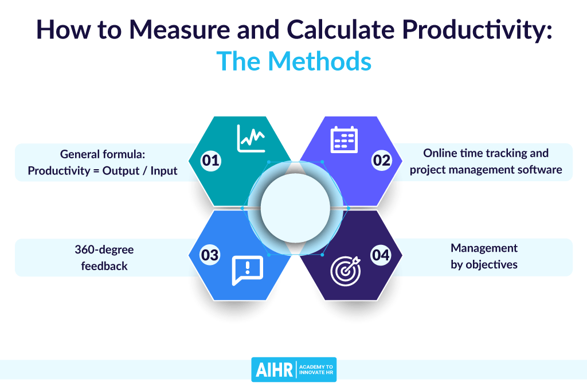

## Table of Contents

## What is productivity and why is it important?

Productivity is about how much work you can get done in a certain amount of time. It's like measuring how fast and well you can finish your tasks. If you can do more work in less time, you are being productive. This can be at your job, at school, or even at home when you are doing chores.

Being productive is important because it helps you achieve your goals faster. When you are productive, you have more time to do the things you enjoy or to take on new projects. It also makes you feel good because you know you are using your time well. For businesses, being productive means they can make more products or provide better services, which can lead to more success and growth.

## How can productivity be measured in a personal context?

In a personal context, productivity can be measured by looking at how many tasks you complete in a day or a week. You can make a list of things you need to do, like washing the dishes, doing homework, or going for a walk. At the end of the day or week, you can check how many of those tasks you finished. If you completed most of them, you were productive.

Another way to measure personal productivity is by seeing how much time you spend on each task. If you can finish your homework faster than usual, that means you are being more productive. You can use a timer to keep track of how long things take. Over time, you might notice that you are getting quicker at doing things, which is a sign of increased productivity.

It's also important to think about the quality of your work. If you are rushing through tasks and making mistakes, you might not be as productive as you think. So, make sure you are doing a good job while trying to be fast. This way, you can feel proud of what you've accomplished and know that your productivity is truly making a difference in your life.

## What are common productivity metrics used in businesses?

In businesses, one common way to measure productivity is by looking at how much work employees do compared to how much time they spend doing it. This can be things like how many products they make in an hour or how many customer calls they handle in a day. Another important metric is revenue per employee, which shows how much money the business makes for each person working there. If this number goes up, it often means the business is getting more productive.

Another metric businesses use is the efficiency ratio, which compares the costs of running the business to the revenue it brings in. A lower ratio means the business is using its resources well and being more productive. Businesses also look at employee performance metrics, like how well employees meet their goals or how often they are absent. These metrics help businesses understand if their teams are working productively and where they might need to make improvements.

## What tools can be used to track productivity?

There are many tools that can help track productivity. One popular tool is a time tracking app, like Toggl or Clockify. These apps let you start a timer when you begin a task and stop it when you finish. This way, you can see exactly how long you spend on different activities. Another useful tool is a task management app, like Todoist or Trello. These apps help you make lists of tasks and check them off when you're done. This makes it easy to see how many tasks you complete in a day or a week.

Another type of tool is a productivity dashboard, like RescueTime or Clockwise. These tools run in the background on your computer or phone and track how you spend your time. They can show you how much time you spend on different apps or websites, and even give you reports on your productivity. For businesses, project management software like Asana or Monday.com can be very helpful. These tools let teams assign tasks, set deadlines, and track progress, making it easier to see how productive everyone is working together.

## How does time management affect productivity?

Time management is very important for being productive. If you can plan your day well and use your time wisely, you can get more work done. For example, if you know you have to do homework, clean your room, and go for a walk, you can decide to do your homework first when you have the most energy. Then, you can clean your room and go for a walk later. By organizing your time like this, you make sure you have enough time for each task and you don't waste time figuring out what to do next.

Not managing your time well can make you less productive. If you spend too much time on one thing, like playing video games, you might not have enough time left for other important tasks. This can make you feel stressed and overwhelmed because you can't finish everything you need to do. Good time management helps you avoid this by making sure you have a clear plan and enough time for all your tasks. This way, you can work more efficiently and feel more in control of your day.

## What are the differences between efficiency and effectiveness in productivity?

Efficiency is about doing things quickly and with less waste. Imagine you have to clean your room. If you can clean it fast and use fewer cleaning supplies, you are being efficient. Efficiency is important because it helps you save time and resources. But being efficient doesn't always mean you are doing the right things. You could clean your room very quickly, but if you missed a lot of spots, you might have to do it again.

Effectiveness is about doing the right things to reach your goal. If your goal is to have a clean room, being effective means making sure every part of your room is clean, even if it takes longer. Effectiveness is important because it makes sure you are working towards what really matters. You can be efficient and effective at the same time, but sometimes you have to choose between the two. For example, you might decide to take a little more time to make sure your room is spotless, which is being effective, even if it means you are less efficient.

## How can productivity be improved in a team environment?

Improving productivity in a team environment starts with clear communication. When everyone knows what they need to do and understands their role, they can work together better. Regular meetings where team members can share updates and discuss any problems help keep everyone on the same page. It's also important to set clear goals and deadlines so that everyone knows what they are working towards. When goals are clear, people can focus on what's important and work more efficiently.

Another way to boost team productivity is by using the right tools and resources. Tools like project management software can help teams keep track of tasks and deadlines. They can also make it easier to see who is doing what and how the project is progressing. It's also helpful to make sure team members have the training and support they need to do their jobs well. When people feel supported and have the right tools, they can work more effectively and get more done.

## What role does technology play in enhancing productivity?

Technology helps make people more productive by giving them tools to do their work faster and easier. For example, computers and software can help you write reports, make presentations, and keep track of tasks. If you need to send a message to someone far away, you can use email or instant messaging instead of waiting for the mail. This saves a lot of time and makes it easier to work with others, even if they are not in the same place as you.

Technology also helps businesses keep track of how much work is being done and how well it is being done. Special software can show managers how their teams are performing and where they might need to make changes to improve productivity. For example, a company might use a program to see how long it takes to make a product and then find ways to make it faster. This can help businesses grow and be more successful by making the most of their time and resources.

## How do you set realistic productivity goals?

Setting realistic productivity goals starts with understanding what you can do in a day. Think about how much time you have and what tasks you need to finish. It's important to be honest with yourself about how long things take. If you know it usually takes you two hours to do your homework, don't plan to do it in one hour. Also, think about other things that might happen during the day, like breaks or unexpected tasks. By considering all these things, you can set goals that you can actually reach.

Once you have a good idea of what you can do, break your goals into smaller steps. Instead of saying you will clean the whole house, you might say you will clean one room each day. This makes the goal feel less overwhelming and easier to achieve. It's also helpful to write down your goals and check them off as you go. This way, you can see your progress and stay motivated. Remember, it's okay if you don't meet every goal perfectly. The important thing is to keep trying and adjust your goals as you learn what works best for you.

## What are advanced techniques for analyzing productivity data?

Advanced techniques for analyzing productivity data often involve using data analytics and [machine learning](/wiki/machine-learning). These methods help find patterns and trends that might be hard to see just by looking at numbers. For example, businesses might use a technique called regression analysis to understand how different factors affect productivity. This can show them if things like employee training or new technology make a big difference. Another technique is predictive analytics, which uses past data to guess what will happen in the future. This can help businesses plan better and make changes before problems happen.

Another advanced technique is process mining, which looks at how work flows through a business. This can show where things might be slowing down or where there are bottlenecks. By understanding these patterns, businesses can make changes to improve how work gets done. Also, some businesses use dashboards and visualization tools to make data easier to understand. These tools turn numbers into charts and graphs, which can help people see trends and make decisions faster. Using these advanced techniques can help businesses be more productive by finding and fixing problems quickly.

## How can productivity measurement impact employee morale and motivation?

Measuring productivity can affect how employees feel about their work. When employees see that their hard work is recognized through productivity metrics, it can make them feel good and want to keep doing well. For example, if an employee finishes more tasks than usual and gets praised for it, they might feel more motivated to keep working hard. But if the focus is always on numbers and meeting goals, it can make employees feel stressed and like they are just numbers. This can lower their morale and make them less excited about their work.

It's important for businesses to balance productivity measurement with caring about employees' well-being. If employees feel supported and know that their bosses care about more than just numbers, they are more likely to stay motivated and happy at work. For example, if a business uses productivity data to help employees improve and grow, instead of just to judge them, it can boost morale. This way, productivity measurement can be a tool to help everyone do better and feel good about their work, instead of something that makes them feel pressured and unhappy.

## What are the future trends in productivity measurement and management?

In the future, productivity measurement and management will likely use more advanced technology like [artificial intelligence](/wiki/ai-artificial-intelligence) and machine learning. These tools can help businesses understand productivity better by looking at big amounts of data and finding patterns that people might miss. For example, AI can predict when a team might need more help or when a project might face delays. This can help businesses make better plans and use their resources more wisely. Also, wearable technology and smart devices might be used more to track how employees work and rest, helping to make sure they stay healthy and productive.

Another trend will be more focus on well-being and flexibility. Businesses will understand that happy and healthy employees are more productive. They might use new ways to measure productivity that look at things like employee happiness and work-life balance. This could mean using surveys and feedback tools to see how employees feel about their work. Also, more businesses might let employees work from home or choose their own hours. This can make employees feel more in control of their work and more motivated to do a good job. By combining these new ways of measuring and managing productivity, businesses can help their teams work better and feel better at the same time.

## What is the understanding of productivity and efficiency in trading?

Productivity and efficiency in trading are critical components that significantly influence the overall profitability and success of financial activities. Drawing parallels with manufacturing, where productivity is measured in terms of outputs delivered per unit of input, trading productivity refers to generating maximum returns with the least amount of resources, such as capital, time, and energy. In this context, trading algorithms serve as the pivotal resource that needs to be optimized to achieve desirable outcomes.

Efficiency in trading is primarily concerned with how well these algorithms can execute trades, which involves performing a transaction quickly and accurately while minimizing costs and slippage. Execution efficiency, for example, deals with the precision and speed of placing trades, ensuring minimal deviation from the target price. Cost efficiency pertains to reducing transaction costs - such as brokerage fees, taxes, and spreads - associated with trading activities.

The Order-to-Trade (OTR) ratio is a central metric in determining trading productivity and efficiency. The OTR ratio is defined mathematically as:

$$
\text{OTR} = \frac{\text{Number of Orders Placed}}{\text{Number of Trades Executed}}
$$

A lower OTR indicates higher execution efficiency, as it suggests fewer orders were placed to achieve the executed trades, reflecting precision in trade placements and decision-making.

In traditional sectors like manufacturing, improving productivity often involves optimizing processes, leveraging economies of scale, and enhancing resource management. Similarly, in [algorithmic trading](/wiki/algorithmic-trading), optimizing algorithms to improve execution precision and speed is paramount. Just as manufacturers streamline processes to increase output and reduce waste, traders refine algorithmic strategies and enhance technology use to maximize returns and minimize resource expenditure.

Interlinking productivity and efficiency in trading with traditional sectors underscores the importance of intelligent resource allocation and strategic execution. By refining these key aspects through metrics and technological improvements, traders can achieve superior results similar to advancements seen in other industries.

## How can trading performance be measured using key metrics?

Evaluating algorithmic trading strategies necessitates a comprehensive understanding of several key performance metrics, which offer insights into aspects such as risk management, profitability, and the overall efficiency of the trading algorithm. Key metrics include the Sharpe Ratio, Maximum Drawdown, Win Rate, Profit Factor, and Average Trade.

The Sharpe Ratio is a metric that measures the performance of an investment by adjusting for its risk. It is calculated as the difference between the returns of the investment and the risk-free return, divided by the standard deviation of the investment returns. Mathematically, it is expressed as:

$$
\text{Sharpe Ratio} = \frac{R_a - R_f}{\sigma_a}
$$

where $R_a$ is the return of the portfolio, $R_f$ is the risk-free rate, and $\sigma_a$ is the standard deviation of the portfolio's excess return. A higher Sharpe Ratio indicates more attractive risk-adjusted returns.

Maximum Drawdown represents the largest observed loss from a peak to a trough in a portfolio's value before a new peak is achieved. It is an important metric for understanding the risk of significant losses within a trading strategy. The drawdown can aid in recognizing the capital preservation capabilities of a trading system.

Win Rate refers to the percentage of all trades that result in a profit. It's a straightforward metric that helps to gauge the effectiveness of a trading strategy in terms of successful trades. A strategy with a high win rate is generally preferable, though it must be considered alongside other metrics like profitability and risk.

The Profit Factor is the ratio of gross profits to gross losses for a trading system. A Profit Factor greater than 1 indicates a profitable system, while values below 1 suggest losses. This metric provides a simple yet effective assessment of a trading strategy's profitability.

Average Trade measures the average amount of profit or loss generated per trade and is calculated by dividing the net profit by the total number of trades. A positive average trade suggests a generally profitable trading strategy, while a negative average trade points to losses.

By thoroughly understanding and analyzing these metrics, traders can gain valuable insights into the strengths and weaknesses of their trading algorithms. This understanding is crucial for optimizing and refining strategies to enhance their overall performance in the financial markets.

## References & Further Reading

1. Aldridge, I. (2013). *High-Frequency Trading: A Practical Guide to Algorithmic Strategies and Trading Systems*. John Wiley & Sons. This book provides a comprehensive overview of algorithmic trading strategies, including discussions on key performance metrics and efficiency.

2. Pardo, R. (2008). *The Evaluation and Optimization of Trading Strategies*. John Wiley & Sons. This work is essential for understanding the statistical and systematic methods to evaluate trading strategies effectively.

3. Kissell, R. (2013). *The Science of Algorithmic Trading and Portfolio Management*. Academic Press. This book offers insights into trading algorithms' quantitative finance aspects, discussing order execution and performance measurement in detail.

4. Menkveld, A. J. (2013). *High-frequency trading and the new market makers*. Journal of Financial Markets, 16(4), 712-740. This paper explores the role of high-frequency traders in modern financial markets and their impact on efficiency and liquidity.

5. Hendershott, T., Jones, C. M., & Menkveld, A. J. (2011). *Does Algorithmic Trading Improve Liquidity?*. Journal of Finance, 66(1), 1-33. This study examines the effects of algorithmic trading on market liquidity, a crucial aspect of trading efficiency.

6. Biais, B., & Woolley, P. (2011). *High-Frequency Trading*. Perspectives on High-Frequency Trading. The work discusses algorithmic trading's implications on financial markets, focusing on efficiency and market behavior.

7. Hasbrouck, J., & Saar, G. (2013). *Low latency trading*. Journal of Financial Markets, 16(4), 646-679. This paper investigates the high-frequency trading strategies that prioritize low latency to achieve competitive advantage and their impact on market efficiency.

8. IOSCO (2011). *Regulatory Issues Raised by the Impact of Technological Changes on Market Integrity and Efficiency*. International Organization of Securities Commissions. This report addresses technology-driven changes in trading and the resulting regulatory challenges.

9. McGroarty, F., & Wood, A. (2009). *Performance evaluation of technical analysis methods in FX markets: A probabilistic-based approach*. Computational Management Science, 6(4), 453-479. This research evaluates technical analysis methods in foreign exchange markets, highlighting key performance metrics.

10. Arnold, G. (2014). *The Financial Times Guide to Investing: The Definitive Companion to Investment and the Financial Markets*. FT Publishing International. A valuable guide for investors, it provides insights into various investment strategies and tools, emphasizing market efficiency.

11. Ivy, R. (2015). *Algorithmic and High-Frequency Trading*. Cambridge University Press. This book is a resource on the mechanics and strategies of algorithmic trading, detailing the performance metrics used for trading evaluation and refinement.

12. Brogaard, J., Hendershott, T., & Riordan, R. (2014). *High-Frequency Trading and Price Discovery*. Review of Financial Studies, 27(8), 2267-2306. An exploration of the role of high-frequency trading in price discovery, contributing to the understanding of trading efficiency.

These resources offer a robust foundation for understanding the metrics and technologies driving efficiency in algorithmic trading.

