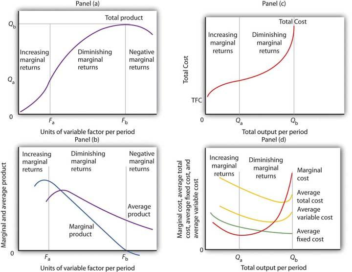

## Table of Contents

## What is productivity and how is it measured?

Productivity is a measure of how efficiently someone or a group can do work. It shows how much output, like products or services, can be produced with a certain amount of input, like time or effort. For example, if a worker can make more toys in less time than before, their productivity has gone up.

Productivity is measured by comparing the amount of output to the amount of input used. A common way to measure it is by calculating how much a worker produces in an hour. If a factory makes 100 items in a day with 10 workers, the productivity per worker per day is 10 items. Businesses use these numbers to see if they are using their resources well and to find ways to improve.

## How do costs affect productivity in a business?

Costs can have a big impact on how productive a business is. When a business spends a lot of money on things like materials, labor, or equipment, it can affect how much they can produce. If costs go up, the business might not be able to make as many products or provide as many services because they have less money to work with. This can lower productivity because the business can't use its resources as efficiently.

On the other hand, if a business can find ways to lower its costs, it might be able to increase productivity. For example, if they find cheaper materials or a more efficient way to do things, they can produce more with the same amount of money. This means they can make more products or provide more services, which can lead to higher productivity. So, managing costs carefully is important for keeping productivity high.

## What are the common factors that influence productivity?

Many things can affect how productive a person or a business is. One big factor is the tools and technology they use. If they have good tools that work well and make things easier, they can get more done in less time. Another factor is the skills and training of the workers. If people know what they're doing and have been trained well, they can work faster and make fewer mistakes. The way work is organized also matters. If tasks are set up in a smart way, it can help people work better together and get more done.

Another important thing is the work environment. If people feel happy and comfortable at work, they are usually more productive. This includes things like having a good relationship with their boss and coworkers, and feeling safe and valued at work. Stress and tiredness can also make a big difference. If people are too stressed or tired, they won't be able to work as well. Finally, motivation plays a key role. If people are excited about their work and feel like it matters, they will work harder and be more productive.

## Can you explain the relationship between productivity and economic growth?

Productivity and economic growth are closely linked. When people and businesses can make more things or provide more services with the same amount of time and resources, the economy grows. This is because higher productivity means more goods and services can be produced, which leads to more money being made. As businesses become more productive, they can sell more, make more profit, and pay their workers more. This extra money then gets spent in the economy, helping it to grow even more.

However, it's not just about making more stuff. When productivity goes up, it can also lead to new inventions and better ways of doing things. This can create new jobs and industries, which also helps the economy grow. But if productivity stays the same or goes down, it can slow down economic growth because fewer goods and services are being produced. So, keeping productivity high is important for keeping the economy strong and growing.

## What are the different types of costs associated with productivity?

There are different types of costs that can affect how much a business can produce. One type is direct costs, which are the costs of things that are used up while making a product or providing a service. This includes things like raw materials and the wages of workers who are directly involved in making the product. If these costs go up, it can be harder for a business to make as many products because they have less money to spend on other things.

Another type of cost is indirect costs, which are costs that are not directly tied to making a product but still affect how much a business can produce. These include things like rent for the factory, utilities, and the salaries of managers and other staff who support the production process. If these costs go up, it can also make it harder for a business to be productive because they have to spend more money on these things instead of on making more products.

There are also opportunity costs, which are the costs of choosing one thing over another. For example, if a business decides to spend money on new equipment to increase productivity, the opportunity cost is what they could have done with that money instead, like hiring more workers or expanding their business. Managing all these different types of costs well is important for keeping productivity high.

## How can a business measure the impact of costs on productivity?

A business can measure the impact of costs on productivity by looking at how changes in costs affect how much they can produce. For example, if the cost of raw materials goes up, the business might not be able to buy as much, which means they can make fewer products. They can compare the amount of products they made before the cost went up to the amount they make after. If they see that they are making less with the same amount of time and effort, then the higher costs are hurting their productivity.

Another way to measure this is by looking at how changes in indirect costs, like rent or utilities, affect productivity. If these costs go up, the business might have to spend less on things that help them make more products, like new equipment or more workers. They can track how much they produce before and after these costs change to see if their productivity goes down. By keeping an eye on all these costs and how they affect what they can produce, a business can figure out how to manage their money better and keep their productivity high.

## What strategies can be implemented to improve productivity while managing costs?

One way to improve productivity while managing costs is to use technology and automation. Machines and software can do some jobs faster and better than people. This means a business can make more things without spending more money on workers. For example, a factory might use robots to put parts together. This can save money on labor costs and make more products at the same time. But it's important to choose the right technology that fits the business's needs and doesn't cost too much.

Another strategy is to train workers better. When people know more about their jobs, they can work faster and make fewer mistakes. This can help a business make more products without spending more money. Training can be done in many ways, like workshops or online courses. It's also good to make sure workers feel happy and valued at work. Happy workers are often more productive, and it doesn't cost a lot to make them feel appreciated.

A third way is to look at how work is organized. Sometimes, just changing the way tasks are done can help a business make more things without spending more money. For example, a business might find that if they change the order of some steps in their process, they can make products faster. It's also important to keep an eye on costs all the time. By watching costs closely, a business can find ways to spend less money on things that don't help them make more products. This can help them use their money in better ways to improve productivity.

## How does technology influence productivity and costs in modern businesses?

Technology has a big impact on how much work businesses can get done and how much it costs them. When businesses use machines and computers to do jobs, they can often do things faster and better than people can. This means they can make more things in less time, which helps their productivity go up. For example, a company might use robots to put parts together in a factory. This can save money on paying workers and help the company make more products at the same time. But it's important for businesses to pick the right technology that fits what they need and doesn't cost too much money.

On the other hand, technology can also make costs go up. Buying new machines and computers can be expensive, and sometimes it takes a lot of money to keep them working well. Also, workers might need to learn how to use the new technology, which can take time and money. But if businesses choose their technology carefully, the benefits of being more productive can be bigger than the costs. For example, if a business spends money on a new computer system that helps them keep track of their work better, they might be able to save money in other ways and make more things. So, technology can help businesses be more productive and manage their costs better if they use it the right way.

## What are some case studies or examples of companies that have successfully managed productivity and costs?

One example is Toyota. They use a system called "lean manufacturing" to make their cars. This system helps them make more cars with less waste. They do this by always looking for ways to do things better and by making sure every part of their work is useful. This has helped Toyota save a lot of money and make their cars faster. By managing their costs well and making their work more efficient, Toyota has become one of the biggest car companies in the world.

Another example is Amazon. They use a lot of technology to help them manage their costs and be more productive. For example, they use robots in their warehouses to help them find and pack things faster. This helps them save money on workers and get more things out to customers quickly. Amazon also uses data to see how they can do things better. By using technology and data to manage their costs and improve their productivity, Amazon has grown into a huge company that can sell almost anything to people all over the world.

## How do global economic conditions affect productivity and cost management?

Global economic conditions can make a big difference in how much businesses can produce and how they manage their costs. When the world economy is doing well, businesses might find it easier to get the things they need to make their products, like raw materials and workers. This can help them make more things and be more productive. But if the world economy is not doing well, it can be harder for businesses to get what they need. Prices for things like materials might go up, which can make it more expensive for businesses to make their products. This can make it harder for them to manage their costs and stay productive.

Also, when the world economy changes, it can affect how much people want to buy things. If people feel good about the economy, they might buy more, which can help businesses sell more of their products and be more productive. But if people are worried about the economy, they might not buy as much, which can make it harder for businesses to sell their products. This can lead to lower productivity because businesses might not need to make as many things. So, businesses need to keep an eye on what's happening in the world economy and be ready to change how they work to manage their costs and stay productive.

## What advanced metrics and analytics can be used to optimize productivity and cost efficiency?

Advanced metrics and analytics can help businesses understand how well they are doing and find ways to do better. One useful metric is the Overall Equipment Effectiveness (OEE), which looks at how well machines are being used. It checks if machines are working when they should be, if they are working as fast as they can, and if they are making good products. By using OEE, businesses can see where they might be wasting time or resources and fix these problems to make more things and spend less money. Another important metric is the Cost per Unit, which tells businesses how much it costs to make one product. By keeping an eye on this, businesses can find ways to make their products cheaper, like using less expensive materials or making things faster.

Analytics can also help businesses by looking at big sets of data to find patterns and make predictions. For example, predictive analytics can help businesses guess when their machines might break down, so they can fix them before it happens. This can save money on repairs and keep production going smoothly. Also, businesses can use data to see how their workers are doing and find ways to help them work better. By looking at things like how long it takes workers to do tasks or how often they make mistakes, businesses can give them the right training or tools to be more productive. Using these advanced metrics and analytics, businesses can make smarter decisions and find the best ways to manage their costs and improve their productivity.

## What future trends are expected to impact productivity and costs in various industries?

In the future, one big trend that will affect how much businesses can produce and how much it costs them is the use of artificial intelligence (AI) and automation. AI can help businesses do things faster and better than people can. For example, AI can help factories make more things by using robots that never get tired and can work all the time. This can save money on workers and help businesses make more products. But it can also cost a lot of money to buy and take care of these machines. So, businesses will need to think carefully about how to use AI to make more things without spending too much money.

Another trend is the move towards more sustainable practices. More and more, people want businesses to be good to the environment. This means businesses might have to spend more money on things like using less energy or finding new ways to make their products that don't hurt the planet. At first, this might make it more expensive for businesses to make things. But in the long run, being sustainable can help businesses save money and be more productive. For example, using less energy can lower costs, and making products that people like because they are good for the environment can help businesses sell more. So, businesses will need to find the right balance between being sustainable and managing their costs to stay productive.

## What are the economic costs and how do they relate to productivity?

Economic costs are integral to understanding how resources are allocated in an economy. These costs encompass all expenses that arise from the production of goods and services, including both explicit costs such as wages and materials, and implicit costs, such as opportunity costs. The concept of economic costs provides a framework for evaluating the total expenditure involved in producing a product or service, and is essential for determining prices and profits.

Productivity, on the other hand, is a measure of the efficiency with which inputs are transformed into outputs. It is often calculated as the ratio of output to input. A simple formula used for calculating productivity is:

$$
\text{Productivity} = \frac{\text{Output}}{\text{Input}}
$$

Where output is the quantity of goods or services produced, and input is the quantity of resources used, such as labor hours or capital. High productivity implies that a greater amount of output is produced for a given amount of input, reflecting an efficient use of resources.

Understanding the relationship between economic costs and productivity is crucial for fostering economic growth. When firms can produce more efficiently, they can lower their per-unit costs, which often translates into lower prices for consumers and higher profit margins for businesses. For example, advancements in technology can enhance productivity by automating processes that were previously labor-intensive, reducing the input required and consequently, the associated costs.

Moreover, improvements in productivity do not only benefit individual businesses but can lead to macroeconomic gains as well. Higher productivity across sectors can drive economic growth by increasing the overall output of an economy. This growth can be measured by an increase in GDP, which is a broad indicator of economic health. Policymakers, therefore, pay keen attention to productivity metrics when formulating policies aimed at stimulating economic growth.

In modern economies, a significant emphasis is placed on measuring productivity accurately. Innovative tools and methods are used to assess productivity levels across different sectors. For instance, multi-[factor](/wiki/factor-investing) productivity (MFP) measures the efficiency of all inputs to a production process and is often used alongside labor productivity metrics to provide a comprehensive view of productivity dynamics.

In conclusion, understanding economic costs and productivity is pivotal in the context of modern economies. By analyzing how efficiently resources are used to produce goods and services, we can gain insights into economic performance and identify opportunities for enhancing economic growth. Through continuous measurement and improvement of productivity, businesses and economies alike can achieve greater efficiency and prosperity.

## References & Further Reading

1. Cartea, S., Jaimungal, S., & Penalva, J. (2015). *Algorithmic and High-Frequency Trading*. Cambridge University Press.
   - This book provides an in-depth analysis of the technical and quantitative aspects of algorithmic and high-frequency trading. It covers topics such as market impact models, trading cost models, and optimal execution strategies.

2. Hasbrouck, J., & Saar, G. (2013). "Low-latency trading." *Journal of Financial Markets, 16*(4), 646-679.
   - This article investigates the effects of low-latency trading on market quality, including liquidity and volatility. It offers empirical insights into the operational mechanisms and economic implications of algorithmic trading.

3. Hendershott, T., Jones, C. M., & Menkveld, A. J. (2011). "Does algorithmic trading improve liquidity?" *Journal of Finance, 66*(1), 1-33.
   - This paper examines how algorithmic trading influences market liquidity. It provides a robust empirical analysis showing how the presence of algorithmic traders impacts bid-ask spreads and depth.

4. Degryse, H., De Jong, F., & Van Kervel, V. (2015). "The Impact of Dark Trading and Visible Fragmentation on Market Quality." *Review of Finance, 19*(4), 1587–1622.
   - This study explores the ramifications of algorithmic trading in the context of dark pools and market fragmentation, assessing the impact on market quality and trading costs.

5. Arnuk, S. L., & Saluzzi, J. (2012). *Broken Markets: How High-Frequency Trading and Predatory Practices on Wall Street are Destroying Investor Confidence and Your Portfolio*. FT Press.
   - A critical examination of the high-frequency trading landscape with insights into its effects on investor confidence and market fairness. The authors discuss technical and regulatory challenges associated with modern trading practices.

6. Gomber, P., Arndt, B., Lutat, M., & Uhle, T. (2011). "High-frequency trading." *Deutsche Börse White Paper*.
   - This industry report by Deutsche Börse Group outlines the technological and regulatory environments for high-frequency trading. It discusses both the efficiencies gained and the risks introduced by speed-oriented trading strategies.

7. Kumar, P. (2014). "Algorithmic Trading: An Overview." *Algorithmic Trading Strategies*.
   - An accessible introduction to algorithmic trading techniques, including statistical arbitrage and trend-following algorithms, along with an assessment of how these strategies can impact market efficiency and volatility.

8. Frydman, C., & Camerer, C. F. (2016). "The psychology and neuroscience of financial decision making." *Trends in Cognitive Sciences, 20*(9), 661-675.
   - While focusing on the psychological component, this study provides insights into decision-making processes, highlighting the cognitive aspects relevant to algorithmic trading strategies.

9. Pettway, R. H., & Schneible Jr, R. A. (1990). "Initial public offerings, subsequent seasoned equity offerings, and long‐run performance." *Journal of Finance, 45*(3), 1099-1112.
   - Though not directly targeted at algorithmic trading, this article sheds light on financial market behaviors that algorithmic strategies often seek to exploit, addressed through the lens of public offerings and their performance.

These resources collectively provide a foundational understanding of algorithmic trading, from its economic impacts to its technical intricacies, assisting in grasping the complexities of this evolving domain.

