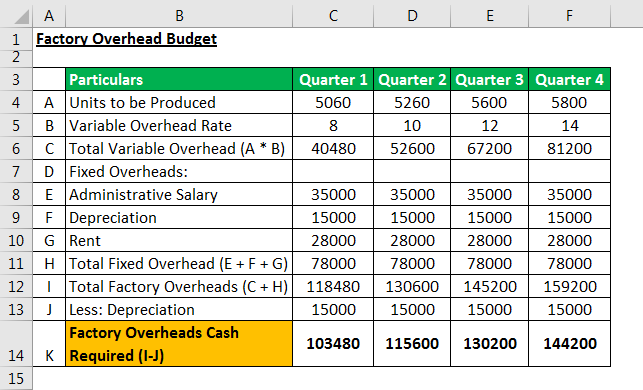

Algorithmic trading, the use of computer algorithms to execute trading strategies, has significantly reshaped financial markets. This paradigm shift has introduced new opportunities and challenges, transforming how traders, institutions, and economies interact. Algorithmic trading harnesses technology to automate transactions, enabling rapid and high-volume trades that were previously impossible. This innovation has improved market efficiency by optimizing trade execution and reducing transaction costs.

The intersection between economic costs, productivity, and algorithmic trading is a vital area of examination. Economic costs include all expenditures associated with producing and delivering goods and services, while productivity measures how efficiently these inputs are transformed into outputs. A comprehensive understanding of these concepts is crucial for advancing economic growth and prosperity. In the context of financial markets, algorithmic trading influences productivity by influencing how resources are allocated and utilized, ultimately affecting economic efficiency.



The implications of algorithmic trading on economic efficiency are profound. By streamlining trading processes, it enhances liquidity and market functioning. However, these benefits come with associated costs. Technological advancements in trading necessitate significant investments in infrastructure and maintenance. Furthermore, algorithmic trading introduces complexities that can challenge market stability, such as increased volatility and potential manipulation. Balancing these trade-offs is essential for leveraging the advantages of algorithmic trading while mitigating its adverse effects.

Through careful study of these dynamics, the role of algorithmic trading in modern economics can be better understood. Its integration into financial markets requires not only technological adaptation but also thoughtful consideration of economic principles. By closely analyzing these interactions, stakeholders can navigate the complexities introduced by algorithmic trading and harness its full potential for maximizing economic prosperity.

## Table of Contents

## Economic Costs and Productivity

Economic costs are integral to understanding how resources are allocated in an economy. These costs encompass all expenses that arise from the production of goods and services, including both explicit costs such as wages and materials, and implicit costs, such as opportunity costs. The concept of economic costs provides a framework for evaluating the total expenditure involved in producing a product or service, and is essential for determining prices and profits.

Productivity, on the other hand, is a measure of the efficiency with which inputs are transformed into outputs. It is often calculated as the ratio of output to input. A simple formula used for calculating productivity is:

$$
\text{Productivity} = \frac{\text{Output}}{\text{Input}}
$$

Where output is the quantity of goods or services produced, and input is the quantity of resources used, such as labor hours or capital. High productivity implies that a greater amount of output is produced for a given amount of input, reflecting an efficient use of resources.

Understanding the relationship between economic costs and productivity is crucial for fostering economic growth. When firms can produce more efficiently, they can lower their per-unit costs, which often translates into lower prices for consumers and higher profit margins for businesses. For example, advancements in technology can enhance productivity by automating processes that were previously labor-intensive, reducing the input required and consequently, the associated costs.

Moreover, improvements in productivity do not only benefit individual businesses but can lead to macroeconomic gains as well. Higher productivity across sectors can drive economic growth by increasing the overall output of an economy. This growth can be measured by an increase in GDP, which is a broad indicator of economic health. Policymakers, therefore, pay keen attention to productivity metrics when formulating policies aimed at stimulating economic growth.

In modern economies, a significant emphasis is placed on measuring productivity accurately. Innovative tools and methods are used to assess productivity levels across different sectors. For instance, multi-[factor](/wiki/factor-investing) productivity (MFP) measures the efficiency of all inputs to a production process and is often used alongside labor productivity metrics to provide a comprehensive view of productivity dynamics.

In conclusion, understanding economic costs and productivity is pivotal in the context of modern economies. By analyzing how efficiently resources are used to produce goods and services, we can gain insights into economic performance and identify opportunities for enhancing economic growth. Through continuous measurement and improvement of productivity, businesses and economies alike can achieve greater efficiency and prosperity.

## The Rise of Algorithmic Trading

Algorithmic trading refers to the use of sophisticated computer algorithms to automate the trading of financial instruments. These algorithms follow pre-defined strategies and criteria, enabling execution speed and precision far superior to human capabilities. At its core, [algorithmic trading](/wiki/algorithmic-trading) is designed to enhance the efficiency of trade execution by leveraging computational power to handle vast amounts of data and execute trades at extremely high speeds, often within fractions of a second. This advancement has fundamentally transformed trading practices, paving the way for high-speed and high-frequency transactions that characterize modern financial markets.

Historical roots of algorithmic trading can be traced back to the early 1970s when computer technologies were first used for simple trading tasks. However, it gained significant traction in the 1980s and 1990s with the development of electronic trading platforms and the availability of extensive historical market data. These advancements allowed traders to backtest their trading strategies, optimizing them for improved performance. By the early 2000s, the rapid evolution of technology and increased market data accessibility further propelled the adoption and complexity of algorithmic trading.

Several distinct strategies are employed within algorithmic trading. Trend-following strategies, often the simplest, involve identifying and capitalizing on market trends based on statistical analysis. Traders use signals generated by moving averages, price levels, or other technical indicators to enter or [exit](/wiki/exit-strategy) positions, thus aiming to profit from market [momentum](/wiki/momentum).

Arbitrage strategies constitute another popular form of algorithmic trading. These strategies exploit price discrepancies of the same asset across different markets or between related financial instruments. For instance, if a stock is trading at different prices on two separate exchanges, an algorithm can simultaneously buy low on one and sell high on the other, capturing the price differential as profit.

Market-making strategies, on the other hand, involve providing [liquidity](/wiki/liquidity-risk-premium) to the markets by continuously placing buy and sell orders. Market makers seek to profit from the bid-ask spread while ensuring efficient market function. Algorithms allow market makers to respond to market movements dynamically and efficiently, enhancing their profitability through rapid adjustments to their trading positions.

The growth of algorithmic trading has been significantly fueled by technological advancements. One key driver is the increased computational power available today, enabling more sophisticated and complex algorithms that can process and analyze massive volumes of data. Advances in cloud computing and data storage have further facilitated the extensive [backtesting](/wiki/backtesting) and real-time analysis required for successful algorithmic trading.

The evolution of financial markets infrastructure, such as the rise of electronic exchanges and trading venues, has also been pivotal. These platforms provide the necessary environment for algorithmic trading by ensuring low-latency connectivity and real-time access to market data. Additionally, the development of advanced programming languages and tools allows traders to implement and refine their algorithmic strategies more precisely. Python, in particular, has become a popular choice for developing trading algorithms due to its versatility, accessibility, and comprehensive libraries for data analysis and [machine learning](/wiki/machine-learning).

Algorithmic trading has undoubtedly revolutionized financial markets by increasing transaction speed and market liquidity. Through continuous technological advancements, it is poised to maintain its crucial role in shaping the future landscape of trading. However, the complexities associated with algorithmic strategies also necessitate rigorous oversight to ensure market fairness and stability.

## Impact on Economics

Algorithmic trading significantly impacts various economic indicators, notably market liquidity and [volatility](/wiki/volatility-trading-strategies). By allowing for high-speed, high-frequency transactions, algorithmic trading enhances trade execution speed and precision. This capability affects market dynamics by ensuring that trades are executed at the best possible prices, often with minimal delay. As a result, algorithmic trading contributes to increased market liquidity, making it easier for buyers and sellers to find counterparts without causing substantial price changes. 

Market liquidity, in essence, refers to the degree to which an asset can be quickly bought or sold in the market without affecting its price. In liquid markets, algorithmic trading platforms can efficiently match buy and sell orders, fostering a more fluid trading environment. This automated trading is enabled through complex algorithms that analyze market data and execute trades swiftly, often exploiting small price discrepancies. The increased market liquidity can lead to lower transaction costs and tighter bid-ask spreads, benefiting all market participants.

However, algorithmic trading also raises concerns about market stability and fairness. The rapid pace of trading can contribute to increased market volatility, as large volumes of trades are executed in short periods. This was notably seen during the "Flash Crash" of May 6, 2010, where the Dow Jones Industrial Average plunged about 1,000 points within minutes, primarily driven by algorithmically triggered market orders. Such events highlight the potential destabilizing effects of algorithmic trading when not adequately monitored or controlled.

Additionally, there are concerns about the fairness of algorithmic trading. High-frequency trading ([HFT](/wiki/high-frequency-trading-strategies)) firms often have advantages over traditional traders, such as superior technology and faster access to market data, which raises questions about the level playing field in financial markets. Critics argue that this creates an unfair trading environment, as HFT firms can capitalize on information asymmetry and execute trades faster than human traders.

Real-world examples illustrate the significant influence of algorithmic trading on economies. In the foreign exchange market, algorithmic trading has contributed to reduced bid-ask spreads and improved pricing efficiency, making it easier for investors to enter and exit positions. In equity markets, algorithmic trading has accounted for a growing proportion of trade [volume](/wiki/volume-trading-strategy), with estimates suggesting that it constitutes over 50% of total trading volume in the U.S. markets.

In conclusion, while algorithmic trading enhances economic efficiency by improving market liquidity and reducing transaction costs, it also introduces challenges related to market volatility and fairness. The balance between leveraging the benefits of algorithmic trading and maintaining market stability remains critical to ensuring the healthy functioning of global financial markets.

## Challenges and Costs of Algorithmic Trading

Algorithmic trading, despite its numerous advantages, presents several challenges and entails substantial costs. A primary concern is technical glitches, which can lead to significant financial losses and impact market stability. For instance, a software malfunction or a bug in the trading algorithm could trigger unintended trading events, such as initiating erroneous buy or sell orders. These issues underscore the necessity for robust testing and continuous monitoring of trading algorithms.

Regulatory concerns also loom large over algorithmic trading. Authorities have been increasingly scrutinizing these activities to ensure they do not compromise market integrity. Regulatory bodies, such as the U.S. Securities and Exchange Commission (SEC) and the European Securities and Markets Authority (ESMA), have imposed stringent rules to mitigate risks associated with high-frequency trading and prevent market abuse. Compliance with these regulations imposes additional costs and operational constraints on trading firms.

Furthermore, the infrastructure required for algorithmic trading is notably expensive. The need for advanced computing systems, state-of-the-art network capabilities, and specialized software significantly escalates operational costs. Firms invest heavily in technology to ensure their algorithms execute trades at optimal speeds. The maintenance and upgrading of this infrastructure demand continuous financial resources.

Overfitting poses another significant challenge, as algorithms can be meticulously refined to perform well on historical data but fail to adapt to new market conditions. This risk arises when models are excessively complex, capturing noise rather than signal, leading to poor predictive performance. To mitigate this, traders must implement robust model validation techniques and continually recalibrate their algorithms.

Similar algorithmic strategies employed by numerous traders can result in market congestion and amplify volatility. When multiple trading systems act in accordance with similar signals or strategies, it can lead to a herding effect, precipitating sudden and extreme market moves. This situation is exacerbated during periods of market stress, where liquidity becomes constrained, thereby magnifying price swings.

To address these challenges, technological innovations are crucial. Advanced machine learning techniques can enhance the adaptability and resilience of trading algorithms. Moreover, the development of more efficient network protocols and data processing systems can mitigate latency issues, enabling more effective trade execution.

Regulatory measures play an equally vital role in mitigating the systemic risks posed by algorithmic trading. Policymakers must strike a balance between fostering innovation and ensuring market stability. This entails creating frameworks that encourage responsible trading practices and enhance transparency in automated trading activities. 

In summary, while algorithmic trading offers substantial benefits, it is accompanied by a plethora of challenges and costs. Overcoming these hurdles requires a combination of technological improvements, stringent regulatory oversight, and prudent risk management practices.

## Economic Efficiency and Algo Trading

Economic efficiency in trading is fundamentally concerned with the minimization of transaction costs while maximizing possible returns. Algorithmic trading has become an essential component in achieving such efficiency by automating and optimizing trading processes through high-speed and data-driven techniques. By integrating sophisticated algorithms and high-frequency trading, algorithmic trading reduces the bid-ask spreads and expedites trade execution, thereby lowering transaction costs significantly.

At the core of algorithmic trading is the optimization of resource allocation within financial markets. By utilizing algorithms, traders can efficiently analyze vast datasets to identify and exploit market opportunities in real-time. For instance, through strategies like statistical [arbitrage](/wiki/arbitrage) and trend-following, these algorithms leverage market inefficiencies to generate consistent returns. The ability to execute large volumes of trades with minimal market impact further illustrates the efficacy of these systems in enhancing economic efficiency.

Predictive analytics plays a vital role in boosting decision-making processes within algorithmic trading. By employing machine learning models, such as Support Vector Machines (SVM) or neural networks, traders can predict market trends and price movements more accurately. Here's a simple Python example of how predictive analytics might be applied in the context of algorithmic trading:

```python
import numpy as np
from sklearn.model_selection import train_test_split
from sklearn.svm import SVR
from sklearn.metrics import mean_squared_error

# Assume features and targets are predefined
features = np.array(...)  # Example feature data
targets = np.array(...)   # Corresponding target values

X_train, X_test, y_train, y_test = train_test_split(features, targets, test_size=0.2, random_state=42)

# Support Vector Regression model
svr_model = SVR(kernel='rbf')
svr_model.fit(X_train, y_train)

# Predict and evaluate
predictions = svr_model.predict(X_test)
mse = mean_squared_error(y_test, predictions)
print(f"Mean Squared Error: {mse:.4f}")
```

Overall, algorithmic trading's contribution to economic efficiency is exemplified by its ability to seamlessly process and analyze financial data, which allows for optimized decision-making and resource allocation. As technology continues to evolve, the future of algorithmic trading looks promising with advancements in [artificial intelligence](/wiki/ai-artificial-intelligence) and machine learning poised to foster even greater efficiencies. Future developments might see the rise of quantum computing-based models, which could offer even faster processing capabilities and more robust predictive analytics. By continuing to minimize transaction costs and enhance returns, algorithmic trading remains a potent force in driving economic efficiency in financial markets.

## Conclusion

The interplay between economic costs, productivity, and algorithmic trading is a complex and multifaceted phenomenon that continues to reshape modern financial markets. Algorithmic trading, characterized by its ability to execute high-frequency and high-speed transactions, provides substantial benefits such as increased market liquidity and improved efficiency in trade execution. However, these advancements are not without their challenges. The high costs associated with infrastructure, the potential for technical glitches, and the risk of exacerbating market volatility pose significant hurdles. 

Balancing the rapid technological progress inherent in algorithmic trading with economic stability remains a critical concern. While algorithmic trading can drive economic productivity by optimizing resource allocation and reducing transaction costs, it also necessitates stringent regulatory frameworks to mitigate systemic risks and ensure fair market practices.

Looking ahead, future research and policy-making will play vital roles in leveraging the full potential of algorithmic trading. Addressing issues such as market manipulation, ensuring transparency, and establishing robust regulatory measures will be essential to harness these advanced trading technologies for long-term economic prosperity. Moreover, ongoing innovations in predictive analytics and machine learning could further bolster the economic efficiencies realized through algorithmic trading.

Understanding the dynamics between economic costs, productivity, and algorithmic trading is crucial for stakeholders aiming to maximize the benefits of these technologies. By navigating the challenges and embracing the opportunities, modern economies can enhance their trading practices, resulting in sustained economic growth and stability.

## References & Further Reading

1. Cartea, S., Jaimungal, S., & Penalva, J. (2015). *Algorithmic and High-Frequency Trading*. Cambridge University Press.
   - This book provides an in-depth analysis of the technical and quantitative aspects of algorithmic and high-frequency trading. It covers topics such as market impact models, trading cost models, and optimal execution strategies.

2. Hasbrouck, J., & Saar, G. (2013). "Low-latency trading." *Journal of Financial Markets, 16*(4), 646-679.
   - This article investigates the effects of low-latency trading on market quality, including liquidity and volatility. It offers empirical insights into the operational mechanisms and economic implications of algorithmic trading.

3. Hendershott, T., Jones, C. M., & Menkveld, A. J. (2011). "Does algorithmic trading improve liquidity?" *Journal of Finance, 66*(1), 1-33.
   - This paper examines how algorithmic trading influences market liquidity. It provides a robust empirical analysis showing how the presence of algorithmic traders impacts bid-ask spreads and depth.

4. Degryse, H., De Jong, F., & Van Kervel, V. (2015). "The Impact of Dark Trading and Visible Fragmentation on Market Quality." *Review of Finance, 19*(4), 1587–1622.
   - This study explores the ramifications of algorithmic trading in the context of dark pools and market fragmentation, assessing the impact on market quality and trading costs.

5. Arnuk, S. L., & Saluzzi, J. (2012). *Broken Markets: How High-Frequency Trading and Predatory Practices on Wall Street are Destroying Investor Confidence and Your Portfolio*. FT Press.
   - A critical examination of the high-frequency trading landscape with insights into its effects on investor confidence and market fairness. The authors discuss technical and regulatory challenges associated with modern trading practices.

6. Gomber, P., Arndt, B., Lutat, M., & Uhle, T. (2011). "High-frequency trading." *Deutsche Börse White Paper*.
   - This industry report by Deutsche Börse Group outlines the technological and regulatory environments for high-frequency trading. It discusses both the efficiencies gained and the risks introduced by speed-oriented trading strategies.

7. Kumar, P. (2014). "Algorithmic Trading: An Overview." *Algorithmic Trading Strategies*.
   - An accessible introduction to algorithmic trading techniques, including statistical arbitrage and trend-following algorithms, along with an assessment of how these strategies can impact market efficiency and volatility.

8. Frydman, C., & Camerer, C. F. (2016). "The psychology and neuroscience of financial decision making." *Trends in Cognitive Sciences, 20*(9), 661-675.
   - While focusing on the psychological component, this study provides insights into decision-making processes, highlighting the cognitive aspects relevant to algorithmic trading strategies.

9. Pettway, R. H., & Schneible Jr, R. A. (1990). "Initial public offerings, subsequent seasoned equity offerings, and long‐run performance." *Journal of Finance, 45*(3), 1099-1112.
   - Though not directly targeted at algorithmic trading, this article sheds light on financial market behaviors that algorithmic strategies often seek to exploit, addressed through the lens of public offerings and their performance.

These resources collectively provide a foundational understanding of algorithmic trading, from its economic impacts to its technical intricacies, assisting in grasping the complexities of this evolving domain.

