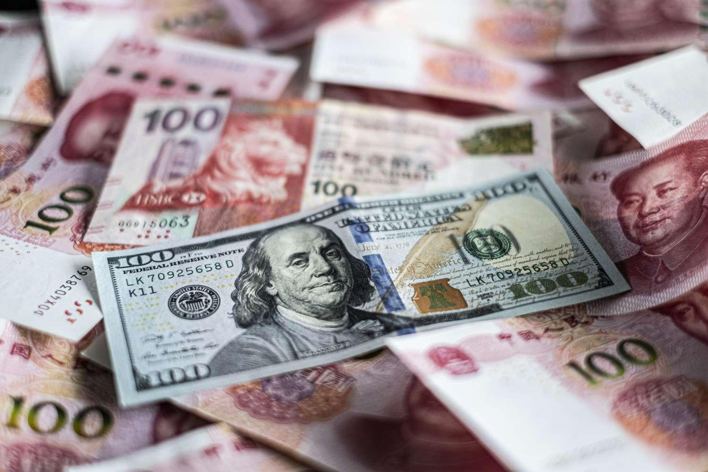

The global trade landscape is an intricate network of transactions and policies, defined by an array of tariffs, trade barriers, and protective measures. At the heart of this network are protective tariffs and trade protectionism, crucial elements that significantly affect industries and economies across the world. Protective tariffs are duties imposed on imports with the intent of shielding domestic industries from foreign competition. By increasing the cost of imported goods, these tariffs aim to sway consumer preference towards domestically produced alternatives.

Trade protectionism encompasses a broader scope, incorporating various policies that limit international trade in order to nurture domestic industries. This approach can lead to increased economic activity within a country by protecting jobs and supporting the stability of essential industries. However, it is a double-edged sword; while it offers short-term protection and job security, it can also trigger trade tensions between countries and lead to higher prices for consumers.

This article examines the complex interaction between protective tariffs, trade protectionism, and import tariffs, alongside the emerging role of algorithmic trading. The deployment of import tariffs is a strategic maneuver within the framework of trade protectionism, regulating the entry of foreign goods into domestic markets. These tariffs serve not only to protect local industries but also as an important source of revenue for governments. As global dynamics shift, the debate between proponents of free trade and those advocating for protectionism gains new dimensions.

The article will also address the impact of algorithmic trading in today's markets. Algorithmic trading involves using computer-generated algorithms to execute trading orders at remarkable speeds and precision, enabling markets to respond instantly to policy shifts. The integration of this technology into financial systems adds complexity to the economic consequences of tariffs and protectionism, as instantaneous data processing influences stock prices and corporate strategies.

The exploration of these subjects provides insights into the intricate relationship between global trade policies and economic outcomes, offering guidance for policymakers and businesses as they navigate the evolving international trade environment.

## Table of Contents

## Understanding Protective Tariffs

Protective tariffs are a fundamental component of trade policies designed to shield domestic industries from foreign competition. By imposing duties on imported goods, these tariffs elevate the cost of foreign products, thereby encouraging consumers to opt for domestically produced alternatives. The intention behind protective tariffs is to nurture and sustain local industries, particularly those deemed vital for national economic health.

In the United States, protective tariffs have a storied history with numerous instances demonstrating their strategic application. For example, tariffs imposed on paper clips, canned tuna, and sneakers are targeted measures aimed at preserving the competitiveness of these American industries. The imposition of such duties serves not only as a barrier against cheaper foreign imports but also as a tool for economic revitalization, supporting employment and production within the domestic sphere.

The rationale for protective tariffs is underpinned by the economic principle that by reducing competition from abroad, local industries can stabilize and grow. This, in turn, can lead to increased investment in domestic production facilities, driving technological advancements and improving product quality. Furthermore, protective tariffs can serve as a temporary measure, allowing nascent industries the time to develop competitive advantages on a global scale.

However, while protective tariffs provide clear benefits in safeguarding specific industries, they come with their own set of challenges and criticisms. One of the primary criticisms of such tariffs is that they can lead to retaliatory measures from trading partners, escalating into trade wars that disrupt international economic relations. Additionally, protective tariffs can result in higher prices for consumers, as the cost of imported goods rises and domestic producers may not have the incentive to lower their prices without foreign competition.

Historical analysis of protective tariffs in the U.S. reveals a nuanced impact on the economy. The Tariff Act of 1930, commonly known as the Smoot-Hawley Tariff, is a prominent example where heightened tariffs contributed to a decrease in international trade during the Great Depression, exacerbating economic woes at the time. Nonetheless, in more recent scenarios, targeted tariffs have been effectively employed to support specific industries facing unfair competition from abroad.

In summary, protective tariffs are a controversial yet significant economic tool wielded by nations to strengthen domestic industries against global market forces. By understanding their application and effects, policymakers can better navigate the intricate balance between protecting local interests and fostering global trade relations.

## The Role of Trade Protectionism

Trade protectionism involves implementing policies aimed at restricting international trade, primarily to promote and protect domestic industries. These policies can take various forms, such as tariffs, quotas, and subsidies, all designed to limit foreign competition and bolster local businesses. The underlying rationale is to preserve domestic jobs, stabilize key industries, and maintain economic self-sufficiency.

One significant advantage of trade protectionism is its potential to foster domestic economic activity. By limiting imports through tariffs or quotas, a country can encourage consumers to buy home-grown products, thereby boosting local manufacturing and employment. This approach can be particularly beneficial during economic downturns, as it supports national industries and mitigates the impact of global competition.

However, protectionist strategies often trigger adverse effects. A primary concern is the likelihood of escalating trade tensions between countries. When one nation imposes trade barriers, targeted countries may retaliate with their own, leading to a cycle of restrictive trade practices. Such scenarios can strain diplomatic relations and impact the global economy by introducing inefficiencies and reducing the overall [volume](/wiki/volume-trading-strategy) of trade.

Moreover, protectionism can lead to higher consumer prices. When foreign goods are taxed, their cost in the domestic market rises. Consequently, consumers may face limited choices and higher prices for everyday products. While domestic industries might benefit from reduced competition, the general populace may experience a decrease in purchasing power.

An illustrative example of protectionism is the European Union's Common Agricultural Policy (CAP). This policy is designed to support EU farmers through subsidies and price support mechanisms, ensuring stable incomes and food supply within Europe. By erecting barriers against non-EU agricultural products, the CAP highlights both the protective and contentious aspects of trade protectionism.

Another example is the United States' tariffs on Chinese goods. Initiated as part of a broader trade strategy, these tariffs aim to correct perceived imbalances and protect American industries from allegedly unfair Chinese trade practices. While these tariffs may bolster specific U.S. sectors, they have also led to increased trade tensions and reciprocal measures from China.

In conclusion, trade protectionism serves as a double-edged sword, supporting domestic industries while potentially fostering international discord and inflating consumer costs. Each protective measure requires careful consideration of its broader economic and diplomatic implications.

## Impact of Import Tariffs

Import tariffs are taxes imposed by governments on imported goods, significantly influencing both domestic markets and international trade relationships. As a central tool of protectionism, import tariffs serve multiple purposes, primarily protecting domestic industries from foreign competition and generating revenue for governments. By making imported goods more expensive, tariffs encourage consumers to purchase domestic alternatives, which can bolster local industries and preserve jobs within the country. This not only helps maintain economic stability but also fosters industrial growth and development.

The implementation of tariffs varies widely among industries and countries, leading to diverse impacts on the global supply chain. For instance, higher tariffs on imported steel can benefit domestic steel producers but may increase costs for industries relying on steel, such as automotive or construction. Such variations necessitate strategic consideration by governments to balance short-term industry protection with long-term economic implications. The global nature of supply chains implies that tariffs imposed by a significant actor like the United States or China can ripple across numerous sectors worldwide, altering competitiveness and affecting price structures.

However, the imposition of tariffs is not without its challenges. It often sparks debates about free trade versus protectionism, a discussion as old as international trade itself. Proponents of free trade argue that reducing tariffs leads to increased efficiency, lower prices for consumers, and greater innovation spurred by international competition. In contrast, advocates of protectionism highlight the importance of safeguarding nascent industries and protecting national security. This debate continues to evolve with the changing tides of global dynamics, particularly as economies recover from disruptions such as pandemics or political conflicts.

While tariffs protect domestic industries and contribute to governmental revenues, they can also exacerbate trade tensions and increase consumer prices. These opposing outcomes require careful policymaking to ensure that tariffs protect critical industries without igniting trade wars or harming consumers. Ensuring such a balance is even more vital as countries navigate the complex interdependencies of today's globalized economy.

## Algorithmic Trading and Its Influence

Algorithmic trading, often abbreviated as algo trading, leverages advanced computer algorithms to execute trades at high speeds and with precision. This form of trading fundamentally changes the dynamics of financial markets by integrating technology with decision-making processes traditionally reliant on human intuition and analysis.

The influence of [algorithmic trading](/wiki/algorithmic-trading) on markets affected by tariffs and protectionism is profound. At its core, algorithmic trading facilitates instant reactions to policy changes, such as the imposition or modification of tariffs. These swift responses can substantially impact stock prices and strategic decisions within financial markets. When a government announces new trade policies that might restrict imports or exports, algorithms analyze the potential impact on various assets and sectors, executing trades based on predefined criteria. This immediate response capability can lead to significant [volatility](/wiki/volatility-trading-strategies) as market participants adjust their positions in light of updated information.

For instance, consider a scenario where the United States announces an increase in tariffs on imported steel to protect domestic producers. An algorithm designed to monitor such news could immediately assess the potential increase in demand for domestic steel and might place buy orders for stocks in U.S.-based steel companies. Simultaneously, it might sell positions in foreign steel manufacturers expected to face decreased demand due to the higher tariffs. This rapid execution is possible because algorithms can process vast amounts of data and complete transactions in fractions of a second, far beyond human capabilities.

Furthermore, the integration of algorithmic trading adds complexity to the impact of economic policies. As algorithms continuously adapt and evolve with the markets, they often incorporate [machine learning](/wiki/machine-learning) techniques to improve decision-making. These systems can learn from past data, identifying patterns and predicting future trends with remarkable accuracy. Such capabilities enhance the efficiency of markets by increasing [liquidity](/wiki/liquidity-risk-premium) and narrowing bid-ask spreads but also present challenges, such as exacerbating market swings when reactions to policy changes become overly aggressive.

The influence of algo trading is not confined to equities alone. It extends to various asset classes, including foreign exchange, commodities, and fixed-income securities. As a result, the effects of protective tariffs can ripple through these markets too, influenced by the interplay of multiple algorithms across diverse trading platforms.

In summary, algorithmic trading introduces a significant layer of complexity to the markets influenced by tariffs and trade protectionism. Its ability to quickly react to policy changes shapes strategic decisions and market behaviors, making it an indispensable tool in contemporary financial ecosystems. As these technologies continue to advance, their role in interpreting and responding to economic policies will likely expand, demanding further adaptation by market participants and regulators alike.

## Case Studies in Trade Protectionism

The paper [clip](/wiki/clip) case is a classic example of how protective tariffs can effectively shield domestic industries from foreign competition. In this instance, a 127% tariff was levied on Chinese imports of paper clips to counteract what was deemed as dumping—selling goods below market value to undercut competitors. This tariff served to significantly limit the influx of cheaper Chinese paper clips, thus preserving the market share and profitability of American manufacturers. The decision was based on a determination by the U.S. International Trade Commission that domestic manufacturers were materially injured by these imports, prompting the imposition of substantial duties to level the playing field.

The U.S. tobacco industry offers another compelling case of long-term trade strategy supported by tariffs. Since the Great Depression, high tariffs have been placed on tobacco imports, effectively insulating U.S. growers from foreign competition. This protectionism has allowed the domestic tobacco industry to maintain production levels and stabilize prices in the face of fluctuating international markets. The strategic use of tariffs has bolstered the industry, ensuring its resilience through various economic cycles and policy shifts.

Tariffs on New Balance sneakers further illustrate the benefits of protective measures for domestic production. By imposing duties on imported sneakers, the U.S. government has contributed to sustaining domestic footwear manufacturing capabilities. This not only benefits the New Balance brand, which prides itself on maintaining a significant portion of its production in the United States but also supports jobs and local economies. The tariffs have allowed U.S. sneaker manufacturers to compete against imports by narrowing the price gap created by cheaper production costs abroad.

These case studies exemplify the diverse applications and outcomes of trade protectionism. They showcase how strategic use of tariffs can preserve and enhance domestic industry, protect jobs, and contribute to economic stability. However, these measures must be carefully weighed against the potential for trade tensions and impacts on consumer prices. The effective implementation of trade protectionism requires a nuanced understanding of both domestic imperatives and international trade dynamics.

## Conclusion

Protective tariffs and trade protectionism are critical components of global economic strategies, serving to bolster domestic industries by shielding them from international competition. However, these measures can also instigate trade tensions, necessitating a careful balancing act. Policymakers must weigh the benefits of safeguarding local employment and industries against the potential for increased consumer prices and retaliatory trade policies from other nations.

Algorithmic trading introduces an additional layer of complexity to this landscape, as it enables rapid reactions to policy shifts. The speed and efficiency of algorithmic systems mean that markets can respond almost instantaneously to changes in tariff structures or protectionist policies, affecting stock prices and trading volumes significantly. Therefore, quick policy adaptations become essential to mitigate potential market disruptions and exploit emerging opportunities.

A thorough understanding of protective tariffs, trade protectionism, and the influence of algorithmic trading is essential for both policymakers and businesses. This knowledge equips them to navigate the intricacies of global trade more effectively, ensuring a strategic approach to international economic exchanges. Such an approach fosters a more stable economic environment and promotes sustainable growth amid the complexities of modern global markets.

## References & Further Reading

[1]: Irwin, D. A. (2017). ["Clashing over Commerce: A History of US Trade Policy"](https://www.nber.org/books-and-chapters/clashing-over-commerce-history-us-trade-policy). Princeton University Press.

[2]: Bhagwati, J. (2008). ["Termites in the Trading System: How Preferential Agreements Undermine Free Trade"](https://academic.oup.com/book/7611). Oxford University Press.

[3]: Lopez de Prado, M. (2018). ["Advances in Financial Machine Learning"](https://www.amazon.com/Advances-Financial-Machine-Learning-Marcos/dp/1119482089). Wiley.

[4]: Johnson, D., & Turner, C. (2010). ["International Business: Themes and Issues in the Modern Global Economy"](https://www.taylorfrancis.com/books/mono/10.4324/9780203861615/international-business-colin-turner). Routledge.

[5]: Jansen, S. (2020). ["Machine Learning for Algorithmic Trading: Predictive Models to Extract Signals from Market and Alternative Data for Systematic Trading Strategies with Python"](https://www.amazon.com/Machine-Learning-Algorithmic-Trading-alternative/dp/1839217715). Packt Publishing.