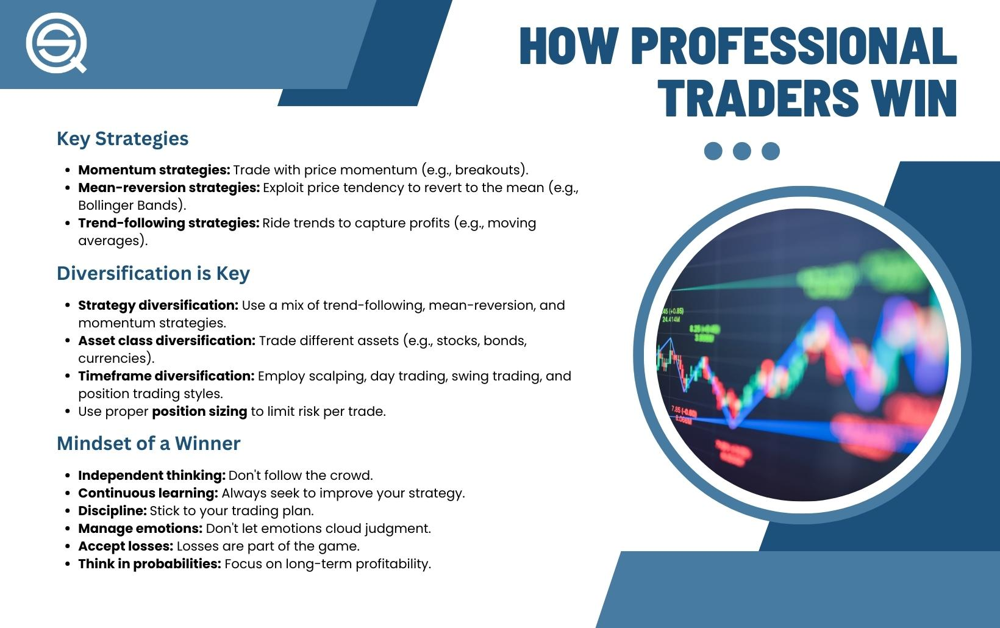

## Table of Contents

## What is professional trading and why is it important?

Professional trading is when people buy and sell things like stocks, currencies, or commodities to make money. These traders use special knowledge and tools to decide when to buy or sell. They might work for big companies or trade on their own. Professional trading is different from just investing because traders often make many trades in a short time, trying to make small profits from each trade.

Professional trading is important for a few reasons. First, it helps keep markets working smoothly. When traders buy and sell, they help set prices that reflect what people think things are worth. This makes markets fair and efficient. Second, professional trading can help the economy grow. When traders make money, they can spend it on other things, which helps businesses and creates jobs. So, professional trading is a big part of how our financial world works.

## What are the basic principles of trading strategies for beginners?

Trading strategies for beginners start with understanding the basics of the market. You need to know what you are trading, whether it's stocks, currencies, or commodities. It's important to learn how to read charts and understand basic terms like 'buy', 'sell', 'bid', and 'ask'. A key principle is to start small. Don't risk a lot of money right away. Instead, use a small amount to practice and learn. This way, you can make mistakes without losing too much.

Another important principle is to have a plan. Decide what you want to achieve and how you will do it. This includes setting goals and knowing when to enter and exit trades. A common strategy for beginners is to follow trends. This means buying when prices are going up and selling when they start to go down. It's also crucial to use stop-loss orders. These are instructions to sell a security when it reaches a certain price, which helps limit your losses if the market moves against you.

Lastly, always keep learning and stay disciplined. The market can be unpredictable, so it's important to stay informed about what's happening in the world that might affect your trades. Don't let emotions drive your decisions. Stick to your plan even when things get tough. Over time, as you gain more experience, you can start to try more complex strategies, but always remember the basics: start small, have a plan, and keep learning.

## How can risk management be integrated into trading strategies?

Risk management is a big part of trading strategies. It helps you protect your money and make smarter choices. One way to do this is by using stop-loss orders. A stop-loss order is like a safety net that tells the computer to sell your stock if it drops to a certain price. This way, you don't lose too much money if things go wrong. Another way is to not put all your money into one trade. Instead, spread it out over different trades. This is called diversification. It's like not putting all your eggs in one basket.

Another important part of risk management is knowing how much money you can afford to lose. This is called setting a risk-reward ratio. For example, you might decide that you're okay with losing $100 if you can make $300. This helps you think about the possible outcomes before you make a trade. Also, it's good to keep learning and adjusting your strategy. The market changes all the time, so what worked yesterday might not work today. By always thinking about risk and trying to manage it, you can make better trading decisions and protect your money.

## What are the most common trading strategies used by professionals?

Professional traders often use a strategy called trend following. This means they watch the market to see if prices are going up or down over time. If they see a trend, they buy when prices are going up and sell when prices start to go down. They use charts and other tools to help them spot these trends. Trend following can work well in markets that move a lot, but it needs patience and discipline because trends can last a long time.

Another common strategy is called scalping. Scalpers make many small trades in a short time, trying to make a little bit of money from each trade. They look for small changes in price and act quickly. This strategy needs a lot of focus and fast decision-making. It can be exciting but also stressful because you need to watch the market all the time.

Some professionals also use a strategy called swing trading. Swing traders hold onto their trades for a few days or weeks, trying to catch bigger moves in the market. They look for patterns that suggest a price might go up or down soon. This strategy needs less time watching the market than scalping but still needs good timing and understanding of market patterns.

## How do technical analysis and fundamental analysis differ in trading?

Technical analysis and fundamental analysis are two different ways traders look at the market to make decisions. Technical analysis is all about looking at charts and past price movements. Traders who use this method believe that all the information they need is already shown in the price of the stock or whatever they are trading. They use tools like moving averages, support and resistance levels, and other chart patterns to guess where the price might go next. It's like trying to predict the future by looking at what happened before.

On the other hand, fundamental analysis is about looking at the real value of a company or asset. Traders who use this method study things like a company's earnings, the economy, and other big picture stuff. They want to know if a stock is a good buy based on how the company is doing and what's happening in the world. It's like trying to figure out if a company is worth investing in by looking at its health and the environment it's in.

Both methods have their place in trading. Some traders use just one, while others mix both to get a fuller picture. Technical analysis is great for short-term trading because it focuses on quick price movements. Fundamental analysis is often used for longer-term investments because it looks at the bigger picture over time.

## What role does market psychology play in developing trading strategies?

Market psychology is all about understanding how people feel and think when they trade. It's important because the way people feel can change the market a lot. For example, if everyone is scared and thinks prices will go down, they might start selling a lot, which can make prices actually go down. On the other hand, if everyone is excited and thinks prices will go up, they might buy a lot, pushing prices up. Traders who understand this can use it to make better decisions. They might look for signs that people are feeling a certain way, like when a lot of people are buying or selling at the same time, and then use that information to guess what might happen next.

When developing trading strategies, knowing about market psychology can help traders in a few ways. First, it can help them spot trends early. If they see that people are starting to feel more positive or negative about the market, they can get in on a trend before it becomes obvious to everyone else. Second, it can help them manage their own emotions. Trading can be stressful, and it's easy to make bad decisions when you're feeling scared or excited. By understanding how emotions affect the market, traders can stay calm and stick to their plan. Overall, market psychology is a big part of trading, and using it wisely can make a big difference in how well a trader does.

## How can traders use algorithmic trading to enhance their strategies?

Algorithmic trading is when traders use computer programs to buy and sell things like stocks or currencies. These programs follow a set of rules that the trader makes up. This can help traders make decisions faster and without letting their feelings get in the way. For example, a trader might set up a program to buy a stock when its price goes up by a certain amount and sell it when it goes down by another amount. This way, the trader doesn't have to watch the market all the time and can make trades even when they're not looking.

Using algorithmic trading can also help traders test their strategies. They can run their programs on past market data to see how well their rules would have worked. This is called backtesting. If the strategy does well in the past, the trader might feel more confident using it in the real market. Plus, algorithmic trading can handle a lot of trades at once, which can be hard for a person to do. This can help traders take advantage of small price changes that happen quickly, making more money over time.

## What are advanced chart patterns and how can they be used in trading?

Advanced chart patterns are shapes or formations that appear on price charts and help traders predict what the market might do next. These patterns can be more complicated than basic ones and often need more experience to spot and understand. Some common advanced patterns include head and shoulders, double tops and bottoms, and flags and pennants. Each of these patterns tells traders something about whether prices might go up or down. For example, a head and shoulders pattern often means that a trend might be ending and prices could start to fall.

Traders use these advanced chart patterns to make better decisions about when to buy or sell. If a trader sees a head and shoulders pattern forming, they might decide to sell their stock before the price drops. On the other hand, if they see a flag or pennant pattern, it might mean that the current trend will continue, so they could buy more. By understanding these patterns, traders can plan their moves more carefully and try to make more money. It's important for traders to practice recognizing these patterns and to use them along with other tools like technical indicators to make the best trading decisions.

## How do professional traders adapt their strategies to different market conditions?

Professional traders change their strategies based on what the market is doing. They watch the market closely to see if it's going up, going down, or staying the same. If the market is moving a lot, they might use strategies like trend following, where they buy when prices are going up and sell when they start to go down. But if the market is not moving much, they might switch to a different strategy, like scalping, where they make many small trades to make a little bit of money from each one. They also look at things like economic news and world events, which can change how the market acts.

Another way professional traders adapt is by using different tools and indicators. For example, if they see that a certain stock is acting differently from the rest of the market, they might use more technical analysis to understand what's happening. They might also change how much risk they're willing to take. In a stable market, they might be more willing to take bigger risks, but in a very unpredictable market, they might play it safer and use more stop-loss orders to protect their money. By always watching the market and being ready to change their plans, professional traders can keep making money no matter what the market is doing.

## What are the key performance indicators to evaluate the success of trading strategies?

Key performance indicators (KPIs) are important tools that traders use to see how well their trading strategies are working. One of the main KPIs is the profit and loss statement, which shows how much money a trader has made or lost over a certain time. Traders also look at the win rate, which is the percentage of trades that make money. A high win rate is good, but it's also important to look at the average profit per winning trade and the average loss per losing trade. This helps traders understand if their winning trades are making enough money to cover their losses.

Another important KPI is the risk-reward ratio, which compares the potential profit of a trade to the potential loss. A good risk-reward ratio means that the potential profit is much bigger than the potential loss. Traders also use the Sharpe ratio to see how well their strategy is doing compared to the risk they're taking. A higher Sharpe ratio means the strategy is doing well for the amount of risk involved. By keeping an eye on these KPIs, traders can figure out if their strategies are working and make changes if they need to.

## How can traders leverage options and futures in their trading strategies?

Options and futures are tools that traders can use to make their strategies better. Options give traders the right, but not the obligation, to buy or sell something at a certain price before a certain time. This can be useful because it lets traders make money from price movements without having to buy the actual thing. For example, if a trader thinks a stock's price will go up, they can buy a call option. If they're right, they can make money without having to buy the stock itself. Futures, on the other hand, are contracts to buy or sell something at a set price on a future date. Traders can use futures to guess where prices will be in the future and make money from those guesses.

Using options and futures can also help traders manage risk. Options can act like insurance. For example, if a trader owns a stock and is worried about its price going down, they can buy a put option to sell it at a certain price. This way, they can limit their losses if the stock's price falls. Futures can help traders lock in prices, which is useful if they need to buy or sell something in the future. By using these tools smartly, traders can protect their money and maybe even make more money than they would with just buying and selling stocks or other things.

## What are the latest trends and innovations in professional trading strategies?

One of the latest trends in professional trading is the use of artificial intelligence (AI) and machine learning. These technologies help traders make better decisions by analyzing huge amounts of data quickly. AI can spot patterns in the market that humans might miss and can even predict what might happen next. Some traders use AI to create trading algorithms that can buy and sell things automatically, without needing a person to watch the market all the time. This can help traders make more money and take less risk.

Another big innovation is the rise of social trading platforms. These platforms let traders copy what other successful traders are doing. If you find a trader who is doing well, you can automatically follow their trades. This can be a good way for beginners to learn from experts and for experienced traders to share their strategies and make some extra money. Social trading also makes trading more fun because it's like being part of a community where people can share ideas and help each other out.

Lastly, there's a growing interest in sustainable and ethical trading. More traders are looking at things like environmental, social, and governance (ESG) factors when they make their decisions. They want to invest in companies that are good for the planet and society. This trend is changing how traders think about what makes a good investment, and it's leading to new strategies that focus on long-term value instead of just short-term profits.

## References & Further Reading

[1]: Elder, A. (1993). [Trading for a Living: Psychology, Trading Tactics, Money Management](https://www.amazon.com/Trading-Living-Psychology-Tactics-Management/dp/0471592242). John Wiley & Sons.

[2]: Livermore, J. (1940). [How to Trade in Stocks](https://www.amazon.com/How-Trade-Stocks-Jesse-Livermore/dp/194696302X). Duel, Sloan & Pearce.

[3]: Jegadeesh, N., & Titman, S. (1993). [Returns to Buying Winners and Selling Losers: Implications for Stock Market Efficiency](https://www.jstor.org/stable/2328882). The Journal of Finance, 48(1), 65-91.

[4]: Poterba, J. M., & Summers, L. H. (1988). [Mean reversion in stock prices: Evidence and implications](https://www.sciencedirect.com/science/article/abs/pii/0304405X88900219). Journal of financial economics, 22(1), 27-59.

[5]: Faber, M. (2007). [A Quantitative Approach to Tactical Asset Allocation](https://papers.ssrn.com/sol3/papers.cfm?abstract_id=962461). The Journal of Wealth Management, 9(4), 69-79.

[6]: Markowitz, H. (1952). [Portfolio Selection](https://www.researchgate.net/publication/228051028_Portfolio_Selection). The Journal of Finance, 7(1), 77-91.

[7]: Gatev, E., Goetzmann, W. N., & Rouwenhorst, K. G. (2006). [Pairs Trading: Performance of a Relative-Value Arbitrage Rule](https://papers.ssrn.com/sol3/papers.cfm?abstract_id=141615). Review of Financial Studies, 19(3), 797-827.

[8]: Tharp, V. K. (2006). [Trade Your Way to Financial Freedom](https://www.amazon.com/Trade-Your-Way-Financial-Freedom/dp/007147871X). New York: McGraw-Hill.

[9]: Douglas, M. (1990). [The Disciplined Trader: Developing Winning Attitudes](https://www.amazon.com/Disciplined-Trader-Developing-Winning-Attitudes/dp/0132157578). New York: Prentice Hall Press.

[10]: Murphy, J. J. (1999). [Technical Analysis of the Financial Markets: A Comprehensive Guide to Trading Methods and Applications](https://www.amazon.com/Technical-Analysis-Financial-Markets-Comprehensive/dp/0735200661). New York: New York Institute of Finance.

[11]: Chaboud, A. P., Chiquoine, B., Hjalmarsson, E., & Vega, C. (2014). [Rise of the Machines: Algorithmic Trading in the Foreign Exchange Market](https://onlinelibrary.wiley.com/doi/abs/10.1111/jofi.12186). The Journal of Finance, 69(5), 2045-2084.

[12]: Sornette, D., & von der Becke, S. (2011). [Crashes and High-Frequency Trading](https://assets.publishing.service.gov.uk/media/5a7c284240f0b61a825d6d18/11-1226-dr7-crashes-and-high-frequency-trading.pdf). An Empirical Study of Mutual Funds. European Journal of Finance, 18(10), 823-839.

[13]: Kahneman, D., & Tversky, A. (1979). [Prospect Theory: An Analysis of Decision under Risk](https://www.jstor.org/stable/1914185). Econometrica, 47(2), 263-292.

[14]: Murphy, J. J. (1999). [Technical Analysis of the Financial Markets: A Comprehensive Guide to Trading Methods and Applications](https://www.amazon.com/Technical-Analysis-Financial-Markets-Comprehensive/dp/0735200661). New York: New York Institute of Finance.

[15]: Malkiel, B. G. (1973). [A Random Walk Down Wall Street](https://www.amazon.fr/Random-Walk-Down-Wall-Street/dp/0393330338). W. W. Norton & Company.

[16]: Shiller, R. J. (2005). [Irrational Exuberance](https://www.amazon.com/Irrational-Exuberance-Robert-J-Shiller/dp/0691050627). Princeton University Press.

[17]: Kahneman, D., & Klein, G. (2009). [Conditions for intuitive expertise: A failure to disagree](https://psycnet.apa.org/doiLanding?doi=10.1037%2Fa0016755). American Psychologist, 64(6), 515.

[18]: Taleb, N. N. (2007). [The Black Swan: The Impact of the Highly Improbable](https://www.amazon.com/Black-Swan-Impact-Improbable-Incerto/dp/1400063515). Random House.

[19]: Bailey, M., & López de Prado, M. (2013). [The Definitive Guide to Futures Trading (Vol. I)](https://www.abebooks.com/9780930233198/Definitive-Guide-Futures-Trading-Volume-0930233190/plp). Journal of Portfolio Management, 40(2), 155-157.

[20]: Treleaven, P., Galas, M., & Lalchand, V. (2013). [Algorithmic trading review](https://www.researchgate.net/publication/262239006_Algorithmic_Trading_Review). Communications of the ACM, 56(11), 76-85.