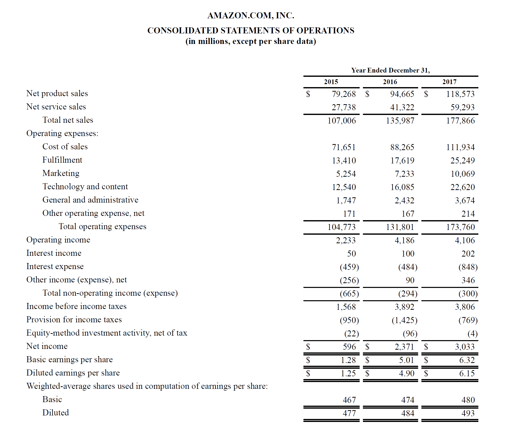

In the world of algorithmic trading, understanding how Profit and Loss (PnL) operates is crucial for traders aiming to optimize their trading strategies. PnL is not just a number indicating gains or losses; it's a comprehensive metric that helps traders evaluate the performance of their trading strategies in algo trading. By providing insights into the profitability and efficiency of various trading algorithms, PnL enables traders to make informed decisions about strategy adjustments and risk management.

PnL represents the net outcome of trading activities over a specific period and is calculated by subtracting total losses from total gains. In mathematical terms, it can be expressed as:

$$
\text{PnL} = \sum (\text{Gains}) - \sum (\text{Losses})
$$

In this article, we will explore what PnL is, why it's important in algo trading, and how platforms like uTrade Algos make it easier for traders to monitor and enhance their strategy's performance. As algorithmic trading relies heavily on data-driven decisions, tracking PnL in real-time can provide traders with a critical edge in measuring the success of their strategies. Furthermore, PnL analysis allows traders to evaluate risk exposure and optimize position sizing by quantifying trade outcomes in a systematic manner.

Understanding the intricacies of PnL and its impact on trading performance is essential for those engaged in algorithm-driven markets. It serves as a diagnostic tool that sheds light on the strengths and weaknesses of various trading algorithms, facilitating continuous improvement. As the trading landscape becomes increasingly complex, platforms such as uTrade Algos offer sophisticated tools to enhance PnL tracking and analysis, ensuring traders remain competitive in this dynamic environment. Through this exploration, traders can aspire to achieve more consistent profitability and refine their approaches based on empirical metrics.

## Table of Contents

## Understanding PnL in Algo Trading

Profit and Loss (PnL) is a fundamental financial metric that quantifies the net profit or loss produced by a trading strategy over a specific timeframe. In [algorithmic trading](/wiki/algorithmic-trading), PnL is pivotal in measuring the success of a trading strategy. It is calculated by analyzing and contrasting the average profit from successful trades against the average loss from unsuccessful trades. This evaluation enables traders to determine the effectiveness and profitability of their trading strategies.

A higher PnL indicates a more profitable trading strategy, denoting that the profits from winning trades surpass the losses incurred from losing trades. In general, a positive PnL suggests that a trading strategy is performing well, while a negative PnL could indicate the need for adjustments or reevaluation of the strategy.

PnL can be calculated using the formula:

$$
\text{PnL} = \sum (\text{Price Exit} - \text{Price Entry}) \times \text{Position Size}
$$

This calculation considers all trades within a specified period, providing a comprehensive view of a strategy’s performance. For example, if a trading strategy involves multiple assets or complex trading algorithms, PnL becomes a critical metric to determine the efficiency and return on investment of these strategies.

Furthermore, PnL helps in analyzing the variance in trade outcomes, which is crucial for understanding the overall risk associated with the trading strategy. By comparing average profits and losses, traders can refine their strategies to maximize profitability and minimize risk. Metrics such as Sharpe Ratio, which uses PnL data to measure risk-adjusted returns, can be derived to give deeper insights into strategy performance.

In algorithmic trading platforms, tools are often provided to calculate PnL automatically, display it over customizable timeframes, and segment it across various strategies. This automated calculation aids traders in making informed decisions quickly, adapting strategies as market conditions change, and optimizing the strategies so they align with individual financial objectives.

## Why is PnL Important in Algo Trading?

Profit and Loss (PnL) is a fundamental metric in algorithmic trading, serving several critical functions that enhance trading strategy effectiveness and decision-making processes.

### Evaluating Strategy Performance
PnL is a quantitative measure that allows traders to assess the efficacy of their trading strategies. By comparing the profits earned and losses incurred over time, traders can determine whether a strategy is successful. The ability to calculate PnL over various periods enables a nuanced understanding of strategy performance, taking into account different market conditions. This evaluation often involves calculating the winning rate of trades and the average size of wins versus losses, helping traders decide if a strategy should be continued, adjusted, or discontinued. 

### Risk Management
In algo trading, PnL is pivotal in visualizing and managing risk. By providing a clear picture of average profits and losses, PnL assists traders in determining the appropriate position sizing and setting stop-loss levels to control risks effectively. For example, using PnL data, a trader might determine that a particular strategy has a favorable risk-reward ratio if the expected profit per trade exceeds the expected loss by a significant margin. This aids in strategizing around capital allocation and minimizing potential losses.

### Benchmarking
PnL acts as a benchmarking tool that allows traders to set performance standards against past results or industry norms. By comparing the PnL of current strategies with historical data or the performance of peers' strategies, traders can identify deviations and potential areas for improvement. Such benchmarking enables continuous refinement and adaptation of strategies, ensuring they remain competitive and aligned with market trends.

### Analyzing Strengths & Weaknesses
Through a detailed analysis of the PnL, traders can identify the strong and weak points within their strategies. For example, by breaking down PnL based on different market conditions or time frames, traders can pinpoint which aspects contribute most to profitability and which cause losses. This insight is invaluable for making strategic adjustments, such as modifying entry and [exit](/wiki/exit-strategy) points, to enhance overall performance. Additionally, traders can leverage this analysis to simulate and predict future performance, enabling more informed decision-making.

In summary, the strategic utility of PnL in algorithmic trading cannot be overstated. It serves not only as a measure of success but also as a vital tool for risk management, strategic refinement, and competitive benchmarking, underpinning the sophisticated decision-making processes that define successful algo trading endeavors.

## How to Use and Check PnL on uTrade Algos

uTrade Algos is a powerful platform that offers traders a comprehensive suite of tools for algo trading, with easy access to Profit and Loss (PnL) metrics. Here’s a guide on how to effectively use and check PnL on uTrade Algos:

1. **Homepage Overview**: After logging into your uTrade Algos account, the homepage presents a detailed earnings box displaying your total earnings. This quick snapshot allows you to see your cumulative profits or losses at a glance.

2. **Accessing the PnL Report**: Navigate to the PnL report section, where you will find a color-coded graph representing your day-wise profit and loss data. The visual representation makes it easier to track the performance of your trading strategies over time. 

3. **Customization Options**: The platform provides customization features that let you modify reports by changing time frames or focusing on specific strategies. This flexibility is crucial for refining trading decisions based on historical performance data. By adjusting these settings, you can gain detailed insights into different aspects of your trading approach.

4. **Video Tutorials**: For users new to the platform or those seeking to maximize its potential, uTrade Algos offers a range of video tutorials. These resources guide you through the platform, demonstrating how to navigate its features effectively and utilize them to enhance your trading performance.

5. **Comprehensive Analysis Tools**: Beyond basic metrics, uTrade Algos provides advanced analytical tools. These tools allow you to dissect PnL data in depth, offering insights into various trading parameters, such as volatility impact and risk-adjusted returns.

By leveraging these features, traders can make informed decisions and optimize their strategies for better outcomes. Staying updated with the platform's latest functionalities and utilizing its educational resources will further enhance your trading experience.

## Conclusion

Incorporating Profit and Loss (PnL) assessments into your algorithmic trading strategy is essential for maintaining a competitive edge in today's dynamic trading landscape. PnL not only serves as a critical benchmark for evaluating the success of your trading strategies but also enhances your capacity for effective risk management and strategic planning. By continually analyzing the PnL, traders can identify strengths and weaknesses within their strategies, enabling more informed decision-making and optimization of tactics.

Platforms like uTrade Algos offer valuable tools by providing comprehensive insights into performance metrics, seamlessly bridging the gap between manual and automated trading methodologies. By leveraging such platforms, traders can customize and refine their strategies more efficiently, focusing on areas needing improvement while capitalizing on successful tactics. The ability to customize reports and visualize strategy performance through color-coded graphs allows for a nuanced understanding of market movements and strategic adjustments based on empirical data.

To maximize trading potential, it is imperative to integrate PnL analysis into your routine strategy assessments. By adopting tools designed to illuminate your trading performance, like uTrade Algos, you empower yourself to make data-driven decisions and better align your actions with your market goals. Embrace the power of PnL analysis to not only monitor your trading outcomes but also to achieve your trading objectives with enhanced precision and confidence.

## References & Further Reading

[1]: Bergstra, J., Bardenet, R., Bengio, Y., & Kégl, B. (2011). ["Algorithms for Hyper-Parameter Optimization."](https://proceedings.neurips.cc/paper/2011/file/86e8f7ab32cfd12577bc2619bc635690-Paper.pdf) Advances in Neural Information Processing Systems 24.

[2]: ["Advances in Financial Machine Learning"](https://www.amazon.com/Advances-Financial-Machine-Learning-Marcos/dp/1119482089) by Marcos Lopez de Prado

[3]: ["Evidence-Based Technical Analysis: Applying the Scientific Method and Statistical Inference to Trading Signals"](https://www.amazon.com/Evidence-Based-Technical-Analysis-Scientific-Statistical/dp/0470008741) by David Aronson

[4]: ["Machine Learning for Algorithmic Trading"](https://github.com/stefan-jansen/machine-learning-for-trading) by Stefan Jansen

[5]: ["Quantitative Trading: How to Build Your Own Algorithmic Trading Business"](https://books.google.com/books/about/Quantitative_Trading.html?id=j70yEAAAQBAJ) by Ernest P. Chan