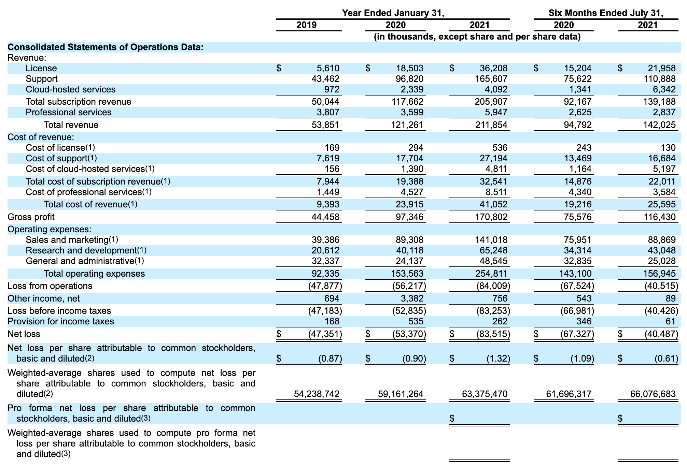

## Table of Contents

## What is a profit and loss statement?

A profit and loss statement, often called a P&L statement, is a financial report that shows how much money a business made or lost over a certain period, like a month or a year. It lists all the money coming into the business from sales and other sources, and all the money going out for expenses like rent, salaries, and supplies. By comparing the total income to the total expenses, the statement shows if the business made a profit or suffered a loss.

This statement is really important for business owners and managers because it helps them see if their business is doing well financially. They can use it to make decisions about where to cut costs or how to increase sales. It's also useful for investors and lenders who want to know if the business is a good risk before they decide to invest money or give a loan.

## Why is a profit and loss statement important for businesses?

A profit and loss statement is very important for businesses because it shows them if they are making money or losing money. It's like a report card for the business's finances. By looking at this statement, business owners can see all the money coming in from sales and other places, and all the money going out for things like rent, salaries, and supplies. If the money coming in is more than the money going out, the business is making a profit. If it's the other way around, the business is losing money.

This statement is also useful for making smart decisions. If a business sees it's losing money, the owners can use the profit and loss statement to find out where they might be spending too much. They can then decide to cut costs in those areas or try to increase their sales. It's also important for people outside the business, like investors or banks. They look at the profit and loss statement to decide if they want to give the business money or if it's a good investment. So, this statement helps everyone understand the financial health of the business.

## What are the main components of a profit and loss statement?

A profit and loss statement has several main parts that help show how a business is doing financially. The first part is revenue, which is all the money the business makes from selling its products or services. This can also include other income like interest or rent from properties the business owns. The second part is the cost of goods sold (COGS), which is the cost of making or buying the products that were sold. Subtracting COGS from revenue gives the gross profit, which shows how much money the business makes after paying for the products it sells.

The next part of the statement is operating expenses, which are all the costs of running the business day to day. This includes things like rent, salaries, utilities, and office supplies. Subtracting these expenses from the gross profit gives the operating profit, which shows how much money the business makes from its main activities. The last part includes other income and expenses, like interest on loans or taxes. After adding or subtracting these, you get the net profit or loss, which is the final number that tells you if the business made or lost money overall.

These components together give a clear picture of the business's financial performance. By looking at each part, business owners can see where they are making money and where they might be spending too much. This helps them make better decisions to improve their business's financial health.

## How do you calculate net profit on a profit and loss statement?

To calculate net profit on a profit and loss statement, you start with the total revenue, which is all the money the business made from selling its products or services. From this, you subtract the cost of goods sold (COGS), which is the cost of making or buying the products that were sold. This gives you the gross profit, which shows how much money the business makes after paying for the products it sells.

Next, you subtract the operating expenses from the gross profit. Operating expenses are all the costs of running the business day to day, like rent, salaries, and utilities. This gives you the operating profit, which shows how much money the business makes from its main activities. Finally, you add or subtract any other income or expenses, like interest on loans or taxes. The result is the net profit, which tells you if the business made or lost money overall.

## What is the difference between gross profit and net profit?

Gross profit and net profit are two important numbers on a profit and loss statement, but they show different things. Gross profit is what you get when you take the money you made from selling your products or services and subtract the cost of making or buying those products. It tells you how much money you have left after paying for the things you sold. This number is important because it shows if your business is making enough money from its main activities to cover the costs of the products.

Net profit, on the other hand, is what's left after you take the gross profit and subtract all the other costs of running your business. These other costs include things like rent, salaries, utilities, and taxes. Net profit tells you if your business is making money overall, after paying for everything. It's the final number that shows if you ended up with more money than you started with, or if you lost money. Knowing the difference between these two helps you understand where your business stands financially.

## How often should a profit and loss statement be prepared?

A profit and loss statement should be prepared regularly to keep track of a business's financial health. Many businesses prepare a profit and loss statement every month. This helps them see how they are doing each month and make quick changes if needed. For example, if a business sees it's losing money in one month, it can look at the statement to find out why and fix the problem before it gets worse.

Some businesses also prepare a profit and loss statement every quarter, which is every three months. This can be useful for businesses that want to look at their performance over a longer period but still need to make changes more often than once a year. At the end of the year, almost all businesses prepare an annual profit and loss statement. This yearly statement is important for understanding the overall financial health of the business and is often required for tax purposes and for showing to investors or lenders.

## Can a profit and loss statement be used to assess business performance over time?

Yes, a profit and loss statement can be used to assess business performance over time. By looking at profit and loss statements from different periods, like months or years, you can see how the business is doing over time. If the business is making more profit each year, that's a good sign that it's growing and doing well. If the profit is going down, it might mean the business needs to make some changes.

Comparing these statements helps you spot trends. For example, if the cost of goods sold is going up faster than the revenue, the business might need to find cheaper suppliers or raise prices. Or if operating expenses are growing without an increase in revenue, the business might need to cut costs. By looking at these patterns over time, business owners can make better decisions to keep their business healthy and profitable.

## What are common mistakes to avoid when preparing a profit and loss statement?

When preparing a profit and loss statement, one common mistake is mixing up personal and business expenses. It's important to keep these separate so the statement shows the true financial health of the business. If personal expenses are included, it can make the business look like it's losing money when it's actually doing okay. Another mistake is not including all income and expenses. Sometimes, small amounts of money coming in or going out can be forgotten, but these can add up and make a big difference in the final numbers.

Another error to watch out for is not updating the statement regularly. If the profit and loss statement is only prepared once a year, it can be hard to spot problems early and fix them. It's better to do it monthly or quarterly to keep a close eye on the business's performance. Also, some people make the mistake of not double-checking their numbers. Simple math errors or typos can lead to wrong information on the statement, which can cause bad decisions. Always take the time to review and make sure everything is correct.

## How can a profit and loss statement help in budgeting and forecasting?

A profit and loss statement can help a lot with budgeting and forecasting. It shows how much money the business made and spent in the past. By looking at this, business owners can see where they spent too much or where they can save money. This helps them make a better budget for the future. For example, if the statement shows that the business spent a lot on office supplies last year, the owner might decide to find cheaper suppliers or cut back on those costs in the next budget.

The profit and loss statement also helps with forecasting, which means guessing how the business will do in the future. By looking at past statements, owners can see patterns and trends. If the business made more money each year, they might guess it will keep growing. Or if costs went up a lot last year, they might plan for that to happen again. This helps them make smart plans and set goals for the future, making sure the business stays healthy and profitable.

## What advanced analysis can be performed using data from profit and loss statements?

Using data from profit and loss statements, businesses can do advanced analysis to understand their financial health better. One way is by doing a break-even analysis. This helps find out how much the business needs to sell to cover all its costs. By looking at the profit and loss statement, the business can see its fixed costs, like rent, and variable costs, like the cost of goods sold. Then, they can figure out the break-even point, which is useful for setting prices and planning sales targets.

Another advanced analysis is trend analysis. This involves looking at profit and loss statements over several periods to spot patterns. For example, if the business sees that its costs are going up faster than its revenue, it might need to find ways to cut costs or increase prices. Trend analysis can also show if the business is growing or shrinking, which helps in making long-term plans. By understanding these trends, the business can make better decisions to improve its financial performance.

Lastly, businesses can use ratio analysis to get deeper insights. This involves calculating different financial ratios using the numbers from the profit and loss statement. For example, the gross profit margin shows how much money the business makes after paying for the products it sells. The net profit margin shows how much money is left after all expenses. These ratios help compare the business's performance over time or against other businesses in the same industry, giving a clearer picture of its financial health and efficiency.

## How do profit and loss statements vary across different industries?

Profit and loss statements can look different depending on the industry because each type of business has its own way of making money and spending it. For example, a restaurant's profit and loss statement will show a lot of money spent on food and ingredients, which is the cost of goods sold. They might also have high labor costs because they need a lot of staff to serve customers. On the other hand, a software company's statement might show big expenses on research and development instead of food costs, because they need to keep creating new software. Their labor costs might be different too, with more money going to programmers and less to customer service.

Even though the main parts of a profit and loss statement, like revenue and expenses, are the same for all businesses, the details can change a lot from one industry to another. A manufacturing company's statement will show costs for raw materials and machinery, which are important for making their products. A retail store's statement might focus more on inventory costs and sales commissions. By understanding these differences, businesses can better compare their performance to others in their industry and make smarter decisions about where to spend their money.

## What are the regulatory requirements for profit and loss statements in different countries?

The rules for making and showing profit and loss statements can be different in different countries. In the United States, businesses have to follow the rules set by the Generally Accepted Accounting Principles (GAAP). These rules say how to record and show financial information. If a business is public, it also has to follow the rules from the Securities and Exchange Commission (SEC), which says they need to share their profit and loss statements with the public every three months and at the end of the year. In the United Kingdom, businesses follow the rules set by the International Financial Reporting Standards (IFRS) or UK GAAP, and they need to share their profit and loss statements in their annual reports.

In other countries, like Australia, businesses follow the Australian Accounting Standards, which are similar to IFRS. They need to share their profit and loss statements with shareholders and the Australian Securities and Investments Commission (ASIC) every year. In Japan, companies have to follow the Japanese Generally Accepted Accounting Principles (J-GAAP) and share their financial statements, including profit and loss statements, with the Financial Services Agency (FSA) and shareholders. Each country has its own rules, but the main idea is the same: to make sure businesses show their financial information clearly and honestly.

## References & Further Reading

[1]: Damodaran, A. (2011). ["The Little Book of Valuation: How to Value a Company, Pick a Stock and Profit"](https://www.amazon.com/Little-Book-Valuation-Company-Profits/dp/1394244401). Wiley.

[2]: Lopez de Prado, M. (2018). ["Advances in Financial Machine Learning"](https://www.amazon.com/Advances-Financial-Machine-Learning-Marcos/dp/1119482089). Wiley.

[3]: Chan, E. (2009). ["Quantitative Trading: How to Build Your Own Algorithmic Trading Business"](https://github.com/ftvision/quant_trading_echan_book). Wiley.

[4]: Aronson, D. R. (2007). ["Evidence-Based Technical Analysis: Applying the Scientific Method and Statistical Inference to Trading Signals"](https://onlinelibrary.wiley.com/doi/book/10.1002/9781118268315). Wiley.

[5]: Andreou, P. C., Charalambous, C., & Martzoukos, S. H. (2015). ["Market Liquidity and Funding Liquidity in an Algorithmic Trading Environment"](https://www.researchgate.net/profile/Panayiotis-Andreou-2/publication/5144627_Robust_Artificial_Neural_Networks_for_Pricing_of_European_Options/links/0c960528cbb859e805000000/Robust-Artificial-Neural-Networks-for-Pricing-of-European-Options.pdf). Quantitative Finance, Springer.

[6]: Jansen, S. (2020). ["Machine Learning for Algorithmic Trading"](https://github.com/stefan-jansen/machine-learning-for-trading). Packt Publishing.

[7]: Hull, J. C. (2014). ["Risk Management and Financial Institutions"](https://books.google.com/books/about/Risk_Management_and_Financial_Institutio.html?id=1J1QDwAAQBAJ). John Wiley & Sons.