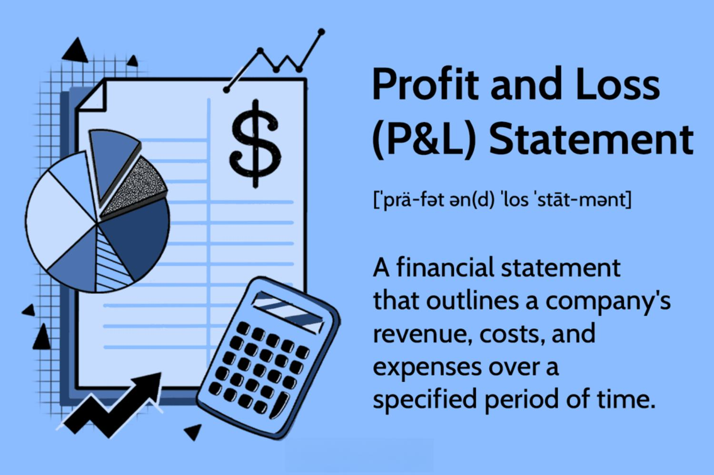

In finance, understanding the interplay between profit and loss statements and algorithmic trading is essential. Financial statements, particularly the profit and loss (P&L) statement, provide a detailed view of a company's financial performance over a specific period. These statements offer critical insights into revenue generation, expense management, and ultimately net income or loss, serving as a foundational tool for traders and investors alike to evaluate the financial health of their interests.

Algorithmic trading, which involves the use of electronic platforms to execute complex trading orders using automated and pre-programmed instructions, increasingly relies on data derived from financial statements. These automated systems utilize historical P&L data to refine, develop, and implement trading strategies that aim to maximize profitability and manage risk effectively. By analyzing such data, algorithmic trading systems can identify patterns and trends that may indicate future price movements or market conditions.



Key factors influencing profit and loss in algorithmic trading extend beyond mere financial data. Market volatility, liquidity, and algorithmic parameters such as risk tolerance and leverage are significant contributors to trading outcomes. Understanding these variables, combined with insights from P&L statements, empowers traders to make informed decisions and adapt strategies to current market dynamics.

The integration of P&L statements into algorithmic trading strategies enables traders to optimize performance by studying past results to forecast future profitability. This methodical approach allows for continuous improvement, ensuring that trading algorithms remain robust against evolving market conditions. The ability to leverage financial statement insights proactively is integral to developing innovative and successful trading strategies that withstand the test of time.

## Table of Contents

## Understanding Financial Statements in Trading

Financial statements are pivotal in providing a holistic view of a company’s financial well-being, encompassing various reports that detail different aspects of financial performance and position. Among these, the profit and loss (P&L) statement is particularly important for traders, as it meticulously outlines a company’s revenue, expenses, and net income over a specified period.

The P&L statement, alternatively known as the income statement, serves as a financial mirror, reflecting a company's operational efficiency and its ability to generate profit. It captures the comprehensive flow of income and expense transactions, culminating in the net income figure, which indicates the company’s profitability. The basic structure of a P&L statement can be simplified as:

$$
\text{Net Income} = \text{Total Revenue} - \text{Total Expenses}
$$

Where:
- **Total Revenue** includes all income generated from business activities, notably sales revenue.
- **Total Expenses** encompass all costs incurred in earning the revenue, such as cost of goods sold (COGS), operating expenses, interest, taxes, and others.

In the context of trading, the P&L statement is instrumental in evaluating a company's past financial performance and forecasting its potential for profit generation. Traders scrutinize these statements as part of [fundamental analysis](/wiki/fundamental-analysis), which involves assessing a company's financial health and operational efficiency to inform investment decisions.

By analyzing P&L insights, traders can identify trends, profitability patterns, and efficiency in cost management that may influence stock prices and investment returns. These insights are crucial for making informed trading decisions, as they help traders determine the intrinsic value of a stock relative to its market price. This approach aids in identifying undervalued or overvalued stocks and making strategic buy or sell decisions.

Moreover, financial statements, particularly the P&L statement, provide valuable data that can influence trading decisions beyond the company's specific performance. They allow traders to assess industry trends, economic conditions, and competitive positioning, further enriching their market understanding and strategy formulation.

Thus, for traders, understanding and analyzing P&L statements is an indispensable practice, enabling them to leverage historical and current financial data to make informed trading and investment decisions.

## The Role of Profit and Loss Statements in Algorithmic Trading

Algorithmic trading relies heavily on systematically analyzing data to make trading decisions. Profit and Loss (P&L) statements are fundamental tools in this analysis, as they provide detailed insights into the financial outcomes of trades. By utilizing historical P&L data, [algorithmic trading](/wiki/algorithmic-trading) systems can refine strategies to enhance profitability and risk management.

P&L statements are instrumental in identifying patterns of profitable trades. These patterns might include specific market conditions, timeframes, or asset classes that have historically led to positive returns. For instance, a trading algorithm might discover that certain technical indicators, when paired with specific market conditions, consistently result in profits. This data can guide the algorithm to focus on such conditions, optimizing its decisions to maximize returns.

Additionally, P&L statements assess a trader’s or algorithm’s capability to navigate market fluctuations. In volatile markets, understanding how different strategies performed historically can inform adjustments to current algorithmic approaches. For example, during periods of high [volatility](/wiki/volatility-trading-strategies), an algorithm might prioritize trades that historically resulted in consistent returns, thereby minimizing risk.

By carefully analyzing P&L outcomes, algorithmic traders can fine-tune the parameters within their systems. Parameters such as asset allocation, timeframes for holding positions, and thresholds for entering or exiting trades can all be optimized based on P&L insights. Python code can be used to automate this process, allowing for the continuous adaption of trading strategies:

```python
import pandas as pd

# Load historical P&L data
historical_data = pd.read_csv('historical_pnl.csv')

# Example of analyzing patterns
profitable_patterns = historical_data[historical_data['profit'] > 0].groupby(['market_condition', 'strategy']).mean()

# Optimize algorithm settings based on historical performance
def optimize_trading_settings(data):
    optimized_settings = {}
    for condition, group in data.groupby('market_condition'):
        best_strategy = group['strategy'].idxmax()
        optimized_settings[condition] = best_strategy
    return optimized_settings

optimized_settings = optimize_trading_settings(profitable_patterns)
```

This code snippet illustrates how historical P&L data can identify successful trading patterns and optimize trading settings accordingly. In conclusion, P&L statements play a crucial role in algorithmic trading by facilitating the analysis and optimization of trading strategies, enabling traders to navigate market complexities more effectively.

## Common Factors Affecting Profitability in Algorithmic Trading

Market volatility and [liquidity](/wiki/liquidity-risk-premium) are crucial factors impacting the profitability of algorithmic trading. Volatility refers to the degree of variation in trading prices over time for a particular market or index. High volatility can present more opportunities for profit due to frequent price swings but can also pose significant risks. In contrast, low volatility often results in smaller price movements, potentially limiting profit but offering more predictable trading conditions. Liquidity, the ability to buy or sell assets without causing significant price distortion, affects the ease and cost-effectiveness of entering or exiting positions. Higher liquidity usually reduces the bid-ask spread, optimizing trading efficiency.

Algorithm parameters, particularly risk tolerance and leverage, directly influence profit and loss statements. Risk tolerance reflects the degree of risk an algorithm is programmed to handle, which can determine its exposure to volatile markets. An algorithm with higher risk tolerance may engage in trades with significant potential returns but also higher risks of loss. Leverage involves borrowing funds to increase trade size beyond the original investment. While leverage can magnify profits, it also amplifies losses if the market moves unfavorably. Proper calibration of these parameters is essential to align the algorithm's objectives with risk management strategies.

Data accuracy and the quality of financial statements are critical in algorithmic decision-making. Algorithms rely on precise, high-quality data to execute trades effectively. Inaccurate data can lead to erroneous trade entries and exits, impacting profit and loss outcomes. Financial statements provide historical data essential for back-testing and refining trading strategies. For instance, using Python, back-testing can be implemented with libraries like `pandas` and `numpy` to assess an algorithm's performance based on historical data:

```python
import pandas as pd
import numpy as np

def backtest_strategy(data, strategy_func):
    signals = strategy_func(data)
    positions = pd.DataFrame(index=signals.index).fillna(0.0)
    positions['Asset'] = 100 * signals  # assuming a capital of 100 units

    portfolio = positions.multiply(data['Close'], axis=0)
    pos_diff = positions.diff()

    portfolio['holdings'] = (positions.multiply(data['Close'], axis=0)).sum(axis=1)
    portfolio['cash'] = 10000 - (pos_diff.multiply(data['Close'], axis=0)).sum(axis=1).cumsum()
    portfolio['total'] = portfolio['cash'] + portfolio['holdings']
    portfolio['returns'] = portfolio['total'].pct_change()

    performance = {
        "Total Return": portfolio['total'].iloc[-1] - 10000,
        "CAGR": ((portfolio['total'].iloc[-1] / 10000) ** (1 / (len(data) / 252)) - 1) * 100,
        "Annualized Volatility": portfolio['returns'].std() * np.sqrt(252),
    }

    return performance

# Example usage:
# data should be a DataFrame with 'Close' prices
# strategy_func is a function that generates buy/sell signals based on data
```

Understanding these factors and incorporating them into algorithm design enhances the robustness of trading algorithms. This involves continuously updating methodologies to adapt to changing market conditions and refining risk assessments to prevent significant financial losses. A comprehensive grasp of these elements allows for more effective algorithm strategies, ultimately impacting profitability in trading.

## Strategies to Mitigate Losses

Employing risk management techniques is essential in algorithmic trading to prevent substantial financial losses. At its core, risk management aims to minimize the potential for losing capital while maximizing the opportunities for profit. An effective approach involves implementing various strategies that have shown effectiveness in limiting drawdowns and protecting trading accounts.

One fundamental technique is the utilization of stop loss and take profit orders. A stop loss order is designed to limit an investor's loss on a position in a security by specifying a predetermined price point at which the position will be automatically sold. By implementing stop loss orders, traders can ensure that their investments are automatically exited when market prices move unfavorably, thereby capping the maximum loss. Conversely, take profit orders allow traders to lock in gains once a position reaches a targeted profitability level. The syntax for placing these orders in a trading algorithm can be as straightforward as:

```python
def place_stop_loss_take_profit(order_price, stop_loss_percentage, take_profit_percentage):
    stop_loss_price = order_price * (1 - stop_loss_percentage / 100)
    take_profit_price = order_price * (1 + take_profit_percentage / 100)
    return stop_loss_price, take_profit_price
```

Diversifying trading portfolios is another crucial risk management strategy. By spreading investments across various assets, sectors, or geographical markets, traders can reduce the impact of adverse price movements in any single asset. Diversification helps in distributing risk and can protect a portfolio from significant volatility associated with individual securities. The geometric reality of diversification is that it lowers the overall risk of a portfolio by ensuring that the performance of a diverse mix of investments can offset negative returns from others.

Regularly updating and optimizing algorithms based on profit and loss (P&L) analysis is also paramount in mitigating losses. Analyzing P&L statements allows traders to evaluate the effectiveness of their trading strategies and identify patterns or anomalies that necessitate adjustments. Systematic evaluation of P&L outcomes can guide modifications in algorithm parameters, such as adjusting risk levels or leveraging settings to align with the current market conditions. Continuous learning from P&L data ensures that algorithms are adaptable and fine-tuned to the evolving market environment.

Incorporating these strategies fosters a disciplined trading approach where the focus remains on sustaining long-term profitability and reducing the likelihood of financial setbacks. Employing these systematic techniques ensures that algorithmic traders can manage their portfolios more effectively, regardless of market fluctuations.

## Case Study: Utilizing P&L Statements for Enhanced Trading

XYZ Trading Firm has demonstrated a noteworthy approach to enhancing profitability through the strategic use of profit and loss (P&L) statements. By methodically analyzing their quarterly financial results, XYZ Trading Firm identified key areas for improving their algorithmic trading strategies.

Initially, the firm meticulously evaluated the P&L outcomes from different sectors. This evaluation involved a detailed analysis of revenue trends, expense patterns, and overall net income across various industries. By focusing on sectors that consistently reported positive P&L figures, XYZ Trading Firm was able to realign their capital allocation towards more promising areas, thereby optimizing the potential for profitable trades.

A pivotal element of this strategy was the modification of algorithmic parameters in response to the insights gained. By utilizing historical P&L data, the firm could simulate different trading scenarios and refine their algorithms accordingly. This optimization process included adjusting key variables such as risk tolerance levels, leverage ratios, and trade frequencies, ensuring that the algorithms were adept at handling market fluctuations while maximizing returns.

The outcome of this data-driven approach was significant. Within a span of six months, XYZ Trading Firm reported a 20% increase in profitability. This improvement was attributed to their disciplined focus on sectors with robust P&L characteristics and their agile adaptation of algorithmic strategies to reflect real-time financial insights.

The case of XYZ Trading Firm underscores the importance of integrating P&L statements into the decision-making processes of algorithmic trading. By continuously monitoring and adjusting trading algorithms based on comprehensive financial data, similar enterprises can aim to enhance their profitability and maintain a competitive edge in the market.

## Conclusion

Financial statements, particularly the profit and loss (P&L) statements, are instrumental in enhancing the efficiency and effectiveness of algorithmic trading. They serve as a comprehensive tool for understanding the financial implications of various trading strategies, offering insights that are crucial to navigating the complexities of financial markets.

P&L statements provide essential data that aid strategic decision-making and risk management. By dissecting the revenue, expenses, and net income components, algorithmic traders can gain a clear picture of their trading performance. This detailed overview allows for the assessment of trade outcomes and the identification of patterns that may contribute to either profit or loss. For instance, understanding cost structures or recurring high-revenue trades can lead to strategic shifts that favor financial gains.

Algorithmic traders are encouraged to harness these insights to refine their trading approaches. Analyzing P&L data allows traders to tweak algorithm parameters for better risk-reward ratios or to adjust trading volumes in alignment with expected profitability. For example, an algorithm might be adjusted to trade more aggressively during periods of low market volatility, where historical P&L analysis shows better performance, while pulling back during market spikes that historically resulted in losses.

Continuous learning and adaptation play pivotal roles in ensuring the sustained success of algorithmic trading systems. Regularly updating algorithms—by integrating insights gained from ongoing P&L analysis—can help address market dynamics and avoid stagnation in trading strategies. The continuous feedback loop between P&L outcomes and algorithm adjustments leads to more resilient trading systems capable of thriving in fluctuating market environments. As markets evolve, maintaining this adaptive approach is key to achieving and maintaining profitability.

In summary, leveraging the detailed insights into financial health provided by P&L statements allows algorithmic traders to make informed decisions, manage risks effectively, and continually refine their trading algorithms. This results in a proactive trading strategy capable of delivering consistent success over time.

## Additional Resources

For traders seeking to enhance their expertise, various resources can offer significant insights and educational opportunities. The IG Academy is a notable platform where individuals can expand their knowledge on trading strategies, risk management, and market analysis through a range of free courses and webinars. This educational resource is designed to cater to both novice traders and experienced professionals looking to refine their skills.

Staying informed about the latest market developments is crucial for successful trading. The IG financial events page provides traders with up-to-date information on significant market events, economic indicators, and company earnings reports. Access to real-time data and news can lead to more informed trading decisions, helping traders anticipate market movements and adjust their strategies accordingly.

While self-education is important, consulting with professional financial advisors can offer personalized advice tailored to individual trading goals and risk tolerance. Financial advisors bring a wealth of experience and can provide strategic guidance, helping traders optimize their portfolios and navigate complex market environments. Engaging with professionals can also offer more nuanced insights into the interplay between financial statements and trading strategies, further enhancing one's understanding of the mechanisms driving profitability and risk in algorithmic trading.

## References & Further Reading

[1]: Bergstra, J., Bardenet, R., Bengio, Y., & Kégl, B. (2011). ["Algorithms for Hyper-Parameter Optimization."](https://dl.acm.org/doi/10.5555/2986459.2986743) Advances in Neural Information Processing Systems 24.

[2]: ["Advances in Financial Machine Learning"](https://www.amazon.com/Advances-Financial-Machine-Learning-Marcos/dp/1119482089) by Marcos Lopez de Prado

[3]: ["Evidence-Based Technical Analysis: Applying the Scientific Method and Statistical Inference to Trading Signals"](https://www.amazon.com/Evidence-Based-Technical-Analysis-Scientific-Statistical/dp/0470008741) by David Aronson

[4]: ["Machine Learning for Algorithmic Trading"](https://github.com/PacktPublishing/Machine-Learning-for-Algorithmic-Trading-Second-Edition) by Stefan Jansen

[5]: ["Quantitative Trading: How to Build Your Own Algorithmic Trading Business"](https://books.google.com/books/about/Quantitative_Trading.html?id=j70yEAAAQBAJ) by Ernest P. Chan