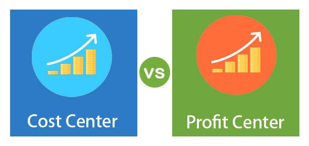

Financial management plays a crucial role in the success and sustainability of businesses, serving as the backbone for strategic decision-making and organizational growth. Effective financial management involves planning, organizing, directing, and controlling financial activities, ensuring efficient allocation and utilization of resources. Within this framework, profit centers and cost centers emerge as fundamental components, each with distinct roles and contributions.

Profit centers refer to parts of a business responsible for generating revenue and profits. They operate with substantial autonomy, being accountable for their own financial results. This financial accountability encourages efficiency and innovation, as profit centers are incentivized to maximize their profitability. Examples include retail units of companies like Walmart and specific product lines of technology giants like Microsoft. These centers are pivotal in determining strategic directions, influencing decisions on resource allocation and performance evaluation.

In contrast, cost centers are essential for supporting a business's operations without directly generating revenues. While they do not contribute to profits directly, their efficient management is vital for optimizing operational performance and controlling expenses. Cost centers are often found in departments like human resources, accounting, and research and development. Effective management of cost centers involves stringent budgeting and cost-control measures, ensuring they operate within financial constraints while delivering high-quality support services.

Algorithmic trading, or algo trading, represents a significant advancement in financial management strategies. It involves using algorithms to make trading decisions based on predefined criteria, enabling transactions at speeds and efficiencies unattainable by humans. Algo trading has transformed various financial markets, including equities, forex, and derivatives, by providing advantages such as precision, speed, and the capacity for backtesting strategies against historical data. Despite its benefits, algorithmic trading also poses challenges, such as the need for sophisticated programming skills and the potential for systemic risks in volatile markets.

The intersection of profit centers, cost centers, and algorithmic trading highlights the necessity for integration in crafting a comprehensive financial strategy. By leveraging data analytics, organizations can better align these components to enhance decision-making processes. This alignment allows businesses to optimize resource allocation, improve financial performance, and adapt to dynamic market conditions.

The objective of this article is to provide a detailed overview of profit centers, cost centers, and algorithmic trading, elucidating their significance and interaction in contemporary business finance. Through examining these elements, business leaders can gain insights into achieving financial stability and strategic growth in an increasingly complex economic landscape.

## Table of Contents

## Understanding Profit Centers

Profit centers are critical components of modern business structures, defined primarily as segments or divisions within an organization that are directly responsible for generating revenue. These centers operate with considerable independence, possessing a certain level of autonomy which allows them to manage their activities like miniature standalone businesses. The primary characteristic of profit centers is their accountability for both revenue and expenses, enabling them to directly contribute to an organization's overall profitability.

The contribution of profit centers to a company's bottom line is substantial. They are not only responsible for generating revenue but also for managing their resources efficiently to maximize profits. This dual accountability—meeting revenue targets while controlling costs—ensures that profit centers are incentivized to innovate and optimize their operations continuously. By focusing on profitability, these centers help businesses measure and improve financial performance, providing insights into which segments are performing optimally and which require strategic adjustments.

Operational independence is a hallmark of profit centers. This autonomy empowers managers to make decisions that best suit their specific market conditions and strategic goals. Such independence typically extends to aspects like pricing, marketing strategies, and supply chain management. With the authority to respond swiftly to market dynamics, profit center managers are often able to exploit market opportunities faster than would be possible in a more centralized organization structure.

Revenue accountability within profit centers means that the performance of these units can be directly measured against their revenue goals. This clear financial accountability supports a more precise allocation of resources and facilitates targeted investment in high-potential areas, thereby enhancing return on investment (ROI). Moreover, profit centers enable companies to better focus on customer needs and market trends, driving tailored innovation and customer experiences that align with strategic priorities.

Examples of effective profit centers abound across various industries. In the retail sector, companies like Walmart manage different product departments or geographic divisions as individual profit centers, allowing for tailored strategies that cater to distinct market demands and customer preferences. Similarly, in the technology sector, firms such as Microsoft operate business units such as cloud computing, software solutions, and hardware as separate profit centers. This structure not only drives innovation within each unit but also allows Microsoft to adjust business strategies dynamically across its diverse product lines.

Strategic decision-making regarding resource allocation is heavily influenced by the performance data obtained from profit centers. By analyzing which units are most profitable, organizations can strategically reinvest profits into areas with the highest growth potential. Furthermore, the autonomy of profit centers fosters a culture of entrepreneurship and accountability among managers, which can lead to better-informed strategic decisions across the entire organization.

In conclusion, profit centers play a pivotal role in enhancing a company's financial health and strategic flexibility. By clearly delineating revenue-generating responsibilities and granting operational independence, profit centers facilitate a deeper understanding of financial performance and enable swift, informed decision-making regarding future growth opportunities.

## Exploring Cost Centers

Cost centers are integral components of an organization that do not directly generate revenue but are essential for maintaining operational efficiency. These departments or units incur costs as they provide necessary support services to ensure an organization's seamless functioning. Financially, a cost center is characterized by its lack of income generation, contrasting with profit centers, which directly impact the organization's bottom line.

### Definition and Significance

A cost center is defined as a distinct department or unit responsible solely for managing and controlling its incurred costs, without directly influencing profit generation. These units are evaluated primarily based on their ability to manage and reduce costs while maintaining the quality of their services. Common cost centers include human resources, accounting, information technology, and customer service departments. Their significance lies in their support to profit centers, enabling them to focus on revenue-generating activities by ensuring operational activities are effectively managed and streamlined.

### Cost Centers in Various Industries

Cost centers are pervasive across industries, playing a crucial role in both manufacturing and service sectors. In manufacturing, departments such as maintenance and quality control are considered cost centers, focusing on equipment upkeep and product quality assurance. In the services sector, departments such as training and development or corporate communications serve as cost centers by providing essential support to enhance the capabilities and visibility of the company.

For example, in a manufacturing company, the maintenance department ensures that all machinery operates efficiently, reducing downtime and enhancing productivity, albeit indirectly contributing to revenues. Similarly, in a service-oriented organization, the human resources department, tasked with talent acquisition and employee development, is pivotal to maintaining a motivated and skilled workforce, indirectly impacting service quality and customer satisfaction.

### Role in Budgeting and Cost Control

Cost centers play an instrumental role in the budgeting process of an organization. By focusing on cost management, these units help in setting financial targets and controlling expenditures. Budgeting for cost centers involves estimating the future expenses for departments, allowing organizations to allocate resources efficiently and monitor financial performance against set targets.

Cost control is a critical function of cost centers, where they are tasked with identifying areas of potential savings and implementing strategies to achieve cost efficiency. A robust cost control mechanism involves ongoing monitoring of expenses, evaluating the cost-benefit of various activities, and implementing corrective measures to align with budgetary constraints.

### Challenges and Management Strategies

Managing cost centers presents specific challenges, primarily due to their non-revenue generating nature. One of the most notable challenges is justifying the budget allocation in the absence of direct income contribution. This can lead to cost centers being viewed as merely expense sinks rather than strategic assets. Additionally, there may be challenges associated with accurately tracking and allocating costs to specific departments, especially in complex organizational structures.

Effective management strategies for cost centers involve enhancing visibility into cost structures and ensuring alignment with organizational objectives. Techniques such as Activity-Based Costing (ABC) enable better tracking of resource allocation and cost consumption. Furthermore, adopting performance metrics and key performance indicators (KPIs) tailored to cost efficiency and service quality can aid in evaluating and optimizing the performance of cost centers. Employing technological solutions, like enterprise resource planning (ERP) systems, can also streamline processes and provide detailed insights into cost management.

In conclusion, while cost centers do not generate revenue directly, they are pivotal for ensuring operational efficiency and contributing indirectly to an organization's profitability. Through strategic management and innovative cost control measures, organizations can optimize the effectiveness and efficiency of their cost centers, thereby enhancing overall financial performance and stability.

## Algorithmic Trading in Financial Management

Algorithmic trading, often referred to as algo trading, has transformed financial markets by leveraging computer programs to execute trading strategies based on pre-defined criteria. Initially developing in the late 20th century with the advent of electronic trading platforms, algo trading has reshaped how financial transactions are conducted, especially with its ability to handle high-frequency trading with minimal human intervention.

### Key Features of Algorithmic Trading

1. **Automation**: At the heart of algorithmic trading is automation. Algorithms allow traders to automate parts or the entirety of the trading process, thereby reducing the likelihood of human error and increasing efficiency. This automated process enables the execution of complex strategies that rely on numerous data inputs and calculations in real-time.

2. **Speed**: With automation comes speed. Algorithms can initiate trades within fractions of a second, a feat unattainable by human traders. This rapid execution is especially crucial in high-frequency trading environments where market opportunities can appear and disappear within milliseconds.

3. **Precision**: Algo trading enhances precision by enabling trades to be executed at the best possible price after a rigorous analysis of multiple market conditions. This precision helps in maintaining consistency and accuracy across trading strategies.

4. **Backtesting**: Backtesting involves testing trading strategies against historical data to evaluate their viability. Algorithms make this process seamless, allowing traders to refine their strategies based on past market performance and hypothetical scenarios, thus improving potential profitability.

### Types of Algorithmic Trading Strategies

Algorithmic trading employs various strategies, each tailored to specific market conditions and objectives:

- **Trend-Following**: This strategy identifies a trend in the market and executes trades based on the predicted continuation of that trend. Indicators such as moving averages might be used to forecast future movements.

- **Arbitrage**: Arbitrage strategies exploit price discrepancies of the same asset across different markets or forms. They involve buying and selling an asset simultaneously to profit from these variations, and are highly dependent on speed and execution accuracy.

### Applications in Financial Markets

Algorithmic trading is employed across multiple financial markets:

- **Equities**: Algo trading is extensively utilized in stock markets for executing large orders with minimal market impact, optimizing execution costs via strategies like volume-weighted average price (VWAP) or time-weighted average price (TWAP).

- **Forex**: In the foreign exchange market, algorithms analyze currency movements and execute trades to capitalize on fluctuations. Strategies often focus on capturing short-term price inefficiencies due to high liquidity.

- **Options and Derivatives**: In derivative markets, algo trading strategies manage complex portfolios and execute sophisticated trades that align with various risk management and hedging strategies.

### Advantages and Challenges

Algorithmic trading offers several advantages, including increased efficiency, reduced transaction costs, and the ability to manage large volumes of trades. However, it also presents challenges such as:

- **Market Impact**: The highly technical nature of algo trading can sometimes exacerbate market volatility, leading to events such as the Flash Crash of 2010. 

- **Technical Failures**: Bugs in algorithms or failures in hardware infrastructure can result in unintended trades or financial losses.

- **Regulatory Concerns**: As financial authorities scrutinize the market impact of high-frequency trading, regulatory frameworks are continually evolving, necessitating compliance and adjustments in trading algorithms.

To maximize the benefits and mitigate potential risks, traders and financial institutions continuously refine algo trading programs, integrating robust risk management frameworks and maintaining adherence to evolving regulatory standards. Algorithmic trading remains an integral part of modern financial management, driving innovation and efficiency in the global financial landscape.

## Interplay Between Profit Centers, Cost Centers, and Algorithmic Trading

In the realm of business finance, integrating profit centers, cost centers, and [algorithmic trading](/wiki/algorithmic-trading) constitutes a sophisticated strategy that can lead to enhanced operational efficiency and maximization of financial returns. Understanding how these components work together allows organizations to optimize their financial strategies and resource allocation.

Profit centers are pivotal in generating revenue and are central to any financial strategy. Their operational independence allows them to focus on activities that directly increase the organization's bottom line. Cost centers, while not direct contributors to profit, are essential for maintaining the infrastructure and services that profit centers rely on. Algorithmic trading, with its capabilities of speed and precision, introduces a modern dynamic to financial management that can enhance decision-making processes through the use of data analytics.

Data analytics plays a crucial role in aligning these elements. By leveraging data collected from various operation channels, businesses can perform detailed analyses to identify trends, predict outcomes, and make informed decisions. For instance, data collected from profit centers can be analyzed for performance metrics, which can then be used to allocate resources more efficiently in cost centers. Furthermore, algorithmic trading strategies benefit significantly from analytics, as they rely on data-driven approaches to execute high-speed transactions, exploit market inefficiencies, and optimize trade executions.

Consider the case of a large retail company integrating these components into its financial strategy. The company might employ algorithmic trading to manage its excess capital, investing in equities for short-term gains. By analyzing the performance of different profit centers, the company can identify which products or services yield the most significant returns and allocate more resources from cost centers to bolster these areas. This approach not only maximizes revenue but also ensures cost efficiency by maintaining lean and effective operations.

Another example could be a tech company that uses data analytics to streamline its product development processes (a cost center). By understanding customer feedback and sales data (collected by profit centers), the company can make informed decisions about where to invest in research and development, ensuring that resources are allocated to projects with the highest potential returns. Simultaneously, algorithmic trading might be used to manage foreign exchange risks associated with global operations, providing an additional layer of financial optimization.

The benefits of such an integrated approach are manifold. Organizations can achieve better alignment between revenue-generating and non-revenue-generating activities, ensuring a balance that maintains operational effectiveness while maximizing profits. Ultimately, this holistic strategy leads to improved resource allocation, enhanced financial performance, and a stronger competitive position in the market.

In summary, the strategic integration of profit centers, cost centers, and algorithmic trading offers a comprehensive framework for businesses aiming to achieve optimal financial management. By leveraging data analytics, organizations can ensure that these elements are not only aligned with their overall financial goals but are also actively contributing to their realization.

## Conclusion

In conclusion, the dynamic landscape of business finance demands a nuanced understanding of profit centers, cost centers, and algorithmic trading. Aligning these components is crucial for optimal financial management, as each serves a distinct yet interrelated function within an organization. Profit centers drive revenue generation and are pivotal in strategic decision-making, focusing on maximizing income and contributing directly to the organization's bottom line. On the other hand, cost centers manage expenditures and support operational efficiency, ensuring that resources are utilized effectively without directly generating revenue.

Algorithmic trading introduces a modern angle to financial strategy, offering automation, speed, and precision that can be leveraged to enhance both profit and cost management. By integrating these elements with data analytics, businesses can achieve a more holistic approach to financial management, aligning strategic objectives with operational execution.

Looking ahead, future trends indicate an increasing reliance on advanced technologies such as [artificial intelligence](/wiki/ai-artificial-intelligence) and [machine learning](/wiki/machine-learning) in financial management. These technologies will likely augment the ability of businesses to analyze large data sets, identify patterns, and make informed decisions rapidly and accurately. Business leaders should consider these trends and invest in technology and talent that can harness the power of data for strategic advantage.

Ultimately, the strategic value of integrating profit centers, cost centers, and algo trading lies in achieving financial stability and growth. By understanding and aligning these elements, organizations can not only optimize their financial performance but also build a resilient framework capable of adapting to market changes and challenges. This comprehensive approach to financial strategy ensures that businesses remain competitive and sustainable in the ever-evolving economic landscape.

## References & Further Reading

1. **Publications and Articles:**

   - Boyle, P. P., & Emanuel, D. (1980). "Discretely Adjusted Option Hedges." *Journal of Financial Economics.* A foundational paper on options pricing and hedging strategies that are critical in algorithmic trading.

   - Jensen, M. C., & Meckling, W. H. (1976). "Theory of the Firm: Managerial Behavior, Agency Costs, and Ownership Structure." *Journal of Financial Economics.* This article discusses the agency costs associated with profit and cost centers within the complex structures of firms.

   - Hasbrouck, J. (1995). "One Security, Many Markets: Determining the Contributions to Price Discovery." *Journal of Finance.* This article explores the efficiency of financial markets, which is a core principle in algorithmic trading.

2. **Books and Resources:**

   - *"Algorithmic Trading: Winning Strategies and Their Rationale"* by Ernie Chan. This book provides strategies and insights for implementing algorithmic trading with practical examples, making it essential for understanding the practical applications in the finance world.

   - *"Financial Statement Analysis and Security Valuation"* by Stephen H. Penman. A comprehensive guide to evaluating financial statements, which is pivotal for managing profit and cost centers effectively.

   - *"Corporate Finance: A Practical Approach"* by Michelle R. Clayman, Martin S. Fridson, & George H. Troughton. This book provides a detailed overview of corporate finance practices, including the management of profit and cost centers.

3. **Web Resources:**

   - [Investopedia](https://www.investopedia.com/): An excellent resource for definitions and explanations of financial terms, concepts, and strategies, including profit centers, cost centers, and algorithmic trading.

   - [CFA Institute](https://www.cfainstitute.org/): Offers numerous research papers and articles related to corporate finance and investment strategies, helpful for deep dives into financial management topics.

4. **Academic Journals and Databases:**

   - Access to databases like JSTOR, ScienceDirect, and Wiley Online Library can provide further insights into academic papers and journal articles discussing advanced financial theories and applications.

By leveraging these materials, readers can gain an in-depth understanding of the concepts discussed in the article, enriching their knowledge of corporate finance and modern trading strategies.

