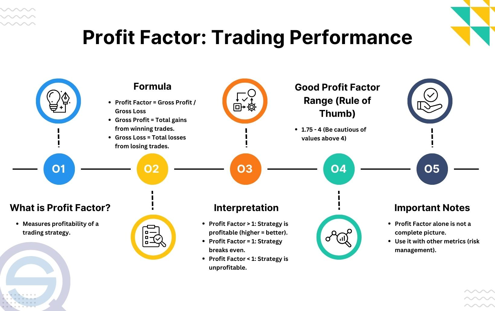

## Table of Contents

## What is the Profit Factor in trading?

The Profit Factor in trading is a simple way to see how well a trading strategy is doing. It is calculated by dividing the total profits by the total losses. If the Profit Factor is more than 1, it means the strategy is making more money than it is losing. If it is less than 1, the strategy is losing more money than it is making.

This number is important because it gives traders a quick idea of how effective their strategy is. A higher Profit Factor means the strategy is better at making money. However, traders should not rely only on the Profit Factor. They should also look at other things like how often they win trades and how big the wins and losses are.

## How is the Profit Factor calculated?

The Profit Factor is calculated by dividing the total profits by the total losses. If you made $1000 from winning trades and lost $500 from losing trades, you would divide $1000 by $500. This gives you a Profit Factor of 2. It's a simple way to see if your trading strategy is making more money than it's losing.

A Profit Factor above 1 means your strategy is profitable because you're making more money than you're losing. If it's below 1, you're losing more money than you're making, which is not good. For example, if you made $500 but lost $1000, your Profit Factor would be 0.5, showing that your strategy is not working well.

## Why is the Profit Factor important for traders?

The Profit Factor is important for traders because it gives a quick and easy way to see if their trading strategy is working well. By dividing the total profits by the total losses, traders can find out if they are making more money than they are losing. If the Profit Factor is more than 1, it means the strategy is good because it's making more money than it's losing. If it's less than 1, the strategy is not doing well because it's losing more money than it's making.

Traders should not only look at the Profit Factor but also consider other things like how often they win trades and how big their wins and losses are. The Profit Factor is just one part of understanding how well a trading strategy is doing. It helps traders make better decisions about whether to keep using a strategy or to try something different.

## What does a Profit Factor of 1 indicate?

A Profit Factor of 1 means that the total profits from your trades are exactly the same as the total losses. This shows that your trading strategy is breaking even - you're not making any money, but you're not losing any money either.

While a Profit Factor of 1 might seem okay because you're not losing money, it's not great for traders who want to make a profit. It means your strategy isn't working well enough to make more money than you're losing, so you might want to change your strategy to do better.

## How can a Profit Factor greater than 1 be interpreted?

A Profit Factor greater than 1 means your trading strategy is making more money than it's losing. This is good news because it shows your strategy is working well. If you have a Profit Factor of 2, for example, it means you're making twice as much money as you're losing. This is a sign that you should keep using your strategy because it's helping you make a profit.

However, just because your Profit Factor is more than 1 doesn't mean everything is perfect. You should also look at other things like how often you win trades and how big your wins and losses are. A high Profit Factor is great, but it's just one piece of the puzzle. Make sure you're looking at the whole picture to really understand how well your trading strategy is doing.

## What are the limitations of using the Profit Factor as a sole performance metric?

Using the Profit Factor as the only way to measure how well a trading strategy is doing can be tricky. It only tells you if you're making more money than you're losing, but it doesn't show you how often you win or lose trades. If you have a high Profit Factor because you made a lot of money from just a few big wins, but you lost a lot of small trades, your strategy might still be risky.

Also, the Profit Factor doesn't tell you about the timing of your wins and losses. If you made all your profits in the beginning and then kept losing money, your Profit Factor might still look good, but you'd be losing money overall. It's important to look at other things like how consistent your wins are and how big your wins and losses are to get a full picture of your trading strategy's performance.

## How does the Profit Factor relate to other trading performance metrics?

The Profit Factor is just one way to check how well your trading strategy is doing. It works well with other metrics like the Win Rate, which tells you how often you win trades, and the Average Win to Average Loss Ratio, which shows how big your wins are compared to your losses. If you have a high Profit Factor but a low Win Rate, it might mean you're relying on a few big wins to make money, which can be risky. On the other hand, a high Win Rate with a low Profit Factor could mean you're winning a lot but not making enough money from those wins.

Another important metric to consider is the Drawdown, which shows how much money you can lose from your highest point before you start making money again. A high Profit Factor might not mean much if your Drawdown is also high because it shows that your strategy can lose a lot of money before it starts winning again. So, while the Profit Factor is helpful, it's best to look at it along with other metrics to really understand if your trading strategy is working well.

## Can the Profit Factor be used to compare different trading strategies?

Yes, the Profit Factor can be used to compare different trading strategies. If one strategy has a Profit Factor of 2 and another has a Profit Factor of 1.5, the first strategy is making more money compared to what it's losing. This can help you decide which strategy might be better for making a profit. But remember, it's not the only thing you should look at when comparing strategies.

You should also consider other things like how often you win trades and how big your wins and losses are. A strategy with a high Profit Factor might have a low win rate, meaning it relies on a few big wins to make money, which can be risky. So, while the Profit Factor is a good starting point for comparing strategies, make sure to look at the whole picture before deciding which strategy to use.

## What is considered a good Profit Factor in different trading environments?

A good Profit Factor can be different depending on the trading environment. In general, a Profit Factor above 1.5 is often seen as good because it means you're making at least 50% more money than you're losing. For [day trading](/wiki/day-trading-spy), where trades happen quickly and often, a Profit Factor of 2 or more is usually what traders aim for. This shows that the strategy is working well and making good profits.

In longer-term trading, like swing trading or investing, a Profit Factor of 1.3 to 1.5 might be enough. This is because these types of trading focus more on steady growth over time rather than quick wins. It's important to remember that while a high Profit Factor is good, it's just one part of the puzzle. You should also look at other things like how often you win and how big your wins and losses are to really understand if your strategy is working well in your trading environment.

## How does the Profit Factor vary across different asset classes?

The Profit Factor can be different for different types of assets like stocks, [forex](/wiki/forex-system), commodities, and cryptocurrencies. In the stock market, where trades might happen over longer periods, a Profit Factor of 1.3 to 1.5 is often seen as good. This is because stock trading focuses more on steady growth over time. In the forex market, where trading happens quickly and often, traders usually aim for a Profit Factor of 2 or more. This shows that the strategy is making good profits from quick trades.

In commodities trading, like trading oil or gold, a Profit Factor around 1.5 to 2 is considered good. Commodities can be more unpredictable because they are affected by things like weather and global events, so a higher Profit Factor is important to show the strategy is working well. Cryptocurrencies, which can be very volatile, might need an even higher Profit Factor, often above 2, to make sure the strategy can handle big price swings and still make money.

## What are some common misconceptions about the Profit Factor?

A common misconception about the Profit Factor is that a number above 1 means your trading strategy is perfect. While a Profit Factor greater than 1 does show that you're making more money than you're losing, it doesn't tell the whole story. It doesn't say anything about how often you win trades or how big your wins and losses are. You could have a high Profit Factor because of a few big wins, but if you lose a lot of small trades, your strategy might still be risky.

Another misconception is that the Profit Factor alone can tell you if a trading strategy is better than another. While it's useful for comparing strategies, it's just one part of the puzzle. You need to look at other things like the Win Rate and the Average Win to Average Loss Ratio to really understand how well a strategy is doing. Also, the Profit Factor doesn't show you how much money you can lose before you start making money again, which is important for understanding the risk of your strategy.

## How can traders improve their Profit Factor?

To improve their Profit Factor, traders need to focus on making more money from their wins and losing less money from their losses. One way to do this is by setting better stop-loss and take-profit levels. A stop-loss helps you limit how much money you lose on a trade, while a take-profit lets you lock in your wins at the right time. By adjusting these levels, you can make sure your wins are bigger than your losses, which will boost your Profit Factor.

Another way to improve the Profit Factor is by choosing the right trading strategies for the assets you're trading. Different assets like stocks, forex, and cryptocurrencies need different strategies. For example, in the forex market, where things can change quickly, you might need a strategy that can make quick profits. In the stock market, where things might move more slowly, a strategy that focuses on steady growth could work better. By matching your strategy to the asset, you can increase your chances of making more money than you lose, which will help your Profit Factor.

## What is Profit Factor?

The Profit Factor is a pivotal quantitative metric utilized in trading, particularly [algorithmic trading](/wiki/algorithmic-trading), to assess the efficacy of a trading strategy. Its primary function is to measure the profitability of a strategy relative to the risks taken, providing traders with crucial insights into how effectively a strategy can convert risk into rewards. This is achieved through a straightforward calculation: the Profit Factor is determined by dividing the total gross profit of winning trades by the total gross losses of losing trades. Mathematically, this is expressed as:

$$
\text{Profit Factor} = \frac{\text{Total Gross Profit}}{\text{Total Gross Loss}}
$$

A Profit Factor greater than 1 indicates a profitable strategy, as it signifies that the strategy generates more profits than losses. For example, a Profit Factor of 1.5 would suggest that for every dollar lost, the strategy earns $1.50, demonstrating a net gain. Conversely, a Profit Factor below 1 suggests a strategy that incurs more losses than profits, indicating a need for reevaluation or optimization. This metric is invaluable for traders seeking a clear, quantitative measure of risk and return, aiding in the selection and refinement of trading strategies to ensure they are not only profitable but also resilient in varying market conditions.

## How do you calculate the profit factor?

Calculating the Profit Factor in trading is a straightforward process that enables traders to assess the effectiveness of their strategies. The formula is defined as:

$$
\text{Profit Factor} = \frac{\text{Total Gross Profit}}{\text{Total Gross Loss}}
$$

This metric quantifies how much profit is generated for every unit of loss incurred. By utilizing this calculation, traders can obtain immediate insights into their trading strategies' efficiency in managing profits relative to losses.

To illustrate, consider a trading strategy where the winning trades accumulate a total gross profit of $700, while the total gross losses from losing trades amount to $150. Applying the Profit Factor formula, we find:

$$
\text{Profit Factor} = \frac{700}{150} \approx 4.67
$$

This result indicates that for every dollar lost, approximately $4.67 is gained, highlighting the strategy’s effectiveness in managing risk and generating profit. Effective risk management, through such evaluations, is vital for maintaining profitability and optimizing trading performance.

## How can Profit Factor be used in conjunction with other metrics?

The Profit Factor is a valuable indicator in evaluating trading strategies, but its effectiveness is enhanced when used in conjunction with other metrics. One such complementary metric is the Sharpe Ratio, which measures the risk-adjusted return of an investment. The Sharpe Ratio is calculated as:

$$
\text{Sharpe Ratio} = \frac{\overline{R} - R_f}{\sigma}
$$

where $\overline{R}$ is the average return of the strategy, $R_f$ is the risk-free rate, and $\sigma$ is the standard deviation of the strategy's return. By incorporating the Sharpe Ratio, traders can gain insights into how much additional return is being compensated per unit of risk assumed beyond a risk-free asset. This provides a more nuanced understanding of a strategy's performance, beyond the simple gain/loss analysis offered by the Profit Factor.

The combination of Profit Factor and Sharpe Ratio helps to distinguish not only profitable trading strategies but also those that are sustainable over time. Traders can identify strategies that consistently outperform risk-free alternatives, balancing profitability with the inherent risks taken.

Employing a multi-metric approach also enables traders to effectively manage risk. For instance, a strategy with a high Profit Factor but a low Sharpe Ratio might indicate that the profits are heavily reliant on few high-risk trades, exposing the strategy to significant [volatility](/wiki/volatility-trading-strategies). By examining both metrics, alongside others such as Maximum Drawdown and the Sortino Ratio, a more comprehensive assessment of the strategy's resilience and efficiency is achieved.

Incorporating these metrics into algorithmic trading frameworks can be effectively done using programming languages such as Python. For example, using Python's financial libraries, one can easily calculate and analyze these metrics:

```python
import numpy as np

# Sample returns data
returns = np.array([0.01, 0.02, 0.015, -0.005, 0.03])

# Risk-free rate (e.g., 0.005 for 0.5%)
risk_free_rate = 0.005

# Calculate mean return
mean_return = np.mean(returns)

# Calculate standard deviation of returns
std_dev = np.std(returns)

# Calculate Sharpe Ratio
sharpe_ratio = (mean_return - risk_free_rate) / std_dev

print("Sharpe Ratio:", sharpe_ratio)
```

This code snippet efficiently calculates the Sharpe Ratio, which can be used alongside the Profit Factor to evaluate a strategy's performance comprehensively.

In conclusion, while the Profit Factor provides a quick snapshot of a trading strategy's profitability, it is imperative to incorporate other metrics such as the Sharpe Ratio for a holistic evaluation. This approach aids investors in crafting strategies that are not only profitable but also robust against market uncertainties, enhancing decision-making processes and strategic planning in trading.

## References & Further Reading

[1]: Bergstra, J., Bardenet, R., Bengio, Y., & Kégl, B. (2011). ["Algorithms for Hyper-Parameter Optimization."](https://papers.nips.cc/paper/4443-algorithms-for-hyper-parameter-optimization) Advances in Neural Information Processing Systems 24.

[2]: ["Advances in Financial Machine Learning"](https://www.amazon.com/Advances-Financial-Machine-Learning-Marcos/dp/1119482089) by Marcos Lopez de Prado

[3]: ["Evidence-Based Technical Analysis: Applying the Scientific Method and Statistical Inference to Trading Signals"](https://www.amazon.com/Evidence-Based-Technical-Analysis-Scientific-Statistical/dp/0470008741) by David Aronson

[4]: ["Machine Learning for Algorithmic Trading"](https://github.com/stefan-jansen/machine-learning-for-trading) by Stefan Jansen

[5]: ["Quantitative Trading: How to Build Your Own Algorithmic Trading Business"](https://www.amazon.com/Quantitative-Trading-Build-Algorithmic-Business/dp/1119800064) by Ernest P. Chan