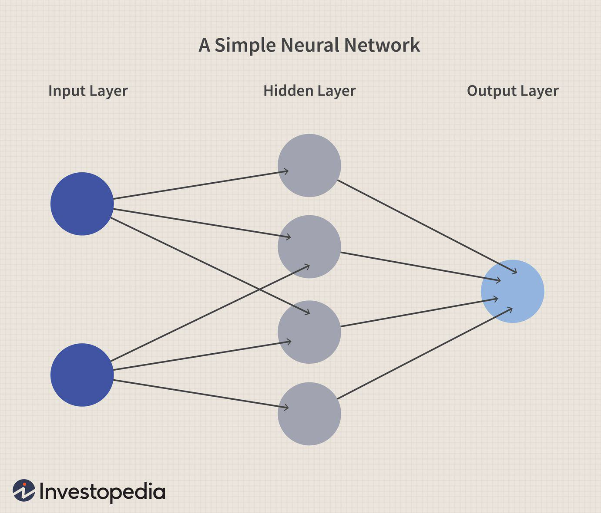

In recent years, neural networks have emerged as a powerful tool in algorithmic trading, fundamentally altering how financial operations function. This transformation is largely due to the capability of neural networks to mimic certain processes of the human brain, allowing traders to forecast profits by analyzing vast amounts of historical data. Traditionally, analysts and traders relied on quantitative models with a predefined set of rules. However, neural networks excel at uncovering complex patterns and relationships within large datasets, which are often missed by conventional statistical methods.

Neural networks, particularly deep learning models, utilize layers of interconnected nodes to process input data, make predictions, and learn from the outcomes. This architecture enables the network to extract and transform features from raw data, thereby enhancing the precision of profit forecasts. For example, a feedforward neural network, which consists of multiple layers in which each neuron applies a linear transformation followed by a non-linear activation function to its inputs, is often used in making predictions about stock prices or identifying trading opportunities.



We are witnessing a paradigm shift in financial operations with neural networks being applied across various sectors, from risk assessment to automated investing. The adaptability of these networks is enhancing not only profitability but also efficiency and risk management. Analysts now leverage recurrent neural networks (RNNs) and long short-term memory networks (LSTMs) to model time series data crucial for understanding market trends, making them invaluable in trading strategies.

This article will explore the role of neural networks in profit forecasting, shedding light on their influence on machine learning algorithms used in trading. It will examine how traders can harness the potential of neural networks to enhance their strategies while also addressing misconceptions and offering insights into the advanced methods that integrate these networks with traditional trading approaches. Through this lens, traders can navigate the evolving landscape of algorithmic trading, striking a balance between modern technology and established financial expertise.

## Table of Contents

## Understanding Neural Networks in Trading

Neural networks have become indispensable in the field of algorithmic trading, owing to their proficiency in processing and analyzing large volumes of financial data. These computational models are adept at identifying intricate patterns within datasets, thereby enabling traders to make data-driven, informed decisions. Unlike traditional statistical methods, neural networks possess the capability to discern both linear and non-linear relationships in data, which is particularly beneficial for navigating the complexities of financial markets.

At their core, neural networks are composed of interconnected layers of nodes, known as neurons, each performing a series of computations. These networks typically consist of an input layer, one or more hidden layers, and an output layer. The hidden layers are critical as they perform the heavy lifting in terms of pattern recognition. Through the process of forward propagation, input data traverses these layers, undergoing transformations based on the weights and biases assigned to each neuron. The output is then refined through backpropagation, an algorithm that iteratively adjusts the weights to minimize error and enhance model accuracy.

In trading, neural networks are commonly employed to refine existing trading strategies rather than generate new ones. By providing precise analyses and evaluations, these models can enhance the efficiency of a strategy by up to 10% in certain cases. For instance, a [neural network](/wiki/neural-network) might be used to predict future price movements based on historical data patterns. While the model does not offer novel trade ideas, it enhances the execution and evaluation of a trader's strategy, allowing for more precise market timing and risk management.

To harness the potential of neural networks, traders must understand how these models operate and integrate them effectively with both traditional and modern trading strategies. This involves selecting appropriate network architectures and algorithms that cater to specific trading requirements. For instance, a recurrent neural network (RNN) may be more suited for time-series data, common in financial markets, due to its ability to remember previous inputs.

Furthermore, continuous learning and adaptation are crucial. The financial markets are dynamic, with patterns and trends evolving rapidly. Thus, the neural networks employed in trading strategies should be regularly trained and updated with the latest data to maintain their predictive accuracy. This evolving nature of financial markets makes it imperative for traders to not only rely on neural networks but also to combine them with their market expertise and intuition. By aligning neural networks with established trading methodologies, traders can leverage these advanced tools to enhance their decision-making process and optimize their trading performance.

## Misconceptions about Neural Networks

Many traders regard neural networks as a mystical solution to trading challenges, often overlooking their real-world limitations and capabilities. While these advanced [machine learning](/wiki/machine-learning) models are powerful tools, they are not magical entities that guarantee instant trading success. Rather, their principal strength lies in their ability to enhance well-formulated trading strategies by providing more nuanced data analysis, pattern recognition, and prediction capabilities.

A common misconception is that neural networks operate independently to deliver profitable trading decisions, yet they essentially rely on the quality and quantity of data input, as well as the efficacy of their algorithmic training processes. Traders must recognize that these networks are designed to model complex non-linear relationships within data, but they do not inherently possess an understanding of market dynamics. Consequently, their effectiveness is contingent upon the alignment with sound trading strategies.

Moreover, neural networks require continual supervision and refinement. The problem with seeing them as standalone solutions is that it can lead to neglect of essential trading components such as risk management, strategy evaluation, and market context analysis. For instance, a neural network trained on historical data from a stable market may not perform well under more volatile conditions, necessitating model recalibration or redesign.

To maximize the utility of neural networks in trading, traders need a comprehensive understanding of both the technology and its limitations. Educational efforts should focus on demystifying neural networks, emphasizing their role as analytical aids rather than ultimate predictors. By building knowledge around these systems, traders can more effectively integrate neural networks into holistic trading strategies, enhancing decision-making processes without relying on them as singular solutions.

## Leveraging Neural Networks to Uncover Opportunities

A significant advantage of neural networks in [algorithmic trading](/wiki/algorithmic-trading) is their capacity to detect non-linear interdependencies within trading data, which often go unnoticed with traditional methods. These interdependencies allow traders to uncover opportunities that might otherwise remain hidden. Unlike conventional forecasting methods that aim to predict future market movements directly, neural networks focus on analyzing historical and real-time data to pinpoint potential areas of interest.

Neural networks accomplish this through their architecture, consisting of interconnected nodes or "neurons," organized in layers. Each layer processes data through weighted connections, with each neuron's output becoming the input for the successive layer. This hierarchical structure enables the network to build complex representations of data, learning intricate patterns over time.

The power of neural networks lies in their ability to model these complex patterns without explicit programming. For instance, they can discern correlations and dependencies among a multitude of financial indicators and price movements to suggest potential trading signals. This is especially valuable in markets where price-action is influenced by numerous simultaneous and dynamic factors.

Mathematically, the learning process in a neural network is driven by minimizing a cost function, commonly done through optimization algorithms like backpropagation combined with gradient descent:

$$

\theta = \theta - \alpha \nabla J(\theta) 
$$

where $\theta$ represents the model parameters, $\alpha$ is the learning rate, and $J(\theta)$ is the cost function.

By using neural networks, traders gain a unique edge. These advanced tools do not deliver explicit trading strategies; instead, they identify potential market opportunities characterized by changes in patterns and trends. This allows traders to leverage such insights to craft or adjust their strategies accordingly. Thus, understanding the underlying data intricacies is crucial.

In practice, here is a simple Python example using a neural network to analyze trading data:

```python
import numpy as np
from sklearn.neural_network import MLPRegressor

# Dummy trading data
X = np.random.rand(100, 5)  # Features: 100 samples, 5 features each
y = np.random.rand(100)     # Target: 100 target values

# Initialize and train the neural network
model = MLPRegressor(hidden_layer_sizes=(50,), max_iter=500, activation='relu', solver='adam')
model.fit(X, y)

# Use the model to predict possible points of interest
predictions = model.predict(X)
```

In conclusion, neural networks foster a deeper understanding of market dynamics by highlighting data's intricate interdependencies, empowering traders to capture elusive opportunities. Leveraging these insights effectively demands a robust comprehension of both data characteristics and neural network capabilities, making them indispensable tools in successful algorithmic trading.

## Optimizing Neural Network Use

Success with neural networks in algorithmic trading hinges on a deep understanding of their architecture and careful management of their operational parameters and data inputs. Neural networks, particularly those used in trading applications, consist of layers of interconnected nodes or neurons, each performing calculations that contribute to the model's overall output. These networks can approximate complex functions, a capability that is crucial for analyzing financial markets. However, their effectiveness is highly sensitive to the choice of parameters and data inputs, necessitating precise calibration to optimize performance.

Regular model updates and retraining are necessary to keep pace with dynamic market conditions. Financial markets are inherently stochastic, which means that patterns and conditions shift over time, rendering static models obsolete. Traders can address this by employing techniques such as online learning, where the model continuously updates with new data, or periodic retraining. This involves selecting recent data that adequately represents current market conditions and utilizing it to refresh the model's parameters.

```python
from sklearn.model_selection import train_test_split
from sklearn.neural_network import MLPRegressor

# Retraining an example neural network model with new data
def retrain_model(new_data, current_model):
    # Splitting new data into features and target
    X_new, y_new = new_data.drop('target', axis=1), new_data['target']

    # Splitting the data further into training and validation sets
    X_train, X_val, y_train, y_val = train_test_split(X_new, y_new, test_size=0.2, random_state=42)

    # Retraining the model
    current_model.fit(X_train, y_train)

    # Evaluate model accuracy on validation
    accuracy = current_model.score(X_val, y_val)

    return current_model, accuracy

# Example of how a new data retraining would be called
model = MLPRegressor(hidden_layer_sizes=(100,), max_iter=500)
data = get_new_market_data()  # Hypothetical function to obtain new market data
model, new_accuracy = retrain_model(data, model)
```

The selection of input data is crucial to optimizing neural network performance. Traders should comprehensively analyze various data sources, including historical price data, trading volumes, and market sentiment indicators, to determine the most relevant inputs for their neural network models. A strategic approach might include feature engineering to transform raw data into forms that better capture influential market factors.

Routine adjustments to model hyperparameters also contribute significantly to sustaining profitability. Hyperparameters such as learning rate, batch size, and the number of hidden layers impact the learning process and must be fine-tuned to achieve optimal model performance. Leveraging grid search or automated tools that assist in hyperparameter optimization can yield improved model accuracy and efficiency.

In conclusion, the effective use of neural networks in trading requires not only technical prowess but also strategic foresight in model management. By regularly updating and optimizing their models, traders can adapt to the fluidity of market environments and maintain a competitive edge.

## Advanced Approaches in Neural Networks

Successful traders recognize that the adaptability of neural networks can be maximized by integrating them with classical trading strategies. This combination allows for the creation of robust systems that are adept at responding to various market conditions. Classical trading strategies, such as moving averages or relative strength index (RSI), provide a foundational understanding of market behavior, which can be further enhanced by the predictive capabilities of neural networks.

One advanced approach involves employing multiple neural networks within a 'committee,' also known as an ensemble. This technique enables traders to address diverse market aspects more effectively. The ensemble method leverages the strengths of different neural network architectures, such as convolutional neural networks (CNNs) for pattern recognition and recurrent neural networks (RNNs) for sequential data analysis. By averaging the outputs or voting on the predictions from these multiple networks, the ensemble can provide more reliable and accurate forecasts.

The integration of neural networks into a cohesive trading framework is supported by sound financial principles and robust risk management strategies. For instance, traders might implement position sizing algorithms that dynamically adjust holdings based on the confidence levels of neural network predictions, thus mitigating potential losses. Moreover, employing stop-loss orders in conjunction with neural network alerts can protect against adverse market movements.

A fortified trading strategy emerges by aligning neural networks with traditional risk assessment tools, such as the Value at Risk (VaR) metric. Traders can use neural networks to estimate the potential future returns distribution, improving the accuracy of VaR calculations. This comprehensive approach ensures that trading decisions are not solely reliant on one methodology but are instead backed by diverse analytical perspectives.

To illustrate, a simple neural network ensemble can be implemented in Python as follows:

```python
from sklearn.ensemble import VotingClassifier
from sklearn.neural_network import MLPClassifier
from sklearn.model_selection import train_test_split
from sklearn.metrics import accuracy_score

# Sample data and target (hypothetical)
X, y = load_financial_data()  # Load your trading data
X_train, X_test, y_train, y_test = train_test_split(X, y, test_size=0.2)

# Define multiple neural network models
nn1 = MLPClassifier(hidden_layer_sizes=(50,), max_iter=1000)
nn2 = MLPClassifier(hidden_layer_sizes=(100,), max_iter=1000)

# Create an ensemble using the Voting Classifier
ensemble = VotingClassifier(estimators=[('nn1', nn1), ('nn2', nn2)], voting='soft')

# Train the ensemble
ensemble.fit(X_train, y_train)

# Evaluate the ensemble's performance
preds = ensemble.predict(X_test)
accuracy = accuracy_score(y_test, preds)
print(f'Ensemble Accuracy: {accuracy:.2f}')
```

Ultimately, combining neural networks with classical trading methodologies within a well-structured framework stands as a highly effective strategy in algorithmic trading. It offers traders a competitive edge while maintaining a disciplined approach to financial markets.

## Conclusion

Neural networks have fundamentally reshaped algorithmic trading by offering traders superior data analysis capabilities. Their ability to process large volumes of historical and real-time data with precision allows for the identification of intricate patterns and market trends, enhancing decision-making processes. This technological advancement has opened new frontiers for traders, making data-driven insights indispensable to develop competitive trading strategies.

However, the integration of neural networks into trading practices should be approached with a balanced perspective. Traders are encouraged to refine and adapt their strategies consistently, ensuring that neural networks serve as valuable tools to complement, rather than replace, established trading methodologies. The successful application of these machine learning systems lies in their capacity to augment human expertise, offering deeper insights that align with tried-and-tested approaches. 

A profitable algorithmic trading strategy thus emerges from a harmonious blend of modern technology and traditional financial acumen. By leveraging the analytical power of neural networks while adhering to sound financial principles and robust risk management practices, traders can navigate the complexities of the financial markets more effectively. This well-rounded approach not only capitalizes on the strengths of both technologies but also mitigates the risks associated with over-reliance on automated systems. The future of trading, therefore, lies in this synergistic integration, driving innovation and profitability in the ever-evolving landscape of financial markets.

## References & Further Reading

[1]: Bergstra, J., Bardenet, R., Bengio, Y., & Kégl, B. (2011). ["Algorithms for Hyper-Parameter Optimization."](https://dl.acm.org/doi/10.5555/2986459.2986743) Advances in Neural Information Processing Systems 24.

[2]: ["Advances in Financial Machine Learning"](https://www.amazon.com/Advances-Financial-Machine-Learning-Marcos/dp/1119482089) by Marcos Lopez de Prado

[3]: ["Evidence-Based Technical Analysis: Applying the Scientific Method and Statistical Inference to Trading Signals"](https://www.amazon.com/Evidence-Based-Technical-Analysis-Scientific-Statistical/dp/0470008741) by David Aronson

[4]: ["Machine Learning for Algorithmic Trading"](https://github.com/stefan-jansen/machine-learning-for-trading) by Stefan Jansen

[5]: ["Quantitative Trading: How to Build Your Own Algorithmic Trading Business"](https://www.amazon.com/Quantitative-Trading-Build-Algorithmic-Business/dp/1119800064) by Ernest P. Chan