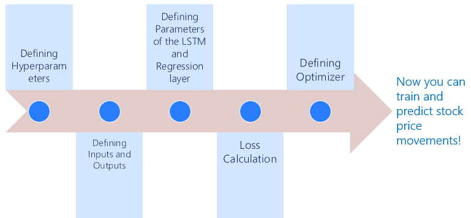

## Table of Contents

## What is profit forecasting and why is it important for businesses?

Profit forecasting is when a business tries to guess how much money they will make in the future. They look at things like how much they think they will sell, how much it will cost to make or buy those things, and other money coming in or going out. This helps them plan for the future and make smart choices about what to do next.

It's really important for businesses to do profit forecasting because it helps them know if they are going to have enough money to keep going. If they think they won't make enough profit, they can change their plans before it's too late. It also helps them decide if they should start new projects or expand their business. Knowing what might happen with their money helps them feel more sure about the future and make better decisions.

## How do neural networks work in simple terms?

Neural networks are like brains for computers. They are made up of many small parts called neurons, which are connected together. When you give the neural network some information, it passes that information from neuron to neuron. Each neuron does a little bit of math on the information it gets, and then sends the result to other neurons. This continues until the information reaches the end of the network, where it gives you an answer.

The cool thing about neural networks is that they can learn. At first, they might not give very good answers, but you can show them the right answers and they will adjust how they do their math. Over time, as you keep showing them examples, they get better and better at figuring things out. This is why neural networks are used for things like recognizing pictures, understanding speech, and even playing games. They learn from experience, just like people do.

## What are the basic steps to implement a neural network for profit forecasting?

To implement a [neural network](/wiki/neural-network) for profit forecasting, you first need to gather and prepare your data. This means collecting information about past sales, costs, and any other factors that might affect your profits, like market trends or seasonal changes. Once you have this data, you need to clean it up and organize it in a way that the neural network can understand. This might involve turning dates into numbers, or making sure all your data is in the same format. After preparing the data, you split it into two parts: one part for training the neural network and another part for testing it to see how well it works.

Next, you set up the neural network itself. This involves deciding how many layers and neurons you want in your network, and what kind of connections you want between them. You then feed the training data into the network and let it learn from it. The network will make guesses about future profits, and you'll tell it how close or far off those guesses are. The network uses this feedback to adjust its calculations, getting better over time. Once the network seems to be making good predictions with the training data, you test it with the other part of your data that it hasn't seen before. If it does well on this test data, you can start using it to forecast profits for your business.

## What kind of data is typically used for profit forecasting with neural networks?

For profit forecasting with neural networks, businesses typically use historical sales data. This includes information on how many products or services were sold in the past, and at what price. They also look at costs, like how much it cost to make or buy the products, and any other expenses like rent or salaries. This data helps the neural network understand patterns in sales and costs over time.

Besides sales and cost data, businesses might also use information about market trends and seasonal changes. For example, they might include data on how the economy is doing, or if there are any big events coming up that could affect sales. This helps the neural network see how outside factors can influence profits. All this data together gives the neural network a full picture of what might happen with profits in the future.

## How can one prepare and preprocess data for neural network-based profit forecasting?

To prepare data for neural network-based profit forecasting, you start by gathering all the information you need. This includes past sales numbers, costs, and other factors like market trends or seasonal changes. You might get this data from your company's records, or from public sources like economic reports. Once you have all your data together, you need to make sure it's clean and organized. This means checking for any missing or wrong numbers, and fixing them. You also need to make sure all your data is in the same format, like turning dates into numbers that the computer can understand easily.

After cleaning and organizing your data, you need to preprocess it so that the neural network can use it. This often involves scaling the data, which means making sure all the numbers are in a similar range. For example, if your sales numbers are in the thousands and your costs are in the hundreds, you might divide them all by their biggest number to make them smaller and easier for the neural network to work with. You also need to split your data into two parts: one for training the neural network, and another for testing it. This helps you see how well the network is learning and predicting. Once your data is preprocessed, you can start feeding it into the neural network to start forecasting profits.

## What are the common neural network architectures used for time series forecasting like profit?

One common neural network architecture for time series forecasting like profit is the Recurrent Neural Network (RNN). RNNs are good at understanding sequences of data because they can remember information from earlier in the sequence. This makes them useful for looking at past sales and costs to predict future profits. A special type of RNN called Long Short-Term Memory (LSTM) is often used because it can remember information for a long time, which is helpful for seeing patterns over many months or years.

Another architecture used for time series forecasting is the Convolutional Neural Network (CNN). While CNNs are often used for images, they can also be used for time series data by treating the data as a one-dimensional sequence. CNNs can find patterns in the data, like how sales might go up and down over time. They are good at [picking](/wiki/asset-class-picking) out important features from the data, which can help in making accurate profit forecasts.

A third option is the combination of different architectures, like using both CNNs and LSTMs together. This is called a hybrid model. By combining the strengths of different types of neural networks, these models can be even better at forecasting profits. They can use the pattern recognition of CNNs and the memory of LSTMs to make very accurate predictions based on past data.

## How do you evaluate the performance of a neural network model in profit forecasting?

To evaluate how well a neural network model works for profit forecasting, you look at how close its guesses are to what really happens. One way to do this is by using something called Mean Absolute Error (MAE). This means you take all the differences between what the model guessed and what actually happened, and then find the average of those differences. If the MAE is small, it means the model is good at guessing profits. Another way is to use Mean Squared Error (MSE), which is similar but squares the differences before averaging them. This makes bigger mistakes count more, so it can show if the model is often way off or just a little off.

Besides these error measures, you can also use something called R-squared (R²). This tells you how much of the changes in profit the model can explain. If R² is close to 1, it means the model is doing a great job at explaining why profits go up or down. If it's close to 0, the model isn't explaining much at all. You can also split your data into two parts: one for training the model and another for testing it. If the model does well on the test data, which it hasn't seen before, you know it's not just memorizing the training data but actually learning to predict profits well.

## What are the challenges and limitations of using neural networks for profit forecasting?

Using neural networks for profit forecasting can be tricky because they need a lot of good data to work well. If you don't have enough past sales and cost information, or if the data is messy or missing important parts, the neural network might not be able to make good guesses about future profits. Also, neural networks can sometimes see patterns that aren't really there, which can lead to wrong predictions. This is called overfitting, and it happens when the network learns the training data too well but can't handle new data it hasn't seen before.

Another challenge is that neural networks can be hard to understand. They work like a black box, meaning you put data in and get a prediction out, but it's tough to see how they made that prediction. This can make it hard to trust the forecasts or explain them to others in the business. Plus, setting up and training a neural network takes a lot of time and computer power, which can be expensive. Even after all that work, the forecasts might not be perfect because the future can be unpredictable, and things like sudden market changes or unexpected events can throw off even the best models.

## How can overfitting be prevented in neural network models for profit forecasting?

Overfitting can be prevented in neural network models for profit forecasting by using a few smart tricks. One way is to use more data for training. The more examples the neural network sees, the better it can learn the real patterns without getting too focused on the little details of the training data. Another trick is to split the data into three parts instead of two: one for training, one for testing, and a third part called validation data. You use the validation data to check how well the model is doing while you're training it, and if it starts doing worse on the validation data, you know it might be overfitting.

Another way to stop overfitting is by using something called regularization. This means you add a little penalty to the neural network's math to stop it from getting too complicated. A simpler model is less likely to overfit. You can also use a technique called early stopping, where you stop training the model before it gets too good at the training data. This helps keep the model from learning the training data too well and not being able to handle new data. By using these methods, you can make sure your neural network model for profit forecasting works well on new data, not just the data it was trained on.

## What advanced techniques can enhance the accuracy of neural network-based profit forecasts?

One way to make neural network-based profit forecasts more accurate is by using something called ensemble methods. This means you train several different neural networks and then combine their guesses to make one final prediction. By doing this, you can get a better overall prediction because the different networks might catch different patterns in the data. Another technique is called transfer learning, where you use a neural network that was already trained on a different but related problem, and then fine-tune it for profit forecasting. This can save time and make the model more accurate because it starts with some knowledge about similar data.

Another advanced technique is to use attention mechanisms, which help the neural network focus on the most important parts of the data when making predictions. For example, it might pay more attention to recent sales data or big changes in costs. This can make the forecasts more accurate by not getting distracted by less important information. You can also use something called feature engineering, where you create new pieces of data from the existing data that might help the neural network make better predictions. For example, you might calculate the average sales over the last three months or look at the difference between sales and costs. By using these advanced techniques, you can improve how well your neural network predicts future profits.

## How do you integrate external economic indicators into a neural network model for improved profit forecasting?

To make profit forecasts better with a neural network, you can add external economic indicators like inflation rates, interest rates, or unemployment numbers. These indicators can help the neural network understand how the economy might affect your business's profits. To do this, you first need to gather this economic data from places like government reports or financial news websites. Once you have it, you clean and organize it just like you did with your sales and cost data. Then, you add these economic indicators to your dataset, making sure they line up with your sales and cost data in time. This way, the neural network can learn how these external factors might change your profits.

After you've added the economic indicators to your data, you train the neural network with this new, bigger dataset. The network will start to see patterns between the economic indicators and your profits. For example, it might learn that when interest rates go up, your profits go down because people buy less. By including these external factors, the neural network can make more accurate guesses about future profits because it has a fuller picture of what might happen. This can help your business plan better and make smarter decisions based on what's going on in the economy.

## What are the latest research trends and future directions in neural network applications for profit forecasting?

The latest research in using neural networks for profit forecasting is focusing on making these models even smarter and more accurate. One big trend is using something called [deep learning](/wiki/deep-learning), which means using neural networks with many layers to find really complex patterns in the data. Researchers are also looking into using more types of data, like social media trends or weather forecasts, to help the neural networks make better guesses about future profits. Another trend is using something called [reinforcement learning](/wiki/reinforcement-learning), where the neural network learns by trying different things and seeing what works best, kind of like playing a game. This can help the model figure out the best way to predict profits over time.

In the future, we might see neural networks that can explain their predictions better, so businesses can understand why the model thinks profits will go up or down. This is called explainable AI, and it's important because it helps people trust the forecasts more. Another future direction is using neural networks to not just predict profits, but also suggest ways to increase them. For example, the model might tell a business to change its prices or run a special sale based on what it thinks will happen in the future. As technology keeps getting better, neural networks will become even more useful for helping businesses plan and make money.

## How can neural networks be leveraged to uncover opportunities?

A significant advantage of neural networks in [algorithmic trading](/wiki/algorithmic-trading) is their capacity to detect non-linear interdependencies within trading data, which often go unnoticed with traditional methods. These interdependencies allow traders to uncover opportunities that might otherwise remain hidden. Unlike conventional forecasting methods that aim to predict future market movements directly, neural networks focus on analyzing historical and real-time data to pinpoint potential areas of interest.

Neural networks accomplish this through their architecture, consisting of interconnected nodes or "neurons," organized in layers. Each layer processes data through weighted connections, with each neuron's output becoming the input for the successive layer. This hierarchical structure enables the network to build complex representations of data, learning intricate patterns over time.

The power of neural networks lies in their ability to model these complex patterns without explicit programming. For instance, they can discern correlations and dependencies among a multitude of financial indicators and price movements to suggest potential trading signals. This is especially valuable in markets where price-action is influenced by numerous simultaneous and dynamic factors.

Mathematically, the learning process in a neural network is driven by minimizing a cost function, commonly done through optimization algorithms like backpropagation combined with gradient descent:

$$

\theta = \theta - \alpha \nabla J(\theta) 
$$

where $\theta$ represents the model parameters, $\alpha$ is the learning rate, and $J(\theta)$ is the cost function.

By using neural networks, traders gain a unique edge. These advanced tools do not deliver explicit trading strategies; instead, they identify potential market opportunities characterized by changes in patterns and trends. This allows traders to leverage such insights to craft or adjust their strategies accordingly. Thus, understanding the underlying data intricacies is crucial.

In practice, here is a simple Python example using a neural network to analyze trading data:

```python
import numpy as np
from sklearn.neural_network import MLPRegressor

# Dummy trading data
X = np.random.rand(100, 5)  # Features: 100 samples, 5 features each
y = np.random.rand(100)     # Target: 100 target values

# Initialize and train the neural network
model = MLPRegressor(hidden_layer_sizes=(50,), max_iter=500, activation='relu', solver='adam')
model.fit(X, y)

# Use the model to predict possible points of interest
predictions = model.predict(X)
```

In conclusion, neural networks foster a deeper understanding of market dynamics by highlighting data's intricate interdependencies, empowering traders to capture elusive opportunities. Leveraging these insights effectively demands a robust comprehension of both data characteristics and neural network capabilities, making them indispensable tools in successful algorithmic trading.

## References & Further Reading

[1]: Bergstra, J., Bardenet, R., Bengio, Y., & Kégl, B. (2011). ["Algorithms for Hyper-Parameter Optimization."](https://dl.acm.org/doi/10.5555/2986459.2986743) Advances in Neural Information Processing Systems 24.

[2]: ["Advances in Financial Machine Learning"](https://www.amazon.com/Advances-Financial-Machine-Learning-Marcos/dp/1119482089) by Marcos Lopez de Prado

[3]: ["Evidence-Based Technical Analysis: Applying the Scientific Method and Statistical Inference to Trading Signals"](https://www.amazon.com/Evidence-Based-Technical-Analysis-Scientific-Statistical/dp/0470008741) by David Aronson

[4]: ["Machine Learning for Algorithmic Trading"](https://github.com/stefan-jansen/machine-learning-for-trading) by Stefan Jansen

[5]: ["Quantitative Trading: How to Build Your Own Algorithmic Trading Business"](https://www.amazon.com/Quantitative-Trading-Build-Algorithmic-Business/dp/1119800064) by Ernest P. Chan