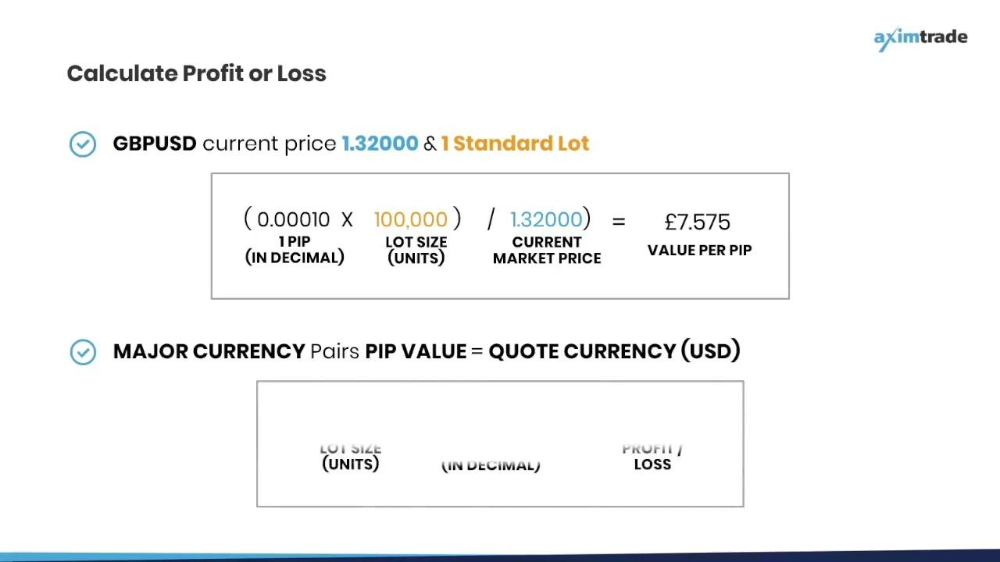

## Table of Contents

## What is currency trading and why is it important to understand profit and loss?

Currency trading, also known as forex trading, is when people buy and sell different countries' money to make a profit. It happens in a big market where money from all over the world is traded. People trade currencies because they think the value of one currency will go up or down compared to another. For example, if someone thinks the US dollar will get stronger against the Japanese yen, they might buy dollars and sell yen, hoping to make money when the exchange rate changes.

Understanding profit and loss is very important in currency trading. When you trade currencies, you want to make more money than you spend. Profit is the money you make when you sell a currency for more than you bought it. Loss is when you sell it for less than you paid. Knowing how to calculate profit and loss helps traders see if they are making good choices. It also helps them manage their money better and decide when to buy or sell. Without understanding profit and loss, it's hard to know if you're doing well in trading.

## How do you calculate profit and loss in a basic currency trade?

To calculate profit and loss in a basic currency trade, you need to know the exchange rate at which you bought the currency and the exchange rate at which you sold it. Let's say you bought 100 Euros with US dollars when the exchange rate was 1 USD = 1.10 EUR. This means you spent 100 / 1.10 = about 90.91 USD to get those 100 Euros. Later, if you sell those 100 Euros back to US dollars at a new exchange rate of 1 USD = 1.15 EUR, you would get 100 * 1.15 = 115 USD. Your profit is the difference between what you got when you sold (115 USD) and what you spent when you bought (90.91 USD), which is 115 - 90.91 = about 24.09 USD.

If the exchange rate goes the other way, you could end up with a loss. Using the same example, if you sell your 100 Euros when the exchange rate drops to 1 USD = 1.05 EUR, you would get 100 * 1.05 = 105 USD. Your loss would be the difference between what you spent when you bought (90.91 USD) and what you got when you sold (105 USD), which is 90.91 - 105 = about -14.09 USD. This means you lost about 14.09 USD. Understanding these calculations helps you see how much money you can make or lose in currency trading.

## What is the concept of pips and how do they relate to profit and loss?

A pip is a small unit used to measure changes in the exchange rate between two currencies. It stands for "percentage in point" or "price interest point." In most currency pairs, a pip is the fourth decimal place of the exchange rate. For example, if the EUR/USD rate moves from 1.1000 to 1.1001, that's a change of one pip. Pips are important because they help traders see how much the value of a currency has changed, which directly affects their profit or loss.

When you trade currencies, the number of pips the exchange rate moves can tell you how much money you've made or lost. If you're trading a standard lot, which is 100,000 units of the base currency, each pip is usually worth about 10 USD in pairs like EUR/USD. So, if the rate moves 50 pips in your favor, you could make 500 USD (50 pips * 10 USD per pip). But if it moves against you, you could lose that amount. Understanding pips helps you keep track of your trades and manage your money better.

## How does leverage affect profit and loss in currency trading?

Leverage in currency trading lets you control a big amount of money with just a small amount of your own money. It's like borrowing money to trade more than you could with just what you have. If you use leverage, a small move in the exchange rate can make you a lot of money because you're trading with more money than you put in. For example, if you use 100:1 leverage, you can control $100,000 with just $1,000. If the exchange rate moves in your favor by just a little bit, your profit can be much bigger than if you didn't use leverage.

But leverage also makes losses bigger. If the exchange rate moves against you, even by a small amount, you can lose a lot more money than you put in because you're trading with borrowed money. Using the same example, if you used 100:1 leverage and the exchange rate moved against you, you could lose more than the $1,000 you put in. That's why it's important to be careful with leverage and understand how it can make both your wins and losses bigger.

## What are the common fees and costs that impact profit and loss calculations?

When you trade currencies, there are some common fees and costs that can affect how much money you make or lose. One big cost is the spread, which is the difference between the price you buy a currency at and the price you sell it at. The spread is like a fee that the broker charges every time you make a trade. Another cost can be commissions, which some brokers charge for each trade you make. These costs can eat into your profits or make your losses bigger.

There are also other costs to think about. If you keep a trade open overnight, you might have to pay something called a swap or rollover fee. This is a charge for holding a position overnight. Sometimes, if you're trading in a different currency than your account is in, you might also have to pay conversion fees when you take money out. All these fees and costs can add up, so it's important to know about them when you're figuring out your profit and loss in currency trading.

## How can you use stop-loss and take-profit orders to manage profit and loss?

Stop-loss and take-profit orders are tools that help you control how much money you make or lose when you trade currencies. A stop-loss order is like a safety net. It tells your broker to sell your currency if the price drops to a certain level. This way, you don't lose more money than you're okay with losing. For example, if you bought Euros at 1.1000 and set a stop-loss at 1.0950, your trade would close automatically if the price falls to 1.0950, helping you limit your loss.

A take-profit order does the opposite. It tells your broker to sell your currency when the price goes up to a level where you're happy with your profit. For instance, if you set a take-profit at 1.1100, your trade would close when the price reaches that level, locking in your profit. Using these orders can help you manage your trades without having to watch the market all the time. They help you stick to your plan and avoid making quick decisions based on emotions.

## What role does the spread play in profit and loss, and how can it be minimized?

The spread is the difference between the price you buy a currency at and the price you sell it at. It's like a fee that you have to pay every time you make a trade. The spread can affect your profit and loss because it's the first thing that gets taken out of any money you make. For example, if you buy a currency at 1.1000 and the sell price is 1.1002, you need the price to move at least 2 pips in your favor just to break even. If the price doesn't move enough to cover the spread, you'll lose money even if the exchange rate moves a little bit in your favor.

To minimize the spread, you can look for brokers that offer lower spreads. Some brokers have fixed spreads, while others have variable spreads that can change based on market conditions. It's a good idea to compare different brokers and see which one offers the best deal for the currencies you want to trade. Another way to minimize the spread is to trade during times when the market is very active, like when major financial centers are open. During these times, spreads are usually smaller because there are more people trading, which makes the market more liquid.

## How do different trading strategies impact profit and loss calculations?

Different trading strategies can change how you make or lose money in currency trading. If you use a [scalping](/wiki/gamma-scalping) strategy, you try to make small profits from quick trades. This means you might make money often, but each time it's just a little bit. Because you're trading a lot, the costs like the spread can add up and eat into your profits. On the other hand, if you use a swing trading strategy, you hold onto your trades for a longer time, hoping the price will move more in your favor. This can mean bigger profits per trade, but you might not make money as often, and you have to wait longer to see if your trade works out.

Another strategy is [trend following](/wiki/trend-following), where you try to make money by following the direction the market is moving. If you get the trend right, you can make good profits because the price can move a lot in one direction. But if you get it wrong, your losses can be big too. Each strategy has its own way of affecting your profit and loss. Some strategies might help you make money more often but in smaller amounts, while others might mean bigger wins or losses but less often. Knowing how each strategy works can help you pick the one that fits best with how much risk you're okay with and how you like to trade.

## What are the tax implications of profit and loss in currency trading?

When you make money or lose money from trading currencies, you have to think about taxes. In many countries, the money you make from trading is seen as income, so you have to pay taxes on it. If you make a profit, you'll have to pay taxes on that profit. The tax rate can be different depending on where you live and how much money you make. If you lose money, you might be able to use those losses to lower the taxes you owe on other income. It's important to keep good records of all your trades so you can report your profits and losses correctly when you do your taxes.

Different countries have different rules about how to handle taxes on currency trading. In some places, you might have to pay a special tax just for trading, while in others, it's treated the same as any other kind of income. It's a good idea to talk to a tax professional who knows about trading to make sure you're doing everything right. They can help you understand what you need to do and make sure you're not paying more taxes than you have to. Keeping track of your profits and losses and understanding the tax laws in your country can help you manage your money better and avoid any surprises when tax time comes around.

## How do you account for currency fluctuations when calculating long-term profit and loss?

When you hold onto a currency trade for a long time, the value of the currencies can change a lot. This is called currency fluctuation. To figure out your profit or loss over a long time, you need to look at how much the exchange rate has changed from when you bought the currency to when you sold it. For example, if you bought Euros with dollars and the Euro got stronger against the dollar over time, you could make a profit when you sell the Euros back. But if the Euro got weaker, you might lose money.

It's important to keep an eye on these changes over time because they can really affect how much money you make or lose. You should also think about other things that can change the value of currencies, like what's happening in the economy of the countries whose money you're trading. Keeping good records and checking the exchange rates regularly can help you understand how currency fluctuations are affecting your long-term trades. This way, you can make better decisions about when to buy or sell to try and make the most money.

## What advanced tools and indicators can be used to predict and manage profit and loss?

To predict and manage profit and loss in currency trading, traders often use advanced tools and indicators. One popular tool is the moving average, which helps you see the average price of a currency over a certain time. This can show you if the price is going up or down over time. Another tool is the Relative Strength Index (RSI), which tells you if a currency is being bought a lot (overbought) or sold a lot (oversold). This can help you decide if it's a good time to buy or sell. There are also tools like Bollinger Bands, which show you how much the price is moving around. If the price is moving a lot, the bands get wider, and if it's not moving much, they get narrower. These tools can help you see patterns and make better guesses about where the price might go next.

Another important set of indicators are the Fibonacci retracement levels, which help you find places where the price might stop going down and start going up again, or vice versa. Traders use these levels to set their stop-loss and take-profit orders. Economic calendars are also very useful because they tell you when important news or reports are coming out that could change currency values. By knowing when these events are happening, you can plan your trades better. Using these tools and indicators together can give you a better idea of what might happen with your trades, helping you manage your profit and loss more effectively.

## How can risk management techniques be optimized to improve profit and loss outcomes in expert trading?

To improve profit and loss outcomes in expert trading, it's important to use good risk management techniques. One way to do this is by setting clear rules for how much money you're willing to risk on each trade. This is called position sizing. By only risking a small part of your money on each trade, you can keep trading even if you lose a few times. Another important technique is diversification, which means not putting all your money into one type of trade. By trading different currencies or using different strategies, you can spread out your risk. This can help you avoid big losses if one trade goes badly.

Another key part of risk management is using stop-loss and take-profit orders smartly. A stop-loss order can help you limit how much money you lose on a trade, while a take-profit order can help you lock in your profits. It's also helpful to use tools like trailing stops, which move with the price and can help you make more money if the price keeps going in your favor. Lastly, always keep learning and adjusting your strategies based on what's happening in the market. By staying flexible and using these risk management techniques, you can improve your chances of making more money and losing less in your trading.

## What is the understanding of profit and loss in currency trading?

Currency trading, commonly referred to as forex trading, involves the buying and selling of currencies to profit from fluctuations in exchange rates. In forex trading, profits and losses can be categorized as realized and unrealized. Realized profits or losses occur when a position is closed and the financial impact is recorded. Conversely, unrealized profits or losses represent the potential gains or losses of an open position based on the current market price compared to the entry price.

A key element in understanding forex trading is the effect of currency value fluctuations on trading outcomes and margin balances. Currency exchange rates can be highly volatile, influenced by economic indicators, geopolitical events, and market sentiment. This [volatility](/wiki/volatility-trading-strategies) directly affects the trader's account balance, particularly for leveraged trades that can magnify both profits and losses.

Calculating profit and loss in [forex](/wiki/forex-system) trading hinges on pip movements. A pip, or "percentage in point," is the smallest price move that a given exchange rate can make based on market convention. For most currency pairs, a pip is a movement at the fourth decimal place, although it varies for pairs involving the Japanese yen, where it is the second decimal place. For instance, if a trader buys EUR/USD at 1.1000 and sells at 1.1050, the change is 50 pips.

To compute the profit or loss from a trade, the following general formula is used:

$$
\text{Profit/Loss} = (\text{Sell Price} - \text{Buy Price}) \times \text{Position Size}
$$

For a long position, where the trader buys a currency pair expecting the base currency to strengthen, the profit is realized if the sell price is higher than the buy price. Conversely, in a short position, where the trader sells a currency pair, the profit is made if the sell price is lower than the buy price at the time of closing the position.

### Example Calculations:

1. **Long Position**: Suppose a trader buys 100,000 units of EUR/USD at 1.1000. The trader later sells at 1.1050. The profit in pips is calculated as:

   \[ \text{Profit in Pips} = 1.1050 - 1.1000 = 0.0050 \text{ or } 50 \text{ pips}
$$

   Using the formula, the profit is:

   \[ \text{Profit} = 50 \text{ pips} \times 100,000 = \$500 \text{ (assuming standard lot size and account denomination in USD)}
$$

2. **Short Position**: Alternatively, consider a trader who sells 50,000 units of GBP/USD at 1.3000 and buys back at 1.2950. The profit in pips is:

   \[ \text{Profit in Pips} = 1.3000 - 1.2950 = 0.0050 \text{ or } 50 \text{ pips}
$$

   Therefore, the profit is:

   \[ \text{Profit} = 50 \text{ pips} \times 50,000 = \$250 \text{ (assuming a mini lot and account denomination in USD)}
$$

In conclusion, mastering how profits and losses are calculated in forex trading requires a solid grasp of pip valuation and the influence of leverage. Accurate calculations are essential for effective risk management and to strategize future trades. Understanding these fundamentals contributes significantly to a trader's ability to make informed decisions in the dynamic forex market environment.

## References & Further Reading

[1]: ["Algorithms for Hyper-Parameter Optimization"](https://dl.acm.org/doi/10.5555/2986459.2986743) by Bergstra, J., Bardenet, R., Bengio, Y., & Kégl, B. Advances in Neural Information Processing Systems 24.

[2]: ["Advances in Financial Machine Learning"](https://www.amazon.com/Advances-Financial-Machine-Learning-Marcos/dp/1119482089) by Marcos Lopez de Prado.

[3]: ["Evidence-Based Technical Analysis: Applying the Scientific Method and Statistical Inference to Trading Signals"](https://www.amazon.com/Evidence-Based-Technical-Analysis-Scientific-Statistical/dp/0470008741) by David Aronson.

[4]: ["Machine Learning for Algorithmic Trading"](https://github.com/PacktPublishing/Machine-Learning-for-Algorithmic-Trading-Second-Edition) by Stefan Jansen.

[5]: ["Quantitative Trading: How to Build Your Own Algorithmic Trading Business"](https://books.google.com/books/about/Quantitative_Trading.html?id=j70yEAAAQBAJ) by Ernest P. Chan.