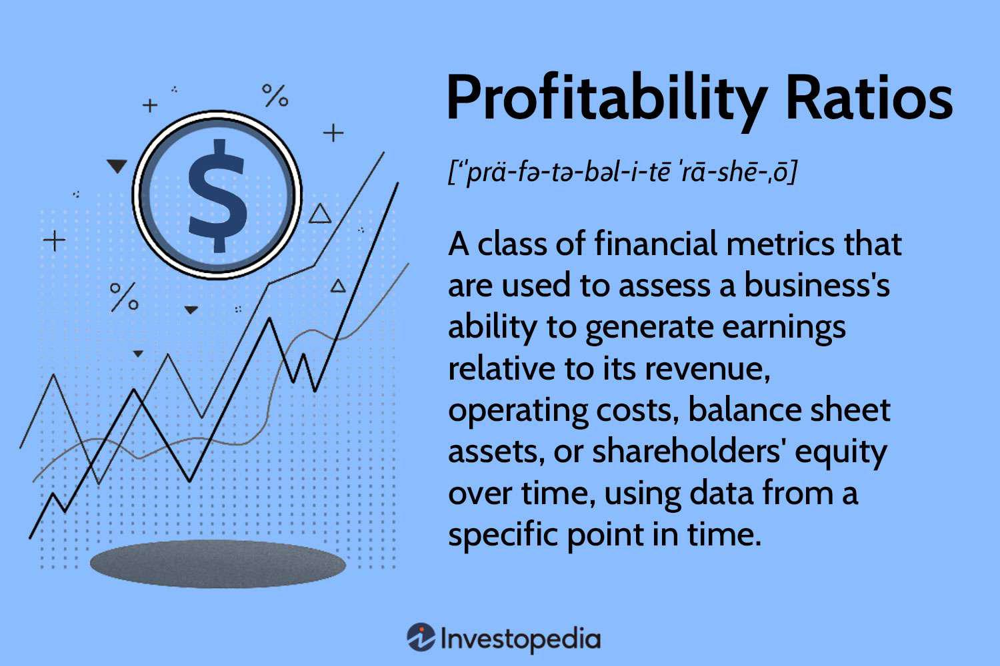

In the ever-evolving landscape of financial markets, both individual and institutional investors continually seek ways to enhance their trading efficiency and profitability. One of the essential metrics in evaluating investment success is the profit-loss ratio, which provides insights into the gains and losses from trading strategies. This article discusses the concept of the profit-loss ratio, its importance in financial analysis, and its crucial role in algorithmic trading.

The profit-loss ratio is a quantitative metric that offers a clear comparison between the profits earned and the losses incurred during trading activities. It is calculated by dividing the total profits by the total losses, serving as a straightforward indication of trading performance. A higher profit-loss ratio implies that the profits significantly overshadow the losses, indicating that the trading practices being employed are effective.



Understanding and optimizing the profit-loss ratio is vital for stakeholders in financial markets. It allows them to systematically gauge their investment strategies, sift through historical trading data, and identify patterns that denote success or need refinement. For algorithmic traders, the profit-loss ratio acts as a critical variable that can be monitored and adjusted in real-time to enhance trading outcomes.

In algorithmic trading, the profit-loss ratio aids in stress-testing trading algorithms across different market scenarios. Continuous analysis of this ratio is indispensable for refining algorithmic strategies, ensuring they can perform well in fluctuating market dynamics.

Improving the profit-loss ratio entails employing robust risk management techniques such as stop-loss orders and optimizing position sizes. Furthermore, incorporating advanced technologies like AI and machine learning has the potential to significantly elevate the capabilities of traders in analyzing and fine-tuning this ratio for superior trading results. As financial markets continue to evolve, maintaining a keen understanding of metrics like the profit-loss ratio will be crucial for securing successful investment outcomes.

## Table of Contents

## Understanding the Profit-Loss Ratio

The profit-loss ratio is a key financial metric that measures the efficiency of a trading strategy by comparing the total profits to total losses over a specific trading period. This ratio is calculated by dividing the total profits by the total losses. Mathematically, it can be expressed as:

$$
\text{Profit-Loss Ratio} = \frac{\text{Total Profits}}{\text{Total Losses}}
$$

This straightforward calculation provides traders with a clear indication of the performance of their trading strategies. A profit-loss ratio greater than one suggests that profits exceed losses, indicating effective trading practices. Conversely, a ratio less than one implies that losses outweigh gains, signaling the need for reassessment of the trading approach. 

The utility of the profit-loss ratio lies in its simplicity and directness, offering an easily interpretable measure that doesn't require complex computations or statistical analysis. By consistently monitoring this ratio, traders can quickly ascertain whether their strategies are yielding favorable outcomes or if adjustments are necessary. In environments where swift decision-making is crucial, such as high-frequency trading, maintaining a high profit-loss ratio is a benchmark for success.

## The Role of Profit-Loss Ratio in Investment Analysis

In investment analysis, the profit-loss ratio is a pivotal metric for assessing the success of a trading strategy. By comparing the total profits generated to total losses incurred over a given period, this ratio provides a clear lens through which investors can measure the effectiveness of their trades. A high profit-loss ratio signifies that an investor's strategy is yielding significantly more in profits than it is losing in losses, indicating a potentially successful trading approach. 

Mathematically, the profit-loss ratio can be expressed as:

$$
\text{Profit-Loss Ratio} = \frac{\text{Total Profits}}{\text{Total Losses}}
$$

By analyzing this ratio, investors can trace patterns in past trading outcomes. This process involves identifying which strategies have consistently produced profits and determining which approaches require adjustments. For instance, if a trading strategy consistently leads to a higher profit-loss ratio, it suggests that the strategy is successful and could be expanded upon.

The utility of the profit-loss ratio is further enhanced when used in conjunction with other financial indicators. For example, Return on Investment (ROI) calculates the percentage of return on a particular investment relative to its cost, providing another dimension of profitability. Meanwhile, the Sharpe ratio measures the return of an investment compared to its risk, offering insights into the risk-adjusted performance. These indicators, alongside the profit-loss ratio, create a robust framework for evaluating the overall performance and sustainability of an investment strategy.

In sum, the profit-loss ratio is more than a mere statistical figure; it is a fundamental tool that, when integrated with other financial metrics, provides a comprehensive view of an investment’s performance. This analytical approach empowers investors to make informed decisions and optimize their trading strategies effectively.

## Profit-Loss Ratio in Algorithmic Trading

Algorithmic trading relies heavily on the application of sophisticated financial metrics to continuously refine strategies and enhance trading efficiency. The profit-loss ratio is one of these pivotal metrics, acting as a barometer for profitability and risk management. This ratio provides algorithmic traders with the means to dynamically adjust their algorithms to optimize outcomes in real-time.

The profit-loss ratio is essentially a comparison of total profits to total losses achieved over a specific trading period. It indicates how effectively a trading strategy is performing by highlighting whether profits are substantially exceeding losses. In [algorithmic trading](/wiki/algorithmic-trading), this ratio is critical for several reasons. First, it allows traders to continuously evaluate and modify trading algorithms. Algorithms can be fine-tuned to react to market fluctuations by increasing or decreasing the aggressiveness of trades based on the profit-loss ratio. 

Real-time analysis of the profit-loss ratio is indispensable. Algorithms should be designed to instantly process this ratio and adjust parameters such as entry and [exit](/wiki/exit-strategy) points, order sizes, and risk limits. For instance, in a Python-based trading algorithm, traders can implement a system where the algorithm monitors the profit-loss ratio continuously using real-time financial data. If the ratio falls below a predetermined threshold, the algorithm can automatically scale back trading activity to minimize potential losses.

Here's an example of how such an implementation might look in Python:

```python
def adjust_strategy(profit_loss_ratio, threshold):
    if profit_loss_ratio < threshold:
        return "Scale back trading activity"
    else:
        return "Maintain or increase trading activity"

# Example usage
profit_loss_ratio = calculate_profit_loss_ratio()
threshold = 1.5
strategy_decision = adjust_strategy(profit_loss_ratio, threshold)
print(strategy_decision)
```

Moreover, back-testing is a crucial tool in algorithmic trading, allowing strategies to be evaluated against historical data. By testing various scenarios and conditions, traders can ascertain how the profit-loss ratio performs under different market influences. This back-testing can reveal whether an algorithmic strategy would maintain a desirable profit-loss ratio over time, particularly during market anomalies.

In summary, the profit-loss ratio serves as a critical metric for algorithmic traders, providing a quantitative measure that helps to optimize trading strategies in real-time and under varying market conditions. Through real-time monitoring and back-testing, traders can ensure their algorithms remain tuned for achieving optimal performance and managing risk effectively.

## Enhancing Profit-Loss Ratio: Strategies and Techniques

To improve the profit-loss ratio, traders must employ various strategies and techniques that focus on risk management. A key practice is the use of stop-loss orders, which are designed to limit an investor's loss on a position. By setting a predetermined price at which the security will be sold, traders can prevent excessive losses. Optimal position sizing, another fundamental technique, involves determining the proper amount of capital to allocate to each trade. This strategy helps in balancing risk and potential reward, preventing overexposure to any single trade.

Diversification plays a vital role in maintaining a healthy profit-loss ratio. By spreading investments across various asset classes or sectors, traders can reduce the impact of a poor-performing asset on the overall portfolio. This approach ensures that not all investments are negatively affected by market [volatility](/wiki/volatility-trading-strategies) or sector-specific downturns. Furthermore, the continuous monitoring of market conditions enables traders to adapt their strategies according to changing market dynamics, improving the likelihood of maintaining a favorable profit-loss ratio.

Technological advancements, particularly in [artificial intelligence](/wiki/ai-artificial-intelligence) (AI) and [machine learning](/wiki/machine-learning), have greatly enhanced the capabilities for analyzing and optimizing the profit-loss ratio. AI and machine learning algorithms can process large volumes of market data swiftly and identify patterns and trends that might not be immediately apparent to human traders. These technologies allow for the development of smarter trading systems that can adjust strategies in real-time, optimizing the profit-loss ratio by strategic decision-making based on predictive analytics.

For instance, machine learning algorithms can predict possible price movements by analyzing historical price data and market conditions. Here is a simple example of how machine learning might be used in Python to enhance trading strategies:

```python
from sklearn.model_selection import train_test_split
from sklearn.ensemble import RandomForestRegressor
import numpy as np

# Sample feature set and target variables
features = np.array([[1, 2], [1.5, 2.5], [2, 3], [2.5, 3.5], [3, 4]])
targets = np.array([1, 1.5, 2, 2.5, 3])

# Splitting data into training and test sets
X_train, X_test, y_train, y_test = train_test_split(features, targets, test_size=0.2, random_state=42)

# Random forest regressor
model = RandomForestRegressor(n_estimators=100, random_state=42)
model.fit(X_train, y_train)

# Predicting future outcomes
predictions = model.predict(X_test)
print("Predicted values:", predictions)
```

In this example, a Random Forest Regressor is used to predict potential future outcomes based on historical features. Such predictive analytics can be used to inform trading decisions, ultimately contributing to an improved profit-loss ratio by identifying high-probability trade setups and optimizing risk-reward scenarios.

## Conclusion

The profit-loss ratio transcends being a mere statistical measure, playing a crucial role in effective financial analysis and refining trading strategies. This ratio, determined by dividing total profits by total losses, serves as a vital tool for traders who aim to refine their strategies and enhance their investment performance. By focusing on this metric, traders can gain valuable insights into the effectiveness of their trades, allowing them to adjust their approaches to achieve better outcomes.

Understanding and utilizing the profit-loss ratio empowers traders to make informed decisions, thereby maximizing their returns and minimizing potential downsides. The ratio offers a straightforward but powerful way to assess the viability of trading strategies over time. A consistently high profit-loss ratio might indicate a successful strategy, whereas a low ratio could signal the need for strategy reevaluation.

With the continuous evolution of financial markets, keeping abreast of metrics like the profit-loss ratio becomes essential for successfully navigating the complexities of modern trading. As markets become more sophisticated, traders can no longer rely solely on intuition or basic analyses. Advanced metrics and techniques, like those utilized in algorithmic trading, require keen attention to such ratios to fine-tune performance.

In conclusion, the profit-loss ratio is a fundamental component of trading success. By leveraging this ratio, along with other financial indicators, traders can adapt to shifting market conditions, optimizing their strategies and investment returns. The dynamic nature of financial markets underscores the need for traders to remain vigilant and knowledgeable about essential metrics, ensuring they stay competitive in an ever-changing landscape.

## References & Further Reading

[1]: Bergstra, J., Bardenet, R., Bengio, Y., & Kégl, B. (2011). ["Algorithms for Hyper-Parameter Optimization."](https://dl.acm.org/doi/10.5555/2986459.2986743) Advances in Neural Information Processing Systems 24.

[2]: ["Advances in Financial Machine Learning"](https://www.amazon.com/Advances-Financial-Machine-Learning-Marcos/dp/1119482089) by Marcos Lopez de Prado

[3]: ["Evidence-Based Technical Analysis: Applying the Scientific Method and Statistical Inference to Trading Signals"](https://www.amazon.com/Evidence-Based-Technical-Analysis-Scientific-Statistical/dp/0470008741) by David Aronson

[4]: ["Machine Learning for Algorithmic Trading"](https://github.com/stefan-jansen/machine-learning-for-trading) by Stefan Jansen

[5]: ["Quantitative Trading: How to Build Your Own Algorithmic Trading Business"](https://github.com/LucindaYa/quant-resources/blob/master/Quantitative%20Trading%20How%20to%20Build%20Your%20Own%20Algorithmic%20Trading%20Business.pdf) by Ernest P. Chan