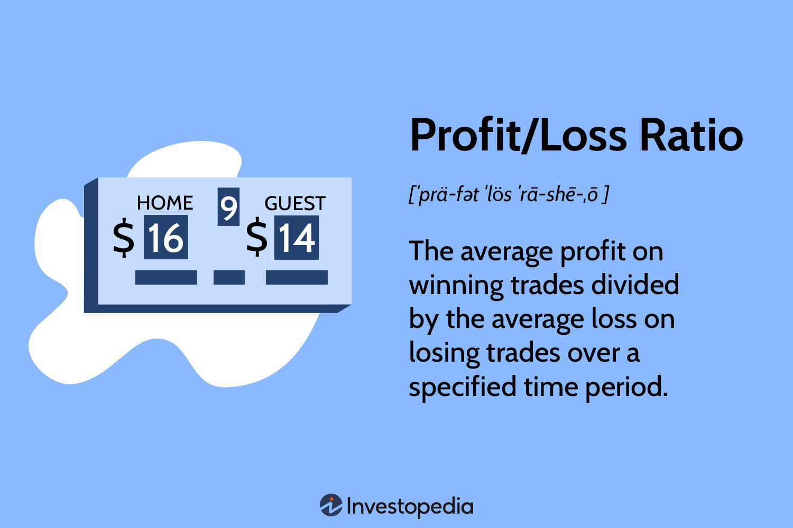

## Table of Contents

## What is the basic definition of profit and loss?

Profit is the money you earn after selling something for more than it cost you to make or buy it. For example, if you buy a toy for $5 and sell it for $10, your profit is $5. This extra money is what businesses aim to make to stay successful and grow. Profit is important because it shows that a business is doing well and can cover its costs, pay its workers, and invest in new things.

Loss, on the other hand, is when you spend more money to make or buy something than what you get back from selling it. Using the same toy example, if you buy it for $10 and can only sell it for $5, you lose $5. Losses can happen for many reasons, like not selling enough items or having to sell them at a lower price. When a business keeps losing money, it might struggle to stay open and may need to find ways to cut costs or increase sales.

## How do you calculate the profit or loss from a transaction?

To calculate profit or loss from a transaction, you need to know two main things: the cost of the item and the selling price of the item. If you sell the item for more than it cost you, you make a profit. To find out how much profit you made, subtract the cost from the selling price. For example, if you bought a toy for $5 and sold it for $10, you would subtract $5 from $10 to get a profit of $5.

On the other hand, if you sell the item for less than it cost you, you have a loss. To figure out the loss, you subtract the selling price from the cost. Using the same toy example, if you bought it for $10 but could only sell it for $5, you would subtract $5 from $10 to get a loss of $5. Understanding these calculations helps you know if a transaction was good for your business or not.

## What is the profit and loss ratio and how is it calculated?

The profit and loss ratio, often called the P&L ratio, is a way to see how much money you make compared to how much you lose. It helps you understand if your business is doing well by looking at all your profits and losses together. To find the P&L ratio, you need to know the total amount of money you made from profits and the total amount of money you lost. 

To calculate the P&L ratio, you divide the total profit by the total loss. For example, if you made $100 in profit and lost $50, you would divide $100 by $50 to get a ratio of 2. This means you made twice as much money as you lost. A ratio higher than 1 is good because it shows you're making more money than you're losing. If the ratio is less than 1, it means you're losing more money than you're making, which can be a warning sign for your business.

## Why is understanding the profit and loss ratio important for business?

Understanding the profit and loss ratio is important for business because it shows how well the business is doing. If the ratio is more than 1, it means the business is making more money than it's losing, which is a good sign. This can help business owners feel confident about their choices and see if their strategies are working. It also helps them know if they can spend more money on new things or if they need to save more.

If the ratio is less than 1, it means the business is losing more money than it's making. This can be a warning sign that the business needs to change something. Maybe they need to sell things for more money, or maybe they need to find a way to spend less. By looking at the profit and loss ratio, business owners can make better choices to help their business do better in the future.

## Can you explain the difference between gross profit and net profit?

Gross profit is the money you make after you sell something, but before you pay for other things like rent or worker's salaries. It's like the first step in figuring out how much money your business is making. To find gross profit, you take the money you got from selling your product and subtract how much it cost you to make or buy that product. For example, if you sell a toy for $10 and it cost you $5 to buy, your gross profit is $5.

Net profit is different because it's what's left after you pay for everything. It's the final amount of money you get to keep after all the bills are paid. To find net profit, you start with your gross profit and then subtract all other costs, like rent, salaries, and taxes. Using the same toy example, if your gross profit was $5 and you had to pay $2 in other costs, your net profit would be $3. Net profit is important because it shows if your business is really making money after all expenses.

## How does the profit and loss ratio impact financial decision-making?

The profit and loss ratio helps business owners make smart choices about money. When the ratio is more than 1, it means the business is making more money than it's losing. This is good news! It tells the owner that they can spend more on new things like machines or hiring more workers. It also means they might want to keep doing what they're doing because it's working well.

On the other hand, if the ratio is less than 1, it's a warning sign. It means the business is losing more money than it's making. This tells the owner they need to be careful with spending and might need to find ways to cut costs or sell things for more money. By looking at the profit and loss ratio, owners can make better decisions to help their business stay healthy and grow.

## What are some common strategies to improve the profit and loss ratio?

One way to make the profit and loss ratio better is by increasing sales. This can be done by selling more of what you already have or by finding new things to sell. You can also try to sell things for a higher price if people are willing to pay more. Another idea is to advertise more so more people know about your products. By selling more and getting more money from each sale, you can make your profits bigger and improve the ratio.

Another strategy is to cut down on costs. This means spending less money on making or buying things. You can look for cheaper materials or find ways to make things faster and with less waste. You can also save money by spending less on things like rent or electricity. When you spend less, you keep more of the money you make from sales, which helps your profits grow and makes the profit and loss ratio better.

Sometimes, it's a good idea to do both things at once: sell more and spend less. By working on both sides of the business, you can make your profits much bigger compared to your losses. This helps make the profit and loss ratio as good as it can be, which is important for a healthy and growing business.

## How can seasonal variations affect the profit and loss ratio?

Seasonal variations can change how much money a business makes and spends, which can affect the profit and loss ratio. During busy seasons, like holidays or summer, businesses might sell a lot more. This means they make more money, and if they keep their costs the same, their profits go up. A higher profit means the profit and loss ratio gets better because they're making more than they're losing. But, they might also have to spend more money during these times, like hiring extra workers or buying more supplies, which can eat into the profits.

On the other hand, during slow seasons, like after the holidays or in winter, businesses might not sell as much. This can lead to less money coming in, and if the costs stay the same, the profits go down. A lower profit means the profit and loss ratio gets worse because they're losing more compared to what they're making. To deal with this, businesses might need to find ways to cut costs or try to boost sales during these slow times to keep their profit and loss ratio healthy.

## What role does cost management play in optimizing the profit and loss ratio?

Cost management is super important for making the profit and loss ratio better. When a business keeps an eye on how much they're spending, they can find ways to save money. This means they can spend less on things like materials, rent, or electricity. If they can lower these costs, they keep more of the money they make from selling their stuff. This makes their profits bigger, and a bigger profit means a better profit and loss ratio.

Sometimes, businesses can also use cost management to make their products cheaper to make. This can let them sell things for less money, which might help them sell more. More sales mean more money coming in, which can also help improve the profit and loss ratio. By being smart about costs, businesses can make sure they're making more money than they're losing, which is key to having a healthy profit and loss ratio.

## How can advanced analytics be used to predict and enhance profit and loss ratios?

Advanced analytics can help businesses predict and improve their profit and loss ratios by looking at lots of data. This data can tell them about things like what customers like to buy, how much they're willing to pay, and when they buy the most. By studying this information, businesses can figure out the best times to sell things or when to offer discounts. They can also see if certain products are making more money than others and focus on selling those. This helps them make more money and keep their costs down, which makes the profit and loss ratio better.

Another way advanced analytics helps is by finding patterns that people might not see just by looking at numbers. For example, it can show if there are certain times of the year when costs go up, so businesses can plan to spend less during those times. It can also help predict how much they might sell in the future, so they can buy the right amount of materials and not waste money. By using this kind of information, businesses can make smarter choices about what to sell, how much to spend, and how to keep their profits high and their losses low.

## What are the industry-specific benchmarks for profit and loss ratios?

Different industries have their own benchmarks for profit and loss ratios because what's normal in one industry might not be the same in another. For example, in the retail industry, a good profit and loss ratio might be around 2 or higher. This means that for every dollar they lose, they make at least two dollars in profit. Retail businesses often have tight margins, so they need to sell a lot of things to keep their ratio high. In contrast, industries like software or technology might have much higher ratios, sometimes reaching 5 or more, because once a product is made, it can be sold many times without costing much more to produce.

In the restaurant industry, a good profit and loss ratio might be around 1.5 to 2. Restaurants have to deal with a lot of costs like food, labor, and rent, so their profits can be smaller compared to their losses. Manufacturing businesses might aim for a ratio of 2 to 3, depending on what they make. They have to spend a lot on materials and machines, but if they can sell their products for a good price, they can keep their ratio healthy. Knowing these benchmarks helps businesses see if they're doing well compared to others in their industry and find ways to do better.

## How do macroeconomic factors influence the profit and loss ratio of a company?

Macroeconomic factors like inflation, interest rates, and economic growth can really change a company's profit and loss ratio. When inflation goes up, it means things cost more money. This can make it harder for a company to keep their costs down, which might lead to smaller profits or bigger losses. If interest rates go up, it can be more expensive for a company to borrow money, which can also hurt their profits. On the other hand, if the economy is growing, people might have more money to spend, which can help a company sell more and make bigger profits.

These big economic changes can also affect how much people want to buy certain things. For example, if the economy is doing badly, people might not want to spend as much money on things they don't need, which can hurt companies that sell those things. But if the economy is doing well, people might be more willing to spend, which can help companies make more money. By keeping an eye on these macroeconomic factors, a company can try to plan ahead and make choices that help keep their profit and loss ratio healthy.

## What is the Profit-Loss Ratio and How Can It Be Understood?

The profit-loss ratio is a critical measure employed by traders to evaluate the profitability of their investment decisions. It is calculated as the ratio of total profits to total losses. Mathematically, this can be represented as:

$$
\text{Profit-Loss Ratio} = \frac{\text{Total Profits}}{\text{Total Losses}}
$$

This ratio provides an indication of expected profit for each unit of loss incurred. A higher profit-loss ratio typically suggests a more effective trading strategy, indicating that profits effectively outweigh the incurred losses. Conversely, a lower ratio could prompt traders to reassess and modify their strategies to enhance performance.

Understanding the significance of the profit-loss ratio is essential for managing risk and evaluating the potential success of future trades. It allows traders to quantify their performance and make informed decisions about continuing or altering their current trading approach. This ratio serves as a straightforward benchmark, enabling investors to gauge whether their current strategies are yielding satisfactory returns against their risks.

Multiple factors can influence the profit-loss ratio, including market conditions, trade execution, and individual strategy variables. Fluctuations in market trends can impact profits and losses, thus affecting the ratio. Efficient trade execution also plays a pivotal role, as slippage or delays can result in unintended losses or reduced profits. Moreover, different strategic variables, such as investment duration, asset selection, and risk appetite, can also affect the ratio.

For instance, during volatile market conditions, traders might experience increased losses, which could reduce the profit-loss ratio. Conversely, a robust trading strategy that carefully manages risk with tools such as stop-loss orders or strategic diversification can help maintain, or even improve, the ratio by stabilizing losses against achieved profits.

In [algorithmic trading](/wiki/algorithmic-trading), where trades are executed at high speed and [volume](/wiki/volume-trading-strategy), the profit-loss ratio becomes even more vital as traders continuously assess and refine algorithms to ensure they remain profitable while effectively managing risks. Thus, understanding and maintaining an optimal profit-loss ratio is of paramount importance in developing a successful trading strategy.

## How can we enhance the profit-loss ratio using various strategies and techniques?

To improve the profit-loss ratio, traders can adopt various strategies and techniques aimed at optimizing both profit potential and risk exposure. One fundamental approach involves rigorous risk management practices. Implementing stop-loss limits is a primary method by which traders can safeguard their investments. A stop-loss order automatically sells a security when it reaches a predetermined price, thus limiting potential losses. Position sizing is another vital technique, determining the amount of capital allocated to a particular trade. By calculating position size based on risk tolerance and account size, traders can prevent disproportionate losses. A simple formula to calculate position size is:

$$
\text{Position Size} = \frac{\text{Risk Per Trade}}{\text{Stop Loss in Pips}}
$$

Diversification provides another layer of security by spreading investments across varying asset classes and market sectors. This approach minimizes the impact of a single underperforming asset on the overall portfolio, effectively balancing potential losses with gains from other investments. 

Consistent performance reviews serve as a crucial tool for maintaining a healthy profit-loss ratio. By systematically analyzing trading results, traders can identify patterns or changes in market conditions that necessitate strategy adjustments. Such reviews help in fine-tuning trading algorithms and decision-making frameworks to adapt to evolving market dynamics.

Advanced data analytics have become instrumental in providing traders with actionable insights. By scrutinizing large datasets, traders can uncover trends, forecast market movements, and make informed decisions that enhance profitability. Machine learning and [artificial intelligence](/wiki/ai-artificial-intelligence) are increasingly being employed to analyze historical data, refine trading algorithms, and predict future price movements.

Continuous education and adaptation are emphasized as essential components of successful trading. As markets are perpetually in flux, traders must stay abreast of new tools, technologies, and strategies. This commitment to learning enables traders to evolve their strategies, ensuring they remain effective in achieving an optimal profit-loss ratio.

These techniques, when integrated into a comprehensive trading strategy, enable traders to optimize their profit-loss ratios efficiently, thereby enhancing overall performance in the financial markets.

## References & Further Reading

[1]: Bergstra, J., Bardenet, R., Bengio, Y., & Kégl, B. (2011). ["Algorithms for Hyper-Parameter Optimization."](https://papers.nips.cc/paper/4443-algorithms-for-hyper-parameter-optimization) Advances in Neural Information Processing Systems 24.

[2]: ["Advances in Financial Machine Learning"](https://www.amazon.com/Advances-Financial-Machine-Learning-Marcos/dp/1119482089) by Marcos Lopez de Prado

[3]: ["Evidence-Based Technical Analysis: Applying the Scientific Method and Statistical Inference to Trading Signals"](https://www.amazon.com/Evidence-Based-Technical-Analysis-Scientific-Statistical/dp/0470008741) by David Aronson

[4]: ["Machine Learning for Algorithmic Trading"](https://github.com/stefan-jansen/machine-learning-for-trading) by Stefan Jansen

[5]: ["Quantitative Trading: How to Build Your Own Algorithmic Trading Business"](https://www.amazon.com/Quantitative-Trading-Build-Algorithmic-Business/dp/1119800064) by Ernest P. Chan