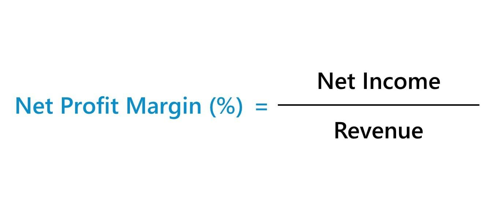

Algorithmic trading, known for its ability to conduct rapid, complex trades, is reshaping how financial markets operate by utilizing sophisticated technology. This trading method employs algorithms to analyze market variables, execute trades, and manage portfolios with unparalleled speed and accuracy. Central to the success of these strategies is the comprehension and application of financial metrics. Among these, the understanding of profit margins is paramount.

Profit margins are financial ratios that measure the degree to which a company or trading strategy makes money. These margins exemplify the balance between cost efficiency and revenue generation, serving as a fundamental indicator of financial health. For algorithmic traders, an acute awareness of these margins can significantly impact the optimization of their strategies.



This article intends to connect the dots between profit margin analysis and enhanced trading profitability. By incorporating these financial metrics, traders can fine-tune their algorithms to improve decision-making processes, ultimately aiming to maximize revenues. The pursuit of integrating detailed financial analyses into trading offers opportunities for precision-driven trading approaches that adapt swiftly to ever-changing market dynamics.

## Table of Contents

## Understanding Profit Margins in Business

Profit margins provide a clear view of a company's ability to generate profit relative to its revenue, thereby offering insight into both profitability and operational efficiency. They represent the percentage of revenue that exceeds the costs associated with making a product or providing a service. Evaluating profit margins involves understanding three major types: gross, operating, and net profit margins—each serving as a key indicator of different aspects of financial health.

**Gross Profit Margin**

The gross profit margin is a financial metric that assesses a company's basic operational efficiency. It measures how well a company can generate revenue from its direct costs of production, known as the cost of goods sold (COGS). The formula for calculating the gross profit margin is:

$$
\text{Gross Profit Margin} = \left( \frac{\text{Revenue} - \text{COGS}}{\text{Revenue}} \right) \times 100
$$

This metric is instrumental in assessing the production processes and pricing strategies. A higher gross profit margin suggests that a company efficiently controls its production costs or commands higher prices for its products.

**Operating Profit Margin**

Operating profit margin investigates deeper by examining a company's earnings before interest and taxes (EBIT). It accounts for operational productivity, incorporating overhead costs and other operational expenses, providing a broader perspective on a company's profitability. The formula is:

$$
\text{Operating Profit Margin} = \left( \frac{\text{EBIT}}{\text{Revenue}} \right) \times 100
$$

This ratio is pivotal for understanding the core operational efficiency of a business. By excluding non-operational factors such as taxes and interest, it focuses purely on the company's ability to generate income through its primary operations.

**Net Profit Margin**

The net profit margin delivers the most comprehensive insight into a company's overall financial health. It represents the percentage of profit a company retains after all operating expenses, interest, taxes, and additional income streams are considered. The formula for net profit margin is:

$$
\text{Net Profit Margin} = \left( \frac{\text{Net Income}}{\text{Revenue}} \right) \times 100
$$

This metric is crucial for stakeholders to assess the ultimate profitability of the company after all financial obligations have been met. It reflects a company's ability to manage its complete financial relationship, from operational expenses to tax obligations.

Understanding these profit margins helps in identifying areas of improvement and forming strategies to enhance overall profitability. Companies can use software tools and analytical models to calculate and interpret these margins accurately, facilitating informed decision-making and strategic planning.

## Financial Analysis for Business Profitability

Financial analysis plays a crucial role in evaluating a company's performance, providing essential insights that guide economic decision-making. By systematically analyzing financial data, businesses can assess their sustainability and growth potential. At the heart of financial analysis is the understanding and application of financial ratios and metrics, such as profit margins, which offer valuable perspectives on a company's operational efficiency and profitability.

Profit margins—gross, operating, and net—serve as fundamental indicators. These metrics illustrate the proportion of revenue that surpasses the various costs incurred by the business. A strong grasp of these metrics enables stakeholders to contextualize a company's financial standing and performance against historical data and industry benchmarks.

To streamline the process of calculating and analyzing profit margins, businesses frequently employ advanced software tools like Microsoft Excel. This tool allows for the efficient handling of large data sets and supports sophisticated functions and formulae to compute essential financial metrics. For instance, the net profit margin can be calculated in Excel using the formula:

$$
\text{Net Profit Margin} = \left( \frac{\text{Net Income}}{\text{Revenue}} \right) \times 100
$$

Substituting the appropriate financial figures into this formula yields the net profit margin percentage, providing a clear measure of overall profitability after all expenses have been accounted for.

Beyond computational efficiency, solid financial analysis contributes to strategic planning by highlighting areas of improvement and providing a benchmark for comparison within the industry. For example, a consistently low operating profit margin compared to industry peers might indicate the need for cost optimization or revenue enhancement strategies. Similarly, high discrepancies in gross margins could suggest inefficiencies in production or supply chain management. 

Financial analysis is also instrumental in long-term strategic planning. By identifying and addressing financial weaknesses, implementing corrective measures, and realigning business strategies based on analytical insights, companies can improve their competitive standing and foster sustained growth. The continuous monitoring and evaluation of financial performance enable a proactive approach to enterprise management, aligning financial objectives with overall corporate goals.

## Algorithmic Trading and Profit Margin Analysis

Algorithmic trading extensively leverages financial metrics, particularly profit margins, to evaluate and refine trading strategies. By understanding and analyzing profit margins, traders can optimize trade executions, which is integral to enhancing overall profitability. Profit margins, indicating the difference between revenue and costs, serve as crucial indicators for algorithmic systems to determine trade profitability.

In [algorithmic trading](/wiki/algorithmic-trading), the gross, operating, and net profit margins are essential parameters that engines utilize to inform decision-making processes. Gross profit margin, expressed as $\frac{\text{Revenue} - \text{Cost of Goods Sold}}{\text{Revenue}} \times 100$, highlights the efficiency of a trading strategy by emphasizing the proportion of revenue remaining after covering direct costs. A higher gross margin signals more resources available for trading operations and further investments in technology.

The operating profit margin, calculated as $\frac{\text{Operating Income}}{\text{Revenue}} \times 100$, considers efficiency before taxes and interest, thus showcasing operational productivity. Assessing this metric allows algorithms to evaluate the effectiveness of trading strategies, facilitating alignment with broader market conditions and internal operational goals.

Net profit margin, revealed through the formula $\frac{\text{Net Income}}{\text{Revenue}} \times 100$, offers comprehensive insights by accounting for all expenses, interests, and taxes. This metric is pivotal when adjusting algorithms to ensure effectiveness even when external variables influence profitability.

Algorithmic trading systems adjust according to trends in profit margins. For instance, when net profit margins dwindle due to increased transaction costs or unfavorable market movements, algorithms can recalibrate parameters to limit exposure and reduce operational costs. By integrating real-time data streams, algorithms continuously assess these financial metrics, ensuring strategic adjustments align with fluctuating market dynamics.

Incorporating profit margin analysis within algorithmic trading not only refines strategies but also aids in sustaining their effectiveness amidst market oscillations. This synergy between quantitative analysis and automated execution contributes to enhanced profitability and risk management within trading environments.

## Integration of Profit Margin Analysis into Algo Trading

Integrating profit margin analysis into algorithmic trading is pivotal for maintaining robust and adaptive trading strategies. This integration involves a meticulous process of continuously monitoring and adjusting trading algorithms to reflect the most current financial metrics, thereby ensuring that strategies remain both efficient and profitable.

One of the foundational methods in this integration is [backtesting](/wiki/backtesting), which allows traders to evaluate how historical changes in profit margins might influence their strategies. By simulating the application of a trading strategy on historical market data, backtesting provides insights into the potential effectiveness and pitfalls of that strategy over time. It helps in identifying how fluctuations in profit margins have historically impacted profit and loss outcomes, allowing traders to refine their algorithms accordingly. For instance, a Python script utilizing libraries such as `pandas` and `numpy` can be crafted to backtest strategies using historical data, optimizing the timing and conditions for executing trades based on profit margin trends.

```python
import pandas as pd
import numpy as np

def calculate_profit_margins(prices, costs):
    return (prices - costs) / prices

def backtest_strategy(data, margin_threshold):
    # Extract prices and costs from data
    prices = data['price']
    costs = data['cost']

    # Calculate profit margins
    profit_margins = calculate_profit_margins(prices, costs)

    # Determine trade actions based on profit margin threshold
    actions = np.where(profit_margins > margin_threshold, 'buy', 'sell')
    return actions

# Example data
data = pd.DataFrame({'price': [100, 110, 95], 'cost': [70, 75, 60]})
actions = backtest_strategy(data, margin_threshold=0.2)
print(actions)
```

Besides backtesting, the usage of real-time data feeds is integral to the responsive adjustment of trading algorithms. Real-time data allows traders to analyze crucial metrics such as gross margins promptly, facilitating informed decision-making processes. Platforms that provide APIs for accessing up-to-date market data can be employed to continuously feed this information into trading algorithms, which adjust their operations according to predefined rules based on current profit margin levels.

Continuous monitoring of profit margins enables the algorithms to make dynamic decisions in response to market changes. For example, if a decrease in gross margins is detected, an algorithm might temporarily adjust by reducing trade [volume](/wiki/volume-trading-strategy) or switching to a different strategy aimed at capturing better margins. This agility not only optimizes trading performance but also mitigates risks associated with volatile market conditions.

In conclusion, integrating profit margin analysis into algorithmic trading involves systematic tracking and adaptation of trading strategies based on financial metrics. Through backtesting and real-time data analysis, traders can ensure their algorithms operate efficiently, paving the way for sustained profitability in ever-evolving financial markets.

## Challenges and Considerations in Algo Trading

Algorithmic trading, especially in the high-frequency trading ([HFT](/wiki/high-frequency-trading-strategies)) space, presents distinct challenges that require careful consideration and strategic management. One of the primary concerns in high-frequency trading is managing transaction costs. Given the large volume of trades executed at rapid speeds, even minor transaction costs can accumulate, significantly impacting profit margins. Traders must continually optimize their systems and strategies to minimize these costs, which include brokerage fees, spread costs, and slippage. 

Another key challenge is monitoring latency, the time delay in transmitting data from the market to the trading system and executing the corresponding trade. In algorithmic trading, minimizing latency is crucial as even microsecond delays can result in missed trading opportunities or suboptimal trade executions. This requires investment in high-performance computing resources, colocating servers near exchange servers, and employing algorithms that can promptly process data and execute trades.

Algorithmic trading also demands ongoing adaptation to fluctuating market dynamics and compliance with evolving regulatory frameworks. Financial markets are influenced by a wide array of economic indicators, geopolitical events, and unforeseen circumstances, necessitating algorithms that can quickly adapt to changing conditions without excessive human intervention. Moreover, regulatory changes can introduce new compliance requirements impacting trading strategies. Traders must ensure their algorithms remain within legal boundaries while still capitalizing on market opportunities.

Continuous performance evaluation of trading algorithms using financial metrics is essential to maintain their effectiveness. Metrics such as the Sharpe ratio, drawdown, and performance against benchmarks help traders assess the risk-adjusted return and stability of their algorithms. This ongoing evaluation may involve backtesting against historical data to anticipate performance under various market conditions and employing [machine learning](/wiki/machine-learning) techniques to refine prediction and decision-making capabilities.

Overall, while algorithmic trading offers significant advantages in speed and precision, it demands diligent management of transaction costs and latency, adaptability to market and regulatory shifts, and continuous evaluation to ensure sustainable profitability. Traders must balance these considerations to optimize their trading strategies in the fast-paced, competitive landscape of financial markets.

## Conclusion

Profit margin analysis is pivotal for determining the profitability and sustainability of trading strategies in modern financial markets. By employing rigorous financial analysis, traders can enhance the precision and efficiency of algorithmic trading systems. This synergy not only improves decision-making processes but also maximizes revenue potential.

Algorithmic trading, which relies on the rapid execution of financial transactions facilitated by sophisticated algorithms, benefits significantly from a thorough understanding of profit margins. These metrics guide traders in tweaking and optimizing their strategies to maintain competitiveness and ensure profitability. An in-depth comprehension of financial metrics such as gross, operating, and net profit margins allows traders to make informed adjustments to their algorithms, thereby preserving a strategic edge in fluctuating market conditions.

Furthermore, integrating comprehensive financial metrics into trading strategies enables businesses and traders to adapt to dynamic market environments. The ability to evaluate profit margins not only highlights the strengths and weaknesses of current strategies but also directs the focus towards sustainable growth avenues. By continuously monitoring and analyzing these metrics, traders can remain responsive to market changes and regulatory frameworks.

In conclusion, merging detailed financial analysis with algorithmic trading practices facilitates a robust framework for navigating the complexities of financial markets. This integration ensures that trading strategies are not only agile and efficient but also aligned with the overarching goal of maximizing profitability. Employing sound financial metrics is thus essential for traders and businesses aiming to thrive in today's competitive financial landscape.

## References & Further Reading

[1]: ["Advances in Financial Machine Learning"](https://www.amazon.com/Advances-Financial-Machine-Learning-Marcos/dp/1119482089) by Marcos Lopez de Prado

[2]: ["Evidence-Based Technical Analysis: Applying the Scientific Method and Statistical Inference to Trading Signals"](https://www.amazon.com/Evidence-Based-Technical-Analysis-Scientific-Statistical/dp/0470008741) by David Aronson

[3]: ["Machine Learning for Algorithmic Trading"](https://github.com/stefan-jansen/machine-learning-for-trading) by Stefan Jansen

[4]: ["Quantitative Trading: How to Build Your Own Algorithmic Trading Business"](https://www.amazon.com/Quantitative-Trading-Build-Algorithmic-Business/dp/1119800064) by Ernest P. Chan

[5]: ["Algorithmic Trading: Winning Strategies and Their Rationale"](https://www.amazon.com/Algorithmic-Trading-Winning-Strategies-Rationale-ebook/dp/B00CY5HC0U) by Ernest P. Chan

[6]: Grossmann, A., & Zhou, Y. (2021). ["The handbook of financial communication and investor relations."](https://onlinelibrary.wiley.com/doi/book/10.1002/9781119240822) Wiley.