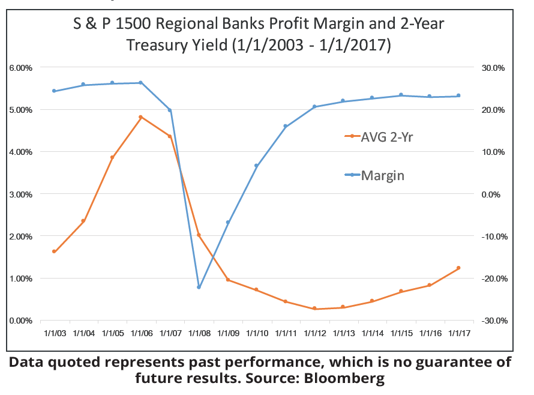

## Table of Contents

## What is profit margin and why is it important in the banking sector?

Profit margin is the percentage of money a business keeps after paying for all its costs. It shows how much profit a company makes from each dollar of sales. For example, if a bank has a profit margin of 20%, it means for every dollar it earns, it keeps 20 cents as profit.

In the banking sector, profit margin is very important because it shows how well a bank is managing its money. Banks have many costs, like paying employees and renting buildings. A good profit margin means the bank is doing a good job of keeping costs low and making money from loans and other services. This helps the bank stay healthy and able to grow, which is good for the economy too.

## How is profit margin calculated for banks?

To calculate the profit margin for banks, you start with the bank's net income. Net income is the money left after the bank pays all its costs, like salaries, rent, and other expenses. Then, you divide this net income by the bank's total revenue. Total revenue is all the money the bank makes from things like loans, fees, and investments. After dividing, you multiply the result by 100 to turn it into a percentage. That percentage is the profit margin.

For example, if a bank's net income is $10 million and its total revenue is $50 million, you would divide $10 million by $50 million to get 0.2. Then, you multiply 0.2 by 100 to get a profit margin of 20%. This means for every dollar the bank earns, it keeps 20 cents as profit. This simple calculation helps show how well the bank is doing at making money and managing its costs.

## What are the different types of profit margins used in banking?

In banking, there are a few different types of profit margins that are used to understand how well the bank is doing. The first one is the net profit margin. This is the most common type and it shows the percentage of money the bank keeps as profit after paying all its costs. To find the net profit margin, you take the bank's net income (money left after all costs) and divide it by the total revenue (all the money the bank makes), then multiply by 100 to get a percentage.

Another type is the gross profit margin. This one looks at the money the bank makes before it pays for things like salaries and rent. It's calculated by taking the total revenue and subtracting the cost of goods sold (which for banks might be the cost of funds or interest paid on deposits), then dividing that by the total revenue and multiplying by 100. The gross profit margin helps show how well the bank is doing at making money from its main activities before other costs come in.

The last type is the operating profit margin. This margin shows the profit the bank makes from its main activities after paying for operating costs like salaries and rent, but before paying taxes and interest. To calculate it, you take the operating income (revenue minus operating expenses) and divide it by the total revenue, then multiply by 100. This helps the bank see how well it's managing its day-to-day costs.

## How do profit margins in banking compare to other industries?

Profit margins in banking can be different from other industries. Banks usually have lower profit margins than some other businesses. For example, tech companies or software businesses might have profit margins of 20% to 30% or even higher. Banks, on the other hand, often have profit margins around 10% to 20%. This is because banks have a lot of costs, like paying for employees, buildings, and technology. They also have to keep a lot of money on hand to give out loans and handle withdrawals, which can make their profit margins smaller.

Even though banks have lower profit margins, they can still make a lot of money. This is because banks deal with huge amounts of money every day. A small profit margin on a very large amount of money can add up to big profits. For example, if a bank makes a 15% profit margin on billions of dollars, that's still a lot of money. Other industries might have higher profit margins, but they might not handle as much money as banks do. So, while the profit margins in banking might seem low compared to other industries, the total amount of profit can be very high.

## What factors influence the profit margins of banks?

Several things can affect how much profit a bank makes. One big thing is the interest rates. When interest rates go up, banks can charge more for loans, which can help their profit margins. But if interest rates go down, banks might not make as much money from loans. Another thing is how well the bank manages its costs. If a bank can keep its costs low, like paying less for buildings or technology, it can have a better profit margin. Competition also plays a role. If there are a lot of other banks around, they might all have to lower their fees to get customers, which can make profit margins smaller.

Another [factor](/wiki/factor-investing) is the economy. When the economy is doing well, more people and businesses want loans, which can help banks make more money. But if the economy is bad, people might not be able to pay back their loans, which can hurt the bank's profits. Regulations from the government can also affect profit margins. Sometimes, the government makes rules that banks have to follow, and these rules can make it harder for banks to make money. For example, rules about how much money banks have to keep on hand can limit how much they can lend out and make in interest. All these things together can make a big difference in how much profit a bank can make.

## How have profit margins in the banking sector changed over the last decade?

Over the last decade, profit margins in the banking sector have gone up and down because of many things happening in the world and in the economy. After the big financial crisis in 2008, banks were careful and had lower profit margins. But as the economy got better, banks started making more money again. For example, in the years after 2010, banks saw their profit margins grow slowly as they got better at managing their costs and as interest rates started to go up. By the middle of the decade, many banks were doing well, with profit margins around 15% to 20%.

But then, things changed again. In the late 2010s and into the 2020s, new problems came up. Low interest rates set by central banks made it hard for banks to make as much money from loans. Also, the global health crisis in 2020 caused a lot of trouble for banks. People and businesses had a hard time paying back loans, which hurt bank profits. But banks that could use technology well and keep their costs down did better. Overall, the last decade shows that profit margins in banking can change a lot because of the economy, interest rates, and how well banks manage their money.

## What role do regulations play in affecting bank profit margins?

Regulations play a big role in how much profit banks can make. Governments make rules that banks have to follow, and these rules can make it harder for banks to earn money. For example, there are rules about how much money banks need to keep on hand. This is called the reserve requirement. If banks have to keep more money on hand, they can lend out less money, which means they make less money from interest on loans. Also, there are rules about how much risk banks can take. If banks can't take as many risks, they might not be able to make as much money from big investments.

Another way regulations affect bank profit margins is by making banks spend more money. Banks have to pay for people and systems to make sure they are following all the rules. This can be expensive and can cut into the bank's profits. Sometimes, new regulations come along that change how banks do business. For example, after the big financial crisis in 2008, new rules were made to make banks safer. These rules helped protect people's money, but they also made it harder for banks to make big profits. So, while regulations are important for keeping the banking system safe, they can also make it tougher for banks to have high profit margins.

## How do different banking services (e.g., loans, investments) impact profit margins?

Different banking services like loans and investments can have a big impact on a bank's profit margins. Loans are a big part of how banks make money. When banks give out loans, they charge interest. This interest is a big part of the bank's revenue. If a bank can give out a lot of loans and people pay back the loans on time, the bank can make a good profit. But if people can't pay back their loans, the bank might lose money, which can hurt its profit margins. So, loans can help a bank's profit margins if everything goes well, but they can also hurt them if things go wrong.

Investments are another way banks can make money. Banks can invest in things like stocks, bonds, or real estate. If these investments do well, the bank can make a lot of money, which can help its profit margins. But investments can also be risky. If the investments don't do well, the bank can lose money, which can hurt its profit margins. So, how well a bank does with its investments can really affect how much profit it makes. Both loans and investments are important for a bank's profit margins, but they come with risks that the bank has to manage carefully.

## What strategies can banks employ to improve their profit margins?

Banks can improve their profit margins by managing their costs better. This means they need to find ways to spend less money on things like salaries, buildings, and technology. For example, banks can use new technology to do things more cheaply, like using online banking instead of having lots of branches. They can also train their employees to work more efficiently. By keeping costs low, banks can keep more of the money they make as profit.

Another way banks can improve their profit margins is by making more money from their services. They can do this by giving out more loans and charging more interest if the market allows it. Banks can also look for good investment opportunities that can make them more money. It's important for banks to manage risks carefully so they don't lose money on bad loans or investments. By finding the right balance between making money and managing risks, banks can increase their profit margins.

## How do global economic conditions affect banking sector profit margins?

Global economic conditions can have a big impact on how much profit banks make. When the world economy is doing well, people and businesses want to borrow more money. This means banks can give out more loans and make more money from interest. Also, when the economy is good, investments usually do better, which can help banks make more money from their investments. But if the world economy is not doing well, like during a recession, people and businesses might not be able to pay back their loans. This can hurt banks' profits because they might have to write off bad loans. Also, when the economy is bad, investments can lose value, which can make it harder for banks to make money.

Another way global economic conditions affect bank profit margins is through interest rates set by central banks. When interest rates are high, banks can charge more for loans, which can help their profit margins. But when interest rates are low, banks might not make as much money from loans. Global economic conditions can also affect how much competition there is between banks. In a good economy, new banks might start up, which can lead to more competition and lower fees. This can make it harder for banks to keep their profit margins high. So, the health of the global economy plays a big role in how much profit banks can make.

## What are the challenges in maintaining high profit margins in the banking industry?

Keeping high profit margins in the banking industry can be tough because of many reasons. One big challenge is competition. When there are lots of banks around, they all have to fight for customers. This means they might have to lower their fees or offer better interest rates on loans, which can make their profit margins smaller. Also, banks have to spend a lot of money on things like technology and security to keep up with other banks. If they don't spend this money, they might lose customers, but spending it can cut into their profits.

Another challenge is dealing with economic ups and downs. When the economy is bad, people might not be able to pay back their loans, which can hurt the bank's profits. Banks also have to be careful with their investments because if they lose money on them, it can lower their profit margins. Plus, banks have to follow a lot of rules from the government. These rules can make it harder for banks to make money because they have to spend money to make sure they are following the rules, and sometimes the rules limit how much risk banks can take, which can also affect their profits.

## How can advanced analytics and technology enhance profit margin management in banks?

Advanced analytics and technology can help banks manage their profit margins better by helping them understand their data. Banks can use computers to look at lots of information about their customers, loans, and investments. This helps them see patterns and make better decisions. For example, they can find out which customers are most likely to pay back their loans on time. This means the bank can give more loans to these customers and make more money from interest. Also, technology can help banks see which investments are doing well and which ones are not, so they can put their money in the right places to make more profit.

Technology also helps banks save money by making things more efficient. For example, online banking means banks don't need as many branches, which saves them money on rent and other costs. Also, computers can do a lot of the work that people used to do, like checking for fraud or answering customer questions. This means banks don't have to hire as many people, which can help their profit margins. By using technology smartly, banks can keep their costs down and make more money, which helps them have higher profit margins.

## What are the key metrics for bank profitability analysis?

Investors rely on several key metrics to evaluate the financial health and profitability of banks. Understanding these metrics is crucial for assessing banks as potential investment opportunities and determining their ability to generate sustainable profits.

### Net Interest Margin (NIM)

Net Interest Margin (NIM) is a critical indicator of a bank's profitability related to its lending activities. It measures the difference between the interest earned on loans and other assets and the interest paid on deposits and other liabilities, relative to the amount of interest-[earning](/wiki/earning-announcement) assets. The formula for calculating NIM is:

$$
\text{NIM} = \left( \frac{\text{Interest Income} - \text{Interest Expense}}{\text{Average Earning Assets}} \right) \times 100
$$

A higher NIM indicates that a bank is effectively utilizing its assets to generate interest income, reflecting efficient management of its [interest rate](/wiki/interest-rate-trading-strategies) spread.

### Efficiency Ratio

The Efficiency Ratio assesses a bank's ability to manage its expenses relative to its revenue. It is calculated by dividing the non-interest expenses by the sum of net interest income and non-interest income. The formula is:

$$
\text{Efficiency Ratio} = \left( \frac{\text{Non-Interest Expenses}}{\text{Net Interest Income} + \text{Non-Interest Income}} \right) \times 100
$$

A lower efficiency ratio indicates a more cost-effective operation. Banks strive for a lower ratio as it demonstrates that their operating expenses are a smaller proportion of their income, showcasing effective cost management.

### Return on Assets (ROA)

Return on Assets (ROA) is a metric that reflects a bank's ability to generate profit from its assets. It measures the net income produced relative to total assets and is expressed as a percentage. The formula for ROA is:

$$
\text{ROA} = \left( \frac{\text{Net Income}}{\text{Total Assets}} \right) \times 100
$$

A higher ROA indicates that the bank is utilizing its assets efficiently to generate earnings. It is a valuable metric for comparing the performance of banks of different sizes.

### Significance in Profitability Analysis

These metrics collectively provide a comprehensive view of a bank's financial health. NIM highlights how effectively a bank is managing its interest-related activities. The Efficiency Ratio offers insights into operational efficiency, and ROA provides an overall measure of profitability relative to asset utilization. By analyzing these metrics, investors can identify banks with robust financial performance and sound management practices, making them attractive investment opportunities. Understanding and analyzing these metrics allows stakeholders to benchmark performance against industry standards and make informed decisions.

## References & Further Reading

[1]: Bergstra, J., Bardenet, R., Bengio, Y., & Kégl, B. (2011). ["Algorithms for Hyper-Parameter Optimization."](https://dl.acm.org/doi/10.5555/2986459.2986743) Advances in Neural Information Processing Systems 24.

[2]: ["Advances in Financial Machine Learning"](https://www.amazon.com/Advances-Financial-Machine-Learning-Marcos/dp/1119482089) by Marcos Lopez de Prado

[3]: Basel Committee on Banking Supervision. (2011) ["Basel III: A global regulatory framework for more resilient banks and banking systems."](https://www.bis.org/publ/bcbs189.htm) Bank for International Settlements.

[4]: Vayanos, D., & Woolley, P. (2013). ["An Institutional Theory of Momentum and Reversal."](https://www.jstor.org/stable/23470044) The Review of Financial Studies, 26(5), 1087–1145.

[5]: ["Quantitative Trading: How to Build Your Own Algorithmic Trading Business"](https://www.amazon.com/Quantitative-Trading-Build-Algorithmic-Business/dp/1119800064) by Ernest P. Chan

[6]: Fama, E. F., & French, K. R. (2004). ["The Capital Asset Pricing Model: Theory and Evidence."](https://www.aeaweb.org/articles?id=10.1257/0895330042162430) Journal of Economic Perspectives, 18(3), 25-46.