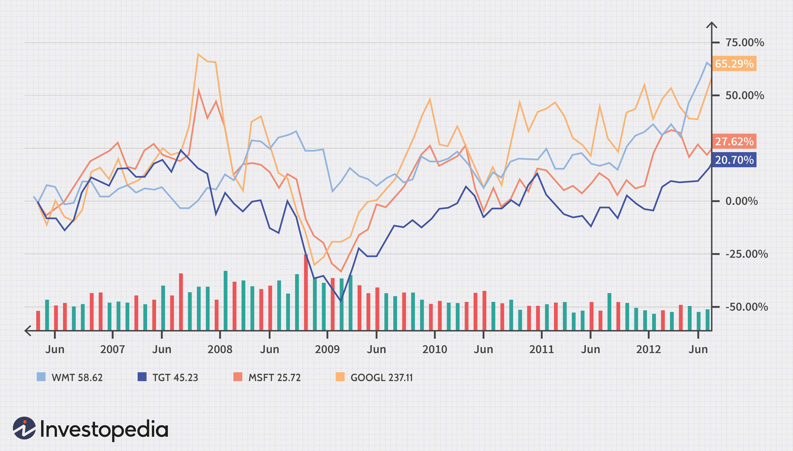

The banking industry is integral to the global financial architecture, functioning as the primary channel for economic transactions and a cornerstone of financial stability. It facilitates the flow of funds, manages financial risk, and acts as a vital intermediary between savers and borrowers. Grasping the mechanisms through which banks generate profits, as well as the variables influencing these profits, is essential not only for investors seeking to maximize returns but also for policymakers aiming to ensure the efficiency and stability of financial markets, and industry participants striving to stay competitive.

Banks generate profits primarily through interest income from loans and other financial products and by charging fees for a variety of services. With interest rates, market conditions, regulatory environments, and technological advancements constantly altering, profit margins in this sector are subject to frequent changes. Effective evaluation of these profit dynamics enables stakeholders to make informed decisions.

This article outlines the complex landscape of banking industry profits, offering an analytical overview of key trends impacting profit margins and the factors driving these changes, such as regulatory modifications and emerging technologies. Algorithmic trading, for instance, has transformed the banking sector by introducing rapid trade execution and precision in financial markets, which influences profitability. The adoption of algorithms in trading operations by banks can introduce both opportunities for enhanced profits and potential risks due to market volatility and technological failure.

Additionally, we will scrutinize essential metrics used to assess bank profitability. These metrics include the net interest margin, efficiency ratios, and return on assets (ROA), each of which provides insight into a bank's financial performance and its potential as an investment.

By examining these various dimensions, the section offers a comprehensive understanding of the current state and future trajectory of banking profitability, especially as banks navigate the challenges posed by digital transformation in a fast-evolving financial landscape.

## Table of Contents

## Overview of Banking Profit Margins

Profit margins in the banking sector have undergone considerable variability due to multiple external and internal factors. These fluctuations are primarily driven by macroeconomic conditions, regulatory changes, and the intensity of market competition. In recent years, the average net profit margin for commercial banks in the United States has seen a range from approximately 13.9% to over 24% during peak periods. Understanding these trends requires a closer look at the historical context and the primary influencers of these variations.

Historically, the banking industry's profitability has been closely tied to the broader economic environment. During times of economic growth, banks generally experience increased lending activity, improved asset quality, and higher interest margins, all contributing to enhanced profitability. Conversely, economic downturns tend to suppress lending activity, increase default rates, and compress interest margins, leading to reduced profit margins.

Regulatory frameworks have a profound impact on banking profitability. Post-2008 financial crisis, heightened regulatory scrutiny and compliance requirements have increased operational costs for banks, putting downward pressure on profit margins. However, these regulations have also fostered a more stable financial environment, indirectly benefiting banks in the long term by mitigating the risk of systemic crises.

Market competition among banks and with non-traditional financial entities, such as fintech companies, also influences profit margins. Increased competition often results in tighter [interest rate](/wiki/interest-rate-trading-strategies) spreads and higher customer acquisition costs. However, competition can also drive innovation, ultimately leading to more efficient operations and improved customer offerings, which can positively impact profitability.

In summary, the fluctuations in banking profit margins over the years highlight the complex interplay between economic conditions, regulatory landscapes, and competitive dynamics. By analyzing these factors, stakeholders can better understand the trends and make informed decisions about the future of banking profitability.

## Factors Influencing Banking Profits

The profitability of banks is shaped by a myriad of factors, each playing a crucial role in determining the overall financial health of these institutions. Key among these factors are interest rate fluctuations, economic conditions, regulatory frameworks, and technological advancements.

Interest rate fluctuations directly affect banks' profit margins, significantly impacting their ability to generate income. When interest rates are high, banks benefit from increased net interest margins, the difference between the interest earned on loans and the interest paid on deposits. Conversely, low interest rates can compress margins, necessitating banks to seek alternative revenue streams or cost-cutting measures to maintain profitability.

Economic conditions are another critical [factor](/wiki/factor-investing). During periods of economic growth, banks typically experience higher loan demand, contributing to increased revenues. Economic downturns, however, can lead to higher default rates on loans, necessitating increased provisions for loan losses and reducing profitability. Moreover, unemployment rates and inflation levels can influence consumer borrowing and spending behaviors, indirectly affecting bank profits.

Regulatory frameworks also influence bank profitability. Stricter regulations generally impose additional compliance costs, affecting the banks' operational efficiency. Regulations such as the Basel III standards, which require banks to hold higher capital reserves, can limit lending capabilities. However, these measures aim to stabilize the financial system, potentially averting the severe losses experienced during financial crises.

In recent years, technological advancements have revolutionized financial services, presenting both opportunities and challenges for banks. Digital transformation, including the adoption of online and mobile banking, has enabled banks to expand their customer reach, reduce operational costs, and improve service efficiency. However, these advancements also invite competition from fintech companies. Fintech firms leverage technology to offer financial services that are often more accessible and cost-effective than traditional banking services, pressuring conventional banks to innovate and adapt.

To remain competitive and maintain healthy profit margins, banks have adopted various strategies. Enhancing digital capabilities has become essential, with investments in [artificial intelligence](/wiki/ai-artificial-intelligence) and [machine learning](/wiki/machine-learning) optimizing processes and offering personalized customer experiences. Operational efficiency improvements, such as automating routine tasks and streamlining operations, help reduce costs. Additionally, banks are forming strategic partnerships with fintech companies to integrate cutting-edge technologies into their offerings and broaden their market presence.

The interplay of these factors underscores the complexity of the banking sector, where adaptability and innovation are key to sustaining profitability amidst evolving economic landscapes and technological advancements.

## Algorithmic Trading in the Banking Sector

Algorithmic trading, or algo trading, involves employing sophisticated computer algorithms to execute trading operations at extremely high velocities and with precise accuracy. This automation facilitates significant efficiencies in financial markets, impacting the profitability of banks that adopt these technologies. The integration of [algorithmic trading](/wiki/algorithmic-trading) systems into traditional banking has the potential to both enhance and complicate profit margins, presenting both opportunities and challenges.

**Opportunities and Risks of Algorithmic Trading**

Algorithmic trading offers considerable advantages, including increased execution speed, reduced transaction costs, and enhanced ability to manage large trading volumes. These efficiencies can translate into improved profit margins for banks. For instance, by harnessing this technology, banks can capitalize on [arbitrage](/wiki/arbitrage) opportunities more swiftly than manual trading would allow, thus potentially generating higher profit with minimized risks. Furthermore, algo trading can assist in mitigating errors associated with human intervention, resulting in more consistent trading outcomes.

However, the technology comes with inherent risks that could negatively affect banking profitability. Algorithms can occasionally malfunction due to errors in the algorithm itself or from unanticipated market conditions, such as the infamous "flash crash" incidents. Additionally, the competitive nature of high-frequency trading ([HFT](/wiki/high-frequency-trading-strategies)) can result in diminishing returns; as more entities employ similar strategies, the effectiveness of individually developed algorithms could degrade over time.

**Incorporation of Algorithmic Trading in Banking Operations**

Banks are increasingly integrating algorithmic trading frameworks into their operations, identifying them as critical components of their trading desks. This adoption involves substantial financial and technological investments in infrastructure capable of supporting high-frequency transactions. For instance, banks are deploying low-latency systems and leveraging colocation services—placing their trading servers in close proximity to exchange servers—to gain millisecond-level advantages that are crucial for success in competitive trading environments.

Furthermore, algorithmic trading requires robust risk management frameworks to monitor and control the algorithms' activity, ensuring compliance with regulatory standards and internal risk parameters. Banks must continuously refine these systems to prevent over-reliance on algorithms that could lead to adverse outcomes.

**Impact on Profit Margins**

The impact of algorithmic trading on banks' profit margins is multifaceted and highly contingent on effective implementation. Properly executed, algo trading can enhance profitability by increasing trading volumes while reducing costs per transaction. However, improper execution or failure to adapt to rapidly evolving market conditions may erode these potential gains. Moreover, increased regulatory scrutiny in certain jurisdictions can impose additional compliance costs, potentially affecting overall profitability.

In conclusion, algorithmic trading presents a double-edged sword for banking profitability; while there are significant opportunities for cost savings and efficiency improvements, the complexities and risks associated with this technology require careful management. As banks continue to navigate the intricacies of integrating algorithmic trading, their ability to sustain and enhance profit margins will depend on their strategic deployment of technology, adept risk management, and compliance with pervasive regulatory frameworks.

## Key Metrics for Bank Profitability Analysis

Investors rely on several key metrics to evaluate the financial health and profitability of banks. Understanding these metrics is crucial for assessing banks as potential investment opportunities and determining their ability to generate sustainable profits.

### Net Interest Margin (NIM)

Net Interest Margin (NIM) is a critical indicator of a bank's profitability related to its lending activities. It measures the difference between the interest earned on loans and other assets and the interest paid on deposits and other liabilities, relative to the amount of interest-[earning](/wiki/earning-announcement) assets. The formula for calculating NIM is:

$$
\text{NIM} = \left( \frac{\text{Interest Income} - \text{Interest Expense}}{\text{Average Earning Assets}} \right) \times 100
$$

A higher NIM indicates that a bank is effectively utilizing its assets to generate interest income, reflecting efficient management of its interest rate spread.

### Efficiency Ratio

The Efficiency Ratio assesses a bank's ability to manage its expenses relative to its revenue. It is calculated by dividing the non-interest expenses by the sum of net interest income and non-interest income. The formula is:

$$
\text{Efficiency Ratio} = \left( \frac{\text{Non-Interest Expenses}}{\text{Net Interest Income} + \text{Non-Interest Income}} \right) \times 100
$$

A lower efficiency ratio indicates a more cost-effective operation. Banks strive for a lower ratio as it demonstrates that their operating expenses are a smaller proportion of their income, showcasing effective cost management.

### Return on Assets (ROA)

Return on Assets (ROA) is a metric that reflects a bank's ability to generate profit from its assets. It measures the net income produced relative to total assets and is expressed as a percentage. The formula for ROA is:

$$
\text{ROA} = \left( \frac{\text{Net Income}}{\text{Total Assets}} \right) \times 100
$$

A higher ROA indicates that the bank is utilizing its assets efficiently to generate earnings. It is a valuable metric for comparing the performance of banks of different sizes.

### Significance in Profitability Analysis

These metrics collectively provide a comprehensive view of a bank's financial health. NIM highlights how effectively a bank is managing its interest-related activities. The Efficiency Ratio offers insights into operational efficiency, and ROA provides an overall measure of profitability relative to asset utilization. By analyzing these metrics, investors can identify banks with robust financial performance and sound management practices, making them attractive investment opportunities. Understanding and analyzing these metrics allows stakeholders to benchmark performance against industry standards and make informed decisions.

## Challenges and Future Outlook

The banking industry is encountering numerous challenges in maintaining its profit margins amidst a fluctuating economic landscape. Economic uncertainty, primarily driven by geopolitical tensions, fluctuating interest rates, and unpredictable market conditions, poses a significant threat to banking profitability. Additionally, changing consumer behaviors, such as a growing preference for digital banking solutions over traditional banking methods, demand that banks continuously innovate to meet customer expectations.

Furthermore, technological disruptions are reshaping the financial sector at an unprecedented pace. The rise of fintech companies and the integration of advanced technologies such as blockchain, artificial intelligence, and machine learning have introduced new competition and compelled traditional banks to reassess their strategies. These disruptions affect how banks operate and require significant investments in technology to remain competitive.

The future of banking profitability hinges on digital transformation and the successful integration of fintech solutions. As digital services become more ingrained in everyday banking experiences, financial institutions must adapt to this trend by enhancing their digital offerings. This evolution presents an opportunity for banks to tap into new revenue streams while reducing operational costs through automation and process optimization. The deployment of advanced data analytics capabilities can also improve decision-making and customer insights, fostering better customer relationships and personalized services.

To overcome these challenges and sustain profitability, banks can adopt several strategies. Streamlining operations through the adoption of automation and artificial intelligence can lead to more efficient processes and reduced costs. Emphasizing cybersecurity measures is essential to protect against growing threats and build consumer trust in digital platforms. Additionally, forming strategic partnerships with fintech firms can help banks leverage innovative technologies without developing them in-house, offering improved services to customers while rapidly adapting to changes in the financial landscape.

Investing in employee skills through training and development programs ensures that bank personnel can effectively work with new technologies and deliver enhanced customer experiences. Lastly, fostering a culture of continuous innovation within the organization encourages the exploration and implementation of new ideas that can lead to long-term profitability and growth. 

Embracing these strategies will not only help banks navigate current challenges but also position them to capitalize on future opportunities in an increasingly digital and competitive financial ecosystem.

## Conclusion

In summary, the banking industry's profit dynamics are multifaceted and subject to a wide array of influences. It is imperative for banks to recognize these elements and adapt their strategies accordingly to thrive in a rapidly changing environment. Sustained profitability will increasingly rely on the ability of banks to embrace innovation and optimize operational efficiency. As the industry evolves, keeping pace with technological progress and regulatory changes is crucial.

Addressing the pressures from fintech disruptions and the need for enhanced customer experiences, banks must leverage digital technologies to streamline operations and deliver personalized services. The shift towards digital banking services requires institutions to modernize their infrastructure, adopt advanced data analytics, and harness algorithmic trading efficiently.

Furthermore, understanding and managing risk, ensuring compliance with regulatory frameworks, and investing in cybersecurity will form the backbone of robust bank operations. Meeting the evolving demands of a digital-savvy customer base will involve not only technology adoption but also fostering a culture of agility and customer-centric innovation. 

Ultimately, the ability of banking institutions to sustain profitability will be determined by their flexibility to adjust strategies in response to market changes and the pace at which they integrate new technologies into their business models.

## References & Further Reading

[1]: Bergstra, J., Bardenet, R., Bengio, Y., & Kégl, B. (2011). ["Algorithms for Hyper-Parameter Optimization."](https://dl.acm.org/doi/10.5555/2986459.2986743) Advances in Neural Information Processing Systems 24.

[2]: ["Advances in Financial Machine Learning"](https://www.amazon.com/Advances-Financial-Machine-Learning-Marcos/dp/1119482089) by Marcos Lopez de Prado

[3]: Basel Committee on Banking Supervision. (2011) ["Basel III: A global regulatory framework for more resilient banks and banking systems."](https://www.bis.org/publ/bcbs189.htm) Bank for International Settlements.

[4]: Vayanos, D., & Woolley, P. (2013). ["An Institutional Theory of Momentum and Reversal."](https://www.jstor.org/stable/23470044) The Review of Financial Studies, 26(5), 1087–1145.

[5]: ["Quantitative Trading: How to Build Your Own Algorithmic Trading Business"](https://www.amazon.com/Quantitative-Trading-Build-Algorithmic-Business/dp/1119800064) by Ernest P. Chan

[6]: Fama, E. F., & French, K. R. (2004). ["The Capital Asset Pricing Model: Theory and Evidence."](https://www.aeaweb.org/articles?id=10.1257/0895330042162430) Journal of Economic Perspectives, 18(3), 25-46.