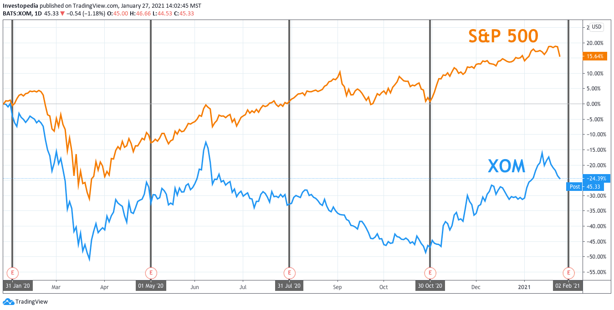

## Table of Contents

## What is profit margin and why is it important in the oil and gas drilling industry?

Profit margin is the percentage of money a company keeps as profit from its sales after all costs are paid. It shows how well a company is doing at making money from what it sells. In the oil and gas drilling industry, profit margins can be affected by many things like the price of oil, how much it costs to drill, and how much oil they can find and sell.

Profit margin is very important in the oil and gas drilling industry because it helps companies know if they are making enough money to keep going and grow. If the profit margin is high, it means the company is doing well and can invest in new projects or pay back loans. If it's low, the company might need to find ways to cut costs or might struggle to stay in business. This is why companies in this industry always watch their profit margins closely.

## How is profit margin calculated in oil and gas drilling?

To calculate the profit margin in the oil and gas drilling industry, you start by figuring out the total revenue, which is the money made from selling oil and gas. Then, you subtract all the costs involved in getting that oil and gas out of the ground and ready to sell. These costs can include things like drilling expenses, labor, equipment, and transportation. Once you have the total costs, you subtract them from the total revenue to find the profit. The profit margin is then calculated by dividing the profit by the total revenue and turning that number into a percentage.

For example, if a company makes $100 million from selling oil and gas and it costs them $80 million to do all the work, their profit is $20 million. To find the profit margin, you divide the $20 million profit by the $100 million revenue, which gives you 0.2. When you turn that into a percentage, the profit margin is 20%. This number helps the company see how well they are doing and if they need to find ways to make more money or spend less.

## What are the typical profit margins for oil and gas drilling companies?

Profit margins in the oil and gas drilling industry can change a lot. They depend on things like the price of oil, how much it costs to drill, and how much oil a company can find. When oil prices are high, companies can make more money and have bigger profit margins. But when oil prices go down, their profit margins can get smaller or even turn into losses. On average, profit margins for oil and gas drilling companies can be anywhere from 5% to 20%, but this can be different for each company.

Some companies might have higher profit margins if they can drill oil more cheaply or if they find a lot of oil. Other companies might have lower profit margins if they have to spend a lot of money to drill or if they don't find as much oil as they hoped. It's important for these companies to keep an eye on their costs and try to find ways to make more money, so they can keep their profit margins as high as possible.

## What factors influence profit margins in the oil and gas drilling sector?

Profit margins in the oil and gas drilling sector are influenced by many things. One big factor is the price of oil. When oil prices are high, companies can sell their oil for more money, which can make their profit margins bigger. But if oil prices go down, it can be harder for companies to make money, and their profit margins can get smaller. Another important factor is how much it costs to drill for oil. If a company can drill oil cheaply, they can keep more of the money they make from selling it, which helps their profit margins. But if drilling costs a lot, it can eat into their profits and make their profit margins smaller.

Another factor that affects profit margins is how much oil a company can find and sell. If a company finds a lot of oil, they can sell more and make more money, which can help their profit margins. But if they don't find as much oil as they hoped, it can be harder to make money and keep their profit margins high. The location where a company drills can also make a difference. Some places are easier and cheaper to drill in, which can help profit margins. Other places might be harder and more expensive, which can hurt profit margins. All these factors together can make profit margins in the oil and gas drilling sector go up and down.

## How do oil prices affect profit margins in drilling operations?

Oil prices have a big impact on the profit margins of companies that drill for oil and gas. When the price of oil goes up, these companies can sell their oil for more money. This means they keep more of the money they make after paying for things like drilling, workers, and equipment. So, higher oil prices usually lead to bigger profit margins. It's like selling a lemonade for more money when the price of lemons goes up, but you still buy the lemons at the same price.

On the other hand, when oil prices go down, it's harder for drilling companies to make money. They still have to pay the same costs to get the oil out of the ground, but they don't get as much money when they sell it. This can make their profit margins smaller, or sometimes they might even lose money. So, oil prices going up and down can really change how much profit these companies make, and they always have to keep an eye on what's happening with oil prices.

## What role do operational costs play in determining profit margins in oil and gas drilling?

Operational costs are a big deal when it comes to figuring out profit margins in oil and gas drilling. These costs include everything a company needs to spend to get oil out of the ground and ready to sell, like paying for drilling rigs, workers, and moving the oil around. If these costs are low, the company can keep more of the money they make from selling the oil, which makes their profit margins bigger. But if the costs are high, it eats into the money they make, and their profit margins get smaller.

Companies in the oil and gas drilling business always try to keep their operational costs as low as they can. They might use new technology to drill faster and cheaper, or they might find ways to save money on things like labor and transportation. By keeping these costs down, they can make more profit from each barrel of oil they sell, even if the price of oil goes up and down. So, managing operational costs is really important for keeping good profit margins in this industry.

## How can technological advancements impact profit margins in the oil and gas drilling industry?

Technological advancements can help oil and gas drilling companies make more money by making their work cheaper and faster. New tools like better drilling rigs and computer programs can find oil more easily and drill it out of the ground quicker. This means the companies spend less money on things like workers and equipment, so they can keep more of the money they make from selling the oil. When they can drill more oil for less money, their profit margins go up because they make more profit from each barrel of oil they sell.

Also, new technology can help companies find oil in places that used to be too hard or too expensive to drill. This means they can get more oil out of the ground, which can help their profit margins too. By using new technology, companies can keep their costs down and sell more oil, which makes their business more profitable. So, staying up to date with the latest technology is really important for oil and gas drilling companies if they want to make more money.

## What are the differences in profit margins between onshore and offshore drilling?

Onshore drilling usually has higher profit margins than offshore drilling. This is because it costs less to drill on land. Onshore drilling doesn't need big ships or special equipment that can work in the ocean. Also, it's easier to get workers and supplies to an onshore site. So, companies can spend less money to get the oil out of the ground, which means they can keep more of the money they make from selling it.

Offshore drilling, on the other hand, can be more expensive and risky. It needs special ships and equipment that can handle being in the ocean. It also costs more to get workers and supplies out to the drilling site. Because of these higher costs, offshore drilling usually has smaller profit margins. But sometimes, offshore drilling can find a lot of oil in places where it's hard to drill on land, which can help make up for the higher costs and still lead to good profits.

## How do regulatory changes impact profit margins in oil and gas drilling?

Regulatory changes can really change how much money oil and gas drilling companies make. When new rules come out, they might make it cost more to drill for oil. For example, if the government says companies have to use special equipment to protect the environment, that equipment can be expensive. Or if there are new safety rules, companies might have to spend more money to make sure their workers are safe. All these extra costs can make the profit margins smaller because the companies have to spend more money to do the same work.

But sometimes, regulatory changes can help companies make more money. If the government gives tax breaks or other benefits to oil and gas companies, it can make their costs go down. This means they can keep more of the money they make from selling oil, which can make their profit margins bigger. So, it's important for companies to keep an eye on what the government is doing, because changes in the rules can make a big difference in how much profit they make.

## What strategies can oil and gas drilling companies use to improve their profit margins?

Oil and gas drilling companies can improve their profit margins by finding ways to spend less money on drilling. They can do this by using new technology that makes drilling faster and cheaper. For example, better drilling rigs and computer programs can help find oil more easily and get it out of the ground quicker. This means the companies don't have to spend as much on workers and equipment, so they can keep more of the money they make from selling the oil. Another way to save money is by drilling in places where it's cheaper to work, like on land instead of in the ocean. By keeping their costs down, companies can make more profit from each barrel of oil they sell.

Another strategy is to find more oil to sell. Companies can use new technology to explore new places where they might find oil. If they can find a lot of oil, they can sell more and make more money, which can help their profit margins. It's also important for companies to pay attention to what's happening with oil prices. If they can sell their oil when prices are high, they can make more money. And if they can buy things they need when prices are low, they can save money. By keeping an eye on the market and finding ways to sell more oil, companies can improve their profit margins and make more money.

## How do geopolitical factors affect profit margins in the global oil and gas drilling market?

Geopolitical factors can really change how much money oil and gas drilling companies make. If there's a war or a big political problem in a country that has a lot of oil, it can make it harder for companies to drill there. They might have to stop drilling or pay more money to keep their workers safe. This can make their costs go up and their profit margins go down. Also, if a country decides to change its rules about who can drill for oil, it can affect how much money companies make. For example, if a country says only its own companies can drill, foreign companies might lose money.

On the other hand, geopolitical changes can sometimes help companies make more money. If a country opens up new areas for drilling or makes it easier for companies to work there, it can help companies find more oil and sell it. This can make their profit margins bigger because they can make more money from selling more oil. Also, if countries work together to keep oil prices stable, it can help companies plan better and make more money. So, what happens in the world can really change how much profit oil and gas drilling companies make.

## What are the future trends and predictions for profit margins in the oil and gas drilling industry?

The future of profit margins in the oil and gas drilling industry will depend a lot on new technology and how much it costs to drill. Companies are always trying to find new ways to drill faster and cheaper. For example, they might use robots or better computer programs to find oil more easily. If they can keep their costs down by using new technology, their profit margins could go up. But if the cost of new technology is too high, it might not help their profit margins as much. Also, if companies can find new places to drill that are cheaper, like on land instead of in the ocean, it could help their profit margins too.

Another big thing that will affect profit margins is what happens with oil prices. If oil prices go up, companies can sell their oil for more money, which can make their profit margins bigger. But if oil prices go down, it can be harder for them to make money, and their profit margins might get smaller. Geopolitical changes, like wars or new rules in countries with a lot of oil, can also make a big difference. If these changes make it easier for companies to drill and sell oil, it can help their profit margins. But if they make it harder, it can hurt their profit margins. So, the future of profit margins in the oil and gas drilling industry will depend on a lot of different things, and companies will need to keep an eye on all of them to do well.

## References & Further Reading

[1]: Montgomery, Carl T., and Michael B. Smith. "Hydraulic fracturing: history of an enduring technology." Journal of Petroleum Technology 62, no. 12 (2010): 26-40.

[2]: Kilian, Lutz. "Not all oil price shocks are alike: Disentangling demand and supply shocks in the crude oil market." American Economic Review 99, no. 3 (2009): 1053-1069.

[3]: Yergin, Daniel. "The Quest: Energy, Security, and the Remaking of the Modern World." Penguin Books, 2011.

[4]: Geman, Hélyette. "Commodities and Commodity Derivatives: Modeling and Pricing for Agriculturals, Metals, and Energy." John Wiley & Sons, 2005.

[5]: Lopez de Prado, Marcos. "Advances in Financial Machine Learning." John Wiley & Sons, 2018.

[6]: Chan, Ernest P. "Quantitative Trading: How to Build Your Own Algorithmic Trading Business." John Wiley & Sons, 2008.