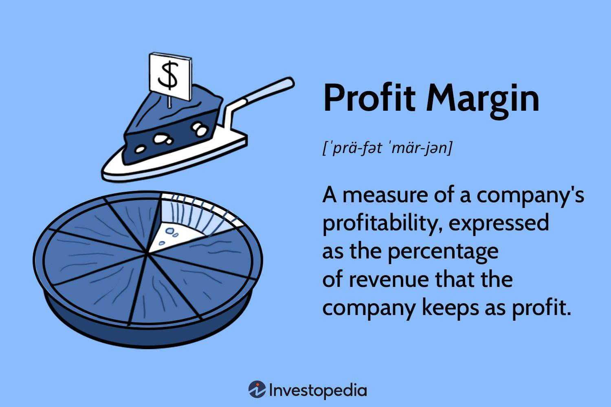

In today's fast-paced financial environment, understanding profit margins and algorithmic trading is essential for investors and business owners. The concept of profit margins serves as a reflection of a company's financial health, offering insights into its effectiveness in cost management and its ability to generate revenue. High profit margins often signal robust operational efficiency and competitive advantages, making them a critical metric for evaluating a company's performance.

Algorithmic trading, by contrast, represents the future of stock and commodities trading, with its capacity to execute trades at speeds and volumes that traditional human traders cannot match. Through the use of sophisticated computer algorithms, this approach enables investors to capitalize on market opportunities using real-time data, thereby reducing transaction costs and eliminating emotional biases that can affect human decision-making.



This article investigates how investing in businesses characterized by high profit margins, in conjunction with leveraging algorithmic trading strategies, can maximize investment returns. By analyzing the synergies and interactions between these two pivotal concepts, the article aims to offer a comprehensive guide for savvy investors looking to optimize their portfolios. The fusion of fundamental financial analysis with cutting-edge technology presents investors with a powerful toolkit for navigating today's complex financial markets, helping them to achieve sustainable wealth growth while managing risks efficiently.

## Table of Contents

## Understanding Profit Margin in Business Finance

Profit margin is an essential financial metric that evaluates a company's ability to convert its revenue into profit, serving as an indicator of financial health and operational efficiency. It is expressed as a percentage and calculated by dividing the profit (net, gross, or operating) by the company's revenue. The general formula for calculating profit margin is:

$$
\text{Profit Margin} = \left( \frac{\text{Profit}}{\text{Revenue}} \right) \times 100
$$

Different types of profit margins provide unique insights into various aspects of a business's performance:

1. **Gross Profit Margin**: This margin reflects the efficiency of a company in producing its goods or services. It is calculated by subtracting the cost of goods sold (COGS) from total revenue, divided by total revenue. A higher gross margin indicates effective management of production costs relative to sales.

2. **Operating Profit Margin**: This margin measures the percentage of profit a company makes from its operations before deducting interest and taxes. It provides insight into a company's operational efficiency, excluding the effects of financing and tax environments.

3. **Pretax Profit Margin**: Also known as the profit before tax margin, it assesses a company's profitability after operational and non-operational expenses but before tax deductions. This gives a clearer picture of a company's profit-generating capacity without tax implications.

4. **Net Profit Margin**: This is the most comprehensive margin, representing the percentage of revenue that remains as profit after all expenses, including taxes and interest, have been deducted. It is an indicator of overall profitability.

High-profit margins are generally indicative of a company’s effectiveness in cost management and pricing strategy, which is often appealing to investors. Industries with substantial profit margins frequently include luxury goods, pharmaceuticals, and technology sectors. These industries benefit from strong pricing power and lower variable costs per unit of sale due to high perceived value, innovative products, or monopolistic advantages.

Conversely, businesses operating in sectors such as agriculture and transportation tend to exhibit lower profit margins, primarily due to their higher operational costs. These industries face greater variable costs—such as fluctuating fuel prices and labor expenses—that can significantly impact profitability.

In summary, profit margins serve as a critical benchmark for evaluating a company’s financial performance, assisting investors in identifying well-managed companies with the potential for strong returns. A comprehensive understanding of profit margins aids in differentiating companies that maintain solid fundamentals through effective cost control and strategic pricing from those that may offer lower investment potential.

## The Role of Algorithmic Trading in Modern Investing

Algorithmic trading consists of using computer programs to execute trades based on predefined criteria, thereby enhancing speed and accuracy without human intervention. This contemporary method has gained significant traction in modern investing due to its capacity to efficiently manage high trading volumes with precision, thereby reducing transaction costs.

One of the primary advantages of [algorithmic trading](/wiki/algorithmic-trading) is its ability to eliminate emotional bias from trading decisions, which often leads to more consistent and systematic execution of strategies. By relying on quantitative models and market data, algorithmic trading can process information and execute trades at a pace and precision unachievable by human traders, thereby allowing for improved scalability in handling large volumes of transactions. This capability is particularly beneficial in highly liquid markets, where small price adjustments can be executed rapidly to exploit market inefficiencies.

Common algorithmic trading strategies include trend-following, [arbitrage](/wiki/arbitrage), and index fund rebalancing. Trend-following involves algorithms that detect and capitalize on emerging trends in the market prices, adjusting positions accordingly. Arbitrage strategies exploit price discrepancies between correlated assets or across different markets to achieve risk-free profits. Similarly, index fund rebalancing uses algorithms to adjust a portfolio's composition in response to changes in the underlying index, maintaining the desired asset allocation.

Implementing algorithmic trading requires a combination of robust programming skills, access to accurate market data, and a dependable technological infrastructure. This infrastructure must be capable of handling high-speed transactions and complex calculations to ensure that the trading strategies can adapt and respond to real-time market fluctuations.

Moreover, algorithmic trading offers the distinct advantage of [backtesting](/wiki/backtesting), whereby historical data is used to evaluate and refine trading strategies before their deployment in live markets. This process allows investors to fine-tune their algorithms, ensuring they are well-adapted to current market conditions and capable of achieving desired performance outcomes. Backtesting typically involves simulating the algorithm's performance over historical data and adjusting the strategy to optimize results, which can be facilitated through programming languages like Python, which offers packages like pandas, NumPy, and TA-Lib for these tasks.

In conclusion, algorithmic trading presents a highly advantageous approach to modern investing by leveraging technology to enhance trading precision and efficiency. By integrating algorithmically-driven strategies within an investment framework, investors can capitalize on market opportunities with minimal human error, contributing to optimized portfolio performance.

## Integrating Profit Margins and Algorithmic Trading for Investment Success

Investors seeking to refine their strategies can benefit from integrating profit margin analysis with algorithmic trading. By examining profit margins, investors can pinpoint businesses with robust financial foundations. This initial step ensures that only financially sound companies are considered, minimizing the risk of investment in unstable or inefficient organizations.

Algorithmic trading can significantly enhance this process by automating decision-making based on profit margin data. Through the use of algorithms, investors can streamline stock selection and asset allocation. For example, a program can be devised to prioritize investments in companies demonstrating increasing operating profit margins over a defined period, signaling efficient cost management and pricing strategy. The automation inherent in algorithmic trading allows for swift adaptation of portfolio strategies, reacting promptly to shifts in profitability or market dynamics without the latency associated with human intervention.

The synergy of analyzing profit margins and applying algorithmic strategies fosters diversified portfolios. Such diversification is essential in managing investment risk while maximizing growth potential. Algorithms can be crafted to monitor and analyze numerous indicators and metrics simultaneously, identifying opportunities across varied sectors and adjusting asset distribution accordingly. This comprehensive strategy not only identifies strong-performing companies but also ensures that portfolios remain agile and responsive to market changes.

Investment algorithms can be fine-tuned to respond dynamically to variations in profit margins or emerging market conditions. For instance, an algorithm could be designed to increase exposure to industries showing upward trends in net profit margins, automatically recalibrating investments to capitalize on sectors with favorable financial trends. The capacity to update investment strategies autonomously provides investors with an evolving tool that matches modern market [volatility](/wiki/volatility-trading-strategies).

This integrated approach provides a more expansive toolkit, combining deep analytical insights with the efficiencies of technological innovation. Investors are equipped with the ability to not only assess current market conditions with precision but also execute trades with unmatched speed and accuracy. This blend of strategy and technology paves the way for sustainable wealth creation by maximizing both defense against risks and opportunities for growth.

## Challenges and Considerations

While high-profit margins are highly sought after by investors, they present unique challenges based on sectoral differences. Industries such as technology or luxury goods typically enjoy higher margins due to lower variable costs and strong pricing power, whereas sectors like agriculture and transportation are often limited by high operational costs. This variation in profit margins complicates direct comparisons across industries and necessitates a nuanced understanding when evaluating investment opportunities. 

Algorithmic trading, though advantageous due to its efficiency and potential for cost reduction, also encounters distinct challenges. Technical glitches and system failures are inherent risks, as reliance on complex computer programs can lead to significant disruptions if systems malfunction. Additionally, algorithms operate under predefined rules which, if not updated with current market data, may result in poor investment decisions during unforeseen events, often referred to as "black swan" events.

To mitigate these risks, it is imperative for investors to continually monitor and refine their algorithmic models. This involves incorporating real-time data analysis and regularly backtesting strategies to ensure they remain effective under changing market conditions. For example, in Python, investors might utilize libraries such as Pandas for data analysis and [backtrader](/wiki/backtrader) for strategy backtesting:

```python
import pandas as pd
import backtrader as bt

# Load market data
data = pd.read_csv('market_data.csv')

# Define and backtest algorithmic strategy
class MyStrategy(bt.Strategy):
    def next(self):
        # Example decision-making logic based on data
        if self.data.close[-1] < self.data.open[-1]:
            self.buy()

cerebro = bt.Cerebro()
data_feed = bt.feeds.PandasData(dataname=data)
cerebro.adddata(data_feed)
cerebro.addstrategy(MyStrategy)
cerebro.run()
```

Regulatory scrutiny remains another significant consideration in algorithmic trading. Financial markets worldwide have established strict regulations to prevent manipulative practices and ensure fair trading conditions. Understanding these regulations is essential for investors to navigate and comply with legal requirements, thereby minimizing the risk of penalties.

In conclusion, while high-profit margins and algorithmic trading offer substantial advantages, they require a careful approach that acknowledges their inherent limitations. Investors must be vigilant, adapting their strategies to new data and regulatory changes to effectively harness the potential of these financial tools.

## Conclusion

Integrating profit margin analysis with algorithmic trading can significantly enhance investment strategies, leading to improved financial outcomes. Profit margin analysis provides insight into the efficiency and profitability of a company, offering a crucial metric for assessing investment viability. High-profit margins suggest effective cost management and robust revenue generation, making companies with such characteristics attractive to investors. 

Algorithmic trading, which automates and optimizes trading strategies using computer algorithms, complements profit margin analysis by providing speed, accuracy, and an ability to manage large volumes of trades with minimal human intervention. This technological advantage allows investors to capitalize on market opportunities more effectively than traditional trading methods.

To maximize benefits, investors should aim to balance these two approaches. While profit margin analysis identifies fundamentally strong companies, algorithmic trading executes optimal trading strategies swiftly. This synergy not only protects capital by focusing on sound investment opportunities but also improves the prospects of exploiting diverse market conditions through quick, data-driven decisions.

However, vigilance is essential. Both strategies have pitfalls; high-profit margins can vary across industries, and algorithmic trading is susceptible to technical and regulatory challenges. Thus, continuous monitoring and adaptation of models are vital to mitigate risks and enhance performance. Staying informed about financial technologies and market trends will be crucial as they evolve.

Ultimately, employing a combination of insightful profit margin analysis and sophisticated algorithmic trading techniques offers a robust framework for wealth creation. This dual approach ensures that investors can both safeguard their assets and seize opportunities, paving the way for a sustainable and prosperous financial future.

## References & Further Reading

[1]: Bergstra, J., Bardenet, R., Bengio, Y., & Kégl, B. (2011). ["Algorithms for Hyper-Parameter Optimization."](https://papers.nips.cc/paper/4443-algorithms-for-hyper-parameter-optimization) Advances in Neural Information Processing Systems 24.

[2]: ["Advances in Financial Machine Learning"](https://www.amazon.com/Advances-Financial-Machine-Learning-Marcos/dp/1119482089) by Marcos Lopez de Prado

[3]: ["Evidence-Based Technical Analysis: Applying the Scientific Method and Statistical Inference to Trading Signals"](https://www.amazon.com/Evidence-Based-Technical-Analysis-Scientific-Statistical/dp/0470008741) by David Aronson

[4]: ["Machine Learning for Algorithmic Trading"](https://github.com/PacktPublishing/Machine-Learning-for-Algorithmic-Trading-Second-Edition) by Stefan Jansen

[5]: ["Quantitative Trading: How to Build Your Own Algorithmic Trading Business"](https://www.amazon.com/Quantitative-Trading-Build-Algorithmic-Business/dp/0470284889) by Ernest P. Chan