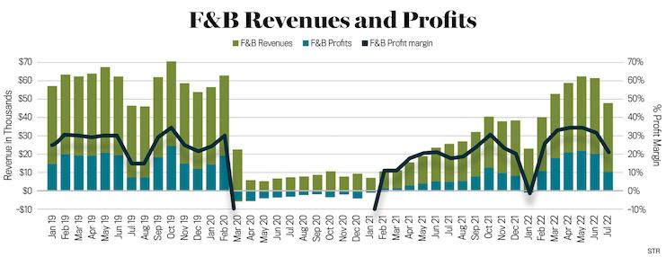

The food and beverage industry is recognized for its dynamism and diversity, specifically in terms of profit margins. This diversity is driven by distinct sub-sectors, each with unique market forces and financial benchmarks. This article examines the financial dynamics of this industry, with a focus on profit margins across food processing, nonalcoholic beverages, and alcoholic beverages. Such an exploration can be valuable for investors seeking to optimize their strategies and enhance operational efficiencies.

Profit margins are a fundamental aspect of financial performance, offering insights into a company's cost management and pricing strategies. By evaluating profit margins, stakeholders can compare industry performance and make data-driven investment decisions. The variations in profit margins across different sub-sectors—food processing, nonalcoholic beverages, and alcoholic beverages—highlight the complex landscape of the food and beverage industry.



In recent years, algorithmic trading has emerged as a significant factor influencing these financial dynamics. By employing data-driven strategies, algorithmic trading allows for rapid response to market trends, potentially improving cost efficiencies and pricing strategies. This integration of modern technology with traditional financial metrics underscores the evolving nature of the industry.

This article aims to offer a comprehensive understanding of how profit margins vary across the food and beverage sub-sectors and how algorithmic trading plays a role in shaping these outcomes. This understanding is crucial for developing informed investment strategies and optimizing the performance of companies within this sector.

## Table of Contents

## Understanding Profit Margins

Profit margin is a critical metric utilized to evaluate the performance of both companies and industries. It serves as an indicator of how well a company manages its costs relative to its revenue, which in turn can signal efficient pricing and operational strategies. To calculate profit margin, one would divide the net income by the total revenues:

$$
\text{Profit Margin (\%)} = \left( \frac{\text{Net Income}}{\text{Total Revenues}} \right) \times 100
$$

This percentage provides insight into how much profit is generated for every dollar of revenue. 

There are several types of profit margins that assess different aspects of a company's financial performance:

1. **Gross Margin**: This margin is computed by subtracting the cost of goods sold (COGS) from total revenues and dividing by total revenues. It measures how well a company can control production costs:

$$
\text{Gross Margin (\%)} = \left( \frac{\text{Total Revenues} - \text{COGS}}{\text{Total Revenues}} \right) \times 100
$$

2. **EBITDA Margin**: This margin evaluates a company's earnings before interest, taxes, depreciation, and amortization as a percentage of its total revenues. It provides a clear view of operating profitability by excluding non-operating expenses:

$$
\text{EBITDA Margin (\%)} = \left( \frac{\text{EBITDA}}{\text{Total Revenues}} \right) \times 100
$$

3. **Net Margin**: The most comprehensive of the profit margins, the net margin includes all expenses. It is calculated as net income divided by total revenues, which reflects the percentage of revenue that turns into profit:

$$
\text{Net Margin (\%)} = \left( \frac{\text{Net Income}}{\text{Total Revenues}} \right) \times 100
$$

Investors and analysts rely on these margins to compare companies within the same industry or across industries. By understanding variations in profit margins, investors can make more informed decisions and assess a company’s competitive position compared to industry averages. Companies with higher-than-average profit margins are generally viewed as more attractive investments, as they indicate effective management and potentially lower risk.

## The Food and Beverage Sector: Sub-Sectors

The food and beverage sector is a multifaceted industry that includes food processing, nonalcoholic beverages, and alcoholic beverages, each contributing to the sector's overall profit margins.

Food processing involves transforming raw ingredients into packaged food products, serving as a vital link between agriculture and consumer markets. Despite the essential nature of this sub-sector, it typically encounters lower profit margins due to intense competition, price sensitivity, and significant input costs. Its financial performance is closely tied to global supply chains, regulatory standards, and consumer trends in health and convenience.

Nonalcoholic beverages comprise products like soft drinks, juices, and bottled water, delivering higher profit margins than food processing. This sub-sector benefits from strong brand presence and consumer loyalty, often leading to premium pricing strategies. Iconic companies like Coca-Cola and PepsiCo dominate the market, leveraging economies of scale and innovative marketing to enhance profitability.

Alcoholic beverages represent another profitable sub-sector, with companies such as Anheuser-Busch InBev and Diageo exhibiting robust financial metrics. The sector's high margins stem from established brand identities, regulatory protections against new entrants, and the premiumization of products such as craft spirits and wines. These factors provide a resilient buffer against economic fluctuations, reinforcing the industry's attractive investment outlook.

Grocery stores and restaurants occupy an overlapping space within the food and beverage sector, bridging retail and service industries. Grocery stores balance between selling processed and fresh foods, often operating on thin profit margins due to competitive pricing and high operational expenses. Restaurants, on the other hand, rely on culinary innovation and customer experience to maintain profit margins, although they face challenges like labor costs and shifting consumer preferences.

Agriculture underpins the entire food and beverage sector by supplying the raw materials necessary for food processing and beverage production. However, it differs dramatically in operational dynamics and market influences, often exhibiting volatile profit margins due to dependency on weather patterns, crop yields, and international trade policies. Despite these challenges, agricultural advancements and sustainable practices are enhancing efficiency and stability in the supply chain.

Collectively, these sub-sectors combine to shape the financial landscape of the food and beverage industry, offering varied opportunities and challenges for stakeholders. Understanding their distinct roles and influences on profit margins is essential for strategic investment and operational decision-making.

## Profit Margins in Food Processing

The food processing industry is known for its relatively lower profit margins when compared to other segments within the broader food and beverage sector. Recent data indicates that the industry exhibits a gross profit margin of approximately 31.99% and a net profit margin of around 12.1%. These figures reflect the industry's balance between revenue generation and cost management, showcasing a stable yet competitive landscape.

Profit margins in food processing are heavily influenced by global market trends, including fluctuations in raw material costs, changes in consumer demand, and shifts in geopolitical dynamics. For instance, variations in commodity prices can directly impact the cost of goods sold (COGS), thereby affecting the gross profit margin. A crucial formula for calculating the gross profit margin is:

$$
\text{Gross Profit Margin} = \left( \frac{\text{Gross Profit}}{\text{Total Revenue}} \right) \times 100
$$

where Gross Profit is the difference between Total Revenue and COGS.

The industry faces continuous pressure to enhance cost-efficiency while maximizing operational output. Efficient cost management practices are vital for sustaining margins, as they help streamline operations and reduce unnecessary expenses. The adoption of advanced technologies, such as automation and digitalization, plays a significant role in optimizing production processes, reducing waste, and improving quality control. Companies that leverage these technological advancements are better positioned to maintain or increase their profit margins.

In conclusion, while the food processing industry operates within a margin environment that is generally lower than other sectors, strategic initiatives focused on cost management and technological innovations are essential for maintaining and potentially improving profitability. Decision-makers in this sector must remain vigilant to market shifts and continually seek methods to enhance operational efficiencies to sustain competitive advantage.

## Nonalcoholic Beverage Profit Margins

Nonalcoholic beverages consistently display higher profit margins compared to other segments within the food and beverage industry. This is primarily due to the significant brand value and extensive market presence of major industry players. According to recent data, gross profit margins for nonalcoholic beverages approximate 50.83%, while net margins can reach 15.22%. These metrics highlight the sector's potential for profitability and stability, which is further reinforced by the strong economic moats maintained by companies such as Coca-Cola and PepsiCo. These firms leverage brand strength and extensive distribution networks to maintain competitive advantages.

The elevated profit margins in this sector are largely attributable to several factors: brand loyalty, scale economies, and premium pricing strategies. Brand loyalty, driven by consistent consumer engagement and marketing efforts, ensures a steady demand that allows for premium pricing strategies. Economies of scale, achieved through large-scale production and distribution, further enhance profitability by reducing per-unit costs.

For investors, understanding these economic dynamics is crucial in recognizing lucrative opportunities within the nonalcoholic beverage sub-sector. The potential for sustained high margins makes this sector an attractive investment opportunity. Companies that create strong brand identities and maintain efficient operations are well-positioned to continue thriving in this competitive market landscape.

In conclusion, the nonalcoholic beverage industry's strong profit margins serve as a testament to the power of brand dominance and operational efficiency. The sector's resilience, supported by its ability to command premium prices and optimize production costs, underscores its attractiveness for potential investors seeking stable and profitable ventures.

## Alcoholic Beverage Profit Margins

The alcoholic beverage industry consistently demonstrates strong profit margins, comparable to those found in the nonalcoholic beverage sector. As of late 2023, the industry reported impressive gross profit margins of 54.11% and net profit margins of 11.47%. This profitability is underpinned by several key factors, including regulatory barriers and brand dominance, which collectively contribute to the sector's stability and attractiveness.

Regulatory barriers play a significant role in shaping the alcoholic beverage market. Governments worldwide impose stringent regulations on production, distribution, and sales, which can limit the entry of new competitors and reinforce the market position of established brands. This regulatory framework necessitates compliance costs, but it also creates a protective barrier for incumbents, reducing competitive pressures and enabling them to maintain higher margins.

Strong brand dominance is another critical [factor](/wiki/factor-investing) that supports high profit margins in the alcoholic beverage industry. Well-established brands benefit from consumer loyalty and brand recognition, allowing them to command premium pricing. Iconic brands such as Johnnie Walker, Jack Daniel's, and Budweiser have cultivated a global presence, ensuring a steady demand for their products. The strength of these brands not only facilitates higher pricing power but also sustains market share in a competitive landscape.

The combination of regulatory hurdles and brand loyalty makes the alcoholic beverage industry an appealing yet challenging prospect for potential entrants. New companies must navigate complex legal environments and establish brand equity to compete effectively. Consequently, the barriers to entry can be prohibitive, preserving the profitability of incumbents while deterring new competitors.

In summary, the alcoholic beverage industry's robust profit margins are largely driven by regulatory protections and formidable brand presence. These factors help sustain profitability and secure market dominance, making the sector attractive to investors but challenging for new market participants seeking to gain a foothold.

## Algorithmic Trading and the Food Sector

Algorithmic trading has revolutionized the food and beverage sector by using sophisticated technology to enhance investment strategies. By analyzing vast datasets, [algorithmic trading](/wiki/algorithmic-trading) facilitates data-driven decision-making, enabling swift adaptations to ever-changing market trends. This technological edge is pivotal in optimizing profit margins, as it allows for improved cost efficiencies and strategic pricing adjustments.

Mathematically, algorithmic trading can employ various quantitative models, such as mean-reversion or [momentum](/wiki/momentum) strategies, to predict market movements. For instance, a basic mean-reversion strategy could be implemented in Python as follows:

```python
import numpy as np
import pandas as pd

# Sample stock price data
data = pd.Series([100, 102, 101, 105, 107, 106, 108])

# Calculate moving average
window_size = 3
moving_average = data.rolling(window=window_size).mean()

# Identify mean-reversion signals
signals = (data < moving_average).astype(int) - (data > moving_average).astype(int)

print("Mean-Reversion Signals:", signals.tolist())
```

This code identifies potential buying opportunities when the price is below the moving average, suggesting a future increase, and selling opportunities when the price is above, indicating a potential decrease.

Investors are increasingly interested in leveraging algorithmic trading within the food and beverage market due to these models' ability to refine operational efficiencies. By adopting algorithmic approaches, investors can potentially mitigate risks associated with market [volatility](/wiki/volatility-trading-strategies), thus enhancing portfolio performance. Ultimately, the integration of algorithmic trading aligns with the pursuit of optimizing profit margins and carving a competitive advantage in the food sector.

## The Bottom Line

The food and beverage industry presents numerous investment opportunities, characterized by varying profit margins across its diverse sub-sectors. Beverage industries, particularly nonalcoholic and alcoholic, tend to offer higher profit margins in comparison to food processing. This disparity underscores their strong investment potential. For instance, nonalcoholic beverages have gross profit margins around 50.83% and net margins of 15.22%, while alcoholic beverages boast gross margins of 54.11% and net margins of 11.47%, as of late 2023. In contrast, food processing industries typically maintain lower profit margins, with recent figures indicating a gross margin of 31.99% and a net margin of 12.1%.

Navigating the complexities of the food and beverage sector effectively requires a comprehensive understanding of both traditional financial metrics and the use of modern trading technologies. Traditional metrics such as gross and net profit margins provide valuable insights into the cost management efficiencies and pricing strategies of companies. These metrics serve as essential tools for benchmarking company performance against industry averages, allowing investors to make informed decisions.

In addition to conventional financial analysis, the integration of modern trading technologies, such as algorithmic trading, has become increasingly crucial. Algorithmic trading facilitates data-driven decision-making and enables rapid adaptation to market trends, potentially optimizing profit margins by enhancing cost efficiencies and fine-tuning pricing strategies. 

Investors seeking to maximize returns in this sector should therefore focus on companies that exhibit strong economic moats—such as brand loyalty and high market entry barriers—and demonstrate a commitment to technological adoption. These characteristics offer a competitive advantage, making such companies more resilient and likely to maintain stable and high profit margins in a dynamic market environment.

## References & Further Reading

[1]: ["Global Food and Beverage Market by Product Type, Distribution Channel and Geography - Forecast and Analysis 2022-2026"](https://www.marketsandmarkets.com/Market-Reports/global-food-and-beverages-industry-outlook-31067591.html) from Research and Markets.

[2]: Kay, J. M., & Leo, G. (2018). ["The Economics of the Food and Beverage Industry"](https://www.sciencedirect.com/science/article/pii/S1364032121001507) from Routledge Publishing.

[3]: ["Advances in Financial Machine Learning"](https://www.amazon.com/Advances-Financial-Machine-Learning-Marcos/dp/1119482089) by Marcos Lopez de Prado.

[4]: ["Quantitative Trading: How to Build Your Own Algorithmic Trading Business"](https://www.amazon.com/Quantitative-Trading-Build-Algorithmic-Business/dp/1119800064) by Ernest P. Chan.

[5]: ["Profitability Ratios Analysis in the Beverage Industry"](https://www.mordorintelligence.com/industry-reports/beverages-market) published in Procedia Economics and Finance.