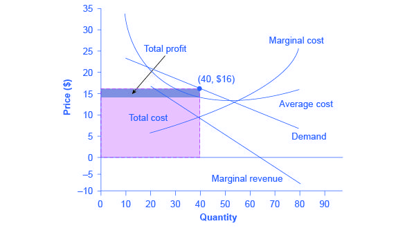

Monopolistic markets are a crucial concept in economics, characterized by the presence of many firms that sell differentiated products. Unlike a pure monopoly, where a single company dominates the entire market, monopolistic markets exhibit characteristics of both monopoly and perfect competition. The distinct feature of monopolistic markets is that each firm has some degree of market power, allowing them to influence prices because of product differentiation, such as through branding or quality variations.

Economic theories related to profit maximization are integral in understanding how firms operate within monopolistic markets. In these markets, firms aim to maximize their profits by setting marginal costs equal to marginal revenue, which is a principle that applies broadly in economics. In the short run, firms can achieve supernormal profits due to fewer competitors in localized monopolistic settings; however, in the long run, the entry of new firms erodes these profits, leading to a normal profit equilibrium.



Algorithmic trading represents a significant evolution in modern financial markets. It involves using computer algorithms to automate trading, making decisions at high speed and frequency. This technology enhances efficiency, accuracy, and cost-effectiveness in trading operations. Algorithmic trading integrates vast amounts of data, executing trades based on predefined criteria without human intervention, which distinguishes it from traditional trading practices.

Linking monopolistic market dynamics and profit maximization principles with algorithmic trading offers intriguing possibilities. In such markets, traders can leverage algorithms to anticipate market trends, optimize prices, and execute trades swiftly, aligning their strategies with profit maximization objectives. Algorithms can effectively manage the complexity of differentiating products and pricing strategies in monopolistic settings.

This article aims to provide insights into the interplay between monopolistic markets and the application of algorithmic trading strategies for profit maximization. By understanding these concepts and their integration, readers can grasp the strategic importance of technology-driven trading in complex market settings. The subsequent sections of this article will explore detailed aspects of monopolistic markets, economic theories, and the role of algorithmic trading, culminating in future trends and innovations.

## Table of Contents

## Understanding Monopolistic Markets

Monopolistic markets represent an economic structure where numerous producers offer products that are differentiated from one another. Despite the competitive environment, each seller possesses some degree of market power, allowing them to influence prices. This section explores the intricacies of monopolistic markets, touching on their definitions, characteristics, and economic implications.

**Definition and Features of a Monopolistic Market**

A monopolistic market is characterized by a large number of firms competing against each other, but unlike in perfect competition, the products they offer are not identical. Instead, there exists product differentiation, which can be based on quality, branding, location, and other features. Firms have some level of control over pricing, but not to the extent observed in a pure monopoly because the presence of close substitutes imposes a degree of competitive pressure.

**Examples of Monopolistic Markets in the Real World**

Common examples of monopolistic markets include industries such as fast food restaurants, clothing brands, and cosmetics. In these industries, firms compete on product differentiation, brand loyalty, and perceived quality. For instance, the cosmetic industry features numerous brands like L'Oréal and Maybelline, each offering unique product lines that cater to specific consumer preferences.

**Distinguishing Monopolistic Competition from Pure Monopoly and Perfect Competition**

In pure monopoly, a single firm controls the entire market, with no close substitutes for the product, hence having significant control over pricing. In contrast, perfect competition features many firms offering identical products, with no individual firm able to influence market prices. Monopolistic competition sits between these extremes. It involves many firms, but product differentiation grants them slight pricing power.

**The Role of Pricing Power and Product Differentiation**

Pricing power in monopolistic markets is directly linked to product differentiation. Firms can set prices above marginal cost due to the uniqueness of their offerings. However, the elastic nature of demand—due to the availability of substitutes—limits their ability to exploit this power fully. Successful differentiation can reduce the price elasticity of demand, enabling firms to sustain higher prices.

Mathematically, profit maximization in this context involves setting marginal revenue (MR) equal to marginal cost (MC), where MR is derived from the demand curve influenced by differentiated products:

$$
MR = \frac{\partial TR}{\partial Q}
$$
$$
MC = \frac{\partial TC}{\partial Q}
$$

**Economic Implications and Challenges Associated with Monopolistic Markets**

Monopolistic markets offer both advantages and challenges. They promote innovation and variety due to competitive pressures to differentiate products. However, they may lead to inefficiencies such as excess capacity and non-price competition, which can incur additional costs. Firms might prioritize marketing and product development over price reductions, leading to higher prices for consumers compared to perfect competition.

In summary, monopolistic markets occupy a unique position within economic theory, offering an environment that balances competition with differentiation. Understanding these dynamics helps elucidate how firms navigate complex market structures to optimize profitability.

## Economic Theories of Profit Maximization

Profit maximization is a fundamental concept in economics, referring to the process by which a firm determines the price and output level that generates the maximum possible profit. In economic terms, profit is the difference between total revenue and total costs. Profit maximization is crucial as it serves as the primary objective for most firms, influencing their operational and strategic decisions. This concept forms the cornerstone of various economic models, guiding firms in their pursuit of efficient resource allocation and optimal output levels.

### Models of Profit Maximization in Monopolistic Markets

1. **Traditional Model**: In monopolistic markets, firms are characterized by some degree of pricing power due to product differentiation. The traditional approach to profit maximization involves equating marginal cost (MC) with marginal revenue (MR). The firm's profit is maximized when these two values are equal, ensuring that any additional unit sold adds more to revenue than it does to cost. Mathematically, this condition is expressed as:
$$
   MR = MC

$$

   The firm's profit is given by:
$$
   \pi = TR - TC

$$

   where $\pi$ is profit, $TR$ is total revenue, and $TC$ is total cost.

2. **Behavioral Models**: Some models consider behavioral aspects, positing that firms may prioritize other objectives alongside profit maximization, such as market share or revenue growth. These models incorporate bounded rationality and the impact of managerial decisions, which may deviate from strict profit-maximizing behavior.

### Short-run versus Long-run Profit Maximization

In the short run, firms operate with fixed resources and capacity, which limits their ability to adjust production levels significantly. During this period, firms focus on setting prices that cover variable costs and contribute to fixed costs, aiming to maximize profit within these constraints. Short-run profit maximization can often involve tactical pricing adjustments and marketing efforts to differentiate products further.

In contrast, long-run profit maximization allows for adjustments in all inputs, enabling firms to alter their production facilities, innovate, and invest in new technologies. Long-run strategies often involve optimal scale of operations, cost structure optimization, and sustainable competitive advantage. Firms consider economies of scale and scope to enhance their profitability.

### Graphical and Mathematical Representation

Graphically, the profit maximization point in the model of monopolistic competition is where the firm's MC curve intersects its MR curve. At this point, the slope of the total revenue curve is equal to the slope of the total cost curve:

$$

\frac{d(TR)}{dQ} = \frac{d(TC)}{dQ} 
$$

Mathematically, firms seek to maximize the function:

$$

\pi(Q) = TR(Q) - TC(Q) 
$$

where $Q$ is the quantity of output. Taking the derivative with respect to $Q$ and setting it to zero gives:

$$

\frac{d\pi}{dQ} = \frac{d(TR)}{dQ} - \frac{d(TC)}{dQ} = 0 
$$

This condition confirms that profit is maximized when MR equals MC.

### Critiques and Limitations

The traditional theory of profit maximization has been critiqued for its assumptions of rationality and complete information. Real-world conditions often involve uncertainty, information asymmetry, and complex competitive dynamics that can lead firms to substitute short-term goals for traditional profit maximization. Furthermore, externalities, government regulations, and market imperfections can impede optimal profit conditions prescribed by traditional models.

Additionally, behavioral economics suggests that cognitive biases and heuristics influence decision-making, challenging the notion that firms always strive for maximum profit. Strategies such as satisficing, where firms aim for satisfactory rather than optimal outcomes, reflect real-world business practices not entirely captured by strict profit maximization models.

In summary, while traditional economic theories on profit maximization provide a foundational understanding, they are often supplemented by more nuanced models considering practical business constraints and human behavior.

## Algorithmic Trading: An Overview

Algorithmic trading refers to the process of executing orders using pre-programmed and automated trading instructions accounting for variables such as time, price, and [volume](/wiki/volume-trading-strategy). This modern trading strategy has evolved significantly since its inception in the 1970s when it was primarily used by institutional investors to manage trades at better prices and improve execution efficiencies. Over time, advancements in technology, the proliferation of electronic trading platforms, and the increase in market data availability have propelled the widespread adoption of [algorithmic trading](/wiki/algorithmic-trading).

The key components of an algorithmic trading system include trading algorithms, market data feeds, order management systems, and execution platforms. The trading algorithm codifies the strategy and decision-making rules. This involves parsing real-time market data feeds to generate trading signals. The order management system handles order routing and execution, typically interfacing with financial exchanges or dark pools to complete trades.

Algorithmic trading offers several benefits, making it an attractive option for traders. One of the most notable is speed. Computers can process market data and execute orders much faster than human traders. This speed translates into more accurate order placement and the ability to take advantage of brief market opportunities, often within fractions of a second. Additionally, algorithmic trading reduces costs by minimizing the impact of human errors and allowing for the execution of numerous trades simultaneously, which translates to lower transaction fees.

Common strategies employed in algorithmic trading include [arbitrage](/wiki/arbitrage) and [trend following](/wiki/trend-following). Arbitrage strategies exploit price discrepancies of the same asset across different markets or asset classes, thereby ensuring a profit from these discrepancies. For example, [statistical arbitrage](/wiki/statistical-arbitrage) uses mathematical models to forecast price movements and capitalize on expected price changes. 

Trend following, on the other hand, involves algorithms that identify and execute trades based on upward or downward market movements. These strategies are primarily driven by technical indicators, which help recognize sustained price movements, allowing traders to 'ride the trend' until reversal signals are detected.

Despite its advantages, algorithmic trading is not without its challenges and risks. Developing effective trading algorithms requires not only sophisticated models but also significant computing power and access to vast amounts of data. Moreover, the high speed and volume of transactions can exacerbate market [volatility](/wiki/volatility-trading-strategies), often leading to flash crashes. Regulatory risks are also prevalent, as algorithms must comply with market rules that differ across jurisdictions. Additionally, trading algorithms can face operational risks due to software glitches or network outages, which can have significant financial consequences.

Overall, algorithmic trading represents a fundamental shift in trading practices, driven by data science and technological innovation. While it provides avenues for enhanced trading performance, it also necessitates diligence and adherence to rigorous risk management protocols.

## The Intersection of Monopolistic Markets, Profit Maximization, and Algo Trading

Algorithmic trading, a method that uses algorithms to automate trading decisions, can be exceptionally advantageous in monopolistic markets. These markets are characterized by a few dominant firms holding significant market power, allowing them to set prices and influence market dynamics. By harnessing the power of algorithmic trading, firms can further enhance their ability to maximize profits within such environments.

### Leveraging Algorithmic Trading in Monopolistic Markets

Algorithmic trading can be particularly effective in monopolistic markets due to its speed and accuracy. These traits are vital as firms analyze large datasets to identify lucrative trading opportunities. Algorithms can instantly process and react to market signals that indicate demand fluctuations or competitor actions, providing a competitive edge in decision-making.

### Strategies for Profit Maximization through Algo Trading

In monopolistic environments, firms can employ algorithmic trading strategies such as arbitrage and market-making. Arbitrage algorithms exploit price discrepancies for assets across different markets or time frames, ensuring profits with minimal risk. Market-making algorithms, meanwhile, facilitate [liquidity](/wiki/liquidity-risk-premium) by providing buy and sell quotes, capturing the bid-ask spread for profit.

For instance, the profit maximization condition in economics, where marginal cost equals marginal revenue (MC = MR), can be dynamically monitored and adjusted by algorithms to adapt to real-time market changes. Algorithms can help optimize pricing in response to competitor actions by continuously analyzing and adjusting to maintain equilibrium near this condition.

### Role of Data and Technology in Enhancing Trading Decisions

Data is the bedrock of algorithmic trading. By leveraging big data analytics and [machine learning](/wiki/machine-learning), firms can derive insights from historical and real-time market data. Machine learning models can predict market trends, identify patterns, and refine trading strategies over time. Technologies such as natural language processing (NLP) can analyze news and social media sentiment to predict market movements.

For example, a Python-based machine learning model can predict stock price movements based on historical trading data:

```python
from sklearn.model_selection import train_test_split
from sklearn.ensemble import RandomForestRegressor
import pandas as pd

# Load and prepare data
data = pd.read_csv('market_data.csv')
features = data.drop('price', axis=1)
target = data['price']

# Split the data
X_train, X_test, y_train, y_test = train_test_split(features, target, test_size=0.2, random_state=42)

# Train the model
model = RandomForestRegressor(n_estimators=100)
model.fit(X_train, y_train)

# Predict and evaluate
predictions = model.predict(X_test)
```

### Case Studies of Successful Trading Algorithms

While specific case studies in monopolistic markets may be proprietary and confidential, success stories like Renaissance Technologies exemplify the potential of algorithm-driven trading. Renaissance Technologies uses mathematical models and algorithms to exploit market inefficiencies, [earning](/wiki/earning-announcement) remarkable returns and showcasing the strategic potential of such approaches.

### Potential Pitfalls and Ethical Considerations

Despite the advantages, algorithmic trading in monopolistic markets is not without its pitfalls. The concentration of power in a few firms can lead to market manipulation risks, where algorithms might be employed to create false price movements or hamper healthy competition. This behavior raises significant ethical concerns and potential violations of anti-trust laws.

Moreover, the reliance on algorithms poses systemic risks; algorithmic failures can catalyze rapid and large-scale market disruptions, as evidenced by events like the 2010 "Flash Crash." Firms need to establish robust risk management protocols and ensure compliance with regulations to mitigate these risks.

In conclusion, leveraging algorithmic trading in monopolistic markets can provide competitive advantages and enhance profit maximization. However, firms must navigate ethical considerations and potential pitfalls to sustain long-term success.

## Future Trends and Innovations

Emerging technologies are likely to significantly influence algorithmic trading by introducing new capabilities, improving efficiency, and driving innovation. A notable technological advancement in this area is the integration of [artificial intelligence](/wiki/ai-artificial-intelligence) (AI) and machine learning (ML) into trading algorithms. These technologies enhance the ability of trading systems to analyze vast datasets rapidly and identify patterns that are not easily detectable by traditional statistical methods. As a result, traders can develop more adaptive and responsive strategies that assess market conditions more accurately and execute trades more effectively.

AI and ML technologies are particularly potent in refining trading algorithms through their capacity to engage in predictive analytics. By leveraging historical data, these systems can generate forecasts about market behavior, aiding traders in navigating changes within monopolistic markets. Such predictions allow for a proactive approach, where trading strategies can be adjusted in anticipation of market shifts, rather than as a reaction to them.

Simultaneously, regulatory developments will play a crucial role in shaping the landscape for algorithmic trading and monopolistic markets. Government agencies and financial regulatory bodies are increasingly focused on ensuring that algorithmic trading practices do not compromise market fairness, transparency, or stability. These regulations could dictate the development and deployment of algorithmic trading systems by mandating compliance with specific standards and imposing constraints on particular trading activities. Companies involved in algorithmic trading must remain vigilant and adaptive, ensuring that their systems and strategies align with evolving regulatory requirements.

Businesses can prepare and evolve with these trends by investing in cutting-edge technologies, fostering a culture of continuous learning, and ensuring regulatory compliance. By staying abreast of technological advancements and regulatory changes, companies will be better positioned to sustain profitability in an increasingly competitive and technologically driven marketplace. Furthermore, integrating AI and ML technologies into trading strategies will not only enhance decision-making processes but also provide a significant edge by enabling more precise market predictions and adaptive strategy adjustments.

## Conclusion

In this article, we explored the intricate relationships between monopolistic markets, profit maximization, and algorithmic trading. Through our analysis, it became clear that understanding economic principles is crucial for effectively navigating and capitalizing on these markets. Companies operating in monopolistic environments often enjoy unique advantages such as pricing power and product differentiation, allowing for distinctive profit maximization strategies. Simultaneously, algorithmic trading has revolutionized the financial landscape by enhancing speed, accuracy, and cost efficiency in executing trades.

Strategically integrating these economic principles with technology-driven trading can lead to substantial gains. Algorithmic trading can optimize decision-making processes in monopolistic markets, leveraging data and technology to refine profit maximization strategies. However, as businesses adopt these advanced methods, balancing innovation with ethical and regulatory considerations becomes essential. The rapid pace of technological advancements necessitates a comprehensive understanding of potential pitfalls, including ethical dilemmas and compliance issues, which must be managed diligently.

For readers interested in a deeper understanding, further study and exploration in this dynamic field are encouraged. Engaging with academic resources and industry publications can provide additional insights into the complexities of monopolistic markets and algorithmic trading. Recommended readings include works on microeconomic theory and publications on the latest advancements in financial technology.

In conclusion, the field of monopolistic markets and algorithmic trading presents a multitude of opportunities for innovation and growth. By embracing both economic theory and technological advancement, businesses can position themselves for sustained profitability in increasingly competitive markets.

## References & Further Reading

[1]: Bergstra, J., Bardenet, R., Bengio, Y., & Kégl, B. (2011). ["Algorithms for Hyper-Parameter Optimization."](https://papers.nips.cc/paper/4443-algorithms-for-hyper-parameter-optimization) Advances in Neural Information Processing Systems 24.

[2]: ["Advances in Financial Machine Learning"](https://www.amazon.com/Advances-Financial-Machine-Learning-Marcos/dp/1119482089) by Marcos Lopez de Prado

[3]: ["Evidence-Based Technical Analysis: Applying the Scientific Method and Statistical Inference to Trading Signals"](https://www.amazon.com/Evidence-Based-Technical-Analysis-Scientific-Statistical/dp/0470008741) by David Aronson

[4]: ["Machine Learning for Algorithmic Trading"](https://github.com/stefan-jansen/machine-learning-for-trading) by Stefan Jansen

[5]: ["Quantitative Trading: How to Build Your Own Algorithmic Trading Business"](https://www.amazon.com/Quantitative-Trading-Build-Algorithmic-Business/dp/1119800064) by Ernest P. Chan