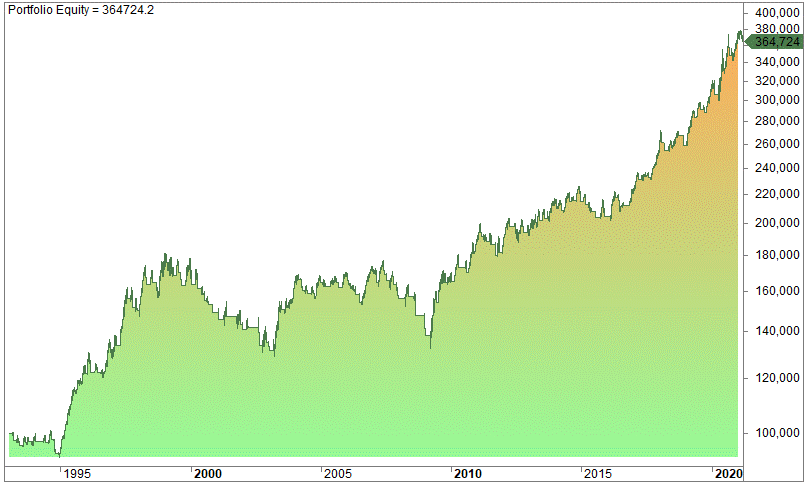

In the evolving world of finance, algorithmic trading has become integral for many traders looking to capture quick profits in volatile markets. As the trading landscape continues to shift towards automation and data-driven decisions, key technical indicators like bands and channels play a crucial role in developing effective trading strategies. These tools help traders interpret market signals, assess volatility, and make informed decisions, thereby providing an edge in competitive financial environments.

This article focuses on the use of bands and channels, specifically Keltner Channels, Donchian Channels, and STARC Bands, to enhance trading strategies. Each of these indicators offers unique methodologies for evaluating market conditions. Keltner Channels, for instance, provide a dynamic approach by adjusting to market volatility, while Donchian Channels are effective for identifying breakout trends. STARC Bands, on the other hand, help traders evaluate risk and identify optimal entry and exit points.



Understanding how these indicators function involves an examination of their construction and the mathematical principles underlying them. Bands and channels often incorporate moving averages and volatility measures, such as the Average True Range (ATR) or standard deviation, to provide insights into price movements and market trends.

The integration of these indicators into algorithmic trading strategies allows traders to automate their decision-making processes and improve the consistency of their trades. Algorithmic trading platforms, like Python-based systems, offer tools to seamlessly incorporate these indicators, bolstering a trader's ability to optimize their strategies.

In summary, this article will explore how Keltner Channels, Donchian Channels, and STARC Bands can be used in algorithmic trading to maximize profits, highlighting the potential that these tools hold for traders seeking to navigate the complexities of modern financial markets.

## Table of Contents

## Understanding Bands and Channels

Bands and channels are essential technical analysis tools utilized to assess market conditions and foresee potential price movements. These tools help traders make informed decisions by visualizing volatility, trend direction, and potential reversals or breakouts.

Among the most prevalent bands and channels are Bollinger Bands, Keltner Channels, Donchian Channels, and STARC Bands. Each of these tools provides distinct insights into market dynamics, primarily focusing on [volatility](/wiki/volatility-trading-strategies) and trend directions:

1. **Bollinger Bands**: Created by John Bollinger in the 1980s, Bollinger Bands consist of a middle band, typically a simple moving average (SMA), and two outer bands. These outer bands are calculated by adding and subtracting a specified number of standard deviations from the SMA. The formula for Bollinger Bands is:
$$
   \text{Upper Band} = \text{SMA} + (n \cdot \text{Standard Deviation})

$$
$$
   \text{Lower Band} = \text{SMA} - (n \cdot \text{Standard Deviation})

$$

   The distance between the upper and lower bands varies based on market volatility, providing insights into potential price breakouts and changes in volatility.

2. **Keltner Channels**: Developed by Chester Keltner and subsequently modified, Keltner Channels employ the Exponential Moving Average (EMA) and Average True Range (ATR) to construct the bands. The formula is as follows:
$$
   \text{Upper Band} = \text{EMA} + (n \cdot \text{ATR})

$$
$$
   \text{Lower Band} = \text{EMA} - (n \cdot \text{ATR})

$$

   The use of ATR instead of standard deviation allows Keltner Channels to offer a more adaptive measure of volatility, which is particularly advantageous in fluctuating markets.

3. **Donchian Channels**: Introduced by Richard Donchian, these channels use the highest high and lowest low over a predetermined number of periods to define their boundaries. This tool is particularly effective for identifying breakouts and new trends. The calculation is straightforward:
$$
   \text{Upper Band} = \max(\text{High}_n)

$$
$$
   \text{Lower Band} = \min(\text{Low}_n)

$$

   where $\text{High}_n$ and $\text{Low}_n$ represent the highest and lowest prices over the last $n$ periods.

4. **STARC Bands**: An acronym for Stoller Average Range Channels, named after the analyst Manning Stoller, STARC Bands integrate the ATR to create bands around a central moving average, similar to Keltner Channels. The bands are defined as follows:
$$
   \text{Upper Band} = \text{SMA} + (n \cdot \text{ATR})

$$
$$
   \text{Lower Band} = \text{SMA} - (n \cdot \text{ATR})

$$

   STARC Bands are valued for their ability to highlight high and low-risk trading opportunities based on the price's proximity to the bands.

These tools' construction often involves moving averages, such as SMA or EMA, and measures of volatility, like the ATR or standard deviation, providing a comprehensive view of market behavior. By effectively employing bands and channels, traders can better anticipate market changes, strategically plan entry and [exit](/wiki/exit-strategy) points, and optimize their trading strategies.

## Keltner Channels: flexibility and adaptability

Keltner Channels are crucial tools for traders seeking flexibility and adaptability in their trading strategies. Developed in the 1960s by Chester Keltner, these channels are constructed using the Exponential Moving Average (EMA) and Average True Range (ATR) to offer a volatility-adjusted perspective of the market. This dual-component construction enables Keltner Channels to seamlessly adapt to varying market conditions, providing valuable insights for both trend-following and mean-reversion strategies.

The basic formula for Keltner Channels involves three components: the middle line, which is the EMA, and the upper and lower bands, which are defined using the ATR. The EMA provides a smoothed line of the market's average price over a specific period, helping to highlight the underlying trend. The ATR, calculated as the moving average of the true ranges of the price during the specified period, measures market volatility. The bands are calculated as follows:

- **Middle line (EMA):** $\text{EMA} = \frac{2}{n+1} \left( \sum_{i=1}^{n} p_i - \text{previous EMA} \right)$
- **Upper band:** $\text{Upper band} = \text{EMA} + K \times \text{ATR}$
- **Lower band:** $\text{Lower band} = \text{EMA} - K \times \text{ATR}$

Here, $n$ is the period for the EMA, and $K$ is a constant multiplier typically set to two for the upper and lower bands.

This construction allows Keltner Channels to be highly responsive to market shifts, capturing both trending and oscillating price movements. When the price moves toward the upper band, it might indicate an overbought condition, potentially prompting a reversal or continuation depending on the broader context of market trends. Conversely, when the price moves toward the lower band, it could signal an oversold condition.

The adaptability of Keltner Channels allows traders to swiftly respond to changing market conditions. Their construction ensures that traders can identify entry and exit points that align with their strategic objectives. For example, in trend-following strategies, traders might look for breaks above or below these bands to initiate trades in the direction of the trend. In mean-reversion strategies, traders might interpret touches or breaches of the bands as signals to counter the current price movement and trade toward the middle line.

Overall, Keltner Channels offer traders a robust framework for navigating volatile markets, enhancing their ability to anticipate price movements and capitalize on market opportunities efficiently.

## Donchian Channels: capturing breakouts

Donchian Channels are a technical analysis tool designed to aid traders in identifying potential [breakout](/wiki/breakout-trading) opportunities in markets such as [forex](/wiki/forex-system) and futures. Developed by Richard Donchian, a significant figure in trend-following strategies, these channels are constructed by determining the highest high and the lowest low over a specified number of periods. The straightforward nature of Donchian Channels makes them a favorite among traders aiming to identify the commencement of new market trends.

The computation of Donchian Channels involves three lines: the upper band, the lower band, and the median. The upper band is constructed by identifying the highest high over a defined period, while the lower band reflects the lowest low over the same timeframe. The median can be calculated as the average of these two bands:

$$
\text{Upper Band} = \max(\text{High}_i, \text{High}_{i-1}, ..., \text{High}_{i-n+1})
$$

$$
\text{Lower Band} = \min(\text{Low}_i, \text{Low}_{i-1}, ..., \text{Low}_{i-n+1})
$$

$$
\text{Median} = \frac{\text{Upper Band} + \text{Lower Band}}{2}
$$

Donchian Channels are particularly known for generating clear buy and sell signals. A breakout above the upper band may signal a buying opportunity, indicating potential upward [momentum](/wiki/momentum), while a drop below the lower band can signal a selling opportunity. These signals are vital for traders seeking to ride emerging trends from the early stages.

In practice, Donchian Channels are most effective in trending markets. Their simplicity allows them to filter out market noise and focus on significant price movements. Traders often adjust the period length to tailor the channel's sensitivity to align with specific trading strategies. Shorter periods can capture more frequent breakouts, suitable for volatile markets, while longer periods are more adept at identifying sustained trends.

For [algorithmic trading](/wiki/algorithmic-trading), Donchian Channels can be coded easily into trading systems. Here is a simple Python example using the pandas library to calculate Donchian Channels:

```python
import pandas as pd

def donchian_channels(data, window):
    data['Upper Band'] = data['High'].rolling(window=window).max()
    data['Lower Band'] = data['Low'].rolling(window=window).min()
    data['Median'] = (data['Upper Band'] + data['Lower Band']) / 2
    return data

# Assuming 'data' is a DataFrame with 'High' and 'Low' columns
donchian_channels(data, window=20)
```

This algorithmic approach allows traders to integrate Donchian Channels with automated trading systems, enhancing their capacity to capture market breakouts efficiently.

## STARC Bands: a measure of risk

STARC Bands (Stoller Average Range Channels) are a technical analysis tool that helps quantify risk by incorporating volatility into market assessments. These bands are constructed around a simple moving average (SMA) using the Average True Range (ATR) to gauge market volatility, thereby creating bands that adjust based on market conditions.

The construction of STARC Bands involves three components: the central SMA, an upper band, and a lower band. The upper and lower bands are calculated by adding and subtracting a multiple of the ATR to and from the SMA, respectively. Mathematically, they are expressed as follows:

$$
\text{Upper Band} = \text{SMA} + m \times \text{ATR}
$$
$$
\text{Lower Band} = \text{SMA} - m \times \text{ATR}
$$

where $m$ is a multiplier that determines the distance of the bands from the SMA. 

STARC Bands assist traders by identifying potential high-risk and low-risk trade opportunities. When the price moves above the upper band, it typically signals a low-risk opportunity to sell, indicating overbought market conditions. Conversely, when the price dips below the lower band, it suggests a low-risk buying opportunity, reflecting oversold conditions. This risk-return profiling helps traders make informed decisions based on anticipated market moves and associated risks, allowing for more precise trading strategies.

## Implementing Bands and Channels in Algorithmic Trading

Algorithmic traders can leverage bands and channels to identify optimal entry and exit points in financial markets. These technical indicators, such as Keltner Channels, Donchian Channels, and STARC Bands, offer profound insights into market dynamics, which can be harnessed to develop precise trading strategies.

**Integration with Python and Quantitative Platforms**

Python, with its robust scientific libraries like Pandas, NumPy, and TA-Lib, provides a solid foundation for integrating bands and channels into algorithmic trading systems. These libraries offer pre-built functions to calculate technical indicators, allowing traders to focus on strategy development rather than computational implementation.

For instance, a simple implementation of the Keltner Channel in Python might look like this:

```python
import pandas as pd
import numpy as np

def calculate_keltner_channel(data, window=20, atr_multiplier=2):
    data['EMA'] = data['Close'].ewm(span=window, adjust=False).mean()
    data['ATR'] = data['High'].rolling(window).max() - data['Low'].rolling(window).min()
    data['Upper_Band'] = data['EMA'] + atr_multiplier * data['ATR']
    data['Lower_Band'] = data['EMA'] - atr_multiplier * data['ATR']
    return data

# Assuming 'df' is a pandas DataFrame with Close, High, and Low columns
keltner_channel_df = calculate_keltner_channel(df)
```

**Backtesting for Strategy Optimization**

Backtesting is a critical component in the development of algorithmic trading systems, providing a retrospective analysis of how a strategy would have performed using historical data. By simulating trades with bands and channels, traders can optimize strategy parameters and validate the reliability of their trading systems.

For instance, using the historical data of a particular stock index, a trader can backtest a strategy using Keltner Channels to see how often positions hit the upper or lower bands and adjust their trading approach accordingly.

**Combining with Other Indicators**

To improve signal accuracy and robustness of trading strategies, traders often combine bands and channels with other indicators, such as the Relative Strength Index (RSI). The RSI can signal overbought or oversold conditions, adding an additional layer of validation to the signals generated by bands and channels.

For example, a strategy might involve buying a security when the price hits the lower band of the Keltner Channel while the RSI indicates an oversold condition. This dual-indicator approach could potentially increase trading accuracy by confirming signals across multiple dimensions of analysis.

By systematically applying bands and channels in conjunction with other indicators and rigorous [backtesting](/wiki/backtesting), algorithmic traders can enhance their ability to capture profitable market opportunities while managing risk more effectively.

## Comparing Bands and Channels

Each band and channel offers distinct features that cater to varied market environments, enabling traders to implement strategies best suited to current conditions. Keltner Channels and Bollinger Bands, despite serving similar functions, demonstrate unique strengths in differing market scenarios, providing valuable insights to traders.

Keltner Channels are particularly effective in markets characterized by smooth and persistent trends. Their construction relies on the Exponential Moving Average (EMA) and the Average True Range (ATR) to define the channel's boundaries. This configuration allows the channels to expand and contract in response to market volatility, presenting a steady framework for traders who focus on trend-following strategies. The central EMA line helps traders identify the predominant market trend, while the ATR-based boundaries signal potential entry or exit points when market prices breach these levels.

In contrast, Bollinger Bands are designed to detect volatility spikes, making them suitable for markets with abrupt price fluctuations. Comprised of a Simple Moving Average (SMA) and standard deviation-based bands, Bollinger Bands expand during periods of high volatility and contract when volatility diminishes. This characteristic makes them an excellent tool for traders seeking to capitalize on sudden price movements. By observing the width of the bands, traders can assess the current market volatility and predict possible breakout points. The divergence between Bollinger Bands and Keltner Channels highlights the necessity for traders to select the right indicator based on their analysis of market conditions and trading objectives.

Choosing between these tools hinges on understanding trading goals and prevailing market conditions. Traders aiming to ride sustained trends with minimal noise might find Keltner Channels preferable. On the other hand, those interested in responding rapidly to market fluctuations may opt for Bollinger Bands. This flexibility in tool selection allows traders to better synchronize their strategies with desired outcomes.

Recognizing these differences equips traders with the insight needed to align their technical analysis tools with trading objectives. By leveraging the unique attributes of each band and channel, traders can enhance their ability to exploit market inefficiencies while optimizing their risk management practices.

## Conclusion

Bands and channels are invaluable tools for traders looking to optimize their profit strategies. Each indicator, including Keltner Channels, Donchian Channels, and STARC Bands, brings unique insights that, when used correctly, can significantly enhance trading outcomes. Keltner Channels, with their reliance on the Exponential Moving Average (EMA) and Average True Range (ATR), offer a dynamic approach to adjusting for market volatility, making them adaptable to changing market conditions. Donchian Channels, by employing the highest high and lowest low over a specific period, excel at capturing breakout opportunities, thus marking the beginning of potential new trends. STARC Bands, through their use of ATR to measure volatility, highlight high and low-risk trading opportunities, enabling traders to make informed decisions based on risk assessments.

By incorporating these indicators in algorithmic trading, traders are better equipped to identify and exploit market inefficiencies. The integration of such indicators into automated strategies allows for more precise entry and exit points, maximizing potential profits while managing risks effectively. Utilizing programming languages like Python, traders can backtest and refine their algorithms using historical data to ensure reliability and effectiveness. 

Continuous learning and adaptation to the evolving market landscape are crucial for traders aiming to leverage these tools successfully. As market dynamics shift, so too must the strategies employed, necessitating ongoing updates to trading algorithms and the addition of complementary indicators to maintain an edge. This iterative process helps ensure that trading strategies remain robust and capable of responding efficiently to new market challenges and opportunities.

## References & Further Reading

[1]: Keltner, C. (1960). ["How to Make Money in Commodities."](https://www.amazon.com/Make-Money-Commodities-Chester-Keltner/dp/B000KU0XK2) Traders Press.

[2]: Pring, M. J. (2002). ["Technical Analysis Explained,"](https://www.amazon.com/Technical-Analysis-Explained-Fifth-Successful/dp/0071825177) McGraw-Hill Education.

[3]: Kaufman, P. J. (2013). ["Trading Systems and Methods,"](https://onlinelibrary.wiley.com/doi/book/10.1002/9781119202561) John Wiley & Sons.

[4]: Bollinger, J. (2002). ["Bollinger on Bollinger Bands."](https://archive.org/download/BollingerOnBollingerBands/Bollinger%20On%20Bollinger%20Bands.pdf) McGraw-Hill.

[5]: "Integrating Technical Indicators for Trading Strategies." [TA-Lib Documentation](https://technical.freqtrade.io/1.5.0/developer/).

[6]: Murphy, J. J. (1999). ["Technical Analysis of the Financial Markets: A Comprehensive Guide to Trading Methods and Applications"](https://archive.org/details/technicalanalysi0000murp), New York Institute of Finance.