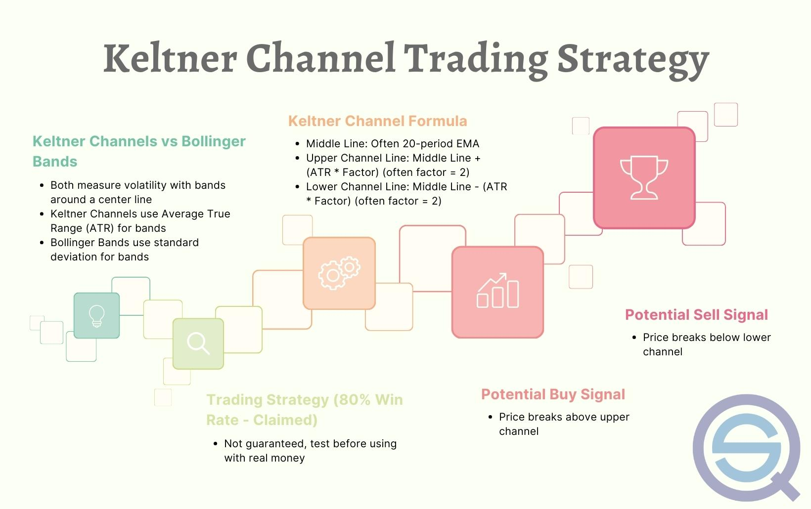

## Table of Contents

## What are bands and channels in the context of finance?

In finance, bands refer to the range within which a financial asset's price moves over a period of time. Imagine a rubber band stretching and contracting; similarly, the price of a stock or currency might move up and down but stays within a certain range. This concept is useful for traders and investors who use it to predict future price movements. If a price stays within a band, it suggests stability, whereas breaking out of a band can signal a big change in the market.

Channels, on the other hand, are similar to bands but are more specific. They are created by drawing two parallel lines on a price chart, one above and one below the current price trend. These lines represent the upper and lower limits of where the price is expected to move. Traders use channels to identify potential buying and selling points. For example, if a price hits the lower channel line, it might be a good time to buy, expecting the price to bounce back up. Conversely, hitting the upper line might suggest selling, anticipating a drop in price.

## How do beginners identify bands and channels on financial charts?

To identify bands on a financial chart, beginners should look for a clear range in which the price of an asset moves over time. Imagine drawing a line at the highest price points and another at the lowest price points within a certain period. If these lines create a clear upper and lower boundary that the price stays within, you've found a band. It's like seeing a road with clear edges; the price travels between these edges. Beginners can use tools on trading platforms that automatically draw these lines to make it easier.

Channels are a bit more specific but still easy to spot. Start by finding a trend on the chart, which could be an upward, downward, or sideways movement. Once you see the trend, draw a straight line along the trend's direction, connecting the highs or lows of the price movement. Then, draw another parallel line that touches the opposite highs or lows. If these two lines create a clear path that the price follows, you've identified a channel. Think of it as drawing a lane on the road for the price to travel in. Many trading platforms have tools that can help draw these lines accurately, making it simpler for beginners to spot channels.

## What is the basic concept of using bands and channels for profit strategies?

The basic idea of using bands and channels for making profits is to buy low and sell high within these defined ranges. When you see a price hitting the lower band or the bottom of a channel, it might be a good time to buy. The thinking is that the price will bounce back up towards the middle or even the top of the band or channel. On the flip side, when the price touches the upper band or the top of a channel, it could be a signal to sell. You expect the price to drop back down, and you can make a profit from the difference between your buying and selling prices.

This strategy works because bands and channels help predict where the price might go next. If the price stays within the band or channel, you can make small but steady profits by trading within these ranges. However, it's important to watch out for when the price breaks out of the band or channel. A breakout can mean a big change in the market, and it might be a chance to make bigger profits if you can predict the new direction correctly. Always remember, though, that trading involves risks, and it's wise to learn more and practice before using real money.

## Can you explain the difference between Bollinger Bands and Keltner Channels?

Bollinger Bands and Keltner Channels are both tools used to understand how a stock or any financial asset is moving, but they are made differently. Bollinger Bands have a middle line which is the average price of the asset over a certain time, and then there are two other lines above and below it. These outer lines move based on how much the price is jumping around, called volatility. If the price is jumping a lot, the bands get wider, and if it's not jumping much, they get closer together. This helps traders see if a price is going to keep moving the same way or if it might change direction.

Keltner Channels, on the other hand, also have a middle line that shows the average price, but the lines above and below it are set differently. They use something called the Average True Range (ATR), which measures how much the price moves up and down over time. The outer lines of the Keltner Channels stay a fixed distance from the middle line, based on the ATR. This means they don't change as much as Bollinger Bands do. Traders use Keltner Channels to see if a price is moving too far from what's normal and might come back to the middle.

Both tools help traders make decisions about buying or selling, but they work a bit differently. Bollinger Bands are good for seeing if the price might change direction because they show how much the price is moving around. Keltner Channels are useful for seeing if the price is getting too far away from the average and might come back. Each tool can help traders in different ways, depending on what they're looking for in the market.

## How do traders use bands and channels to determine entry and exit points?

Traders use bands and channels to find good times to buy and sell. When a price touches the lower band or the bottom of a channel, traders might see it as a good time to buy. They think the price will go up again, back to the middle or even the top of the band or channel. For example, if a stock price hits the lower Bollinger Band, a trader might buy it, expecting it to rise. The same goes for Keltner Channels; if the price touches the bottom line, it might be a signal to buy, hoping for the price to move back towards the middle.

On the other hand, when the price reaches the upper band or the top of a channel, traders might think it's a good time to sell. They expect the price to go down again, back to the middle or the bottom. For instance, if a stock's price hits the upper Bollinger Band, a trader might sell it, hoping to make a profit before the price drops. Similarly, if the price touches the top line of a Keltner Channel, it might be a signal to sell, anticipating the price to fall back down. By using these tools, traders can make decisions about when to enter and exit trades based on where the price is within the bands or channels.

## What are some common mistakes beginners make when using bands and channels?

One common mistake beginners make when using bands and channels is not understanding that these tools are not perfect. They think if a price hits the bottom of a band or channel, it will always go back up, or if it hits the top, it will always go down. But the market can be unpredictable, and sometimes the price will keep going down even after hitting the bottom, or keep going up after hitting the top. Beginners need to remember that bands and channels are just guides, not guarantees.

Another mistake is relying too much on just one tool. Beginners might focus only on Bollinger Bands or Keltner Channels and ignore other important information like news about the company or the overall market trend. Using bands and channels along with other tools and information can give a fuller picture of what might happen next. It's like using a map and a compass together; they both help you find your way, but using them together is even better.

## How can bands and channels be combined with other technical indicators for better results?

Combining bands and channels with other technical indicators can help traders make better decisions. For example, a trader might use the Relative Strength Index (RSI) along with Bollinger Bands. If the price hits the lower Bollinger Band and the RSI shows the stock is oversold (usually below 30), it might be a strong signal to buy. The RSI adds extra information about whether the price is likely to go up, making the decision to buy more confident. Similarly, if the price touches the upper Bollinger Band and the RSI is overbought (usually above 70), it might be a good time to sell. Using both tools together helps traders see if the price is likely to keep moving in the same direction or if it might change soon.

Another useful combination is using bands and channels with moving averages. A trader might look at a simple moving average (SMA) or an exponential moving average (EMA) alongside Keltner Channels. If the price is below both the middle line of the Keltner Channel and the moving average, it could be a strong signal that the price might go down even more. But if the price is above both the middle line and the moving average, it might be a good sign that the price will keep going up. By looking at these different indicators together, traders can get a clearer picture of what might happen next and make smarter choices about when to buy or sell.

## What are advanced techniques for adjusting band and channel parameters to suit different market conditions?

Adjusting the parameters of bands and channels can help traders better match these tools to different market conditions. For Bollinger Bands, one important parameter to change is the period used to calculate the moving average and the standard deviation. In a market that moves a lot, using a shorter period, like 10 or 20 days, can make the bands react quicker to price changes. This helps traders catch fast moves in the market. But in a quieter market, using a longer period, like 50 or 100 days, can smooth out the bands and give a clearer picture of the bigger trends. Traders might also change the number of standard deviations used to set the band width, making them wider or narrower based on how much the price is jumping around.

For Keltner Channels, the key parameter to adjust is the multiplier used with the Average True Range (ATR). In a market that moves a lot, increasing the multiplier can make the channels wider, giving the price more room to move without signaling a breakout. This can help avoid false signals in a volatile market. On the other hand, in a quieter market, using a smaller multiplier can make the channels narrower, helping to spot smaller price moves that might be important. Traders can also change the period used to calculate the ATR, using shorter periods for more responsive channels in fast-moving markets, and longer periods for a smoother, more stable view in slower markets. By tweaking these parameters, traders can make bands and channels work better in different market conditions.

## How do professional traders use volatility in conjunction with bands and channels to maximize profits?

Professional traders use volatility to help them make more money with bands and channels. They know that when the market is moving a lot, the price can jump around more than usual. So, they watch the width of the Bollinger Bands. When the bands get wider, it means the market is more volatile, and traders might expect bigger price moves. They might buy when the price hits the lower band, hoping for a big jump up, or sell when it hits the upper band, expecting a big drop. By understanding how much the market is moving, traders can make better guesses about where the price might go next and make more money.

Traders also use Keltner Channels to see how the price is moving compared to what's normal. When the market is calm, the channels stay close together, and traders might look for smaller price moves to make profits. But when the market gets wild, they might increase the channel width to give the price more room to move without thinking it's breaking out. This helps them avoid selling too soon when the price is just moving a lot. By adjusting the channels based on how much the market is moving, traders can spot good times to buy and sell, even when the market is unpredictable.

## Can you discuss the psychological aspects of trading with bands and channels and how to manage them?

Trading with bands and channels can be tough on your mind because it's easy to feel scared or too excited when you see the price moving. When the price hits the bottom of a band or channel, you might feel scared to buy because you worry it will keep going down. But if you've learned about how bands and channels work, you know it might be a good time to buy because the price could go back up. On the other hand, when the price hits the top, you might feel too excited to sell, thinking you'll make a lot of money fast. But if you're not careful, you might sell too soon and miss out on more profits. It's important to stay calm and not let your feelings make you do things you might regret later.

To manage these feelings, it helps to have a plan before you start trading. Decide ahead of time when you'll buy and sell based on what the bands and channels show you. Stick to your plan even when you feel scared or excited. It's also good to take breaks and not watch the market all the time. This can help you stay calm and make better decisions. Remember, trading is not just about knowing the tools; it's also about knowing yourself and how to handle your feelings. By keeping your emotions in check, you can use bands and channels to make smarter trades and hopefully make more money.

## What are the limitations and risks associated with relying on bands and channels for trading decisions?

Using bands and channels for trading can be helpful, but it's not perfect. One big problem is that these tools don't always predict what will happen next. Sometimes, the price might hit the bottom of a band or channel and keep going down instead of bouncing back up. Other times, it might touch the top and keep going up instead of coming back down. This means you could lose money if you buy or sell based on what the bands and channels suggest. Also, bands and channels can give you false signals, making you think something will happen when it doesn't. This can lead to bad trades and losses.

Another risk is that bands and channels work best when the market is moving in a clear way, but markets can change quickly. If the market starts moving differently than before, the bands and channels might not be as useful. For example, if the market suddenly becomes very wild or very calm, the bands and channels might not adjust fast enough to help you make good decisions. It's also important not to rely only on these tools. If you don't pay attention to other things like news or overall market trends, you might miss important information that could affect your trades. So, while bands and channels can be useful, it's smart to use them along with other tools and information to make the best trading choices.

## How can algorithmic trading strategies be developed using bands and channels, and what are some examples of successful implementations?

Algorithmic trading strategies using bands and channels can be developed by setting up rules that automatically buy or sell when the price hits certain points within the bands or channels. For example, a trader might program a computer to buy a stock when its price touches the lower Bollinger Band and sell it when it reaches the upper band. The computer follows these rules without getting scared or excited, which helps to make steady trades. Traders can also adjust the parameters of the bands or channels, like the period for Bollinger Bands or the multiplier for Keltner Channels, to make the strategy work better in different market conditions. By testing these strategies with past data, traders can see how well they might work in the future and make changes to improve them.

One successful example of using bands and channels in algorithmic trading is the "Bollinger Band Squeeze" strategy. This strategy looks for times when the Bollinger Bands get very close together, which means the market is not moving much. When the bands start to spread out again, it might be a sign that the price is about to make a big move. The algorithm buys when the price breaks above the upper band after a squeeze and sells when it breaks below the lower band. Another example is using Keltner Channels to create a "Channel Breakout" strategy. Here, the algorithm buys when the price breaks above the upper Keltner Channel and sells when it breaks below the lower channel. Both strategies use bands and channels to find good times to buy and sell, helping traders make profits in different market conditions.

## What is the understanding of Bands and Channels?

Bands and channels are essential technical analysis tools utilized to assess market conditions and foresee potential price movements. These tools help traders make informed decisions by visualizing volatility, trend direction, and potential reversals or breakouts.

Among the most prevalent bands and channels are Bollinger Bands, Keltner Channels, Donchian Channels, and STARC Bands. Each of these tools provides distinct insights into market dynamics, primarily focusing on [volatility](/wiki/volatility-trading-strategies) and trend directions:

1. **Bollinger Bands**: Created by John Bollinger in the 1980s, Bollinger Bands consist of a middle band, typically a simple moving average (SMA), and two outer bands. These outer bands are calculated by adding and subtracting a specified number of standard deviations from the SMA. The formula for Bollinger Bands is:
$$
   \text{Upper Band} = \text{SMA} + (n \cdot \text{Standard Deviation})

$$
$$
   \text{Lower Band} = \text{SMA} - (n \cdot \text{Standard Deviation})

$$

   The distance between the upper and lower bands varies based on market volatility, providing insights into potential price breakouts and changes in volatility.

2. **Keltner Channels**: Developed by Chester Keltner and subsequently modified, Keltner Channels employ the Exponential Moving Average (EMA) and Average True Range (ATR) to construct the bands. The formula is as follows:
$$
   \text{Upper Band} = \text{EMA} + (n \cdot \text{ATR})

$$
$$
   \text{Lower Band} = \text{EMA} - (n \cdot \text{ATR})

$$

   The use of ATR instead of standard deviation allows Keltner Channels to offer a more adaptive measure of volatility, which is particularly advantageous in fluctuating markets.

3. **Donchian Channels**: Introduced by Richard Donchian, these channels use the highest high and lowest low over a predetermined number of periods to define their boundaries. This tool is particularly effective for identifying breakouts and new trends. The calculation is straightforward:
$$
   \text{Upper Band} = \max(\text{High}_n)

$$
$$
   \text{Lower Band} = \min(\text{Low}_n)

$$

   where $\text{High}_n$ and $\text{Low}_n$ represent the highest and lowest prices over the last $n$ periods.

4. **STARC Bands**: An acronym for Stoller Average Range Channels, named after the analyst Manning Stoller, STARC Bands integrate the ATR to create bands around a central moving average, similar to Keltner Channels. The bands are defined as follows:
$$
   \text{Upper Band} = \text{SMA} + (n \cdot \text{ATR})

$$
$$
   \text{Lower Band} = \text{SMA} - (n \cdot \text{ATR})

$$

   STARC Bands are valued for their ability to highlight high and low-risk trading opportunities based on the price's proximity to the bands.

These tools' construction often involves moving averages, such as SMA or EMA, and measures of volatility, like the ATR or standard deviation, providing a comprehensive view of market behavior. By effectively employing bands and channels, traders can better anticipate market changes, strategically plan entry and [exit](/wiki/exit-strategy) points, and optimize their trading strategies.

## What are Donchian Channels and how do they help in capturing breakouts?

Donchian Channels are a technical analysis tool designed to aid traders in identifying potential [breakout](/wiki/breakout-trading) opportunities in markets such as [forex](/wiki/forex-system) and futures. Developed by Richard Donchian, a significant figure in trend-following strategies, these channels are constructed by determining the highest high and the lowest low over a specified number of periods. The straightforward nature of Donchian Channels makes them a favorite among traders aiming to identify the commencement of new market trends.

The computation of Donchian Channels involves three lines: the upper band, the lower band, and the median. The upper band is constructed by identifying the highest high over a defined period, while the lower band reflects the lowest low over the same timeframe. The median can be calculated as the average of these two bands:

$$
\text{Upper Band} = \max(\text{High}_i, \text{High}_{i-1}, ..., \text{High}_{i-n+1})
$$

$$
\text{Lower Band} = \min(\text{Low}_i, \text{Low}_{i-1}, ..., \text{Low}_{i-n+1})
$$

$$
\text{Median} = \frac{\text{Upper Band} + \text{Lower Band}}{2}
$$

Donchian Channels are particularly known for generating clear buy and sell signals. A breakout above the upper band may signal a buying opportunity, indicating potential upward [momentum](/wiki/momentum), while a drop below the lower band can signal a selling opportunity. These signals are vital for traders seeking to ride emerging trends from the early stages.

In practice, Donchian Channels are most effective in trending markets. Their simplicity allows them to filter out market noise and focus on significant price movements. Traders often adjust the period length to tailor the channel's sensitivity to align with specific trading strategies. Shorter periods can capture more frequent breakouts, suitable for volatile markets, while longer periods are more adept at identifying sustained trends.

For [algorithmic trading](/wiki/algorithmic-trading), Donchian Channels can be coded easily into trading systems. Here is a simple Python example using the pandas library to calculate Donchian Channels:

```python
import pandas as pd

def donchian_channels(data, window):
    data['Upper Band'] = data['High'].rolling(window=window).max()
    data['Lower Band'] = data['Low'].rolling(window=window).min()
    data['Median'] = (data['Upper Band'] + data['Lower Band']) / 2
    return data

# Assuming 'data' is a DataFrame with 'High' and 'Low' columns
donchian_channels(data, window=20)
```

This algorithmic approach allows traders to integrate Donchian Channels with automated trading systems, enhancing their capacity to capture market breakouts efficiently.

## What are STARC Bands and how do they measure risk?

STARC Bands (Stoller Average Range Channels) are a technical analysis tool that helps quantify risk by incorporating volatility into market assessments. These bands are constructed around a simple moving average (SMA) using the Average True Range (ATR) to gauge market volatility, thereby creating bands that adjust based on market conditions.

The construction of STARC Bands involves three components: the central SMA, an upper band, and a lower band. The upper and lower bands are calculated by adding and subtracting a multiple of the ATR to and from the SMA, respectively. Mathematically, they are expressed as follows:

$$
\text{Upper Band} = \text{SMA} + m \times \text{ATR}
$$
$$
\text{Lower Band} = \text{SMA} - m \times \text{ATR}
$$

where $m$ is a multiplier that determines the distance of the bands from the SMA. 

STARC Bands assist traders by identifying potential high-risk and low-risk trade opportunities. When the price moves above the upper band, it typically signals a low-risk opportunity to sell, indicating overbought market conditions. Conversely, when the price dips below the lower band, it suggests a low-risk buying opportunity, reflecting oversold conditions. This risk-return profiling helps traders make informed decisions based on anticipated market moves and associated risks, allowing for more precise trading strategies.

## References & Further Reading

[1]: Keltner, C. (1960). ["How to Make Money in Commodities."](https://www.amazon.com/Make-Money-Commodities-Chester-Keltner/dp/B000KU0XK2) Traders Press.

[2]: Pring, M. J. (2002). ["Technical Analysis Explained,"](https://www.amazon.com/Technical-Analysis-Explained-Fifth-Successful/dp/0071825177) McGraw-Hill Education.

[3]: Kaufman, P. J. (2013). ["Trading Systems and Methods,"](https://onlinelibrary.wiley.com/doi/book/10.1002/9781119202561) John Wiley & Sons.

[4]: Bollinger, J. (2002). ["Bollinger on Bollinger Bands."](https://archive.org/download/BollingerOnBollingerBands/Bollinger%20On%20Bollinger%20Bands.pdf) McGraw-Hill.

[5]: "Integrating Technical Indicators for Trading Strategies." [TA-Lib Documentation](https://technical.freqtrade.io/1.5.0/developer/).

[6]: Murphy, J. J. (1999). ["Technical Analysis of the Financial Markets: A Comprehensive Guide to Trading Methods and Applications"](https://archive.org/details/technicalanalysi0000murp), New York Institute of Finance.