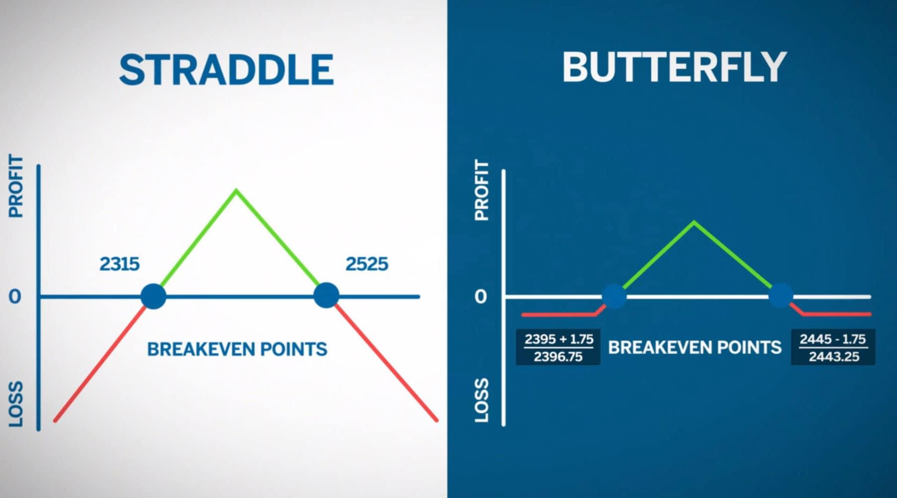

## Table of Contents

## What is a butterfly spread and how does it work?

A butterfly spread is a type of options trading strategy that involves using three different strike prices to create a position that can profit from low volatility in the underlying asset. It is called a "butterfly" because the profit and loss diagram resembles the shape of a butterfly's wings. To set up a butterfly spread, you buy one option at a lower strike price, sell two options at a middle strike price, and buy one option at a higher strike price. This can be done with either calls or puts.

The goal of a butterfly spread is to make money when the price of the underlying asset stays close to the middle strike price at expiration. If the price does end up near the middle strike, the options you sold will expire worthless, while the options you bought at the lower and higher strikes will retain some value. The maximum profit is achieved if the asset price is exactly at the middle strike at expiration. However, if the price moves too far away from the middle strike, the potential losses are limited because of the way the options are structured. This makes the butterfly spread a low-risk strategy, but the potential profits are also limited.

## What are the key components of a butterfly spread?

A butterfly spread has three main parts. First, you buy one option at a lower price. This is called the lower strike price. Second, you sell two options at a middle price. This is the middle strike price. Third, you buy one option at a higher price. This is the higher strike price. You can use either call options or put options to set up a butterfly spread.

The goal is to make money if the price of the thing you're trading stays close to the middle price when the options expire. If it does, the options you sold will be worth nothing, but the options you bought at the lower and higher prices will still have some value. This can make you a profit. But if the price moves too far away from the middle price, you won't lose too much money because of how the options are set up. So, a butterfly spread is a safe way to trade, but you can't make a lot of money with it.

## How can a butterfly spread be used to generate profit?

A butterfly spread can help you make money if the price of the thing you're trading stays close to the middle price when the options expire. You set it up by buying one option at a lower price, selling two options at a middle price, and buying one option at a higher price. If the price is right at the middle price when the options expire, the options you sold will be worth nothing, but the options you bought at the lower and higher prices will still have some value. This is when you make the most money.

But if the price moves too far away from the middle price, you won't lose too much money because of how the options are set up. This makes a butterfly spread a safe way to trade, but you can't make a lot of money with it. The most you can lose is the money you spent to set up the spread. So, it's a good strategy if you think the price will stay steady and not move too much.

## What are the different types of butterfly spreads and when should each be used?

There are three main types of butterfly spreads: the long call butterfly, the long put butterfly, and the iron butterfly. A long call butterfly is made by buying one call option at a lower strike price, selling two call options at a middle strike price, and buying one call option at a higher strike price. A long put butterfly works the same way but uses put options instead. Both of these types are used when you think the price of the thing you're trading will stay close to the middle strike price at expiration. They can help you make money if the price doesn't move too much.

An iron butterfly is a bit different. It uses both call and put options. You sell one at-the-money call and one at-the-money put at the middle strike price, and then you buy one out-of-the-money call and one out-of-the-money put to limit your risk. This type of butterfly spread is also used when you expect the price to stay steady, but it can be a bit cheaper to set up because you're using both calls and puts. You would choose an iron butterfly if you want to spend less money to set up your trade but still think the price will stay close to the middle strike price at expiration.

## What are the risk and reward characteristics of a butterfly spread?

A butterfly spread has a limited risk and a limited reward. The most you can lose is the money you spent to set up the trade. This happens if the price of the thing you're trading moves too far away from the middle strike price at expiration. Since your risk is limited to what you paid for the options, it's a safer way to trade compared to some other strategies. However, because the risk is low, the potential reward is also low. The most you can make is if the price is exactly at the middle strike price when the options expire. This profit is the difference between the middle strike and the lower strike, minus the cost of setting up the spread.

The key to making money with a butterfly spread is that the price needs to stay close to the middle strike price. If it does, you'll make money because the options you sold will expire worthless, while the options you bought at the lower and higher strikes will still have some value. But if the price moves too far away from the middle strike, you won't make as much or might even lose a bit of money. So, a butterfly spread is best used when you think the price will be calm and not move much. It's a good strategy for traders who want to limit their risk but also understand that the potential reward won't be very high.

## How do market conditions affect the profitability of a butterfly spread?

Market conditions play a big role in how well a butterfly spread works. If the market is calm and the price of the thing you're trading doesn't move much, a butterfly spread can be very profitable. This is because the strategy is set up to make money when the price stays close to the middle strike price at expiration. If the price does stay near that middle price, the options you sold will be worth nothing, but the options you bought at the lower and higher prices will still have some value, which can lead to a profit.

However, if the market is very active and the price moves a lot, a butterfly spread might not work out so well. If the price moves too far away from the middle strike price, you won't make as much money or might even lose some. The good thing is that your losses are limited to the money you spent to set up the spread, so it's still a safe way to trade. But if the market is too unpredictable, it might be better to use a different strategy that can handle bigger price swings.

## What are the steps to set up a butterfly spread?

To set up a butterfly spread, start by choosing the thing you want to trade, like a stock or an index. Then, pick three different prices, called strike prices, for your options. The first step is to buy one option at the lowest price, called the lower strike. Next, you sell two options at the middle price, called the middle strike. Finally, you buy one option at the highest price, called the higher strike. You can use either call options or put options for this. Make sure the options all expire at the same time.

After you've bought and sold the options at these three prices, you've set up your butterfly spread. The goal is to make money if the price of what you're trading stays close to the middle strike price when the options expire. If it does, the options you sold at the middle strike will be worth nothing, but the options you bought at the lower and higher strikes will still have some value. This can lead to a profit. If the price moves too far away from the middle strike, you won't make as much or might lose a bit of money, but your loss is limited to what you spent to set up the spread.

## How do you calculate the maximum profit and loss for a butterfly spread?

To calculate the maximum profit for a butterfly spread, you need to know the difference between the middle strike price and the lower strike price. Then, subtract the total cost of setting up the spread from this difference. The total cost is what you paid for the options at the lower and higher strikes, minus what you got for selling the two options at the middle strike. If the price of what you're trading is exactly at the middle strike price when the options expire, you'll make the maximum profit. This is because the options you sold will be worth nothing, but the options you bought at the lower and higher strikes will still have some value.

To find out the maximum loss, it's simple: it's just the total cost of setting up the butterfly spread. This is what you paid for the options at the lower and higher strikes, minus what you got for selling the two options at the middle strike. The most you can lose is this amount, and it happens if the price moves too far away from the middle strike price at expiration. So, your risk is limited to what you spent to set up the spread, which makes it a safer way to trade.

## What are some common mistakes to avoid when using butterfly spreads?

One common mistake people make with butterfly spreads is not picking the right middle strike price. If you think the price of what you're trading will stay the same, you need to choose a middle strike price that's close to where you think the price will be when the options expire. If you pick the wrong middle strike, you might not make as much money or could even lose some. Another mistake is not paying attention to how much time is left before the options expire. Butterfly spreads work best when there's not too much time left, because the options you sold will lose value faster as time goes on. If you set up your spread too early, you might not make as much profit.

Another mistake to watch out for is not understanding how much you could lose. Even though the most you can lose with a butterfly spread is the money you spent to set it up, some people forget this and might be surprised if they don't make any money. It's also important to know that butterfly spreads don't work well in a market that's moving a lot. If the price of what you're trading goes up or down a lot, you might not make any money. So, it's best to use butterfly spreads when you think the market will be calm and the price won't change much.

## How can advanced traders adjust butterfly spreads to improve profitability?

Advanced traders can adjust butterfly spreads to try to make more money by changing the strike prices or the expiration dates. One way to do this is by moving the middle strike price closer to where they think the price of what they're trading will be when the options expire. If they think the price will go up a bit, they might move the middle strike up too. If they think it will go down, they might move it down. This can help them make more money if they're right about where the price will be. Another way is to change when the options expire. If they think the price will stay calm for a longer time, they might choose options that expire later. This can give them more time for the price to move to the right spot.

Another thing advanced traders might do is use different types of butterfly spreads, like an iron butterfly, which can be cheaper to set up because it uses both call and put options. They might also adjust their butterfly spreads by adding or taking away options to change how much they could win or lose. For example, they might sell more options at the middle strike to make more money if the price stays close to that strike, but this also means they could lose more if the price moves away from the middle strike. By making these adjustments, advanced traders can try to make their butterfly spreads work better for them, but they need to be careful because changing things can also make the trade riskier.

## What are the tax implications of trading butterfly spreads?

When you trade butterfly spreads, you need to think about taxes. The money you make or lose from trading options, like butterfly spreads, is usually treated as capital gains or losses. If you hold your butterfly spread for less than a year before it expires or you close it, any profit you make is considered a short-term capital gain. Short-term capital gains are taxed at your regular income tax rate, which can be pretty high. If you hold it for more than a year, it's a long-term capital gain, which is taxed at a lower rate, usually between 0% and 20%, depending on your income.

It's also important to know that you can use losses from butterfly spreads to lower your taxes. If you lose money on a butterfly spread, you can use that loss to reduce your taxable income. You can deduct up to $3,000 of net capital losses from your regular income each year. If your losses are more than $3,000, you can carry the extra over to future years. Always keep good records of your trades, because you'll need them when you do your taxes. It's a good idea to talk to a tax professional to make sure you're doing everything right and taking advantage of all the tax benefits you can.

## How can butterfly spreads be integrated into a broader trading strategy?

Butterfly spreads can be a useful part of a bigger trading plan if you use them the right way. They work best when the market is calm and the price of what you're trading doesn't move much. So, you can use butterfly spreads to make money when you think things will stay steady. For example, if you have other trades that do well when the market moves a lot, you can balance them out with butterfly spreads. This way, you can make money no matter if the market is moving or staying the same. It's like having a safety net that helps protect your other trades from losing too much money if the market doesn't move as much as you thought it would.

Another way to use butterfly spreads in your overall trading strategy is to use them to make money while you wait for other trades to work out. If you have a trade that you think will take a while to pay off, you can set up a butterfly spread to make some money in the meantime. This can help you keep making money even when you're waiting for a big move in the market. By mixing butterfly spreads with other trading strategies, you can make your trading plan more flexible and able to handle different market conditions. Just remember to keep an eye on how all your trades are doing and adjust them if you need to.

## What are Profit Strategies Using Butterfly Spreads?

Options trading has gained significant traction among investors, largely due to its versatility and potential for high returns. Within this domain, butterfly spreads have emerged as a favored strategy, offering traders a balanced risk-reward profile. This section explores various profit strategies using butterfly spreads, focusing on identifying optimal market conditions, calculating returns, managing risks, and examining successful trade examples.

### Optimal Market Conditions for Butterfly Spread Strategies

Butterfly spreads thrive in specific market conditions, primarily when traders anticipate minimal price movement. This strategy is most effective in a low-volatility environment, as it profits when the underlying asset's price remains near the central strike price at expiration. However, this does not imply that butterfly spreads cannot be profitable in other conditions. Competent traders often adapt their strategies to fit moderate volatility scenarios by adjusting the strike prices and widths of their spreads.

### Profit Potential and Calculating Returns

Calculating potential returns from a butterfly spread involves understanding the initial cost, maximum profit, and breakeven points. The profit maximizes when the price of the underlying asset equals the middle strike price at expiration. The formula for potential profit is:

$$
\text{Max Profit} = \text{Middle Strike} - \text{Low Strike} - \text{Premium Paid}
$$

The breakeven points are situated around the middle strike price and can be calculated as follows:

$$
\text{Breakeven Upper} = \text{Middle Strike} + \left(\text{High Strike} - \text{Middle Strike} - \text{Premium Paid}\right)
$$
$$
\text{Breakeven Lower} = \text{Middle Strike} - \left(\text{Middle Strike} - \text{Low Strike} - \text{Premium Paid}\right)
$$

### Enhancing Profitability through Adjustments and Managing Risks

Enhancing profitability within butterfly spreads often involves adjusting positions in response to market changes. For instance, traders might shift the entire spread upward or downward (known as a "butterfly roll") if they anticipate movement away from the initial central strike. Additionally, traders may widen the spread in volatile markets to increase the range of potential profitability.

Risk management in butterfly spreads hinges on maintaining a watchful eye on volatility and employing stop-loss orders when necessary. The strategy's limited downside is beneficial, but proactive measures help in preserving capital and protecting profits.

### Examples of Successful Butterfly Spread Trades

A successful butterfly spread trade is one where the underlying asset's price remains near the central strike at expiration. For instance, if a trader sets up a butterfly spread on XYZ stock with a central strike price of $100, and at expiration, the stock price is $101, the trade is likely profitable provided the initial premium is covered.

### Case Studies: Different Profit Strategies and Outcomes

Consider a case study where a trader uses a call butterfly spread on a tech stock during an earnings season. Anticipating minimal price movement post-announcement, the trader sets up a butterfly spread with a narrow range of strike prices due to an expected drop in implied volatility. The trader adjusts the position based on earnings report reactions and ultimately closes the position with a profit as the stock price stabilizes around the central strike.

Another example involves a bearish market sentiment where a trader uses a put butterfly spread. By accurately forecasting declining volatility and setting the appropriate strike prices, the trader secures a profit despite a market downturn.

In conclusion, mastering butterfly spread strategies requires a keen understanding of market conditions, precise calculation of potential returns, and proactive risk management. With experience, traders can often enhance their profitability through well-timed adjustments and strategic positioning.

## References & Further Reading

[1]: McMillan, L. G. (2002). ["Options as a Strategic Investment"](https://www.amazon.com/Options-Strategic-Investment-Lawrence-McMillan/dp/0735201978). Prentice Hall Press.

[2]: Chan, E. P. (2009). ["Quantitative Trading: How to Build Your Own Algorithmic Trading Business"](https://github.com/ftvision/quant_trading_echan_book). Wiley.

[3]: Jansen, S. (2020). ["Machine Learning for Algorithmic Trading: Predictive Models to Extract Signals from Market and Alternative Data for Systematic Trading Strategies with Python"](https://github.com/stefan-jansen/machine-learning-for-trading). Packt Publishing.

[4]: Lopez de Prado, M. (2018). ["Advances in Financial Machine Learning"](https://books.google.com/books/about/Advances_in_Financial_Machine_Learning.html?id=oU9KDwAAQBAJ). Wiley.

[5]: Aronson, D. R. (2007). ["Evidence-Based Technical Analysis: Applying the Scientific Method and Statistical Inference to Trading Signals"](https://onlinelibrary.wiley.com/doi/book/10.1002/9781118268315). Wiley.