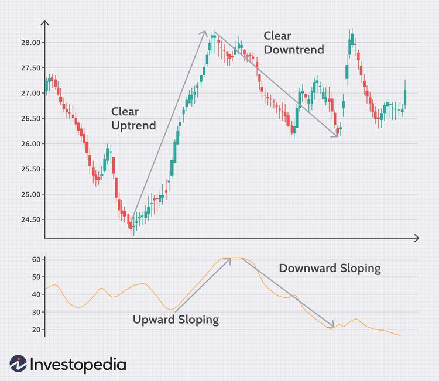

In the rapidly evolving world of finance, mastering investment techniques, market prediction methods, profit strategies, and algorithmic trading has become essential. These elements are not isolated aspects but interwoven functionalities that collectively shape the landscape of modern trading and investment. Technological advancements and the availability of vast datasets have revolutionized the way market participants approach financial markets. Investors and traders now have access to sophisticated tools enabling them to make well-informed decisions that were once considered the domain of experts alone.

Investment techniques have progressed from traditional methods to embracing complex quantitative models, allowing for enhanced portfolio management and risk assessment. As markets become increasingly unpredictable, effective market prediction methods have turned into a double-edged sword; while they offer the potential for substantial gains, they also introduce significant risk if not approached with caution. In this context, developing robust profit strategies becomes crucial for achieving long-term financial objectives. These strategies often involve diversification, risk mitigation, and capitalizing on transient market opportunities, ensuring scalability and adaptability.



Algorithmic trading marks the pinnacle of technological integration in finance, employing computerized systems to automate trading based on pre-defined rules. This innovative approach mitigates human emotional bias, maximizes efficiency, and takes advantage of rapid data processing. Exploring algorithmic strategies such as trend-following and market-making can enhance investors' ability to optimize profits.

The strategic integration of these elements creates a dynamic and responsive investment framework. Investors who combine traditional and modern methodologies can foster increased resilience and profitability in their portfolios. This article will articulate how these crucial components can harmonize for optimal financial performance in today's complex financial environment.

## Table of Contents

## Investment Techniques in the Modern Market

Investment techniques have undergone substantial transformation, particularly with advancements in technology and the exponential increase of available data. This evolution has broadened the horizon for investors, enabling more informed and strategic decision-making processes. Traditionally, investment methods focused predominantly on fundamental and technical analyses. However, the introduction of quantitative methods has gradually revolutionized portfolio management.

**Technical Analysis**

Technical analysis remains a core method through which investors predict future price movements based on historical data and price patterns. The basic premise relies on the idea that market psychology influences trading, which can be observed through chart patterns. Common tools include moving averages, relative strength index (RSI), and Bollinger Bands. These indicators help identify trends and potential entry or [exit](/wiki/exit-strategy) points in the market.

The use of algorithms for technical analysis has increased, allowing for [backtesting](/wiki/backtesting) and optimization of strategies. For example, moving averages can be automatically calculated and plotted over varying timeframes to identify potential crossovers – a signal often associated with shifting market trends.

**Fundamental Analysis**

Unlike technical analysis, which focuses on historical price trends, [fundamental analysis](/wiki/fundamental-analysis) examines the intrinsic value of an asset based on macroeconomic factors, industry conditions, and company-specific data. Key components include earnings reports, revenue growth, profit margins, and competitive positioning within an industry.

The approach is more qualitative and often involves subjective judgments. Yet, advancements in data processing and analytics have enabled a more quantitative angle to fundamental analysis. Investors can now model financial forecasts using statistical techniques and [machine learning](/wiki/machine-learning) algorithms to simulate various market scenarios.

**Quantitative Strategies**

Quant-based strategies are a modern innovation, using mathematical models to evaluate investment opportunities. These strategies often involve complex statistical techniques, such as Monte Carlo simulations, and leverage big data analytics to uncover patterns that might not be evident through traditional analysis.

Python, a widely-used programming language in finance, offers numerous libraries for implementing quant strategies. A simple example in Python to fetch stock data and calculate the returns might involve libraries like `pandas`, `numpy`, and `matplotlib`.

```python
import pandas as pd
import numpy as np
import matplotlib.pyplot as plt
from pandas_datareader import data as pdr

# Fetching stock data
ticker = 'AAPL'
stock_data = pdr.get_data_yahoo(ticker, start='2022-01-01', end='2023-01-01')

# Calculating daily returns
stock_data['Returns'] = stock_data['Close'].pct_change()

# Plotting the returns
stock_data['Returns'].plot(figsize=(10, 6))
plt.title(f'Daily Returns of {ticker}')
plt.show()
```

Quantitative approaches extend beyond simple calculations, delving into complex algorithms for high-frequency trading and portfolio optimization. Techniques like mean-variance optimization, developed by Harry Markowitz, aim to construct portfolios that offer the highest expected return for a defined level of risk. This is expressed by the formula:

$$
\text{Minimize: } \frac{1}{2} \mathbf{w}^T \Sigma \mathbf{w} - \lambda \mathbf{w}^T \mathbf{\mu}
$$

Where $\mathbf{w}$ is the portfolio weights, $\Sigma$ is the covariance matrix of returns, $\lambda$ represents the risk aversion coefficient, and $\mathbf{\mu}$ is the vector of expected returns. 

In conclusion, the synergy of traditional and quantitative techniques, powered by technology, has dramatically changed how investors approach the market today. These methodologies allow for sophisticated analysis and potentially more profitable portfolios, navigating the intricacies of the modern financial landscape with precision and foresight. 

## Market Prediction: A Double-Edged Sword

Predicting market trends stands as one of the most challenging facets of investing due to the inherent complexity and fluidity of financial markets. Market prediction can be a powerful tool for investors, potentially leading to significant gains. Accurate forecasts may offer a competitive edge, allowing traders to anticipate price movements and capitalize on profitable opportunities. However, the unpredictability of markets also introduces substantial risks, highlighting the double-edged nature of predicting market trends.

Market predictions often rely on a combination of historical data analysis, statistical models, and computational algorithms. Techniques such as time series analysis, machine learning models, and sentiment analysis are frequently employed to forecast market trends. For instance, models like the Autoregressive Integrated Moving Average (ARIMA) or Long Short-Term Memory (LSTM) networks are used for time series forecasting, aiming to identify patterns and predict future prices. Despite their sophistication, these methods are not infallible and can be affected by unforeseen market events, changes in market sentiment, or data quality issues.

Investors are advised to employ prediction techniques with caution. To mitigate the risks associated with market prediction, balancing these techniques with confirmation strategies is recommended. Confirmation strategies involve validating predictions through multiple models or cross-referencing with other indicators, reducing the reliance on a single forecast. Additionally, robust risk management tools, such as diversification, stop-loss orders, and position sizing, should be employed to protect against adverse market movements. This cautious approach not only aims to enhance the reliability of predictions but also to manage potential losses, maintaining the overall stability of investment portfolios.

Ultimately, while the allure of accurately predicting market trends is considerable, the reality underscores the necessity for careful application and reinforcement with risk management practices. This balanced strategy helps investors navigate the uncertainties of financial markets, striving for a harmonious blend of foresight and prudence.

## Crafting Profit Strategies

Effective profit strategies are essential in achieving investment goals, serving as the backbone for financial growth and stability. One of the fundamental approaches to crafting these strategies is the diversification of portfolios. This involves spreading investments across various asset classes, sectors, and geographical regions to mitigate risk and improve potential returns. Diversification reduces the impact of a poor-performing investment on the overall portfolio, adhering to the principle of not putting all eggs in one basket. Empirical studies suggest that a well-diversified portfolio can reduce unsystematic risk, which is unique to a specific company or industry, thereby enhancing long-term returns.

Risk mitigation is another critical aspect of profit strategy development. Techniques such as stop-loss orders, options contracts, and hedging through futures contracts can protect against adverse market movements. For instance, using a stop-loss order allows investors to limit potential losses by automatically selling a security when it reaches a predetermined price. Options can provide a way to hedge against [volatility](/wiki/volatility-trading-strategies) by securing the right to buy or sell an asset at a predetermined price within a specified time frame.

Leveraging market opportunities is also vital for crafting effective profit strategies. This involves staying informed about economic trends, technological advancements, and geopolitical developments that could present new investment opportunities. Investors can benefit from entering emerging markets or sectors at an early stage, capitalizing on growth potential. For example, investing in green technology, which is experiencing rapid growth due to the global push for sustainable energy solutions, could offer substantial returns.

Profit strategies that emphasize scalability and adaptability are increasingly important in today's fast-paced financial environment. Scalable strategies allow investors to increase or decrease their market exposure without a proportional increase in risk or cost. This feature is particularly beneficial for investors looking to expand their portfolios significantly. Adaptability, on the other hand, refers to the ability of a strategy to adjust to evolving market conditions. Adaptive strategies actively adjust investment approaches based on market analyses and forecasts, ensuring alignment with changing trends and conditions.

Incorporating a combination of these elements—diversification, risk mitigation, market opportunity leveraging, scalability, and adaptability—can significantly enhance market performance. Investors must continuously evaluate and refine their strategies, responding proactively to market feedback and developments. This dynamic approach is crucial in effectively navigating the complexity and unpredictability of financial markets, ultimately positioning investors for sustained success.

## Algo Trading: The Future of Financial Markets

Algorithmic trading utilizes computerized systems to execute trades automatically based on predetermined criteria, thereby streamlining the trading process. By minimizing human intervention, [algorithmic trading](/wiki/algorithmic-trading) eliminates emotional biases, which can adversely affect trading outcomes. This method enhances operational efficiency by leveraging the high-speed capabilities of modern computing systems and advanced data processing techniques.

Algorithmic trading strategies offer various ways to optimize profits in financial markets. Among these strategies, trend-following and market-making are prominent. 

Trend-following strategies aim to capitalize on the [momentum](/wiki/momentum) of asset prices, relying on historical data and statistical methods to identify upward or downward trends. These strategies implement algorithms that trigger buy or sell orders when specific price thresholds or moving averages are crossed. For instance, a simple moving average crossover strategy might look at the intersection of short-term and long-term moving averages to generate trading signals.

```python
# Example of a basic moving average crossover strategy using Python
def moving_average(prices, window):
    return sum(prices[-window:]) / window

def generate_signal(prices, short_window=40, long_window=100):
    short_ma = moving_average(prices, short_window)
    long_ma = moving_average(prices, long_window)
    if short_ma > long_ma:
        return 'buy'
    elif short_ma < long_ma:
        return 'sell'
    else:
        return 'hold'
```

Market-making, on the other hand, involves placing both buy and sell limit orders to profit from the bid-ask spread. This strategy requires quickly adjusting orders based on market fluctuations to maintain a neutral position, which helps stabilize market [liquidity](/wiki/liquidity-risk-premium) and can reduce transaction costs due to optimal order placements. Algorithms in market-making strategies need to adapt to changing market conditions to ensure competitive pricing and to capitalize on the spread.

The integration of machine learning and [artificial intelligence](/wiki/ai-artificial-intelligence) in algorithmic trading has further enhanced its potential. Modern algorithms can process vast amounts of data and adapt to new information at an unprecedented speed, which is crucial in today's fast-paced markets. This adaptability and continuous learning capability make algorithmic trading an indispensable tool for financial institutions seeking to maintain a competitive edge.

Algorithmic trading signifies a transformative shift in financial markets, offering greater precision, efficiency, and scalability. As technology advances, such strategies will likely become even more integral to trading activities, potentially reshaping market dynamics globally.

## Combining Strategies for Maximum Benefit

Integrating various investment techniques, prediction methods, and trading strategies is instrumental in developing a robust investment approach. The synergy of these elements can enhance portfolio resilience against market volatility and uncertainties. A key aspect of this integration involves balancing automation with manual oversight, as fully automated systems might miss context-specific nuances while human intervention can introduce emotional biases.

Automated trading systems, such as algorithmic trading platforms, offer the advantage of speed and accuracy in executing trades. These systems can quickly process vast datasets to identify patterns and execute strategies with minimal delay. However, human oversight remains crucial to address unforeseen anomalies and strategic pivots that require judgment beyond coded rules. For instance, while an algorithm might efficiently execute a mean reversion strategy based on historical data trends, a human trader can adjust parameters in response to emerging geopolitical events or regulatory changes that the algorithm cannot foresee.

Moreover, continuous monitoring and adaptation to market changes are essential for sustained profitability. Markets are dynamic, influenced by a myriad of economic, political, and social factors. Staying profitable requires not only deploying well-designed strategies but also adapting them to evolving market conditions. For example, an investor might use moving averages for trend-following, adjusting the period of the moving average based on current volatility levels.

One practical approach to implementing this adaptability is through backtesting and real-time data analysis. By backtesting, investors can assess how their strategies would have performed historically, which aids in refining the parameters used in prediction models. Additionally, real-time data analysis offers insights into current market sentiment and trend shifts, enabling proactive rather than reactive strategy adjustments.

Python provides powerful libraries such as NumPy, pandas, and [backtrader](/wiki/backtrader) for these tasks. Here is a simple example of how Python can be used to backtest a moving average crossover strategy:

```python
import pandas as pd
import backtrader as bt

class MovingAverageStrategy(bt.Strategy):
    params = (('short_period', 10), ('long_period', 30),)

    def __init__(self):
        self.dataclose = self.datas[0].close
        self.short_ma = bt.indicators.SimpleMovingAverage(self.datas[0], period=self.params.short_period)
        self.long_ma = bt.indicators.SimpleMovingAverage(self.datas[0], period=self.params.long_period)

    def next(self):
        if self.short_ma > self.long_ma:
            if not self.position:
                self.buy()
        elif self.short_ma < self.long_ma:
            if self.position:
                self.sell()

# Load your data here
data = bt.feeds.PandasData(dataname=pd.read_csv('your_data.csv'))

# Set up the backtest
cerebro = bt.Cerebro()
cerebro.addstrategy(MovingAverageStrategy)
cerebro.adddata(data)
cerebro.run()

cerebro.plot()
```

This script evaluates the effectiveness of a moving average crossover strategy, providing historical performance insights that can guide future decisions. Ultimately, integrating diverse methodologies and maintaining a balance between automated systems and human judgment, alongside regular strategy evaluation and adjustment, results in a more comprehensive investment strategy poised for long-term growth.

## Conclusion

Navigating the complexities of investment effectively requires a sophisticated balance between time-tested strategies and cutting-edge technologies. Investors who master the principles of key components such as investment techniques, market prediction, profit strategies, and algorithmic trading stand well-positioned to achieve consistent success.

A strategic approach to investment demands more than just an understanding of these individual components. It involves a holistic view where each element supports the others, creating a robust framework for decision-making. Investment techniques provide the foundational skills necessary for portfolio management, allowing investors to interpret and react to market signals. Market prediction empowers them with foresight, enabling data-driven assumptions about future trends, albeit with intrinsic risks that require caution and complementary risk management.

Profit strategies build upon this foundation by emphasizing the importance of diversification and adaptability. These strategies focus on capitalizing on market dynamics while maintaining a safeguard against unforeseen fluctuations. Algorithmic trading complements these aspects by employing automated systems to execute trades with precision and speed, reducing human error and making full use of computational power.

The future of investment will likely emphasize the integration of these methods to optimize performance further. Investors should aim to combine traditional analysis with modern algorithmic approaches, embracing technological advancements without forsaking the insight provided by human judgment. This synergy has the potential to advance smarter, data-driven decision-making, enabling investors to navigate volatile markets with confidence and poise.

To thrive in the ever-evolving landscape of finance, the strategic amalgamation of these components is essential. This multidimensional approach not only enhances the flexibility and robustness of investment strategies but also prepares investors to harness opportunities across diverse market conditions.

## References & Further Reading

[1]: Bergstra, J., Bardenet, R., Bengio, Y., & Kégl, B. (2011). ["Algorithms for Hyper-Parameter Optimization."](https://dl.acm.org/doi/10.5555/2986459.2986743) Advances in Neural Information Processing Systems 24.

[2]: ["Advances in Financial Machine Learning"](https://www.amazon.com/Advances-Financial-Machine-Learning-Marcos/dp/1119482089) by Marcos Lopez de Prado

[3]: ["Evidence-Based Technical Analysis: Applying the Scientific Method and Statistical Inference to Trading Signals"](https://www.amazon.com/Evidence-Based-Technical-Analysis-Scientific-Statistical/dp/0470008741) by David Aronson

[4]: ["Machine Learning for Algorithmic Trading"](https://github.com/stefan-jansen/machine-learning-for-trading) by Stefan Jansen

[5]: ["Quantitative Trading: How to Build Your Own Algorithmic Trading Business"](https://www.amazon.com/Quantitative-Trading-Build-Algorithmic-Business/dp/1119800064) by Ernest P. Chan