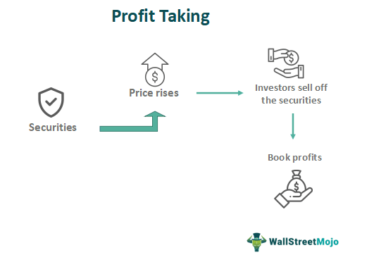

## Table of Contents

## What is profit-taking in finance?

Profit-taking in finance is when investors sell their investments to make a profit. They do this when the price of the investment goes up and they think it might not go up anymore or might even go down. This is a way for investors to lock in the gains they have made from their investments.

For example, if someone bought a stock at a low price and it went up a lot, they might decide to sell it to take their profit. This is common in stock markets, but it can happen with any type of investment like real estate or bonds. Profit-taking can affect the market because when many people do it at the same time, it can cause the price of the investment to go down.

## Why is profit-taking important for investors?

Profit-taking is important for investors because it lets them keep the money they have made from their investments. When an investor buys something like a stock and its price goes up, they can sell it to get more money back than they spent. This is good because it means they can use that money for other things, like buying new investments or paying for things they need.

It also helps investors manage risk. If they think the price of their investment might go down soon, selling it to take a profit can stop them from losing money later. By taking profits, investors can feel more secure about their money and make smarter choices about where to put it next.

## How does profit-taking affect stock prices?

When a lot of people decide to take their profits at the same time, it can make the price of a stock go down. This happens because when many people want to sell their stocks, there are more sellers than buyers. If there are more people trying to sell than people wanting to buy, the price of the stock has to go down so that someone will want to buy it.

This can start a chain reaction. When the price starts to drop because of profit-taking, other investors might get worried and decide to sell their stocks too, to avoid losing money. This can make the price drop even more. So, profit-taking can lead to big changes in stock prices, especially if a lot of people do it at the same time.

## What are common strategies for profit-taking?

One common strategy for profit-taking is setting price targets. This means an investor decides on a specific price at which they will sell their investment to make a profit. For example, if someone buys a stock at $50, they might decide to sell it when it reaches $60. This way, they know they will make a profit of $10 per share. Setting price targets helps investors stay disciplined and not get too greedy, waiting for the price to go even higher.

Another strategy is using stop-loss orders with a trailing stop. A stop-loss order is a way to automatically sell a stock if its price starts to drop too much. A trailing stop moves up as the stock price goes up, so it helps investors lock in profits while still giving the stock a chance to keep rising. For instance, if a stock goes from $50 to $70, a trailing stop might be set at 10% below the highest price, so it would trigger a sale if the price drops to $63. This helps protect the profits the investor has made.

Some investors also use a percentage-based approach. They might decide to sell a certain percentage of their holdings when the stock price goes up by a set percentage. For example, if a stock goes up by 20%, they might sell half of their shares to take some profit, while keeping the rest in case the price keeps rising. This way, they can enjoy some of the gains while still having a chance to make more money if the stock continues to do well.

## When is the best time to engage in profit-taking?

The best time to engage in profit-taking is when the price of your investment has gone up a lot and you think it might not go up anymore or might even start to go down. This could be when the stock reaches a price you set as a target before you bought it. For example, if you bought a stock at $50 and you decided you would sell it at $60, then when it hits $60, that's a good time to take your profit. It's also a good time if you see signs that the market might be changing, like if a lot of other people are starting to sell their stocks too.

Another good time for profit-taking is when you need the money for something else. Maybe you want to buy a new investment or you need to pay for something important. If you've made a good profit on your current investment, selling it to get that money can be a smart move. It's all about balancing the chance to make more money with the need to keep your money safe and use it when you need to.

## How can profit-taking be identified in market trends?

Profit-taking can be seen in market trends when a lot of people start selling their investments at the same time. This usually happens after the price of a stock or other investment goes up a lot. When many investors decide to sell to take their profits, it can make the price start to go down. You might see this on a chart where the price goes up and then suddenly drops. This drop can be a sign that people are taking their profits and selling their investments.

Another way to spot profit-taking is by looking at trading [volume](/wiki/volume-trading-strategy). When the volume of trades goes up a lot, it can mean that many people are selling their stocks to take profits. If this happens right after a big price increase, it's a good clue that profit-taking is happening. Watching these signs can help investors decide if it's a good time for them to sell their own investments and take their profits too.

## What psychological factors influence profit-taking decisions?

One big psychological [factor](/wiki/factor-investing) that influences profit-taking is fear of missing out, or FOMO. When investors see the price of their investment going up a lot, they might feel worried that they will miss out on even more gains if they sell too soon. This can make them wait longer to sell, hoping the price will keep going up. But if the price suddenly drops, they might feel regret for not selling earlier and taking their profit.

Another factor is loss aversion. People often feel the pain of losing money more strongly than the joy of making money. So, when an investment's price goes up, investors might be quick to sell and take their profit to avoid the risk of losing it later. This fear of losing what they've gained can push them to take profits even if the investment might still go up more. Balancing these feelings of FOMO and loss aversion is a big part of deciding when to take profits.

## How do different market conditions affect profit-taking strategies?

Different market conditions can change how investors decide to take their profits. In a bull market, where prices are going up a lot, investors might wait longer to sell their investments. They might think the prices will keep going up, so they hold onto their stocks hoping to make even more money. But if they see signs that the market might be getting too high or if they need the money for something else, they might decide to sell and take their profits before the market changes.

In a bear market, where prices are going down, investors might be quicker to take their profits. They might sell their investments as soon as they see a small increase in price, because they are worried the price will drop again soon. This way, they can lock in some profit and avoid losing money if the market keeps going down. Knowing what the market is doing can help investors decide the best time to take their profits and keep their money safe.

## What are the tax implications of profit-taking?

When you take profits from your investments, you have to pay taxes on the money you made. The tax you pay depends on how long you held the investment before you sold it. If you held it for a year or less, it's called a short-term capital gain, and you pay taxes on it at the same rate as your regular income. If you held it for more than a year, it's a long-term capital gain, and the tax rate is usually lower. Knowing these rules can help you plan when to sell your investments to pay less in taxes.

For example, if you bought a stock and sold it after six months for a profit, that profit would be taxed as a short-term capital gain. But if you waited until after a year to sell it, you would pay the lower long-term capital gain tax rate. This can make a big difference in how much money you keep after taxes. So, when you are thinking about taking profits, it's a good idea to think about how long you've held the investment and how that will affect your taxes.

## How can profit-taking be optimized using technical analysis?

Technical analysis can help investors find the best time to take profits by looking at charts and patterns. One way to do this is by using support and resistance levels. These are prices where the stock often stops going up or down. If a stock is close to a resistance level, it might be a good time to sell and take profits because the price might not go much higher. On the other hand, if the stock breaks through a resistance level, it could keep going up, so you might want to wait a bit longer before selling.

Another way to use technical analysis is by looking at moving averages. These are lines on a chart that show the average price of a stock over time. If a stock's price goes above its moving average, it might keep going up, so you might want to hold onto it. But if the price starts to drop below the moving average, it could be a sign to sell and take your profits before the price goes down more. By watching these signs, investors can make smarter choices about when to take their profits and keep more of their money.

## What role does profit-taking play in portfolio management?

Profit-taking is an important part of managing a portfolio because it helps investors keep the money they've made from their investments. When an investor sells a stock or another investment to make a profit, they can use that money to buy new investments or save it for something else they need. This way, they can keep growing their portfolio and make sure they have money when they need it. By taking profits at the right time, investors can make their portfolio stronger and more balanced.

Profit-taking also helps investors manage risk. If an investment's price goes up a lot, selling it to take a profit can stop the investor from losing money if the price goes down later. This is important because it helps keep the portfolio safe and stable. By thinking about when to take profits, investors can make smart choices that help their portfolio do well over time.

## How do institutional investors approach profit-taking compared to retail investors?

Institutional investors, like big banks or pension funds, have a different way of taking profits than retail investors, who are everyday people investing their own money. Institutional investors usually have more money to invest and can do a lot of research. They often use computers and special tools to help them decide when to sell their investments and take profits. They might also have rules they follow, like selling a certain amount of their investment when it goes up by a set percentage. This helps them keep their big portfolios safe and balanced.

Retail investors, on the other hand, might not have as much money or the same tools as institutional investors. They often make decisions based on what they read in the news or see on social media. They might sell their investments to take profits when they feel like the price has gone up enough, or if they need the money for something else. Retail investors might not have a strict plan for when to take profits, and their decisions can be influenced more by their feelings and less by detailed analysis.

## References & Further Reading

[1]: Bergstra, J., Bardenet, R., Bengio, Y., & Kégl, B. (2011). ["Algorithms for Hyper-Parameter Optimization."](https://papers.nips.cc/paper/4443-algorithms-for-hyper-parameter-optimization) Advances in Neural Information Processing Systems 24.

[2]: ["Advances in Financial Machine Learning"](https://www.amazon.com/Advances-Financial-Machine-Learning-Marcos/dp/1119482089) by Marcos Lopez de Prado

[3]: ["Evidence-Based Technical Analysis: Applying the Scientific Method and Statistical Inference to Trading Signals"](https://www.amazon.com/Evidence-Based-Technical-Analysis-Scientific-Statistical/dp/0470008741) by David Aronson

[4]: ["Machine Learning for Algorithmic Trading"](https://github.com/stefan-jansen/machine-learning-for-trading) by Stefan Jansen

[5]: ["Quantitative Trading: How to Build Your Own Algorithmic Trading Business"](https://www.amazon.com/Quantitative-Trading-Build-Algorithmic-Business/dp/1119800064) by Ernest P. Chan