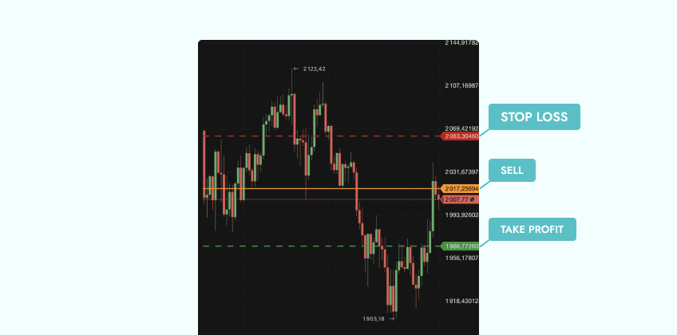

Algorithmic trading, frequently referred to as algo trading, has become a cornerstone in the dynamic landscape of financial trading. This method leverages computer algorithms to execute trades at speeds and complexities far beyond the capabilities of human traders. The precision and efficiency of algorithmic trading are driven by its ability to process vast amounts of data and make split-second decisions based on predefined parameters and conditions.

One critical aspect of algorithmic trading is the setting of profit-taking limits. These are predetermined thresholds at which a trader exits a position to lock in gains. Properly understanding and establishing profit-taking limits are crucial for maximizing potential earnings while also managing the risks inherent in trading activities. These limits serve as automated checkpoints within trading strategies, ensuring that traders capture profits systematically rather than succumbing to market volatility or emotional decision-making.



This article aims to examine the significance of profit-taking limits within algorithmic trading. We will assess how these limits can significantly influence trading strategies and explore best practices for their implementation. By integrating these guidelines into their algorithmic models, traders can improve the consistency of their results and foster a more disciplined approach to navigating financial markets.

## Table of Contents

## What Are Profit-Taking Limits in Algo Trading?

Profit-taking limits, in the context of [algorithmic trading](/wiki/algorithmic-trading), refer to predefined levels at which a position is automatically closed to secure gains. These limits are integral to automated trading algorithms and serve as triggers for executing sell orders when specific profit thresholds are met. The implementation of profit-taking limits helps traders lock in profits before market dynamics shift unfavorably. This proactive approach mitigates the risk of potential loss from holding positions too long, aiming for unrealistically high returns that may not be achievable.

In algorithmic trading, profit-taking limits are an essential component of comprehensive money management strategies. They work in conjunction with other critical elements such as stop-loss orders and daily trading limits to balance trading objectives with risk management. Stop-loss orders, for instance, are used to cap downside risk by exiting a position when it reaches a certain level of loss. Similarly, daily trading limits help prevent excessive trading activities that could result in substantial losses within a single trading day.

Profit-taking limits not only provide a systematic mechanism to secure gains but also contribute to reducing the emotional influence on trading decisions. By automating the process, traders can adhere to a disciplined approach that emphasizes the importance of capturing actualized profits rather than succumbing to speculative market movements. This structured technique also aligns with the broader objective of consistency in trading performance by ensuring that profit objectives align with realized market conditions.

Overall, the use of profit-taking limits within algo trading enhances the efficiency of executing trades by automating decision-making processes, thereby facilitating more predictable and consistent trading outcomes.

## Importance of Profit-Taking Limits

Profit-taking limits are fundamental instruments in managing risk and securing profits within trading strategies. These limits serve as predetermined points at which a trader will [exit](/wiki/exit-strategy) a market position to lock in gains, thus offering a structured approach that diminishes the emotional involvement in decision-making processes. By removing the psychological element often associated with trading, traders are less likely to fall prey to the pitfalls of emotional decision-making fueled by greed or fear.

One of the critical benefits of profit-taking limits is their ability to cut through market [volatility](/wiki/volatility-trading-strategies) to secure gains. Traders can predetermine when to exit a position and capture profits without succumbing to the whims of fluctuating market conditions. This approach ensures that profits are consistently realized without the temptation to hold onto a position in the hope of achieving higher, unpredictable gains.

Moreover, maintaining disciplined trading practices is essential for achieving long-term success in the marketplace. Profit-taking limits foster this discipline by establishing clear rules for capitalizing on gains, which can lead to more consistent and reliable trading results over time. For example, a trader might leverage the moving average of an asset's price to determine an optimal exit point. By using analytical tools and data-driven strategies, the trader can systematically achieve desired outcomes without undue reliance on intuition or chance.

In practice, this approach can be expressed through algorithms programmed to recognize when an asset has reached a target price or percentage gain. These algorithms automatically execute trades at these predefined limits, thus ensuring discipline and consistency. In Python, for instance, one might implement such a strategy as follows:

```python
def should_take_profit(current_price, target_price):
    return current_price >= target_price

# Example usage
current_price = 105
target_price = 100

if should_take_profit(current_price, target_price):
    print("Sell to take profit.")
```

In summary, profit-taking limits constitute a critical component of effective trading strategies by reducing emotional biases, ensuring systematic profit capture amid market volatility, and supporting disciplined trading practices indispensable for sustainable success.

## How Profit-Taking Limits Alter Trading Strategies

Implementing profit-taking limits can significantly influence the outcome of trading strategies. By setting predefined thresholds for exiting positions, traders can ensure more consistent, albeit sometimes smaller, gains. This approach emphasizes a steady accumulation of profit over the pursuit of larger, less reliable windfalls. For example, with profit caps in place, traders might experience more frequent exits from trades, capturing moderate gains repeatedly rather than waiting for larger movements that may not occur. This method aligns well with risk-averse strategies, enhancing the predictability of earnings.

When adjusting algorithms to account for market conditions such as volatility and [liquidity](/wiki/liquidity-risk-premium), traders can fine-tune profit-taking limits to maximize returns. Volatility indices and liquidity ratios can be integrated into the algorithm to dynamically adjust these limits. A Python code snippet to adjust profit-taking levels based on volatility could look like this:

```python
def adjust_profit_limit(base_limit, volatility_index):
    # Assume base_limit is the initial profit limit and volatility_index is a measure of current market volatility
    adjusted_limit = base_limit * (1 + volatility_index / 100)
    return adjusted_limit
```

This function increases the profit limit based on the market's volatility index, thereby offering flexibility in changing market conditions.

Another critical consideration is balancing profit-taking limits with stop-loss orders. These mechanisms serve complementary purposes; while profit-taking limits secure gains, stop-loss orders minimize losses. An effective trading strategy often involves setting these levels in tandem, ensuring they work together to maintain an optimal risk-reward ratio. For example, a trader might choose a 2:1 reward-to-risk ratio when determining these thresholds, ensuring that potential profits outweigh the potential losses.

Adjusting these components allows traders to tailor their strategies to specific market environments and personal risk appetites, enhancing their ability to consistently achieve desired financial outcomes. Mathematical models and historical performance data can further refine the balance between profit-taking and stop losses, promoting a robust, adaptive trading strategy.

## Setting Effective Profit-Taking Limits

Setting effective profit-taking limits requires a balanced understanding of market conditions and individual risk tolerance. Traders should employ data analytics to study historical market data, enabling them to set realistic and effective limits. By analyzing market trends, price patterns, and statistical indicators, traders can derive profit-taking limits that reflect the asset's volatility and price behavior.

An important strategy in setting these limits involves the use of [backtesting](/wiki/backtesting). Backtesting enables traders to apply their profit-taking strategies to historical data to evaluate how the strategy would have performed. This approach helps in identifying optimal exit points based on past price movements and can guide traders in setting limits that maximize returns while minimizing risks.

It is essential to continuously monitor and adjust these limits to ensure they align with current market scenarios and trading goals. Market conditions are dynamic, and what might be a suitable profit target today may not be tomorrow. Therefore, revisiting and reassessing profit-taking limits periodically is crucial. Traders can use techniques such as moving averages to adapt to changing market conditions. For example, using a moving average crossover strategy might help in setting dynamic profit limits that respond to long-term and short-term trends.

Incorporating mechanisms such as trailing stops can provide flexibility, allowing profit limits to adjust according to favorable market movements. Trailing stops are designed to lock in profits by enabling the stop price to adjust as the market price moves favorably. For instance, if a stock's price increases, a trailing stop will follow the upward movement but remain fixed if the price begins to decline. This ensures that gains are secured in a favorable market climate without prematurely closing a position that still has upward [momentum](/wiki/momentum).

The balance between risk and return is paramount when setting profit-taking limits. A trader must consider their risk tolerance, which may vary depending on the investment horizon and financial goals. Mathematical models such as the Risk-Reward Ratio can aid in understanding this balance. The Risk-Reward Ratio is calculated as:

$$
\text{Risk-Reward Ratio} = \frac{\text{Expected Loss}}{\text{Expected Gain}}
$$

A favorable ratio is typically less than 1, indicating that the expected gain outweighs the potential loss, thereby guiding traders in setting their profit-taking limits effectively.

Ultimately, setting effective profit-taking limits is a nuanced process that requires a mix of data-driven analysis, adaptive strategies, and an understanding of personal risk tolerance. By employing these techniques, traders can better position themselves to secure their profits and optimize their trading strategies.

## Examples of Profit-Taking Strategies in Algo Trading

In algorithmic trading, profit-taking strategies are essential for optimizing returns and managing risks. A prevalent method among traders is the use of fixed-point profit targets. These targets are predefined based on thorough analysis of historical trading data and market conditions, enabling traders to lock in profits once certain price levels are achieved. By establishing profit targets in advance, traders can ensure they secure gains while maintaining a systematic approach to trading.

Another effective strategy involves adopting dynamic profit-taking limits. This approach allows for real-time adjustment based on market fluctuations and volatility indices. By employing dynamic limits, traders can adapt to changing market conditions, potentially maximizing profits by capturing more advantageous price moves. This strategy is particularly useful in highly volatile markets, where fixed targets may not be as effective.

With advances in technology, sophisticated algorithms now incorporate [machine learning](/wiki/machine-learning) techniques to predict optimal profit-taking points. Machine learning models can analyze historical patterns, identify trends, and implement predictive analysis to determine the most opportune moments to take profits. This approach leverages large datasets and complex models to enhance decision-making processes, contributing to more informed and precise trading strategies.

In the retail sector, platforms like NinjaTrader provide built-in tools that facilitate the setting and testing of various profit-taking strategies in a simulated environment before live deployment. These tools allow traders to experiment with different parameters and strategies without the risk of financial loss, helping refine their approach and adapt to specific trading goals and market scenarios.

By employing these strategies, traders can effectively manage profit-taking in algorithmic trading, ensuring a balance between securing gains and capitalizing on market opportunities.

## Potential Pitfalls and How to Avoid Them

In algorithmic trading, a key challenge is setting appropriate profit-taking limits to strike a balance between achieving consistent profits and avoiding significant losses. One major pitfall is failing to establish these limits, which can lead traders to hold onto positions in anticipation of unrealistic gains. This misjudgment often results in missed opportunities where potential profits could have been secured, but instead evaporate due to market reversals.

Overly conservative profit-taking limits present another challenge, as they may prevent traders from realizing larger potential gains. Such limits can hinder overall profitability, as traders might exit positions too early, missing out on upward market trends that could lead to higher returns. Consequently, it's crucial to find a sweet spot in setting these limits to optimize profitability.

A one-size-fits-all approach is insufficient when setting profit-taking limits. Trading strategies must be tailored to reflect specific trading goals and market conditions. Each strategy requires careful consideration of market volatility, liquidity, and trader risk tolerance. Customization ensures that algorithms are flexible and responsive to different trading environments, enhancing their effectiveness.

To ensure profit-taking limits remain aligned with current trends, traders should regularly review and adjust these thresholds. Market conditions are dynamic, with trends and patterns evolving over time. By frequently revisiting and recalibrating profit-taking limits, traders can keep their strategies relevant and adaptive, avoiding the risks associated with outdated or misaligned limits. This adaptive approach contributes to sustained trading success and competitive advantage.

## Conclusion

Profit-taking limits are an essential tool in the algorithmic trader's arsenal, helping secure gains and manage risks. The strategic application of these limits plays a pivotal role in ensuring that traders effectively capture profits while minimizing exposure to adverse market movements. To achieve this, it is important that profit-taking limits are implemented with precision and are subject to regular review and adjustment. This practice ensures they remain aligned with dynamic market conditions and trading objectives.

Effectively integrating profit-taking limits into algorithmic strategies significantly boosts the probability of consistent profitability. By setting clear parameters for exit points, traders can systematize their strategies, thereby reducing emotional decision-making and maintaining discipline. Algorithmic systems can be calibrated to automatically enforce these limits, thereby improving execution timing and reducing the likelihood of slippage.

Ultimately, the success of any trading strategy, including those utilizing profit-taking limits, hinges on continuous learning and adaptation. Markets are inherently volatile and influenced by countless factors; hence, strategies must evolve in response to new data and changing environments. By remaining vigilant and making necessary adjustments, traders can enhance the robustness and effectiveness of their algorithmic approaches, ensuring long-term success in the competitive landscape of trading.

## References & Further Reading

[1]: Bergstra, J., Bardenet, R., Bengio, Y., & Kégl, B. (2011). ["Algorithms for Hyper-Parameter Optimization."](https://papers.nips.cc/paper/4443-algorithms-for-hyper-parameter-optimization) Advances in Neural Information Processing Systems 24.

[2]: ["Advances in Financial Machine Learning"](https://www.amazon.com/Advances-Financial-Machine-Learning-Marcos/dp/1119482089) by Marcos Lopez de Prado

[3]: ["Evidence-Based Technical Analysis: Applying the Scientific Method and Statistical Inference to Trading Signals"](https://www.amazon.com/Evidence-Based-Technical-Analysis-Scientific-Statistical/dp/0470008741) by David Aronson

[4]: ["Machine Learning for Algorithmic Trading"](https://github.com/stefan-jansen/machine-learning-for-trading) by Stefan Jansen

[5]: ["Quantitative Trading: How to Build Your Own Algorithmic Trading Business"](https://books.google.com/books/about/Quantitative_Trading.html?id=j70yEAAAQBAJ) by Ernest P. Chan