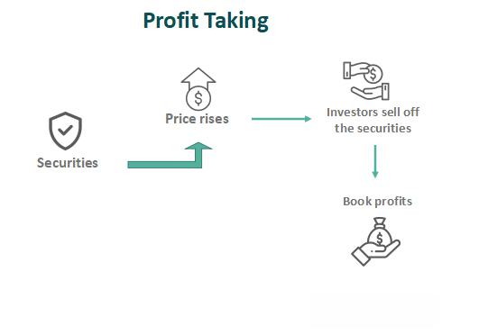

Algorithmic trading has fundamentally transformed the execution of financial transactions, leveraging computational power to enhance efficiency, accuracy, and speed. This sophisticated approach uses algorithms—predefined sets of rules or instructions—to execute trades based on intricate strategies and real-time data analysis. At the heart of effective algorithmic trading lies a critical component: a well-defined take profit strategy.

A take profit strategy plays a pivotal role in trading as it dictates the conditions for closing a position, thus securing profits and managing risk. The decision of when to exit a trade is just as crucial as the decision to enter. Without a disciplined approach to taking profits, traders risk watching potential gains erode or turning profitable trades into losses.



In this article, we explore various take profit strategies used in algorithmic trading. Understanding these strategies can aid traders in making informed decisions, whether they are experienced professionals or newcomers. Each strategy has unique methodologies and criteria that govern its operation, and selecting the right one can significantly enhance a trader's performance.

The successful implementation of take profit strategies requires a comprehensive understanding of their mechanics and potential impact on trading outcomes. Through this exploration, traders can learn to effectively incorporate these strategies into their trading systems. The goal is to provide actionable insights that aid in managing risk and maximizing profitability in the challenging environment of financial markets.

## Table of Contents

## Understanding Take Profit Strategies

A take profit strategy serves as a blueprint for determining the optimal exit points in trading to secure gains. The primary objective of these strategies is to maximize profits while minimizing potential losses. Traders utilize a variety of methods to achieve these goals, each catering to different market conditions, trading styles, and individual objectives.

One common method involves setting specific price targets. This approach entails predefining a price level at which the trader intends to close a position. For instance, if a stock is purchased at $50, the trader might decide to sell it once it reaches $60, thereby capturing a $10 profit per share. Such targets can be based on historical price data, technical analysis, or fundamental evaluations.

Another widely used strategy is to define a desired percentage gain. For instance, setting a goal to [exit](/wiki/exit-strategy) a trade once the asset appreciates by 5% from the entry price. This method offers flexibility and can be adjusted to suit different risk appetites and market conditions.

Incorporating technical indicators into take profit strategies is also prevalent among traders. Technical indicators such as moving averages, Relative Strength Index (RSI), or Fibonacci retracement levels provide signals that suggest favorable exit points. For instance, using a moving average crossover as an exit signal when a shorter-term moving average crosses below a longer-term one.

Each take profit strategy is crucial for risk management, aiding in converting profitable trades into realized gains before market conditions change unfavorably. An effective strategy can prevent scenarios where greed might lead traders to hold onto positions for too long, potentially turning profitable trades into losses.

The diversity of take profit strategies allows traders to select approaches that align with their trading style and objectives. For instance, day traders may prefer short-term percentage gains, while swing traders might opt for indicators that capture longer market movements. Factors like market [volatility](/wiki/volatility-trading-strategies), [liquidity](/wiki/liquidity-risk-premium), and asset classes also influence strategy selection.

In conclusion, understanding and implementing an appropriate take profit strategy is essential for locking in profits and managing risks effectively. Adaptability and alignment with individual trading goals are key for the successful application of these strategies.

## Types of Take Profit Strategies

Algorithmic trading often centers around optimizing exits to secure trades' profitability. Here, we explore various take profit strategies, each with unique methodologies and applications.

**Time-Based Exit**:
In this strategy, trades are exited after a predetermined period, which can be as short as a few minutes or as long as several days, depending on the trading objectives. The primary advantage of this approach is the reduction of exposure to market volatility after the set time period. This strategy is particularly useful in high-frequency trading where positions are held for very short durations. It does, however, come with the drawback of potentially missing out on additional gains if the market continues to move in a favorable direction after the exit.

**Fixed Profit Target**:
This strategy involves setting a specific profit level at which the position will be closed. The profit target can be based on various factors, including technical analysis, market condition forecasts, or a set percentage of the initial investment. For example, a trader might decide to exit a trade once a 10% gain is realized. While this method allows for clear risk-reward planning, it can also limit the potential upside if the market keeps moving favorably past the fixed target.

**Trailing Stops**:
A more dynamic approach to managing trades, trailing stops move in concert with favorable market movements, allowing profits to accrue while offering a mechanism to cap losses. As the market price rises, the trailing stop adjusts upward but does not move down if the market declines. The Python code for implementing a trailing stop might resemble:

```python
def trailing_stop(price_series, trail_percent):
    stop_level = None
    highest_point = 0
    for price in price_series:
        if price > highest_point:
            highest_point = price
            stop_level = price - (highest_point * trail_percent / 100)
        elif price <= stop_level:
            return "Exit", price
    return "Hold", price_series[-1]
```

This strategy captures extended market movements but might trigger stops prematurely in volatile conditions.

**Using Opposite Signals**:
This approach involves exiting trades when indicators suggest a reversal, thus capturing potential changes in market direction. For instance, if a long position is initiated based on a bullish signal, the trade might be closed when a bearish signal appears. This method ensures that profits are locked in when market dynamics suggest a turnaround. However, implementing this strategy might lead to increased trading frequency and associated transaction costs.

In summary, the choice of take profit strategy is often dictated by a trader's objectives, the trading environment, and the instruments' characteristics. Each strategy presents its advantages and challenges, and understanding them is crucial to optimizing trading performance.

## Pros and Cons of Different Strategies

### Pros and Cons of Different Strategies

In [algorithmic trading](/wiki/algorithmic-trading), selecting the appropriate take profit strategy is vital to optimize returns while managing risk. Each strategy offers unique advantages and disadvantages, which can be crucial in deciding the methodology best suited to a trader's goals and market conditions.

#### Time-Based Exit

Time-based exit strategies involve closing a trade after a predetermined period, providing simplicity and reducing potential drawdown by limiting exposure to prolonged market volatility. This approach is beneficial for traders who prefer a straightforward mechanism to lock in profits without having to constantly monitor market movements. However, the primary downside is the risk of prematurely exiting a position that could continue to be profitable. Setting an arbitrary time limit might lead to missed opportunities if the market moves favorably after the exit.

#### Fixed Profit Target

Setting a fixed profit target enables traders to establish clear profit expectations and a defined risk-reward ratio. This strategy facilitates precise planning and easier assessment of trading outcomes. For instance, a trader might decide to exit a trade once a 5% return is achieved. However, the limitation of this approach lies in the potential of underestimating the market's capability, thereby capping profit prematurely. Markets can extend well beyond the initial target, and sticking to predefined limits might result in leaving additional gains unexploited.

#### Trailing Stops

Trailing stops provide a dynamic exit strategy where the stop-loss order moves in favor of the trade, maintaining a set distance from the current price level. This method allows traders to capture prolonged market trends while safeguarding profits. For example, if a trailing stop is set at $2 for a stock purchased at $50, and the stock rises to $55, the stop-loss order adjusts to $53, locking in a $3 profit if the price reverses. While trailing stops offer flexibility, the challenge lies in their sensitivity to market volatility, which can lead to premature triggering if the market fluctuates backward slightly before resuming an upward trajectory.

#### Using Opposite Signals

Exiting trades upon encountering signals conflicting with the initial trade setup assists in capturing potential market reversals. This strategy can be particularly effective for traders using technical analysis to capitalize on trend shifts. For instance, if a moving average crossover signals an initial buy, an opposing crossover might be used as an exit signal. However, the cost of this strategy includes potential increases in trading frequency, leading to higher transaction costs and the risk of overtrading. It demands rigorous analysis to avoid mistaking temporary fluctuations for genuine signal changes.

Each of these strategies provides distinctive mechanisms to manage the exit phase of a trading position. The choice of strategy should align with the trader's objectives, risk tolerance, and market environment, and consideration should be given to combining multiple approaches for a more comprehensive profit-taking plan.

## Developing a Personal Profit-Taking Approach

Developing a personal profit-taking approach in algorithmic trading involves aligning your take profit strategy with your trading style and objectives. A clear understanding of these elements allows for more tailored and effective strategy implementation. Here are the key considerations:

1. **Understand Your Trading Style and Objectives**: Your trading style—be it day trading, swing trading, or position trading—and your objectives will heavily influence your take profit strategy. Day traders might prefer quick exits to capitalize on small price movements, while swing traders may allow for longer hold times to capture larger trends. Your objectives, whether focused on short-term gains or long-term growth, also define your strategy.

2. **Consider Risk Appetite, Market Conditions, and Asset Class**: 
   - **Risk Appetite**: Assess your comfort with risk. Conservative traders may opt for strategies that emphasize capital preservation, perhaps using tighter profit targets. Aggressive traders might allow for broader targets, hoping for higher profits.
   - **Market Conditions**: Volatile vs. stable markets require different approaches. In volatile markets, dynamic take profit strategies like trailing stops may be more effective to lock in gains amid fluctuations.
   - **Asset Class**: Different assets have varying volatility characteristics. For instance, Forex markets might necessitate different profit-taking tactics compared to equities. Understand the typical behavior and trends of your chosen asset class.

3. **Utilize Backtesting**: Evaluate the performance of different take profit strategies through backtesting. This process involves testing your strategies on historical data to determine their potential effectiveness. Python libraries such as `backtrader` or `pandas` can facilitate this process. Here's a simple example of a backtesting setup in Python:

   ```python
   import backtrader as bt

   class MyStrategy(bt.Strategy):
       def __init__(self):
           self.order = None

       def next(self):
           if self.order:
               return

           if self.data.close[0] > self.data.close[-1]:  # Sample condition
               self.order = self.buy()  # Example action

           if self.position and self.data.close[0] < self.data.close[-1]:
               self.order = self.sell()

   cerebro = bt.Cerebro()
   cerebro.addstrategy(MyStrategy)
   cerebro.run()
   ```

   This simple strategy can be expanded to include various take profit conditions, allowing for detailed analysis of different approaches.

4. **Combine Multiple Strategies**: It is often beneficial to diversify your approach by combining multiple strategies. This can enhance risk management and maximize profit opportunities. For instance, using a fixed profit target in combination with a trailing stop can secure gains while still allowing for profit optimization if market conditions remain favorable.

By leveraging these steps, traders can refine their take profit strategies to align with personal styles and market dynamics, ultimately improving their trading performance and decision-making processes.

## Conclusion

An effective take profit strategy is essential for successful algorithmic trading. These strategies play a pivotal role in risk management by allowing traders to lock in profits and avoid potential losses from market reversals. Understanding and applying various take profit strategies enable traders to navigate different market conditions and cater to individual trading goals. Each strategy presents its own set of advantages and limitations, and recognizing these aspects can help traders make informed decisions.

Continuous evaluation and adaptation of take profit strategies are crucial for maintaining their effectiveness over time. Market dynamics are not static, and strategies that work well under certain conditions might require adjustments to remain advantageous. Therefore, traders must regularly assess the performance of their strategies, incorporating any necessary modifications to align with current market trends and personal trading objectives.

Backtesting is an indispensable step in this process, providing a method to evaluate the efficacy of a strategy using historical data. By simulating trades on past market conditions, traders can gauge how their strategies might perform in real-time scenarios. This practice not only aids in refining strategy parameters but also in identifying potential weaknesses before actual implementation. Ultimately, the combination of well-thought-out take profit strategies and rigorous [backtesting](/wiki/backtesting) can significantly enhance overall trading performance, leading to more consistent and profitable outcomes.

## FAQ

### FAQ

**What is a take profit strategy in algorithmic trading?**

A take profit strategy in algorithmic trading is a pre-defined plan to close a trade at a certain profit level. It is designed to automatically execute the sale of an asset when a specific price target or condition is met, thereby securing profits without emotional interference. These strategies are integral to effective risk management, ensuring that profitable positions are realized and protected from market reversals. Implementing a take profit strategy allows traders to systematically capitalize on favorable market moves in accordance with their trading goals and risk tolerance.

**How do trailing stops work in a take profit strategy?**

Trailing stops are a dynamic element of a take profit strategy where the stop-loss level adjusts as the market price moves in a favorable direction. Unlike fixed stop-loss orders, trailing stops follow the market price, allowing traders to lock in profits as the price continues to improve. For example, if a trailing stop is set at a 10% trail with the stock price at $100, the stop-loss initially stands at $90. If the price rises to $110, the stop-loss moves up to $99. If the price subsequently falls to $99, the position is closed, capturing the profit. This method affords flexibility in capturing extended market movements while minimizing the risk of premature exit during market volatility.

**Why is backtesting important for take profit strategies?**

Backtesting is an essential process in developing and validating take profit strategies. By simulating a strategy against historical market data, traders can evaluate its effectiveness and profitability without risking real capital. This process helps identify potential weaknesses, optimize parameters, and ensure alignment with the trader's objectives. Backtesting provides quantitative evidence on how a strategy would have performed in past market conditions, aiding in decision-making and strategy refinement. Moreover, it offers insights into the strategy’s risk-reward profile, drawdown levels, and overall performance, thereby increasing confidence in its application in live markets.

**Can I mix different take profit strategies in my trading plan?**

Yes, mixing different take profit strategies within a trading plan is not only possible but often beneficial. Diversifying strategies can enhance risk management and adaptability to varying market conditions. For instance, combining a fixed profit target with trailing stops can allow for securing initial gains while still participating in potential larger movements. Similarly, using opposite signals alongside a time-based exit strategy could capture market reversals while limiting exposure. The key is to ensure that the integrated strategies align with the trader's overall risk appetite, market understanding, and trading objectives. Traders should employ thorough backtesting and continuous performance monitoring to fine-tune the combined approach for optimal results.

## References & Further Reading

[1]: Bergstra, J., Bardenet, R., Bengio, Y., & Kégl, B. (2011). ["Algorithms for Hyper-Parameter Optimization."](https://dl.acm.org/doi/10.5555/2986459.2986743) Advances in Neural Information Processing Systems 24.

[2]: ["Advances in Financial Machine Learning"](https://www.amazon.com/Advances-Financial-Machine-Learning-Marcos/dp/1119482089) by Marcos Lopez de Prado

[3]: ["Evidence-Based Technical Analysis: Applying the Scientific Method and Statistical Inference to Trading Signals"](https://www.amazon.com/Evidence-Based-Technical-Analysis-Scientific-Statistical/dp/0470008741) by David Aronson

[4]: ["Machine Learning for Algorithmic Trading"](https://github.com/stefan-jansen/machine-learning-for-trading) by Stefan Jansen

[5]: ["Quantitative Trading: How to Build Your Own Algorithmic Trading Business"](https://books.google.com/books/about/Quantitative_Trading.html?id=j70yEAAAQBAJ) by Ernest P. Chan