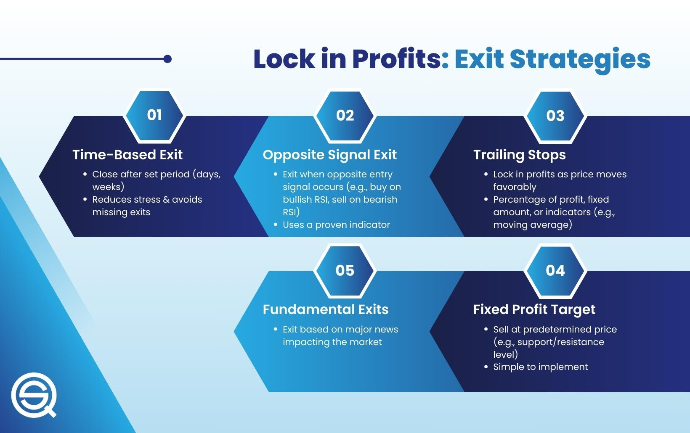

## Table of Contents

## What is a profit-taking strategy?

A profit-taking strategy is a plan that investors use to sell their investments and make money. When the price of an investment goes up, investors might decide it's a good time to sell and take the profit they've made. This helps them lock in the gains they've earned instead of waiting and risking a drop in price.

Choosing when to take profits can be tricky. Some investors set specific goals, like selling when the price goes up by a certain amount. Others might watch the market closely and sell when they think the price has reached its peak. The key is to have a clear plan and stick to it, so you don't miss out on the profits you've worked hard to earn.

## Why is it important to have a profit-taking strategy?

Having a profit-taking strategy is important because it helps you make money from your investments. When you buy something like a stock, you hope its price will go up. If it does, you want to sell it at the right time to make a profit. Without a plan, you might wait too long and the price could drop, making you lose money instead of gaining it. A profit-taking strategy helps you decide when to sell so you can lock in your gains.

It also helps you stay calm and make smart choices. The stock market can be exciting and scary at the same time. Prices can go up and down a lot, and it's easy to get nervous. If you have a clear plan, you won't panic and make quick decisions that you might regret later. Instead, you'll follow your strategy and feel more confident about your choices.

## What are the common types of profit-taking strategies?

One common type of profit-taking strategy is setting a target price. This means you decide on a specific price at which you will sell your investment. For example, if you buy a stock at $50, you might decide to sell it when it reaches $60. This way, you know exactly when to take your profit and don't have to guess if the price will keep going up.

Another strategy is using a trailing stop. This is a bit more flexible. You set a percentage or amount below the current price, and if the price drops to that level, your investment is sold automatically. For instance, if a stock is at $100 and you set a 10% trailing stop, it will sell if the price falls to $90. This helps you keep more of your gains if the price keeps rising, but also protects you if it starts to fall.

A third strategy is based on technical analysis. This involves looking at charts and patterns to decide when to sell. Investors using this method might look for signs that the price is about to drop, like a stock reaching a resistance level. When they see these signs, they sell to take their profits before the price goes down. This method needs more knowledge and practice but can be very effective.

## How does a trailing stop order work in profit-taking?

A trailing stop order is a way to help you make money from your investments without having to watch the market all the time. When you set a trailing stop, you pick a percentage or a dollar amount below the current price of your investment. For example, if you own a stock that's worth $100, you might set a 10% trailing stop. This means if the stock price drops to $90, your stock will be sold automatically.

The cool thing about a trailing stop is that it moves up with the price of your investment. So, if your stock goes up to $110, your trailing stop moves up too, now set to sell at $99 (which is 10% below $110). This way, you can keep more of your gains if the price keeps going up, but you're also protected if the price suddenly drops. It's like having a safety net that follows your investment as it grows.

## What is the difference between a fixed target and a dynamic target in profit-taking?

A fixed target in profit-taking is when you decide on a specific price at which you will sell your investment. For example, if you buy a stock at $50, you might set a fixed target to sell it when it reaches $60. This means you'll sell no matter what happens after the price hits $60. It's simple and clear, but it might mean you miss out if the price keeps going up after you sell.

A dynamic target, on the other hand, changes as the price of your investment moves. A common type of dynamic target is a trailing stop. With a trailing stop, you set a percentage or amount below the current price. If the price goes up, your target moves up with it. For instance, if you set a 10% trailing stop on a stock that's at $100, your sell point would be $90. But if the stock rises to $110, your new sell point becomes $99. This way, you can keep more of your gains if the price keeps rising, but you're also protected if the price suddenly drops.

## How can one determine the optimal profit-taking level?

Deciding the best time to take profits can be tricky, but it often depends on what you want to achieve with your investment. If you have a specific goal in mind, like saving for a big purchase or wanting to make a certain amount of money, you might set a fixed target price. For example, if you need to make $1,000, you can figure out what price your investment needs to reach to get that amount and sell when it hits that level. This way, you know exactly when to take your profit and don't have to guess if the price will keep going up.

Another way to find the best profit-taking level is by using a dynamic target like a trailing stop. This method helps you keep more of your gains if the price keeps rising, but also protects you if the price suddenly drops. To set a trailing stop, you decide on a percentage or dollar amount below the current price. If the price goes up, your sell point moves up with it. For example, if you set a 10% trailing stop on a stock that's at $100, your sell point would be $90. But if the stock rises to $110, your new sell point becomes $99. This way, you can lock in your profits without missing out on potential gains.

It's also important to think about how much risk you're willing to take. Some people might feel comfortable waiting for bigger profits, while others might want to sell sooner to be safe. Looking at charts and patterns, which is called technical analysis, can help you spot signs that the price might be about to drop. By using these tools and understanding your own risk level, you can make a smart plan for when to take your profits.

## What role does market volatility play in profit-taking strategies?

Market [volatility](/wiki/volatility-trading-strategies), which means how much prices go up and down, can really affect when you decide to take your profits. When the market is very volatile, prices can change a lot in a short time. This can make it hard to know the best time to sell. If you see the price of your investment going up and down a lot, you might want to sell sooner to make sure you keep your profits. Waiting too long in a volatile market could mean you lose the money you've made if the price suddenly drops.

On the other hand, if you know the market is volatile, you can use this to your advantage. You might set a tighter trailing stop, which means you'll sell if the price drops just a little bit. This can help you lock in your gains even if the market is moving a lot. Understanding how volatile the market is can help you make a better plan for when to take your profits, so you don't miss out on the money you've worked hard to earn.

## Can you explain the concept of partial profit-taking?

Partial profit-taking is when you sell just some of your investment instead of all of it. This way, you can take some of your profits now, but still keep some of your investment in case the price keeps going up. For example, if you own 100 shares of a stock and it goes up a lot, you might decide to sell 50 shares to take some profit, but keep the other 50 shares in case the price goes even higher.

This strategy can be really helpful because it lets you enjoy some of your gains without missing out on more potential profits. It's like having the best of both worlds. If the price keeps going up, you still have some shares to sell later for even more profit. But if the price starts to drop, you've already taken some money out, so you're not as worried. It's a good way to balance making money now and hoping for more money later.

## How do psychological factors influence profit-taking decisions?

Psychological factors can really affect when people decide to take their profits. One big thing is fear of missing out, or FOMO. People might see their investment going up and up, and they worry that if they sell now, they'll miss out on even bigger gains later. This can make them wait too long to sell, and then the price might drop, and they lose money instead of making it. On the other hand, some people get scared when they see the price going down a little bit. They might sell too soon because they're afraid of losing money, even if the price could go back up later.

Another important psychological [factor](/wiki/factor-investing) is overconfidence. Sometimes, people think they know exactly what the market will do next. They might hold onto their investment too long, hoping for even bigger profits, but the market can be unpredictable. It's easy to think you're smarter than everyone else, but this can lead to bad decisions. It's important to have a clear plan and stick to it, so your emotions don't make you do something you'll regret later.

## What are the tax implications of different profit-taking strategies?

When you make money from selling your investments, you have to pay taxes on those profits. The amount of tax you pay can depend on how long you held the investment before selling it. If you sell an investment you've held for less than a year, the profit is considered a short-term capital gain, and you'll pay your regular income tax rate on it. But if you hold the investment for more than a year, the profit is a long-term capital gain, and you'll usually pay a lower tax rate. So, if you're thinking about when to take your profits, knowing how long you've held the investment can help you save on taxes.

Different profit-taking strategies can also affect your taxes. For example, if you use a fixed target and sell all your investment at once, you might end up with a big tax bill that year. But if you use partial profit-taking and sell your investment in smaller chunks over time, you might be able to spread out your tax payments. This can be helpful if you want to manage how much tax you pay each year. It's always a good idea to talk to a tax professional to understand how your profit-taking strategy will affect your taxes and plan the best way to keep more of your money.

## How can backtesting be used to refine a profit-taking strategy?

Backtesting is a way to test your profit-taking strategy using past data to see how well it would have worked. You can look at what happened to the prices of stocks or other investments in the past and pretend you used your strategy back then. This helps you see if your plan would have made you money or if you need to change it. By trying out different ways to take profits, like setting a fixed target or using a trailing stop, you can find out which one works best for you.

When you backtest, you can also see how your strategy would have done in different market conditions. Markets can be calm or very up and down, and your strategy might work better in some situations than others. By looking at how your plan did in the past, you can make it better for the future. This way, you can feel more confident that your profit-taking strategy will help you make money when you use it for real.

## What advanced techniques can be used to enhance profit-taking in algorithmic trading?

In [algorithmic trading](/wiki/algorithmic-trading), one advanced technique to enhance profit-taking is using [machine learning](/wiki/machine-learning) algorithms. These algorithms can analyze a lot of data quickly, like past prices, news, and other market information. They can find patterns that humans might miss and make smarter decisions about when to sell. For example, a machine learning model can predict how likely it is that a stock's price will go up or down based on what's happened before. This can help you set better profit targets and sell at the right time to make more money.

Another technique is using multiple time frames for analysis. Instead of just looking at the price changes over one time period, like a day or a week, you can look at different time frames at the same time. This can give you a better understanding of what's happening in the market. For instance, you might see a good time to take profits on a short-term chart, but a longer-term chart might show that the price could keep going up. By combining information from different time frames, you can make more informed decisions about when to sell and take your profits.

## References & Further Reading

[1]: Bergstra, J., Bardenet, R., Bengio, Y., & Kégl, B. (2011). ["Algorithms for Hyper-Parameter Optimization."](https://dl.acm.org/doi/10.5555/2986459.2986743) Advances in Neural Information Processing Systems 24.

[2]: ["Advances in Financial Machine Learning"](https://www.amazon.com/Advances-Financial-Machine-Learning-Marcos/dp/1119482089) by Marcos Lopez de Prado

[3]: ["Evidence-Based Technical Analysis: Applying the Scientific Method and Statistical Inference to Trading Signals"](https://www.amazon.com/Evidence-Based-Technical-Analysis-Scientific-Statistical/dp/0470008741) by David Aronson

[4]: ["Machine Learning for Algorithmic Trading"](https://github.com/stefan-jansen/machine-learning-for-trading) by Stefan Jansen

[5]: ["Quantitative Trading: How to Build Your Own Algorithmic Trading Business"](https://books.google.com/books/about/Quantitative_Trading.html?id=j70yEAAAQBAJ) by Ernest P. Chan