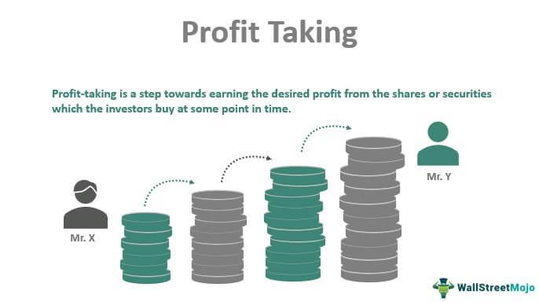

## Table of Contents

## What is profit-taking?

Profit-taking is when investors sell their stocks or other investments to make money from the price going up. They do this because they think the price won't go up much more, or they want to use the money for something else. It's like picking fruit when it's ripe; you take it before it falls or goes bad.

When a lot of people start taking profits at the same time, it can make the price of the investment go down. This is because there are more people selling than buying. It's important for investors to watch the market and decide the best time to take their profits, so they can get the most money possible.

## Why is profit-taking important in trading and investing?

Profit-taking is important in trading and investing because it helps investors make money from their investments. When the price of a stock or other investment goes up, investors can sell it to take their profits. This is like picking fruit when it's ripe; you want to take it before it falls or goes bad. If investors wait too long, the price might go down, and they could lose the chance to make money.

It's also important because it helps investors manage their money. By taking profits, they can use the money to buy other investments or save it for later. This way, they can keep their money growing and avoid losing it all if the market goes down. Knowing when to take profits is a key part of being a smart investor.

## How does profit-taking affect the stock market?

When a lot of people start taking profits at the same time, it can make the price of a stock go down. This happens because there are more people selling than buying. If many investors think a stock has reached its highest price and start selling, the price will drop as more shares are available on the market than people want to buy.

This can create a ripple effect in the stock market. When one stock's price drops because of profit-taking, it can make other investors nervous. They might start selling their stocks too, which can lead to more price drops across the market. But, profit-taking is a normal part of trading and investing, and it helps keep the market balanced by giving other people a chance to buy stocks at lower prices.

## What are common strategies for profit-taking?

One common strategy for profit-taking is setting a target price. This means deciding ahead of time how much you want the stock price to go up before you sell it. For example, if you buy a stock at $50, you might decide to sell it when it reaches $60. This helps you make sure you get the profit you want without waiting too long and risking a price drop.

Another strategy is using stop-loss orders. A stop-loss order is like a safety net. You set a price below the current stock price, and if the stock drops to that price, it will automatically sell. This can help you lock in some profit if the stock price starts to fall. For example, if you bought a stock at $50 and it goes up to $60, you might set a stop-loss at $55 to make sure you keep some of the profit if the price goes down.

A third strategy is trailing stops. This is a bit like a moving stop-loss order. As the stock price goes up, the trailing stop moves up with it, but always stays a certain amount below the current price. This lets you keep riding the price up while still protecting your profits. If the stock price suddenly drops, the trailing stop will sell the stock, locking in the profit you've made so far.

## When is the best time to take profits?

The best time to take profits depends on your goals and the market. If you have a target price in mind, like selling when a stock reaches $60 after buying it at $50, that's a good time to take profits. It helps you make sure you get the money you want without waiting too long and risking the price going down. Also, if you see the market getting shaky or the stock's price starting to drop, it might be smart to take your profits then to avoid losing money.

Another good time to take profits is when you need the money for something else. Maybe you want to buy a new investment or save for something important. Taking profits can give you the cash you need. It's also important to think about how long you want to keep your money in the stock. If you've been holding onto a stock for a long time and it's done well, it might be a good idea to take some profits and let the rest keep growing.

## How can profit-taking impact an investor's portfolio?

When an investor takes profits, it can change their portfolio in big ways. If they sell a stock that has gone up in price, they make money from it. This extra money can be used to buy other stocks or saved for later. It helps keep their money growing and lets them try new investments. But, if they sell too soon, they might miss out on even more money if the stock keeps going up. It's like [picking](/wiki/asset-class-picking) fruit too early; you get some, but you might have gotten more if you waited.

On the other hand, taking profits can also protect an investor's portfolio. If the market starts to go down, selling stocks that have gone up can help them avoid losing money. It's like putting on a seatbelt before a bumpy ride. By taking profits, they can lock in the money they've made and use it to buy other things or keep it safe. Knowing when to take profits is important because it helps investors balance making money and keeping their money safe.

## What psychological factors influence profit-taking decisions?

People's feelings and thoughts can really affect when they decide to take profits. One big feeling is fear. If someone is scared that the stock price might go down, they might sell it too soon to make sure they get some money. This is called fear of missing out, or FOMO, but in reverse. They're scared of losing the money they've made, so they take their profits early. On the other hand, greed can make people wait too long to sell. They might think the price will keep going up and up, so they hold onto the stock hoping for more money. But if the price suddenly drops, they could lose the chance to take any profit at all.

Another feeling that plays a big role is overconfidence. When someone has made good money from a stock, they might start to think they know everything about the market. This can make them keep the stock longer than they should, hoping for even bigger profits. But the market can be unpredictable, and overconfidence can lead to big losses. It's important for investors to stay calm and not let their feelings take over. By thinking clearly and sticking to a plan, they can make better choices about when to take their profits.

## How do different market conditions affect profit-taking strategies?

Different market conditions can change how and when people take profits. In a bull market, where stock prices are going up a lot, people might wait longer to sell their stocks. They think the prices will keep going up, so they want to get as much money as they can. But, they still need to be careful. If they wait too long, the market could turn around and they might lose the chance to take profits. In a bull market, setting a high target price or using a trailing stop can help them get the most out of their investments.

In a bear market, where stock prices are going down, people might take profits more quickly. They're scared that the prices will keep falling, so they want to lock in the money they've made. Using stop-loss orders can be a good idea in a bear market. This way, if the stock price starts to drop, the order will sell the stock automatically and keep some of the profit. In a bear market, it's important to be ready to take profits earlier than in a bull market to avoid big losses.

In a sideways market, where stock prices stay pretty much the same, people might use different strategies. They might take smaller profits more often, instead of waiting for a big jump in price. This can help them keep making money even when the market isn't moving much. In a sideways market, setting small target prices and using stop-loss orders can help them take profits without waiting too long for a big change.

## What are the tax implications of profit-taking?

When you take profits from selling stocks, you have to think about taxes. If you make money from selling a stock, that's called a capital gain. The tax you have to pay on this gain depends on how long you held the stock before selling it. If you held it for less than a year, it's a short-term capital gain, and you'll pay your regular income tax rate on it. If you held it for more than a year, it's a long-term capital gain, and you'll pay a lower tax rate, usually between 0% and 20%, depending on your income.

Taxes can change how you decide to take profits. If you know you'll have to pay a lot of tax on a short-term gain, you might wait until you've held the stock for more than a year to get the lower long-term rate. But, you also have to think about the stock's price and the market. Sometimes, it's better to take the profit and pay the tax than to wait and risk losing money if the price goes down. Talking to a tax advisor can help you figure out the best way to handle your profits and taxes.

## How can automated systems assist with profit-taking?

Automated systems can make taking profits easier by doing things for you without you having to watch the market all the time. These systems can be set up to sell your stocks when they reach a certain price or if they start to drop. For example, you can set a stop-loss order that will sell your stock if it goes down to a price you choose. This way, you can lock in your profits without having to check the market every day. Automated systems can also use trailing stops, which move up as the stock price goes up, helping you get more profit if the price keeps rising.

Using these systems can help you stick to your plan and not let your feelings get in the way. Sometimes, people get scared or greedy and make bad choices about when to sell their stocks. With an automated system, you can set it up to do what you want without letting fear or greed take over. This can help you make better decisions and keep your money growing. But, it's still important to keep an eye on your investments and make sure the automated system is doing what you want it to do.

## What are the risks associated with premature or delayed profit-taking?

Taking profits too early can mean you miss out on more money. If you sell a stock as soon as it goes up a little, you might not get as much profit as you could if you waited longer. For example, if you buy a stock at $50 and it goes to $60, you might sell it then. But if you waited, it could have gone to $70 or more. Selling too soon can make you feel safe, but it can also mean you don't get all the money you could have.

On the other hand, waiting too long to take profits can be risky too. If you hold onto a stock hoping it will keep going up, you might lose the profit you already made if the price suddenly drops. For example, if you bought a stock at $50 and it goes to $70, but then falls back to $40, you could lose money. It's important to find a good balance between taking profits early enough to make money and waiting long enough to get the most out of your investment.

## How do professional traders and institutional investors approach profit-taking differently from retail investors?

Professional traders and institutional investors often have more tools and resources to help them decide when to take profits. They use big computers and special software to watch the market closely and make quick decisions. They might also have teams of people who study the market and give them advice. Because they have more money to invest, they can take bigger risks and hold onto stocks longer, hoping for bigger profits. But they also have to be careful because they manage a lot of other people's money, so they use strict rules to decide when to sell.

Retail investors, on the other hand, usually don't have as many tools or as much money to work with. They might use simple apps on their phones or websites to buy and sell stocks. They often have to make decisions on their own, without a team to help them. Because they have less money to invest, they might be more scared of losing it, so they might take profits sooner than professional traders. They might also be more affected by their feelings, like fear or greed, when deciding when to sell.

## What are the strategies for profit-taking in algo trading?

In [algorithmic trading](/wiki/algorithmic-trading), profit-taking strategies are employed to maximize earnings by strategically exiting positions. These strategies are critical for ensuring that gains are realized efficiently in diverse market conditions. The primary strategies include trend-following, mean reversion, and adaptive profit-taking.

**Trend-Following Strategy**: This approach capitalizes on capturing established market trends. Once a trend has been identified, the algorithm exits positions to lock in gains as the trend matures. This strategy relies on technical indicators, such as moving averages, to detect and confirm trends. For instance, an algorithm might exit a position when a short-term moving average crosses below a long-term moving average, a signal that the prevailing trend may be reversing. The formula for a simple moving average (SMA) is:

$$
\text{SMA} = \frac{\sum_{i=1}^{n} P_i}{n}
$$

where $P_i$ is the price at each time interval $i$, and $n$ is the number of time intervals considered.

**Mean Reversion Strategy**: This strategy targets assets that have deviated from their historical average prices, assuming that prices will revert to the mean over time. The algorithm sells positions once prices return to these historical averages. A common tool for implementing this strategy is Bollinger Bands, which identify whether prices are unusually high or low relative to a moving average. When prices exceed the upper band, the algorithm may trigger a sell signal. The formula for Bollinger Bands involves the SMA and standard deviations ($\sigma$) of price:

$$
\text{Upper Band} = \text{SMA} + k \times \sigma
$$
$$
\text{Lower Band} = \text{SMA} - k \times \sigma
$$

where $k$ is the number of standard deviations away from the SMA.

**Adaptive Profit-Taking**: This strategy entails modifying profit-taking thresholds based on varying market conditions and ongoing performance evaluations. Unlike fixed strategies, adaptive strategies incorporate machine learning and real-time data analysis to determine optimal exit points dynamically. Python can be used to model adaptive strategies by feeding algorithms with streaming data and optimizing exits using frameworks like TensorFlow or scikit-learn. An example of adaptive decision-making could involve a reinforcement learning model that adjusts exit thresholds to maximize cumulative profits:

```python
import numpy as np

def adaptive_profit_taking(price_history, model):
    for price in price_history:
        recommendation = model.predict(price)
        if recommendation == 'sell':
            execute_trade('sell', price)

price_data = np.array([...])  # Placeholder for actual price data
trained_model = load_trained_model('profit_taking_model.h5')
adaptive_profit_taking(price_data, trained_model)
```

By utilizing these strategies, traders can effectively manage and secure profits within algorithmic trading, adapting to ever-changing market dynamics.

## References & Further Reading

[1]: Bergstra, J., Bardenet, R., Bengio, Y., & Kégl, B. (2011). ["Algorithms for Hyper-Parameter Optimization."](https://papers.nips.cc/paper/4443-algorithms-for-hyper-parameter-optimization) Advances in Neural Information Processing Systems 24.

[2]: ["Advances in Financial Machine Learning"](https://www.amazon.com/Advances-Financial-Machine-Learning-Marcos/dp/1119482089) by Marcos Lopez de Prado

[3]: ["Evidence-Based Technical Analysis: Applying the Scientific Method and Statistical Inference to Trading Signals"](https://www.amazon.com/Evidence-Based-Technical-Analysis-Scientific-Statistical/dp/0470008741) by David Aronson

[4]: ["Machine Learning for Algorithmic Trading"](https://github.com/PacktPublishing/Machine-Learning-for-Algorithmic-Trading-Second-Edition) by Stefan Jansen

[5]: ["Quantitative Trading: How to Build Your Own Algorithmic Trading Business"](https://books.google.com/books/about/Quantitative_Trading.html?id=j70yEAAAQBAJ) by Ernest P. Chan