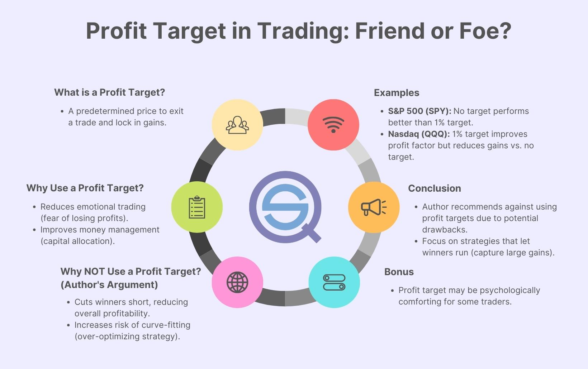

Modern investing has transformed significantly, utilizing sophisticated tools and strategies aimed at optimizing profits while minimizing risks. One such innovative approach is profit target investing, a method which involves setting predetermined price levels to exit trades and secure gains. This strategy supports traders in maintaining a disciplined approach to investment, reducing the influence of emotional decision-making which can lead to impulsive actions and heightened risk.

Algorithmic trading, a rapidly growing domain in the financial sector, complements profit target investing by automating trading decisions through advanced software solutions. This automation not only increases the precision and speed of trade execution but also facilitates the consistent application of trading strategies, such as profit target setting, across various market conditions.



This article investigates into the concept of profit target investing, examining its significance within financial strategies and its synergistic relationship with algorithmic trading. By integrating these methodologies, investors can enhance their trading efficiency and adapt swiftly in the ever-evolving financial markets. Through a combination of predetermined profit targets and automated algotrading platforms, traders are better positioned to achieve their financial goals in an informed and structured manner.

## Table of Contents

## Understanding Profit Targets

A profit target represents a predetermined price level at which an investor intends to exit a trade to secure gains. This approach is a cornerstone of strategic trading, crucial for maintaining a disciplined stance in the financial markets. By defining explicit exit points, traders can manage risk more effectively, ensuring that speculative activities do not become guided by impulsive emotional responses that typically heighten exposure to potential losses.

In the context of managing risk, profit targets serve as a deterrent against emotional trading behaviors that may lead to impromptu decisions. Emotional decision-making is often driven by greed or fear, manifesting in actions such as holding onto a position longer than advisable in hopes of further gains or prematurely exiting a trade during temporary market fluctuations. By adhering to predefined profit targets, traders reinforce a structured trading strategy that aligns with their overall risk management objectives.

Setting a profit target typically involves analyzing various market factors and employing specific methodologies like technical analysis. For instance, traders may use resistance levels—points at which an asset's price historically struggles to advance—as potential profit targets. Fibonacci retracement levels, another technical analysis tool, are also frequently used to predict profit targets based on historical price movements.

Here is a simple Python example illustrating how one might employ historical price data to establish a profit target:

```python
def calculate_fibonacci_targets(current_price, price_high, price_low):
    retracement_levels = [0.236, 0.382, 0.618, 0.786]
    targets = [(current_price - (price_high - price_low) * level) for level in retracement_levels]
    return targets

current_price = 150
price_high = 200
price_low = 120

targets = calculate_fibonacci_targets(current_price, price_high, price_low)
print("Potential profit targets based on Fibonacci retracement:", targets)
```

In this example, Fibonacci retracement levels help identify potential [exit](/wiki/exit-strategy) points by analyzing past price behaviors, thus establishing robust profit targets. By setting these targets, traders enable a systematic approach to investment, reducing the likelihood of snap decisions and fostering consistent strategies aligned with their risk tolerance and financial goals.

## The Importance of Profit Targets in Investing Strategy

Profit targets are essential in crafting a defined and effective investing strategy, serving as benchmarks that balance potential rewards against associated risks. Setting profit targets involves specifying sell points in advance, thereby reducing the emotional influences that often lead to suboptimal trading decisions. By establishing these targets, traders can adhere to an organized trading plan, ensuring consistency and alignment with their broader financial objectives.

The application of profit targets brings clarity to the trading process by defining exit strategies beforehand. This pre-emptive planning ensures that decisions align with a trader's risk tolerance and investment goals. For instance, a trader who establishes a profit target at 10% gains avoids the common pitfall of emotional trading, which might prompt irrational decisions under volatile market conditions. Such disciplined approaches mitigate the risk of emotional reactions that could lead to exiting profitable trades prematurely or, conversely, holding onto them for too long.

One of the significant risks mitigated by setting profit targets is the tendency to hold on to winning trades indefinitely, hoping for even higher returns. Without predefined exit points, the market's unpredictable nature may cause a reversal, eroding unrealized profits. Traders, therefore, safeguard their gains by adhering to the targets set preemptively, effectively curbing the impulse to extend trades beyond logical limits. This discipline reduces the likelihood of transforming potential profits into losses—a common occurrence in the absence of structured exit points.

In essence, profit targets serve as critical components of a disciplined trading framework. They ensure that traders remain focused beyond immediate market fluctuations, fostering adherence to strategic financial planning. The implementation of profit targets not only safeguards against the emotional pitfalls inherent in financial markets but also enhances decision-making by providing objective metrics that are in line with the predefined goals of the trader.

## Algorithmic Trading and Setting Profit Targets

Algorithmic trading platforms, such as UltraAlgo, play a significant role in modern-day investing by automating the process of setting and adjusting profit targets. These platforms leverage sophisticated algorithms and computational power to streamline trading activities, thereby enhancing efficiency and reducing the emotional bias inherent in manual trading.

Backtesting is one of the fundamental tools provided by these platforms. It allows traders to evaluate the performance of a trading strategy by applying it to historical data. This process helps in identifying optimal profit target levels by analyzing past market conditions and trader behavior. By simulating trades with historical data, traders can estimate potential profitability and the risk associated with different profit targets, leading to more informed decision-making.

The use of technical indicators is another vital component. Indicators like moving averages, Relative Strength Index (RSI), and Bollinger Bands provide insights into market trends and potential reversal points. These indicators can signal when the market conditions are ripe for reaching predetermined profit targets. For instance, an RSI above 70 might indicate an overbought market, suggesting that it could be an opportune moment to set or adjust a profit target.

AI-powered insights further enhance these capabilities by providing dynamic responses to ever-changing market conditions. Machine learning algorithms can process vast amounts of data in real-time, identifying patterns and trends that might not be immediately apparent to human traders. With these insights, traders can swiftly adjust their profit targets to capitalize on emerging opportunities or mitigate potential losses. For example, a [machine learning](/wiki/machine-learning) model may detect a pattern suggesting an upcoming market rally, prompting the trader to adjust the profit target upwards to capture more gains.

Algorithmic trading platforms often support automation through APIs that allow traders to code their strategies in programming languages like Python. A simple example of setting a dynamic profit target using Python might involve the following code snippet:

```python
import pandas as pd
import ta

# Load historical data
data = pd.read_csv('historical_prices.csv')
# Calculate a simple moving average
data['SMA'] = ta.trend.sma_indicator(data['close'], window=20)

# Set a dynamic profit target based on moving average
def set_profit_target(current_price, moving_average):
    if current_price > moving_average:
        return current_price * 1.05  # Target 5% gain if above average
    else:
        return current_price * 1.02  # Target 2% gain if below average

data['Profit_Target'] = data.apply(lambda row: set_profit_target(row['close'], row['SMA']), axis=1)
```

This example demonstrates how traders can dynamically set profit targets based on moving average trends, ensuring they adapt to market conditions effectively. By automating these processes, platforms like UltraAlgo offer traders enhanced precision, reduced emotional interference, and improved potential for maximizing investment returns.

## Implementing Effective Profit Target Strategies

Traders aiming to optimize their investment outcomes can employ various profit target strategies, such as trailing stops and resistance levels, to create dynamic profit targets. These strategies are vital in capturing additional profits while ensuring that gains are preserved when market conditions fluctuate.

Trailing stops are an effective method in profit target strategies, allowing for dynamic target adjustments as the market price moves in a favorable direction. By setting a trailing stop, traders ensure that their stop-loss level trails the market price by a specific percentage or dollar amount, thus locking in profits if the market price reverses. The formula for a trailing stop loss can be expressed as: 

$$
\text{Trailing Stop Price} = \text{Current Market Price} \times (1 - \text{Trailing Stop Percentage})
$$

For instance, if a stock price rises from $100 to $110 and the trader sets a trailing stop at 5%, the trailing stop would move to $104.50. If the price then falls to $104.50, the stop order is triggered, thus capturing a profit.

Resistance levels are another essential tool for setting dynamic profit targets. Traders identify these levels through technical analysis to anticipate where an asset may encounter selling pressure. Utilizing resistance levels, traders can set profit targets just below these anticipated levels to maximize gains while preemptively exiting before potential declines.

Leveraging platforms like UltraAlgo enhances these strategies, offering sophisticated tools such as [backtesting](/wiki/backtesting), which enables traders to simulate and refine their profit target strategies based on historical data. Technical indicators provided by such platforms can identify optimal entry and exit points, increasing the precision of dynamic target settings.

The integration of algorithmic tools in setting profit targets ensures disciplined trading by minimizing the emotional biases often associated with manual trading. Algorithms can automatically adjust targets based on pre-defined market conditions and indicators, ensuring alignment with the trader's strategic objectives.

In conclusion, employing strategies like trailing stops and resistance levels in conjunction with [algorithmic trading](/wiki/algorithmic-trading) tools like UltraAlgo enables investors to maintain discipline and optimize their trade outcomes in volatile markets. The dynamic nature of these strategies ensures that traders can effectively capture profit opportunities while safeguarding against potential market reversals, ultimately contributing to a structured and successful trading approach.

## Conclusion

Incorporating profit targets into trading strategies is fundamental for effectively managing investment risk while maximizing potential gains. Profit targets not only establish a disciplined framework for entering and exiting trades but also help in mitigating emotional biases that might otherwise lead to suboptimal decision-making. By defining these targets clearly, traders maintain a structured approach, reducing the likelihood of converting profitable trades into losses due to market fluctuations.

Algorithmic trading platforms play a vital role in this process. They provide an array of sophisticated resources to automate and enhance the implementation of profit target strategies. Utilizing advanced statistical tools, backtesting functionalities, and real-time market data analysis, these platforms enable traders to fine-tune their strategies for setting and adjusting profit targets dynamically. The integration of machine learning algorithms and AI-powered insights further empowers traders to quickly adapt to changing market conditions, ensuring that profit strategies remain effective regardless of market [volatility](/wiki/volatility-trading-strategies).

By setting well-defined profit targets and leveraging technological advancements in algorithmic trading, traders enhance their probability of success. These methodologies ensure that trading activities are aligned with overall financial objectives, helping traders to optimize their returns in the constantly evolving financial markets. Consequently, adopting a disciplined strategy with clear profit targets is essential for any trader seeking to maximize their success and sustainability in trading ventures.

## References & Further Reading

[1]: Bergstra, J., Bardenet, R., Bengio, Y., & Kégl, B. (2011). ["Algorithms for Hyper-Parameter Optimization."](https://dl.acm.org/doi/10.5555/2986459.2986743) Advances in Neural Information Processing Systems 24.

[2]: ["Advances in Financial Machine Learning"](https://www.amazon.com/Advances-Financial-Machine-Learning-Marcos/dp/1119482089) by Marcos Lopez de Prado

[3]: ["Evidence-Based Technical Analysis: Applying the Scientific Method and Statistical Inference to Trading Signals"](https://www.amazon.com/Evidence-Based-Technical-Analysis-Scientific-Statistical/dp/0470008741) by David Aronson

[4]: ["Machine Learning for Algorithmic Trading"](https://github.com/stefan-jansen/machine-learning-for-trading) by Stefan Jansen

[5]: ["Quantitative Trading: How to Build Your Own Algorithmic Trading Business"](https://www.amazon.com/Quantitative-Trading-Build-Algorithmic-Business/dp/1119800064) by Ernest P. Chan