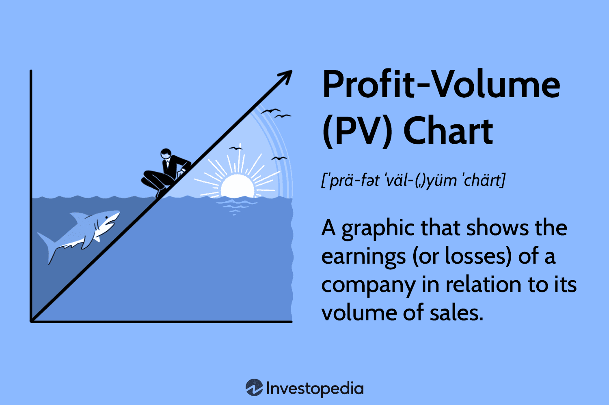

Profit-Volume (PV) charts are vital tools in business analysis, offering essential insights into a company's financial strategy. These charts visually depict the correlation between a company's profits and its sales volume, allowing stakeholders to grasp complex financial data quickly and effectively. By plotting key metrics such as revenues, costs, and sales volumes, PV charts serve as powerful instruments for evaluating a business's financial health. They are often used to identify critical benchmarks, such as the break-even point where total revenues align with total costs, indicating neither a profit nor a loss.

The significance of PV charts extends beyond simple visualization. These charts play a pivotal role in decision-making processes by highlighting which products or services within a company’s portfolio are profitable and which are not. This information empowers businesses to adapt their strategies in real-time, optimizing pricing, sales targets, and cost management. As profitability is intrinsically linked to sales volume, PV charts are instrumental in projecting future revenue scenarios based on different sales conditions, thereby supporting strategic planning efforts.



In the contemporary financial landscape, the relevance of PV charts is further amplified when incorporated into algorithmic trading strategies. With the increasing reliance on data to drive trading decisions, PV charts can be integrated into algorithmic models to enhance prediction accuracy and optimize trades. This integration enables traders to leverage profitability metrics, allowing for the automation of buying and selling decisions based on real-time financial data. As these algorithms refine their understanding of market patterns, the potential for improved financial outcomes becomes more pronounced.

Overall, PV charts are not only foundational tools in traditional business analysis but are also indispensable in modern algorithmic trading environments. By harnessing the insights provided by PV charts, companies can achieve superior financial performance and operational efficiency through informed strategic decision-making and enhanced market responsiveness.

## Table of Contents

## What is a Profit-Volume (PV) Chart?

A Profit-Volume (PV) chart is a graphical tool that illustrates the correlation between a company's profits and its sales volume. This chart is a vital instrument in the financial analysis arsenal, providing businesses with the ability to identify critical financial metrics. Primarily, it aids in pinpointing the break-even point, which is the production and sales level at which total revenues precisely cover total costs, resulting in neither profit nor loss.

The PV chart is underpinned by several key components:

1. **Total Revenue (TR):** This is the income generated from sales before any expenses are deducted. Total Revenue can be expressed as $TR = P \times Q$, where $P$ is the price per unit and $Q$ is the quantity of units sold.

2. **Total Costs (TC):** Total costs are the sum of fixed and variable expenses incurred by a company in the production of goods or services. Total costs can be expressed as $TC = FC + (VC \times Q)$, where $FC$ represents fixed costs and $VC$ represents variable costs per unit.

3. **Sales Volume:** This refers to the total quantity of goods or services sold. It directly impacts both costs and revenue, and consequently, profitability.

The calculation of the break-even point, which is often depicted on a PV chart, is fundamental to business planning. This can be calculated using the formula:

$$
\text{Break-even Point (units)} = \frac{FC}{P - VC}
$$

Where $FC$ is fixed costs, $P$ is the price per unit, and $VC$ is the variable cost per unit. This formula allows businesses to determine the minimum sales [volume](/wiki/volume-trading-strategy) needed to cover all costs—critical for setting realistic sales targets and making informed pricing decisions.

In summary, a Profit-Volume chart provides a streamlined view of the interplay between sales volume, costs, and profits, making it an invaluable tool for analyzing product profitability and setting strategic goals. By using PV charts, businesses can not only estimate the sales required to achieve desired profit levels but also gain insights into optimizing operational performance.

## Understanding the Components of PV Charts

A Profit-Volume (PV) chart serves as a strategic tool for businesses, capturing critical components that influence financial outcomes. Understanding these components is crucial for making informed financial decisions.

**Sales Volume:** Sales volume is the total quantity of products sold over a specific period. It directly impacts profitability, as higher sales volumes typically lead to increased revenues. However, profit is influenced by factors beyond just sales volume, such as pricing strategies and cost management. Sales volume is quantified as:

$$
\text{Sales Volume} = \sum_{i=1}^{n} \text{Units Sold}_i
$$

where $\text{Units Sold}_i$ represents the units sold for each product $i$.

**Break-Even Point:** The break-even point is the level of sales at which total revenue equals total costs, resulting in neither profit nor loss. It is a critical marker for businesses to determine the minimum sales volume needed to avoid losses. The formula for calculating the break-even point in units is:

$$
\text{Break-Even Point (units)} = \frac{\text{Fixed Costs}}{\text{Price per Unit} - \text{Variable Cost per Unit}}
$$

This equation highlights the importance of controlling both fixed and variable costs to achieve profitability.

**Total Costs:** Total costs are the sum of fixed and variable costs incurred in producing goods or services. Fixed costs remain constant regardless of production volume, whereas variable costs fluctuate with sales volume. Therefore, managing both types of costs is essential for maintaining profitability. Total costs can be expressed as:

$$
\text{Total Costs} = \text{Fixed Costs} + (\text{Variable Cost per Unit} \times \text{Sales Volume})
$$

**Total Revenue:** Total revenue represents the income generated from sales before any expenses are deducted. It provides an overview of a company’s revenue-generating capability, forming a foundational measure for assessing financial health. It is calculated as:

$$
\text{Total Revenue} = \text{Price per Unit} \times \text{Sales Volume}
$$

These components of PV charts—sales volume, break-even point, total costs, and total revenue—provide a comprehensive framework for understanding profitability and financial strategies. Through careful analysis, businesses can adjust their operations to optimize profit margins, aligning their sales goals with financial health objectives.

## Importance of PV Charts in Business Decision-Making

Profit-Volume (PV) charts hold significant importance in business decision-making by providing a clear visual representation of the relationship between sales volume and profit potential. These charts enable businesses to identify which products or services are most profitable, based on their sales volume and associated revenue.

PV charts are particularly valuable in determining the sales volume required to cover costs. By identifying the break-even point — where total revenue equals total costs — businesses can assess the minimum number of units they need to sell to avoid losses. This is crucial for setting realistic sales targets and ensuring financial stability.

Moreover, PV charts facilitate the forecasting of profit changes under various sales scenarios. By analyzing different sales volumes, companies can predict how changes in product demand might affect their profitability. This predictive capability allows businesses to test different strategic options, such as varying pricing strategies, adjusting production scales, or exploring cost reduction opportunities.

By utilizing PV charts, companies can make informed strategic decisions regarding pricing, cost management, and sales targets. For example, businesses can use these charts to evaluate whether lowering prices will lead to a sufficient increase in volume to boost overall profits, or if it is more advantageous to enhance cost efficiencies to achieve desired profit levels.

PV charts encapsulate essential data that aids businesses in optimizing their operational strategies. Through clear graphical insights, companies gain the ability to navigate complex financial landscapes and devise strategies that bolster profitability and competitive advantage. By integrating these analyses into their decision-making processes, organizations can enhance their prospects for sustainable growth and success in a dynamic market environment.

## Examples of PV Chart Analysis

A critical application of Profit-Volume (PV) chart analysis is assessing the performance and profitability of individual and multiple products, as well as service-oriented businesses. The distinct use cases illustrate how PV charts can guide businesses in their strategic planning.

### Single Product Analysis

For a single product, a PV chart elucidates its profitability and the sales volume required to achieve desired profit margins. By plotting the relationship between sales volume and profit, businesses can identify the break-even point—where total revenue equals total costs—and determine the sales levels needed to surpass this threshold into profitability. This analysis assists in setting realistic sales goals and pricing strategies. For instance, if a company sells a gadget with fixed costs of $5,000 and variable cost per unit of $20, and each unit sells for $50, the break-even volume is calculated as:

$$
\text{Break-even volume} = \frac{\text{Fixed Costs}}{\text{Selling Price per Unit} - \text{Variable Cost per Unit}} = \frac{5000}{50 - 20} = 167 \text{ units}
$$

Surpassing this threshold ensures profitability, guiding production targets and marketing strategies.

### Multiple Product Analysis

When dealing with multiple products, a PV chart provides comparative insights into each product's profitability. By plotting each product’s profit against its sales volume, companies can discern which products offer the highest returns relative to others. This analysis assists in resource allocation, marketing focus, and product-line adjustments. For example, using Python, companies might automate this comparison with a script to plot and analyze each product's data:

```python
import matplotlib.pyplot as plt

products = ['Product A', 'Product B', 'Product C']
sales_volume = [500, 300, 800]
profits = [15000, 12000, 18000]

plt.bar(products, profits)
plt.title('Profit Comparison by Product')
plt.xlabel('Products')
plt.ylabel('Profit')
plt.show()
```

The visual representation helps stakeholders make informed decisions about which products warrant more investment or require strategic pricing changes to increase profitability.

### Service Business Analysis

PV charts are not limited to tangible goods; they are equally valuable for service-based businesses. Here, the focus is on optimizing profit margins through efficient pricing and cost management strategies. Service businesses often face fluctuating variable costs, and a PV chart helps visualize the sales volume needed to cover these costs along with fixed expenses. For example, a consultancy firm can use PV charts to determine the number of billable hours required to cover costs and achieve profitability. Adjustments in pricing, service offerings, and cost structures can be planned more effectively using insights from PV data.

In conclusion, PV charts serve as an essential analytical tool across various business models. By applying PV analysis to single and multiple products and services, businesses can refine their pricing, production, and marketing strategies to maximize profitability and ensure sustainable growth.

## Integrating PV Charts with Algo Trading

Algorithmic trading systems leverage Profit-Volume (PV) charts to enhance decision-making by analyzing the intricate relationship between sales volume and profitability. These charts serve as key inputs for predicting market trends and formulating data-driven financial decisions. In such trading frameworks, PV charts help identify pricing patterns and sales performance, crucial factors that influence automated buy and sell decisions.

PV charts provide a visual representation of profitability metrics that can be directly integrated into algorithmic models. These metrics include sales volume, total revenue, total costs, and the break-even point, all of which are vital for evaluating the financial health of an asset. Through PV chart analysis, algorithmic traders can derive actionable insights, such as when an asset exceeds its break-even point and begins to yield profits.

By continuously updating PV chart analyses, automated trading systems can refine their strategies, thus improving both accuracy and profitability. This involves recalculating profitability metrics in real-time and adjusting trading algorithms accordingly. For instance, if a sudden increase in sales volume leads to a rise in profitability, a trading algorithm might trigger a buy signal based on the newly calculated profit margins.

Here is a simple example of how such an integration can be implemented using Python:

```python
# Sample Python code to integrate PV chart metrics into a trading algorithm

def calculate_break_even_point(fixed_costs, variable_cost_per_unit, price_per_unit):
    return fixed_costs / (price_per_unit - variable_cost_per_unit)

def trading_decision(sales_volume, break_even_volume):
    if sales_volume > break_even_volume:
        return "Buy"
    else:
        return "Sell"

# Example usage
fixed_costs = 10000
variable_cost_per_unit = 20
price_per_unit = 50
sales_volume = 300

break_even_volume = calculate_break_even_point(fixed_costs, variable_cost_per_unit, price_per_unit)
decision = trading_decision(sales_volume, break_even_volume)

print(f"The trading decision based on current sales volume is: {decision}")
```

This code snippet computes the break-even point and makes trading decisions based on current sales volume versus the calculated threshold. By embedding such computations into their systems, traders can dynamically adjust their strategies in response to market movements.

Overall, the integration of PV charts into [algorithmic trading](/wiki/algorithmic-trading) systems serves to enhance trading precision and profitability. These tools provide foundational metrics that can be continually monitored and adjusted to align with financial goals, thereby optimizing performance in volatile markets.

## Conclusion

In business analysis and algorithmic trading, Profit-Volume (PV) charts play a crucial role in enhancing the decision-making framework. These visual tools allow firms to visualize the relationship between profit and sales volume, providing a foundation for better forecasting and strategic planning.

PV charts serve as a vital component in identifying areas of potential profitability. By analyzing data points such as total revenue, total costs, and sales volume, businesses can pinpoint products and services with higher profit potential, assess break-even points, and establish realistic sales targets. This detailed analysis helps companies execute informed strategic decisions, such as price adjustments or cost management practices, ultimately leading to increased profitability and operational efficiency.

Incorporating PV charts into trading strategies, particularly in algorithmic trading, equips traders with enhanced predictive capacity. These charts offer critical profitability metrics, allowing traders to develop algorithms that react to market trends with greater accuracy. By leveraging the continuous updates offered by PV chart analyses, algorithmic trading systems can provide more precise buy and sell signals, thereby optimizing performance and profitability.

Overall, PV charts are essential tools that facilitate not only traditional business analysis but also the advancement of modern trading systems. By integrating these charts into business strategies, companies are better positioned to achieve superior financial outcomes and enhanced operational effectiveness, making well-informed financial decisions a more tangible reality.

## References & Further Reading

[1]: ["Strategic Management Accounting: Theory and Practice"](https://books.google.com/books/about/Strategic_Management_Accounting_Theory_A.html?id=ZFQtQwAACAAJ) by Malcolm Smith

[2]: Dhanuka, M., & Gupta, S. (2014). ["Break-even Analysis: A Key to Profit Planning and Control."](https://ebooks.inflibnet.ac.in/mgmtp11/chapter/break-even-analysis/) International Journal of Research in Management & Business Studies.

[3]: ["Financial Modeling and Valuation: A Practical Guide to Investment Banking and Private Equity"](https://books.google.com/books/about/Financial_Modeling_and_Valuation.html?id=Bet3zgEACAAJ) by Paul Pignataro

[4]: Naveed, K. (2012). ["Algorithmic Trading Strategies – Proprietary Trading, High Frequency, and Arbitrage Mechanisms."](https://ijrpr.com/uploads/V4ISSUE11/IJRPR19386.pdf) 

[5]: ["Profitability Analysis Using Cost-Volume-Profit Approach."](https://accountingprofessor.org/everything-you-need-to-know-about-cost-volume-profit-cvp-analysis/) by Ilona Loica, Journal of Economic Literature