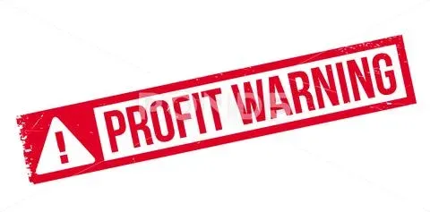

## Table of Contents

## What is a profit warning?

A profit warning is when a company tells everyone that it might not make as much money as it thought it would. This can happen if the company is having problems or if things in the world change and affect their business. When a company gives a profit warning, it's like saying, "We're not doing as well as we hoped, and we might not reach our money goals."

When a company issues a profit warning, it can make people worried. Investors who own parts of the company might sell their shares because they think the company's value will go down. This can make the price of the company's stock drop. Also, customers and other businesses might start to think the company is not doing well and might not want to do business with them as much.

## Why do companies issue profit warnings?

Companies issue profit warnings because they want to be honest with people who care about their business, like investors and customers. When a company sees that it won't make as much money as it expected, it tells everyone so they are not surprised later. This is important because it helps keep trust. If a company suddenly does worse than expected without warning, people might feel tricked and lose faith in the company.

Also, there are rules that companies have to follow. In many places, the law says that if a company knows it will make less money than it told everyone before, it has to say so. This is to make sure the stock market is fair and that everyone has the same information. By giving a profit warning, a company follows these rules and avoids getting into trouble.

## How does a profit warning affect a company's stock price?

When a company issues a profit warning, it usually makes the company's stock price go down. This happens because investors get worried that the company is not doing as well as they thought. If a company says it will make less money, people might think the company is not worth as much as before. So, they might sell their shares, which makes the price of the stock drop.

Sometimes, the stock price might not go down a lot if investors already thought the company was going to have problems. But usually, a profit warning is bad news for the stock price. It can also make other people, like customers and business partners, think the company is in trouble, which can make things even worse for the stock price.

## What are the common causes of a profit warning?

One common reason for a profit warning is when a company's sales go down. This can happen if people stop buying the company's products or services. Maybe a new competitor came along and took away customers, or maybe the economy got worse and people don't have as much money to spend. When sales drop, the company makes less money, and it might need to warn everyone that it won't meet its profit goals.

Another reason is when costs go up. If it suddenly costs more to make or sell the company's products, the company might not make as much profit. This can happen if the price of materials goes up, or if the company has to pay its workers more. Sometimes, unexpected things like natural disasters or new laws can make costs go up, and the company has to tell everyone it might not make as much money as it planned.

Sometimes, a profit warning comes from problems inside the company. Maybe the company made bad decisions, like spending too much money on things that didn't help the business grow. Or maybe the company found out it was doing something wrong and had to fix it, which cost a lot of money. When these kinds of problems happen, the company might need to warn everyone that it won't make as much profit as it hoped.

## How can investors identify early signs of a potential profit warning?

Investors can look at a company's sales numbers to spot early signs of a profit warning. If a company's sales are going down, it might mean they won't make as much money as they thought. Investors can check the company's reports to see if sales are lower than before. They can also look at what people are saying about the company's products or services. If customers are unhappy or if there are fewer customers, that's a sign that sales might keep going down.

Another thing to watch is if the company's costs are going up. If it costs more to make or sell the company's products, the company might not make as much profit. Investors can look at the company's financial reports to see if costs are higher than before. They should also pay attention to news about the company or the industry. If something big happens, like a new law or a natural disaster, it might make costs go up and lead to a profit warning.

Sometimes, problems inside the company can be a sign of a profit warning. If the company is making bad decisions or if there are big changes happening, like a new CEO, it might affect how much money the company makes. Investors can read news about the company and listen to what the leaders say in meetings with investors. If the company seems to be struggling or making risky moves, it might be a sign that a profit warning is coming.

## What steps should a company take after issuing a profit warning?

After issuing a profit warning, a company should start by figuring out why it's not making as much money as it thought. They need to look at their sales numbers, costs, and any problems inside the company. Once they know what's going wrong, they can make a plan to fix it. This might mean cutting costs, finding new ways to sell their products, or changing how the company works. It's important for the company to act fast and let everyone know what they're doing to make things better.

Next, the company should talk to its investors and customers. They need to explain what happened and what they're doing to fix it. Being honest and clear can help keep people's trust. The company should also keep an eye on how things are going and update everyone if there are any changes. By showing that they're working hard to solve the problem, the company can start to rebuild its reputation and maybe even make its stock price go back up.

## How do profit warnings impact different stakeholders like employees, suppliers, and customers?

When a company issues a profit warning, it can make employees worried about their jobs. They might think the company is not doing well and could start cutting jobs to save money. This can make employees feel stressed and less happy at work. They might even start looking for new jobs because they're not sure if the company will be okay. For suppliers, a profit warning can mean the company might not buy as much from them. If the company is spending less, suppliers might get less business, which can hurt their own profits. They might also worry about getting paid on time if the company is having money problems.

Customers can also be affected by a profit warning. They might start to think the company's products or services are not as good as before. This can make them less likely to buy from the company, which can make things even worse. If customers hear that a company is not doing well, they might go to a different company instead. This can lead to even lower sales for the company that issued the profit warning. Overall, a profit warning can make everyone connected to the company feel unsure and worried about the future.

## Can a profit warning be a strategic move by a company?

Yes, a profit warning can sometimes be a strategic move by a company. If a company knows it will not make as much money as it said before, it can tell everyone early. This can help the company keep trust with investors and customers. By being honest and clear, the company can show that it is trying to do the right thing. This can make people feel better about the company, even if it's not doing as well as hoped.

Also, a profit warning can give a company time to fix its problems. If the company tells everyone it might not make as much money, it can start working on a plan to do better. This might mean cutting costs or finding new ways to sell its products. By doing this, the company can try to turn things around before they get worse. So, a profit warning can be a smart move to help the company get back on track.

## What are the regulatory requirements for issuing a profit warning?

When a company thinks it will make less money than it told everyone before, it has to follow certain rules. In many places, the law says that if a company knows it will not meet its profit goals, it has to tell everyone. This is called issuing a profit warning. The company has to make sure that the information is clear and honest. They usually have to send the profit warning to the stock market and share it with the public at the same time. This helps make sure that everyone has the same information and the stock market stays fair.

There are also rules about how quickly a company has to issue a profit warning. If the company finds out it will not make as much money, it has to tell everyone as soon as possible. This means they can't wait until the last minute or try to hide the problem. The company also has to be careful about what it says in the profit warning. They need to make sure they don't say anything that could be seen as trying to trick people. By following these rules, the company can avoid getting into trouble with the people who make sure the stock market is fair.

## How do profit warnings vary across different industries?

Profit warnings can be different in different industries because each industry has its own challenges and ways of making money. For example, in the tech industry, a profit warning might come because a new technology came out and made the company's products less popular. Or maybe the company spent a lot of money on research and development but didn't make as much money back as they hoped. In the retail industry, a profit warning might happen if people stop shopping at the company's stores because they don't like the products or if there's a big sale that doesn't go as well as planned.

In the manufacturing industry, a profit warning could be because the cost of materials went up a lot, making it more expensive to make things. Or maybe there was a problem at the factory that slowed down production. In the energy industry, a profit warning might come if the price of oil or gas goes down, so the company doesn't make as much money selling it. Each industry has its own reasons for profit warnings, but the main idea is the same: the company is telling everyone it might not make as much money as it thought it would.

## What are the long-term effects of a profit warning on a company's reputation and market position?

When a company issues a profit warning, it can hurt its reputation in the long run. People might start to think the company is not doing well and might not trust it as much. Investors might be less likely to buy the company's stock because they think it's risky. Customers might go to other companies because they think the company's products or services are not as good. This can make it hard for the company to get back to where it was before the profit warning. It might take a long time for the company to show everyone that it's doing better and to win back their trust.

A profit warning can also change a company's position in the market. If the company's stock price goes down and stays down, it might be harder for the company to grow or to buy other companies. Competitors might take advantage of the situation and try to take away the company's customers or market share. The company might have to work harder to come up with new products or find new ways to make money. Over time, if the company doesn't fix its problems, it could lose its place in the market to other companies that are doing better.

## How can financial analysts and investors use profit warnings to refine their investment strategies?

Financial analysts and investors can use profit warnings to make smarter choices about where to put their money. When a company issues a profit warning, it's a sign that something might be wrong. Analysts can look at why the company is not making as much money as it thought. They can see if it's because of problems inside the company, like bad decisions, or if it's because of things outside the company, like a bad economy. By understanding the reasons behind the profit warning, investors can decide if they should sell their shares or wait to see if the company can fix its problems. This can help them avoid losing money on a company that might keep doing badly.

Profit warnings can also help investors find good opportunities. Sometimes, a profit warning makes a company's stock price go down a lot, but the company might still be a good investment. If the company has a plan to fix its problems and start making more money again, the stock price might go back up. Investors can look for these kinds of companies and buy their shares when the price is low. This way, they can make money if the company gets better. By using profit warnings to guide their choices, financial analysts and investors can make their investment strategies stronger and more successful.

## What is the key to understanding corporate earnings reports?

Corporate earnings reports are crucial documents that provide a detailed snapshot of a company's financial health. These reports typically include several key financial metrics such as revenue, net income, and earnings per share (EPS), which collectively offer insights into a company's operational efficiency and profitability.

**Revenue** is the total income generated by a company from its business activities, usually from the sale of goods and services. It is often referred to as the "top line" because it resides at the top of the income statement and forms the basis for further financial analysis. High and growing revenue figures generally indicate increasing demand for a company's products or services.

**Net Income** is the profit a company realizes after deducting all its expenses from the revenue, including operating costs, taxes, interest, and overheads. It is often referred to as the "bottom line." Positive and increasing net income generally suggests that a company manages its expenses effectively and maintains profitability, positively influencing investor sentiment.

**Earnings Per Share (EPS)** is a measure of a company’s profitability on a per-share basis and is calculated as:

$$
\text{EPS} = \frac{\text{Net Income} - \text{Preferred Dividends}}{\text{Average Outstanding Shares}}
$$

EPS is a critical indicator because it provides a view of a company's earnings relative to its share base, making it an essential metric for assessing company performance in a relative context.

Investors scrutinize these reports to make informed decisions about buying or selling stocks. They assess these metrics not just in isolation but also in comparison to market expectations, past performance, and industry benchmarks. Positive earnings surprises, where reported earnings exceed market expectations, often lead to an increase in a company's stock price. Conversely, earnings disappointments can result in stock price declines.

The timing of earnings reports is also pivotal. Companies typically release their earnings reports on a quarterly basis. The precise timing and interpretation of these reports can cause significant fluctuations in stock market [volatility](/wiki/volatility-trading-strategies) and investor sentiment. This is because investors and traders adjust their portfolios based on the new information provided in these reports, which could affect supply and demand dynamics for a company's stock.

In summary, corporate earnings reports are more than just numbers; they are dynamic tools that influence investor behavior and market conditions. As such, their timely and accurate dissemination and interpretation hold substantial weight in shaping financial market movements.

## References & Further Reading

Investopedia offers valuable insights into various concepts essential for understanding financial markets and trading dynamics. Articles on profit warnings detail how these early indicators can influence investor sentiment and market performance. High-frequency trading ([HFT](/wiki/high-frequency-trading-strategies)), a crucial aspect of [algorithmic trading](/wiki/algorithmic-trading), is extensively covered, providing an understanding of its mechanics, advantages, and potential pitfalls. Additionally, Investopedia's content on financial ratios is instrumental in analyzing company performance and making informed investment decisions.

Books and research papers on algorithmic trading strategies and financial forecasting models offer comprehensive knowledge for those seeking an in-depth understanding of these advanced methodologies. Literature on algorithmic trading covers strategy development, implementation, and potential risks, equipping traders with the tools to optimize their trading systems. Meanwhile, works on financial forecasting models discuss the complexities and techniques involved in predicting market trends and company performance, highlighting both challenges and advancements in the field.

Regulatory guidelines and statements from the U.S. Securities and Exchange Commission (SEC) and the Commodity Futures Trading Commission (CFTC) provide essential information on maintaining compliance within financial markets. These documents outline rules and best practices aimed at ensuring market integrity, preventing manipulation, and protecting investors, specifically concerning automated and algorithmic trading. Staying informed about regulatory developments and requirements is crucial for traders and firms involved in sophisticated trading operations.

