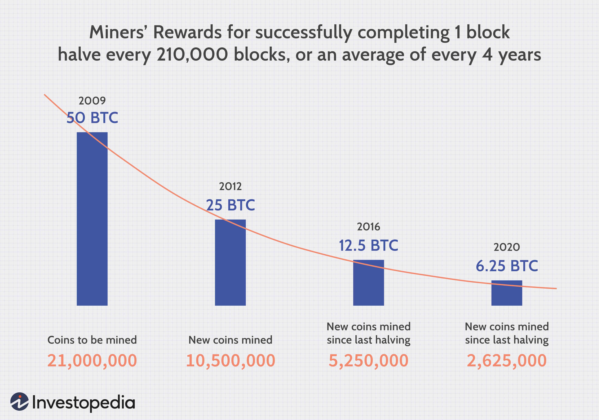

Cryptocurrencies have reshaped the financial landscape by providing decentralized digital assets accessible to anyone with an internet connection. The financial potential within this domain is vast, offering opportunities for investment, innovation, and transformation of traditional economic systems. Among various activities, Bitcoin mining stands as a fundamental operation within the crypto ecosystem, playing a crucial role in both maintaining the network's integrity and rewarding participants through incentives like Bitcoin itself.

Bitcoin mining is integral to the functioning of the Bitcoin network as it involves the verification and addition of transactions to the blockchain ledger. Miners utilize computational power to solve complex cryptographic puzzles, a process known as proof-of-work, which ensures the security and immutability of the blockchain. This operation, while essential, also presents a unique set of profitability challenges and opportunities. Profitability in Bitcoin mining hinges on several variables, including the cost of hardware, electricity, and maintenance, as well as the volatility in Bitcoin's market price. Miners must calculate their expected returns by considering these expenses against potential rewards from block rewards and transaction fees.

Alongside Bitcoin mining, algorithmic trading (algo trading) has emerged as a significant force within crypto markets. Algo trading involves the use of automated software to execute trades based on predetermined strategies, which can capitalize on market inefficiencies and volatility. This method of trading enhances precision and speed, offering significant advantages over traditional manual trading approaches. As the cryptocurrency market is known for its rapid price fluctuations, algo trading becomes a valuable tool for navigating such volatility.

This article aims to explore the interplay between Bitcoin mining, profitability, and algorithmic trading. By examining how these components integrate and influence each other, we can gain insights into strategies that enhance financial returns and optimize operations within the cryptocurrency landscape. Understanding this synergy is crucial for stakeholders looking to maximize their participation in the evolving financial opportunities presented by cryptocurrencies.

## Table of Contents

## The Basics of Bitcoin Mining

Bitcoin mining is a critical process within the cryptocurrency ecosystem, responsible for validating transactions and securing the Bitcoin network. The process involves miners using specialized hardware to solve complex mathematical problems, which enables the creation of new Bitcoin blocks, a fundamental component of blockchain technology.

Miners are integral to the functioning of the Bitcoin network. They confirm transactions by grouping them into blocks and adding these blocks to the blockchain. This decentralized consensus mechanism ensures the network's security and integrity, preventing double-spending and censorship. To incentivize and compensate miners for their efforts, they receive block rewards in the form of newly minted Bitcoins, along with transaction fees from the transactions included in the block.

The efficiency of Bitcoin mining operations largely depends on the type of hardware used. Application-Specific Integrated Circuits (ASICs) dominate the mining landscape due to their superior processing power and energy efficiency compared to earlier mining methods, such as using Graphics Processing Units (GPUs) or Central Processing Units (CPUs). ASICs are designed explicitly for the task of mining Bitcoin by maximizing hash rates while minimizing energy consumption, making them the preferred choice for serious mining operations.

Energy consumption is a significant consideration in Bitcoin mining, often sparking debates about its environmental impact. Mining is an energy-intensive process, with the global Bitcoin mining network consuming significant amounts of electricity. As a result, miners often seek out regions with low-cost electricity or invest in renewable energy sources to reduce operational costs and mitigate environmental concerns. The choice of energy sources and the geographical locations of mining farms can significantly affect the profitability of mining operations.

Economic factors play a crucial role in influencing Bitcoin mining rewards and the network's difficulty adjustments. These factors include the price of Bitcoin, mining difficulty, and block reward halving events. Mining difficulty adjusts approximately every two weeks, based on the network's overall hash rate, to ensure that new blocks are mined approximately every ten minutes. If more miners join the network, increasing the hash rate, the difficulty increases, making it harder to mine new blocks. Conversely, if miners [exit](/wiki/exit-strategy) the network, the difficulty decreases. Additionally, the Bitcoin protocol undergoes halving events approximately every four years, reducing the block reward by half, which impacts miners' revenue and incentivizes efficiency improvements.

In summary, the basics of Bitcoin mining involve understanding the critical role miners play in transaction validation and network security, the impact of hardware advancements like ASICs on mining efficiency, the implications of energy consumption, and the economic factors that affect mining profitability. These elements together define the fundamental operations and challenges faced in Bitcoin mining.

## Profitability in Bitcoin Mining

Bitcoin mining profitability hinges on several critical metrics and economic factors that can significantly impact gains. Understanding these metrics and their interplay is essential for any potential or existing miner.

### Key Metrics for Assessing Mining Profitability

1. **Hash Rate**: A fundamental measure, the hash rate represents the computational power used by miners in the Bitcoin network. A higher hash rate increases the probability of solving the complex mathematical problems required to validate transactions and thus earning block rewards.

2. **Mining Difficulty**: Mining difficulty is a variable that adjusts approximately every two weeks to ensure the time between each Bitcoin block remains around 10 minutes. As more miners join the network and the hash rate increases, the difficulty also rises, impacting profitability by requiring more computational power.

3. **Bitcoin Price**: The market price of Bitcoin is a primary determinant of mining profitability. The potential revenue generated from mining is directly affected by Bitcoin's price, with an increase in price potentially leading to higher profitability, assuming costs remain constant.

### Cost Considerations

- **Hardware**: The initial investment in mining hardware, particularly Application-Specific Integrated Circuits (ASICs), is substantial. ASICs are designed for Bitcoin mining and offer higher efficiencies than ordinary CPUs or GPUs, yet they come at a high cost.

- **Electricity**: One of the most significant ongoing expenses in Bitcoin mining is electricity. Miners must evaluate electricity costs carefully, as locations with lower energy prices can profoundly influence profitability.

- **Maintenance**: Regular maintenance and cooling systems for hardware also add to operational expenses. Efficient cooling systems are necessary to avoid overheating, which can damage hardware and reduce its lifespan.

### Revenue Sources

- **Block Rewards**: Miners earn Bitcoin through block rewards, which are newly minted Bitcoins awarded for processing a block of transactions. Currently, the fixed block reward is 6.25 BTC per block, a number that halves approximately every four years in an event known as the Bitcoin Halving.

- **Transaction Fees**: In addition to block rewards, miners collect transaction fees from the transactions included in the block. Though smaller than block rewards, these fees can become more significant as the number of transactions grows over time.

### Impact of Bitcoin's Price Volatility

Bitcoin's price is notoriously volatile, which can dramatically affect miners' earnings. For instance, a sudden drop in Bitcoin's price might render mining operations unprofitable if costs exceed revenues. Conversely, price increases can significantly boost profitability. Miners often hedge against this [volatility](/wiki/volatility-trading-strategies) by selling a portion of their mined Bitcoin to lock in profits and mitigate the impact of unfavorable price movements.

### Long-term Profitability

Long-term profitability in Bitcoin mining involves strategic planning and adaptability. Beyond immediate costs and revenue, miners must consider market trends such as advancements in mining technology, legislative changes, and shifts in global [cryptocurrency](/wiki/cryptocurrency) adoption. These factors can reshape mining economics over time. For instance, the continuous development of more efficient ASIC miners can lower operational costs, while regulatory changes might impose new financial burdens.

In conclusion, Bitcoin mining profitability is a complex equation dependent on market conditions, technological advancements, and careful financial planning. Successful miners must balance these elements effectively to sustain and maximize their ventures in the ever-evolving cryptocurrency landscape.

## The Role of Cryptocurrency Algo Trading

Algorithmic trading, often referred to as algo trading, has become a cornerstone of modern financial markets. It involves the use of pre-programmed instructions to execute trades, aiming to leverage speed and computational power over traditional trading methods. In the context of financial markets, algo trading is designed to capitalize on market inefficiencies, process massive volumes of data swiftly, and mitigate emotional decision-making, which can often cloud judgment.

### How Algo Trading Applies to Cryptocurrency Markets

In the cryptocurrency ecosystem, algo trading fulfills similar roles but with nuances driven by the market’s unique characteristics. Cryptocurrencies like Bitcoin and Ethereum are traded across numerous exchanges worldwide, often operating 24/7. This round-the-clock trading environment suits algorithmic strategies, ensuring opportunities are neither missed nor delayed due to human factors. Algorithms are employed to execute trades based on predefined criteria, such as market trends, technical indicators, or specific price points these digital assets might reach.

### Strategies Employed in Cryptocurrency Algo Trading

1. **Market Making**: This involved placing buy and sell orders simultaneously to earn the spread. Market makers are compensated for providing liquidity to the exchange.

2. **Arbitrage**: Capitalizing on price discrepancies for the same cryptocurrency on different exchanges. Algorithsm can quickly spot and exploit these differences which can rapidly change.

3. **Trend Following**: Algorithms that follow market trends use data analytics to identify and capitalize on the directional movement of prices. This approach might leverage moving averages, channels, or relative strength indices as triggers for executing trades.

4. **Statistical Arbitrage**: This involves complex mathematical models to identify trading opportunities based on statistical mispricings between different cryptocurrencies or pairs.

5. **Mean Reversion**: Algorithms in this strategy anticipate that the price of a cryptocurrency will revert to its mean or average price over time. Algorithms track price movements to detect these deviations and execute trades accordingly.

### Benefits of Using Algorithms for Trading Precision and Speed

Algo trading significantly enhances trading precision and speed. Given the real-time data processing capabilities, algorithms can analyze and react to market conditions in fractions of a second, executing trades faster than any human trader could. This speed is crucial in a volatile market like cryptocurrencies, where prices can shift drastically within minutes. Additionally, algorithmic strategies are designed to minimize human error and reduce the emotional bias that can often lead to irrational trading decisions. This precision in execution ensures that trades are executed at optimal conditions with minimal slippage.

### Challenges and Risks Associated with Algo Trading in Volatile Crypto Environments

Despite its advantages, algo trading in the volatile cryptocurrency markets comes with inherent challenges and risks:

1. **Market Volatility**: Cryptocurrency markets are notoriously volatile, with significant price swings that can outpace even the most sophisticated algorithms, leading to potential losses.

2. **Technical Failures**: Algo trading systems rely on the robustness of software and infrastructure. Bugs, server downtime, or communication delays between exchanges can lead to missed opportunities or erroneous trades.

3. **Regulatory Challenges**: As the regulatory landscape for cryptocurrencies continues to evolve, algo traders must remain compliant, adapting their strategies to new regulations which can differ significantly across jurisdictions.

4. **Overfitting of Algorithms**: This refers to algorithms being too finely tuned to past data, which might not predict future market movements accurately. Overfitting can result in strategies that perform well in backtesting but fail in live deployment.

5. **Liquidity Risks**: Trading in cryptocurrencies with low liquidity can be risky, as attempting to execute large trades could significantly impact the market price, resulting in unfavorable trade execution.

In conclusion, while [algorithmic trading](/wiki/algorithmic-trading) offers remarkable advantages in speed and precision, especially crucial in the ever-active cryptocurrency markets, traders need to be acutely aware of the inherent risks and challenges posed by market volatility and other external factors. Successful implementation requires not only cutting-edge technical tools and robust algorithms but also a keen understanding of both market dynamics and regulatory environments.

## Synergy: Combining Bitcoin Mining and Algo Trading

Bitcoin mining and algorithmic trading represent two pivotal components in the cryptocurrency ecosystem. Their integration can yield significant benefits, improving profitability and managing risks more effectively.

**Exploring the Interconnectedness of Mining Profitability and Algorithmic Trading**

Bitcoin mining involves solving complex mathematical problems to validate transactions and secure the network, [earning](/wiki/earning-announcement) miners block rewards and transaction fees. However, mining profitability is subject to fluctuations due to factors like Bitcoin's price volatility, changing mining difficulty, and operational costs. Algorithmic trading offers a strategic advantage in this scenario by enabling hedging strategies to mitigate risks associated with these fluctuations.

**Utilizing Algo Trading to Hedge Against Mining Profitability Risks**

Algo trading can be utilized to reduce exposure to Bitcoin price volatility, a primary risk [factor](/wiki/factor-investing) for miners. For instance, miners can employ [arbitrage](/wiki/arbitrage) strategies to capitalize on price differences across various exchanges. This method ensures that even if mining revenue dips, profits might be sustained from trading activities. Additionally, algorithms can be used to execute hedging options or futures contracts, providing a safety net against adverse price movements.

**Algorithmic Strategies for Optimizing Mining Operations**

Efficiency in mining operations can be significantly enhanced through algorithmic solutions. Algorithms can analyze market conditions in real-time and adjust mining efforts accordingly. For example, during periods of high energy costs or low market prices, mining operations can be reduced or ceased temporarily to avoid losses. Furthermore, predictive algorithms can forecast difficulty adjustments or price trends, enabling miners to optimize resource allocation and strategic planning.

**Case Studies of Successful Integration of Mining and Algo Trading**

There are several instances where the fusion of mining and algo trading has proven successful. One notable case is that of large-scale mining companies incorporating trading desks into their operations. By leveraging algorithmic trading, these companies have been able to stabilize income streams, regardless of mining profitability. These integrative strategies allow businesses to remain competitive, adapting to market conditions swiftly.

**Future Prospects: Advancements in Tech That Drive This Synergy**

The future of integrating Bitcoin mining and algorithmic trading is promising, driven by technological advancements. Enhanced [machine learning](/wiki/machine-learning) algorithms offer improved predictive capabilities in market analysis. Additionally, developments in blockchain tech, like increased transparency and efficiency in mining and trading activities, present new opportunities for integration.

Moreover, quantum computing, although still developing, could revolutionize both mining and trading. Its computational power could tackle current cryptographic algorithms, affecting mining by altering the landscape of security and consensus mechanisms. Adapting to these advancements will be crucial for those who want to remain at the forefront of the crypto industry's evolution.

The synergy between Bitcoin mining and algo trading is a potent paradigm. As technology evolves, it will empower crypto enterprises to optimize profitability and navigate the complexities of digital asset markets more effectively.

## Technological Innovations Driving the Future

Emerging technologies are critical drivers of innovation and efficiency in Bitcoin mining, algorithmic trading, and broader cryptocurrency markets. Advanced hardware and improved energy efficiency are at the forefront of Bitcoin mining. Application-Specific Integrated Circuits (ASICs) have significantly increased mining efficiency. These specialized chips are designed specifically for Bitcoin mining, offering high computational power and energy efficiency compared to general-purpose hardware. Continuous improvements in ASIC design and manufacturing processes enhance computing power while reducing energy consumption, critical for the profitability of mining operations. Innovations in cooling technologies and power management systems further contribute to these improvements, potentially lowering electricity costs and increasing overall profitability.

Artificial Intelligence (AI) and Machine Learning (ML) have become integral to cryptocurrency algorithmic trading. These technologies analyze vast datasets, identify patterns, and make informed, real-time decisions far beyond human capabilities. AI-driven trading algorithms can adapt to changing market conditions, optimize trading strategies, and reduce latency in trade execution. Machine learning models can be trained on historical data to predict price movements, enhancing decision-making in cryptocurrency markets. By leveraging AI and ML, traders gain a competitive edge, achieving higher levels of precision and speed in executing trades.

Quantum computing is poised to revolutionize both mining and algorithmic trading. Quantum computers perform complex calculations exponentially faster than classical computers. In Bitcoin mining, quantum computing could potentially disrupt the traditional proof-of-work process by solving hash functions more efficiently, raising concerns about network security and the need for quantum-resistant cryptographic methods. In algorithmic trading, quantum algorithms could handle complex data analyses and optimize trading strategies more effectively than current computational methods. However, wide-scale implementation of quantum computing remains a future prospect, with ongoing research focused on overcoming technical challenges.

Blockchain innovations hold promise for enhancing transparency and efficiency in mining and trading. Layer-2 solutions, such as the Lightning Network, facilitate faster and cheaper transactions by processing them off the main blockchain, reducing congestion and transaction fees. Smart contracts, self-executing contracts with predefined conditions encoded on the blockchain, automate trading processes, ensuring the execution of trades without the need for intermediaries, raising transaction efficiency and lowering costs.

Decentralized Finance (DeFi) plays a pivotal role in shaping future cryptocurrency profitability. DeFi platforms offer financial services without traditional intermediaries, leveraging blockchain technology to enable lending, borrowing, and trading activities. This decentralization reduces costs and democratizes access to financial services, increasing market participation. For miners and traders, DeFi platforms present opportunities for earning yield through staking, lending digital assets, and participating in [liquidity](/wiki/liquidity-risk-premium) pools. By integrating DeFi services, cryptocurrency participants can diversify income streams and enhance overall profitability.

In conclusion, these technological innovations provide new opportunities and challenges in Bitcoin mining and cryptocurrency trading. As the landscape evolves, staying informed and adaptable will be crucial for leveraging these advancements to drive future success.

## Conclusion

The conclusion of this exploration into Bitcoin mining, profitability, and algorithmic trading highlights the intricate relationships that exist within the cryptocurrency landscape. Bitcoin mining remains a critical element in the operation and security of blockchain systems. Its profitability is influenced by a variety of factors including hardware efficiency, energy costs, and Bitcoin's market price. The volatile nature of the cryptocurrency market necessitates constant vigilance and adaptation for miners who must balance costs against potential earnings to maintain profitability.

Algorithmic trading emerges as a powerful tool within this ecosystem, offering enhanced precision and speed. By facilitating faster decision-making based on market trends and historical data, algorithmic trading allows participants to mitigate risks associated with Bitcoin's price fluctuations. When mining and algorithmic trading are combined, they provide a complementary relationship where strategies can be integrated to hedge against market volatility and improve operational efficiencies.

Staying informed and adaptable is essential in the rapidly changing crypto space. Technological advancements such as AI, machine learning, and potential future breakthroughs like quantum computing are poised to further revolutionize both Bitcoin mining and algorithmic trading. These innovations promise increased transparency, efficiency, and profitability. Blockchain advancements continue to evolve, offering new opportunities in decentralized finance (DeFi) which may redefine future profitability models in the crypto industry.

It is vital for crypto enthusiasts and investors alike to explore integrated strategies that leverage the synergies between mining and trading. The dynamic nature of cryptocurrency as a financial opportunity requires a holistic approach that encompasses varied strategies and technological innovations.

Looking forward, the future of Bitcoin mining and algorithmic trading appears optimistic. Continued advancements in technology and increased understanding of market mechanisms will likely drive further integration and efficiency, fostering an environment ripe with potential for financial gain and innovation. The challenge lies in continually adapting to the shifts in this vibrant market and seizing the opportunities they present.

## References & Further Reading

[1]: Narayanan, A., Bonneau, J., Felten, E., Miller, A., & Goldfeder, S. (2016). ["Bitcoin and Cryptocurrency Technologies."](https://press.princeton.edu/books/hardcover/9780691171692/bitcoin-and-cryptocurrency-technologies) Princeton University Press.

[2]: Antonopoulos, A. M. (2017). ["Mastering Bitcoin: Programming the Open Blockchain."](https://www.amazon.com/Mastering-Bitcoin-Programming-Open-Blockchain/dp/1491954388) O'Reilly Media.

[3]: Lopez de Prado, M. (2018). ["Advances in Financial Machine Learning."](https://books.google.com/books/about/Advances_in_Financial_Machine_Learning.html?id=oU9KDwAAQBAJ) Wiley.

[4]: Narayanan, A. (2015). ["The Bottom-Up Economics of Bitcoin."](https://link.springer.com/chapter/10.1007/978-3-319-31686-4_3) Journal of Economic Perspectives.

[5]: Yermack, D. (2013). ["Is Bitcoin a Real Currency? An Economic Appraisal."](https://www.nber.org/papers/w19747) National Bureau of Economic Research.