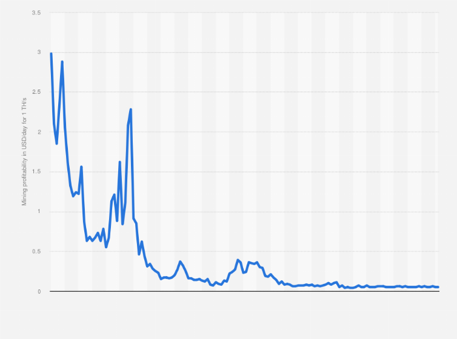

## Table of Contents

## What is Bitcoin mining?

Bitcoin mining is a process where people use computers to solve complex math problems. When they solve these problems, they help add new transactions to the Bitcoin network. This process also creates new bitcoins, which is why it's called mining. It's like digging for gold, but instead of using shovels, miners use powerful computers.

The math problems that miners solve are very hard and need a lot of computing power. This helps keep the Bitcoin network secure. Miners compete to solve these problems first because the first one to solve it gets rewarded with bitcoins. This reward encourages more people to mine and helps keep the network running smoothly.

## How does Bitcoin mining contribute to the network?

Bitcoin mining helps the network by adding new transactions to the system. When people send bitcoins to each other, miners check these transactions to make sure they are real and not fake. They do this by solving hard math problems. Once a miner solves the problem, they can add a group of transactions to the Bitcoin record, called the blockchain. This keeps the network honest and secure because it's very hard to change the blockchain once transactions are added.

Mining also creates new bitcoins. Every time a miner solves a math problem and adds transactions to the blockchain, they get rewarded with new bitcoins. This reward encourages more people to mine, which helps keep the network running smoothly. Without miners, the Bitcoin network wouldn't be able to process new transactions or create new bitcoins, so mining is really important for the whole system.

## What are the basic costs involved in Bitcoin mining?

Bitcoin mining involves several costs that miners need to consider. The biggest cost is usually the hardware. Miners need powerful computers called ASICs, which are specifically designed for mining. These machines can be very expensive, often costing thousands of dollars each. Miners might need several of these to be competitive, so the initial investment can be high.

Another major cost is electricity. Mining uses a lot of power because the computers have to run all the time to solve the math problems. Depending on where you live, electricity can be cheap or very expensive. This can make a big difference in how much it costs to mine bitcoins. Some miners even move to places with cheaper electricity to save money.

There are also other smaller costs to think about. For example, miners need to keep their equipment cool, which might mean buying fans or air conditioners. Plus, the computers need regular maintenance and might need to be replaced every few years because they wear out. All these costs add up and can affect whether mining is profitable or not.

## How is the profitability of Bitcoin mining calculated?

To figure out if Bitcoin mining is profitable, you need to compare the money you make from mining to the money you spend on mining. The money you make comes from the bitcoins you get as a reward for solving math problems and adding transactions to the blockchain. The price of Bitcoin can change a lot, so how much you earn in dollars can go up or down. You also might get small fees from the transactions you add to the blockchain, but these are usually not as big as the reward.

The money you spend includes the cost of the mining hardware, which can be very expensive, and the electricity to run it. Electricity costs can be different depending on where you live, so this can make a big difference in your costs. You also need to think about other smaller costs like cooling your equipment and keeping it running well. To see if mining is worth it, you subtract all these costs from the money you make. If you make more than you spend, mining is profitable. If not, you might lose money.

## What is the impact of electricity costs on mining profitability?

Electricity costs have a big impact on how much money you can make from Bitcoin mining. The machines used for mining need a lot of power to run all the time. If electricity is expensive where you live, it can eat up a lot of the money you earn from mining. This means you might end up spending more on electricity than you make from the bitcoins you mine, which would make mining unprofitable.

To make mining profitable, some people move to places where electricity is cheaper. For example, some miners go to countries where electricity costs less, like Iceland or parts of China. By doing this, they can keep their costs down and make more money from mining. So, the price of electricity can really decide if mining is a good way to make money or not.

## How do Bitcoin halving events affect mining profitability?

Bitcoin halving events happen about every four years and they cut the number of new bitcoins miners get as a reward in half. This means that after a halving, miners earn fewer bitcoins for solving the same math problems. If the price of Bitcoin stays the same, miners will make less money than before the halving. This can make mining less profitable because their costs, like electricity and hardware, don't go down, but their rewards do.

However, the price of Bitcoin often goes up after a halving. This is because there are fewer new bitcoins being made, which can make them more valuable. If the price of Bitcoin goes up enough, it can make up for the smaller rewards and keep mining profitable. So, whether mining stays profitable after a halving depends a lot on what happens to the price of Bitcoin.

## What role does mining difficulty play in profitability?

Mining difficulty is how hard it is to solve the math problems needed to mine bitcoins. The Bitcoin network changes the difficulty to keep the time it takes to solve a problem about the same, even if more people start mining. If more miners join, the difficulty goes up to make it harder. If fewer miners are around, the difficulty goes down to make it easier. This means that the number of bitcoins you can mine in a day can change, even if you use the same equipment.

The difficulty affects how much money you can make from mining. If the difficulty is high, it takes longer to solve the problems and get the reward. This can make mining less profitable because you're spending the same amount on electricity and other costs, but you're getting fewer bitcoins. On the other hand, if the difficulty is low, you can solve the problems faster and get more rewards, which can make mining more profitable. So, miners always need to keep an eye on the difficulty to see if mining is still worth it.

## How can miners optimize their operations to increase profitability?

Miners can make their operations more profitable by choosing the right place to mine. Some places have cheaper electricity, which is a big cost in mining. By moving to these places, miners can save a lot of money on their bills. They can also look for special deals or discounts on electricity to lower their costs even more. Another way to save money is by using the right kind of mining hardware. Some machines are better at solving the math problems needed for mining, so choosing the best ones can help miners get more bitcoins for the same amount of electricity.

Miners can also join mining pools to increase their chances of earning rewards. In a mining pool, many miners work together and share the rewards they get. This can make mining more steady and less risky because you're more likely to get some bitcoins every day, even if you don't solve the problem yourself. Keeping an eye on the mining difficulty and the price of Bitcoin is also important. If the difficulty goes up a lot or the price of Bitcoin goes down, miners might need to change their plans to stay profitable. By always looking for ways to save money and earn more, miners can make their operations more successful.

## What are the differences in profitability between solo mining and pool mining?

Solo mining means one person mines by themselves. They keep all the bitcoins they earn when they solve a math problem. But it can take a long time to solve a problem, so they might not earn anything for a while. This makes solo mining risky because you might spend a lot on electricity and not get any bitcoins for a long time. If you do solve a problem, though, you get a big reward all to yourself.

Pool mining is when many miners work together. They share the work of solving math problems and also share the bitcoins they earn. This makes it more likely that you'll get some bitcoins every day, even if it's a smaller amount. Pool mining is less risky because you don't have to wait as long to earn something. But you have to pay a small fee to be part of the pool, and you share the reward with others, so each person gets less than they would if they mined alone.

## How do regulatory changes influence the profitability of Bitcoin mining?

Regulatory changes can have a big impact on how much money miners can make from Bitcoin. If a country makes new rules that make mining harder or more expensive, it can cut into miners' profits. For example, some places might start taxing mining income more or put limits on how much electricity miners can use. These rules can make it cost more to mine, which means miners might not make as much money as before.

On the other hand, if a country makes rules that help miners, it can make mining more profitable. For instance, if a government gives miners special deals on electricity or makes it easier to set up mining operations, miners can save money and earn more. So, miners always need to keep an eye on what the rules are where they mine, because changes can make a big difference in how much money they can make.

## What advanced strategies can be used to maximize mining profits?

Miners can use advanced strategies to make more money from mining. One way is to use smart software that helps them choose the best times to mine. This software looks at things like the price of Bitcoin, the mining difficulty, and electricity costs to figure out when it's most profitable to mine. Miners can also use special kinds of mining hardware that are really good at solving the math problems needed for mining. These machines can be expensive, but they can help miners get more bitcoins for the same amount of electricity.

Another strategy is to take part in something called "mining arbitrage." This means miners can switch between mining different cryptocurrencies depending on which one is most profitable at the time. They can use software to quickly change what they're mining to always be working on the most profitable coin. Miners can also join special groups called "mining cooperatives" where they work together to share costs and make mining more efficient. By using these advanced strategies, miners can make the most out of their mining operations and earn more money.

## How does the choice of mining hardware affect long-term profitability?

The choice of mining hardware is really important for how much money miners can make over a long time. Some mining machines are better at solving the math problems needed for mining than others. These machines can be expensive, but they use electricity more efficiently and can solve problems faster. This means miners can get more bitcoins with the same amount of power. Over time, using better hardware can help miners save money on electricity and earn more bitcoins, which makes mining more profitable.

But, mining hardware also gets old and less useful over time. Newer machines come out that are even better at solving problems, so miners need to think about when to buy new hardware. If they keep using old machines, they might not be able to mine as many bitcoins as they could with new ones. This can make mining less profitable in the long run. So, miners need to balance the cost of buying new hardware with how much more they can earn from it to keep their mining operations making money over time.

## References & Further Reading

[1]: Narayanan, A., Bonneau, J., Felten, E., Miller, A., & Goldfeder, S. (2016). ["Bitcoin and Cryptocurrency Technologies."](https://press.princeton.edu/books/hardcover/9780691171692/bitcoin-and-cryptocurrency-technologies) Princeton University Press.

[2]: Antonopoulos, A. M. (2017). ["Mastering Bitcoin: Programming the Open Blockchain."](https://www.amazon.com/Mastering-Bitcoin-Programming-Open-Blockchain/dp/1491954388) O'Reilly Media.

[3]: Lopez de Prado, M. (2018). ["Advances in Financial Machine Learning."](https://books.google.com/books/about/Advances_in_Financial_Machine_Learning.html?id=oU9KDwAAQBAJ) Wiley.

[4]: Narayanan, A. (2015). ["The Bottom-Up Economics of Bitcoin."](https://link.springer.com/chapter/10.1007/978-3-319-31686-4_3) Journal of Economic Perspectives.

[5]: Yermack, D. (2013). ["Is Bitcoin a Real Currency? An Economic Appraisal."](https://www.nber.org/papers/w19747) National Bureau of Economic Research.