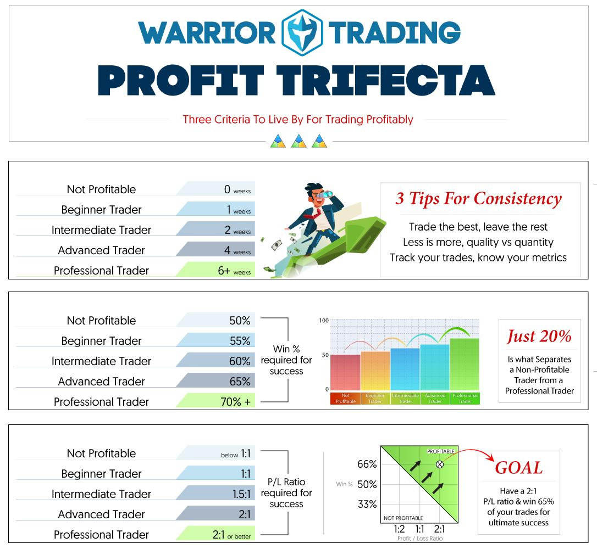

Day trading and algorithmic trading are two prominent strategies in the financial markets, known for their potential to generate significant profits, yet each carries a distinct set of risks and complexities. Day trading is characterized by the buying and selling of financial instruments within a single trading day, aiming to capture short-term market movements. Algorithmic trading, often referred to as algo trading, utilizes computer algorithms to execute trades based on predefined criteria, often leveraging speed and data processing capabilities beyond human capacity.

The purpose of this guide is to provide beginners with a comprehensive overview of these two trading strategies, focusing on their profitability. We will examine the fundamental aspects of both day trading and algo trading, offering insights into strategies, tools, risks, and potential earnings. Understanding these components is critical for anyone looking to navigate the multi-faceted world of trading successfully.



Day trading requires a keen understanding of market dynamics, discipline, and emotional control. It often involves strategies such as scalping, momentum trading, and range trading, each with its specific techniques and risk management practices. On the other hand, algorithmic trading involves developing and deploying sophisticated algorithms, often requiring knowledge of programming and quantitative analysis.

The tools and platforms used in trading play a crucial role in execution and strategy development. From trading platforms that support technical analysis and algorithmic executions to simulation tools for practice without financial risk, selecting the right resources is essential for success.

This article aims to serve as a roadmap for beginners, helping them understand the intricacies of day trading and algorithmic trading. By exploring various strategies and risk management techniques, newcomers can develop a grounded approach to trading, potentially leading to profitability. Through this exploration, we hope to provide a clearer perspective on approaching day trading and algo trading effectively, encouraging a focus on ongoing learning and adaptation to market developments.

## Table of Contents

## Understanding Day Trading

Day trading involves the buying and selling of financial instruments such as stocks, currencies, commodities, or derivatives within the same trading day. The primary objective is to profit from short-term price movements rather than from the long-term gains that traditional investing aims for. Unlike investing, which typically requires holding positions for extended periods, day trading closes all positions by the end of the trading day to avoid the risks associated with overnight market changes.

### Day Trader Activities and Instruments

Day traders actively monitor the markets, making swift decisions to capitalize on price fluctuations. They frequently trade highly liquid instruments like stocks, foreign exchange ([forex](/wiki/forex-system)), and futures, as these markets offer the necessary [volatility](/wiki/volatility-trading-strategies) for effective [day trading](/wiki/day-trading-spy). The high trading volumes and price variability in these instruments provide ample opportunities for executing profitable trades.

### Common Day Trading Strategies

Common strategies employed by day traders include [momentum](/wiki/momentum) trading, [scalping](/wiki/gamma-scalping), and range trading. Momentum trading involves capitalizing on existing market trends. Traders identify stocks or other instruments that show a strong trend and enter trades in the direction of the trend. Scalping, on the other hand, involves making a large number of small profit trades throughout the trading day by exploiting small price gaps created by order flows or spreads. Range trading relies on identifying key support and resistance levels to make buy or sell decisions as prices oscillate between these levels.

### Day Trading Setup

For effective day trading, traders require a robust setup that includes fast and reliable internet connectivity, powerful computing equipment, and advanced trading platforms. Popular trading platforms such as MetaTrader or TradingView offer sophisticated charting and analysis tools, as well as the capability to execute trades quickly. Essential software often integrates real-time data feeds, analytics, and customizable trading alerts to aid in decision-making.

### Day Trading Regulations

Day trading is subject to certain regulatory constraints, the most notable being the Pattern Day Trader (PDT) rule established by the Financial Industry Regulatory Authority (FINRA) in the United States. This rule applies to traders who execute four or more day trades within five business days using a margin account. The PDT rule requires such traders to maintain a minimum equity of $25,000 in their margin accounts to continue day trading. This regulation aims to mitigate the risks associated with frequent trading by ensuring traders have adequate capital reserves.

### Advantages and Limitations of Day Trading

Day trading offers several advantages, including the potential for high returns due to the frequent trading opportunities. The short-term nature of trades reduces exposure to overnight market risks, and the [liquidity](/wiki/liquidity-risk-premium) of traded instruments enables ease of entry and [exit](/wiki/exit-strategy) from positions.

However, day trading also presents significant challenges. The necessity for constant monitoring and rapid decision-making can be stressful and time-consuming. Furthermore, the [high frequency](/wiki/high-frequency-trading) of trades incurs substantial transaction costs, and the associated tax implications may be less favorable compared to long-term investing. Additionally, the psychological pressures of daily fluctuations can lead to impulsive decisions detrimental to trading performance.

In conclusion, while day trading can be profitable, it requires a comprehensive understanding of market dynamics, a disciplined approach, and the ability to manage risks effectively. Beginners aspiring to succeed in day trading must equip themselves with the necessary knowledge, tools, and strategies to navigate this fast-paced trading environment.

 to Algorithmic Trading

Algorithmic trading, often referred to as algo trading, involves the use of computer algorithms to make trading decisions and execute trades at speeds and frequencies that are beyond human capabilities. At its core, this approach relies on predefined criteria, which can range from simple conditions like moving averages to complex mathematical models and high-frequency trading strategies.

**Basic Principles and Evolution**

The fundamental principle of [algorithmic trading](/wiki/algorithmic-trading) is to remove human emotion and error from the trading process, thereby increasing the efficiency and potentially the profitability of trade execution. Initially developed in the 1970s with the advent of electronic exchanges, algorithmic trading has evolved significantly due to advancements in computer technology and the availability of vast amounts of market data. The adoption of [machine learning](/wiki/machine-learning) and [artificial intelligence](/wiki/ai-artificial-intelligence) further pushes the boundaries of what algorithms can analyze and predict.

**Key Components**

1. **Trading Strategy Development**: A successful algorithmic trading system begins with a well-defined strategy. This involves the identification of entry and exit points based on various indicators, price levels, or statistical metrics. Strategies can be categorized into several types, including trend-following, arbitrage, market-making, or sentiment analysis-based strategies.

2. **Role of Technology**: Technology plays a crucial role in algorithmic trading. High-performance computing and low-latency execution are vital for certain strategies, particularly those used in high-frequency trading (HFT). Additionally, robust software platforms enable traders to backtest strategies using historical data before implementing them in live markets.

**Common Types of Algorithms**

- **Trend-Following Algorithms**: These are based on technical indicators that signal the likelihood of a price moving in a certain direction. A simple moving average crossover strategy is a classic example.

- **Arbitrage Algorithms**: These exploit price discrepancies between correlated assets or markets. For instance, a statistical arbitrage strategy might involve identifying and trading temporary deviations between pairs of related stocks.

- **Market-Making Algorithms**: These are designed to provide liquidity to the markets by placing buy and sell orders around the current market price. By capturing the bid-ask spread, market-making algorithms can generate profits.

- **Sentiment Analysis Algorithms**: With advancements in natural language processing (NLP), these algorithms analyze news, social media, and other textual data to gauge market sentiment and predict price movements.

**Advantages Over Traditional Methods**

Algorithmic trading offers several advantages, including enhanced speed and accuracy in trade execution, the ability to process and analyze vast amounts of data, and the removal of emotional decision-making. These aspects can lead to reduced transaction costs and improved market liquidity, benefiting both the trader and the broader market ecosystem.

**Challenges and Limitations**

Despite its advantages, algorithmic trading is not without its challenges. The reliance on complex technology can lead to significant losses if errors in the algorithm or system failures occur. Furthermore, algorithms can sometimes exacerbate market volatility, as seen during flash crashes. Stringent regulatory frameworks, such as those imposed by the Securities and Exchange Commission (SEC) or the Commodity Futures Trading Commission (CFTC), are designed to mitigate these risks but also add complexity to the deployment of algorithmic strategies.

In conclusion, algorithmic trading represents a complex yet powerful evolution of modern finance, combining technological prowess with traditional trading acumen to navigate and profit from financial markets.

## Day Trading Strategies for Beginners

Day trading strategies offer a structured approach to profit from the market's short-term price fluctuations. Here, we explore three beginner-friendly strategies: momentum trading, scalping, and range trading, along with effective implementation tips and essential risk management techniques.

### Momentum Trading

Momentum trading is premised on the principle that stocks exhibiting strong price movements in one direction will continue in that direction for a period. Traders seek to capitalize on such trends by entering trades aligned with these movements.

- **Example**: A stock that gains 5% in value due to positive earnings reports might attract momentum traders who anticipate further upside.

#### Implementation Tips:
1. **Identify Strong Trends**: Use technical indicators like the Relative Strength Index (RSI) or Moving Average Convergence Divergence (MACD) to confirm momentum.
2. **Entry Points**: Look for breakouts of significant price levels or trend continuation patterns such as flags and pennants.
3. **Exit Strategy**: Establish clear exit points to lock in profits before momentum wanes. Trailing stop losses can be useful here.

### Scalping

Scalping involves making numerous trades throughout the day to profit from small price changes. This strategy requires precision and quick execution.

- **Example**: A trader scalping the EUR/USD currency pair might aim to pocket a few pips on a series of trades executed over a short time frame.

#### Implementation Tips:
1. **Trade Liquid Markets**: Focus on highly liquid markets like Forex or major stocks to ensure tight spreads.
2. **Monitor Spreads**: The cost of spreads can erode profits, so aim for markets with low transaction costs.
3. **Utilize Technology**: High-speed internet and reliable trading platforms are essential for effective scalping.

### Range Trading

Range trading involves identifying and trading securities that are consistently moving between defined upper and lower price levels, known as resistance and support.

- **Example**: If a stock consistently bounces between $50 and $55, traders might buy near $50 and sell near $55.

#### Implementation Tips:
1. **Chart Patterns**: Use charts to identify established ranges and validate with oscillators like RSI for potential reversal points.
2. **Risk Management**: Set stop losses just outside the range to avoid significant losses from breakouts.
3. **Time Management**: Be aware of news events that might trigger a breakout from the established range.

### Risk Management in Day Trading

Risk management is a critical component that can safeguard traders from potential losses:

1. **Position Sizing**: Calculate risk per trade to ensure it does not exceed a certain percentage of total capital. For instance, if capital is $10,000 and risk per trade is capped at 2%, the maximum risk is $200 per trade.
$$
   \text{Position Size} = \frac{\text{Risk Per Trade}}{\text{Trade Risk (Entry Price - Stop Loss)}}

$$

2. **Leverage Control**: New traders should exercise caution with leverage, as it amplifies both potential gains and losses.

3. **Diversification**: Spreading trades across multiple instruments can help mitigate the risk of a significant loss in one position.

### The Role of Discipline and Emotional Control

Discipline and emotional control are vital for maintaining focus and consistency in day trading. Traders must adhere to their strategies and avoid making impulsive decisions driven by emotions like fear or greed. Maintaining a trading journal can help track performance and reflect on decision-making processes, fostering improvements and disciplined behavior over time.

By understanding and applying these foundational strategies and risk management techniques, beginners can better navigate the complexities of day trading.

## Developing an Algo Trading System

Developing an algorithmic trading system involves several key steps that allow traders to automate their strategies for more efficient execution. By following a structured approach, beginners can create a robust system that maximizes their chances of success.

### Step 1: Choosing a Strategy
The first step is identifying a trading strategy. This could be a trend-following strategy, mean-reversion, or [arbitrage](/wiki/arbitrage), among others. Each strategy has specific rules and criteria that can be programmed into an algorithm. It’s crucial to choose a strategy that aligns with your trading goals and risk tolerance. Research and [backtesting](/wiki/backtesting) on historical data are essential to evaluate a strategy's potential effectiveness before deploying it live.

### Step 2: Programming the Algorithm
Once a strategy is chosen, the next step is to program it into a trading algorithm. Python is a popular programming language for this purpose due to its extensive libraries and ease of use. Here is a simple example of a moving average crossover strategy implemented in Python using the pandas and numpy libraries:

```python
import pandas as pd
import numpy as np

# Load historical data
data = pd.read_csv('historical_data.csv')

# Calculate moving averages
data['SMA50'] = data['Close'].rolling(window=50).mean()
data['SMA200'] = data['Close'].rolling(window=200).mean()

# Define signals
data['Signal'] = np.where(data['SMA50'] > data['SMA200'], 1, 0)
data['Position'] = data['Signal'].diff()
```

### Step 3: Backtesting
Backtesting is crucial for assessing how the algorithm would have performed in the past. This involves running the algorithm on historical data to simulate trading under past market conditions. Important metrics such as return on investment, maximum drawdown, and Sharpe ratio are typically analyzed during backtesting to measure the strategy's risk-adjusted returns.

### Step 4: Live Testing
After successful backtesting, the algorithm should be live-tested in a real-world environment with minimal capital to monitor its performance and make necessary adjustments. Many platforms offer paper trading accounts that allow users to test their algorithms with virtual money, providing an opportunity to refine the system without financial risk.

### Tools and Platforms
There are several platforms available for developing algorithmic trading systems without the need for complex coding. Platforms like QuantConnect and MetaTrader provide user-friendly interfaces and drag-and-drop features to construct trading algorithms. These platforms often include backtesting capabilities, allowing traders to test their strategies before live deployment.

### Risk Management Practices
In algorithmic trading, robust risk management is essential to mitigate system failures and market risks. Techniques such as diversification, stop-loss orders, and position sizing can be integrated into algorithms to manage risk effectively. It's also important to continuously monitor system performance and make adjustments as needed to adapt to changing market conditions.

### Real-World Examples
Algorithmic trading systems are widely used by hedge funds and financial institutions. For instance, Renaissance Technologies, known for its Medallion Fund, extensively uses mathematical models and statistical analysis to execute trades automatically. Such examples highlight how theoretical concepts are applied practically to achieve consistent profitability in markets.

By following these steps and utilizing the available tools and risk management techniques, beginners can develop their own algorithmic trading systems. These systems, when properly deployed, have the potential to execute trades with greater precision and speed, aligning with the objective of maximizing profitability while minimizing risks.

## Risk Management in Trading

Risk management is a fundamental aspect of both day trading and algorithmic trading, often determining the line between profit and loss. Key techniques include stop losses and position sizing, both of which are essential for mitigating risk. A stop-loss order automatically sells a security when its price reaches a predetermined threshold, thus preventing further losses. Position sizing, on the other hand, determines how much capital to allocate to a specific trade, typically based on account size and risk tolerance. These two techniques, when used effectively, can help traders manage potential downsides.

In addition to these techniques, understanding and setting realistic risk/reward ratios is vital. A risk/reward ratio measures the potential loss against the potential gain of a trade. While different traders might use various ratios, a common practice is to aim for at least a 1:2 or 1:3 ratio, ensuring that potential profits outweigh potential losses. Diversification of trades is another critical strategy, as it spreads risk across different assets or markets, reducing the impact of a single loss.

Market volatility, which refers to the frequency and magnitude of price movements, significantly impacts trading strategies. High volatility can present opportunities for substantial gains but also increases the risk of losses. Traders need to tailor their strategies according to prevailing market conditions, choosing when to trade aggressively or conservatively.

Emotional discipline is equally crucial in risk management. Emotional reactions can be detrimental in trading, leading to impulsive decisions and increased risk. Traders must cultivate self-control and adhere to their predefined plans, using techniques such as journaling their trades or setting strict rules to remain objective.

By integrating these risk management techniques and maintaining discipline, traders can better navigate the uncertainties of financial markets, ultimately improving their chances of achieving consistent profitability.

## Tools and Platforms for Day and Algo Trading

When engaging in day trading or algorithmic trading, selecting the right tools and platforms is indispensable for executing strategies efficiently. Various platforms have been designed to cater to the needs of both individual traders and institutions, each offering unique features to facilitate trading.

MetaTrader and TradingView stand out as popular platforms providing robust capabilities for both day and algorithmic trading. MetaTrader is renowned for its powerful trading features, offering a comprehensive suite of tools including real-time access to market data, technical analysis, and automated trading through expert advisors (EAs). It supports algorithmic trading, where traders can develop and execute complex trading strategies using its MQL4/MQL5 scripting language.

TradingView, on the other hand, is highly favored for its advanced charting tools and social networking features that allow traders to share insights. It supports algorithmic trading by integrating with various brokers and offers a scripting language called Pine Script for developing custom indicators and strategies.

For beginners and seasoned traders alike, the use of paper trading and simulation tools is crucial in testing strategies without risking actual capital. These tools provide a risk-free environment to assess the effectiveness of a trading strategy under real market conditions. Simulation platforms often accompany trading platforms, such as MetaTrader’s Strategy Tester, which allows backtesting of algorithms with historical data.

Choosing the right broker and platform requires careful consideration of individual trading needs and styles. Factors such as transaction fees, ease of use, reliability, and the array of available features should be weighed. Some brokers offer platforms tailored for high-frequency trading with low latency execution, while others might focus on providing educational resources for beginners.

Emerging technologies and tools continue to shape the evolution of trading. The role of Artificial Intelligence in trading analytics, blockchain for transaction transparency, and machine learning for predictive modeling is becoming increasingly significant. Tools employing these technologies are enhancing the precision and effectiveness of trading strategies, allowing traders to adapt swiftly to market changes.

In summary, leveraging the right tools and platforms is critical to optimizing performance in day and algo trading. Understanding the capabilities and limitations of each platform and tool is key to aligning them with one's trading objectives and risk appetite.

## Maximizing Profitability in Trading

Maximizing profitability in both day trading and algorithmic trading requires strategic adaptation to market conditions, the effective use of analytics, continuous education, and learning from established traders. The dynamic nature of financial markets demands flexibility and an ongoing commitment to refining one's approach.

Adapting to changing market conditions is crucial for both day traders and algorithmic traders. Traders must remain vigilant and responsive to shifts in market trends and volatility. For day traders, this often means modifying strategies to suit different market environments, such as switching from momentum trading in a bullish market to scalping in a sideways market. Algorithmic traders, on the other hand, need to ensure that their algorithms are robust enough to handle fluctuations without overfitting to past data. This might include implementing dynamic stop-loss mechanisms and adjusting parameters based on current market conditions.

Leveraging analytics and trading metrics can significantly enhance performance. Analyzing historical trade data to identify patterns and inefficiencies can lead to the refinement of trading strategies. Advanced traders often use machine learning techniques to identify non-obvious patterns in large datasets. For example, by applying unsupervised learning algorithms such as clustering, traders can segment market data into meaningful patterns that inform strategy adjustments. Similarly, regression models can be used to predict future price movements based on existing data, optimizing entry and exit points.

The importance of ongoing education and staying updated with market trends cannot be overstated. Financial markets are constantly evolving with new instruments, regulations, and technologies emerging regularly. Traders should pursue continuous learning through online courses, webinars, and industry publications. Understanding emerging technologies such as blockchain, artificial intelligence, and machine learning is especially vital for those involved in algo trading. These technologies offer innovative ways to enhance trading strategies and execution.

Examining case studies of successful traders provides valuable insights into effective trading practices. For instance, renowned traders like Jim Simons, the founder of Renaissance Technologies, have successfully applied mathematic models to capture subtle patterns in market data that are undetectable to the human eye. This success has largely been attributed to their emphasis on data and quantitative analysis. Similarly, Paul Tudor Jones' focus on macroeconomic analyses and his disciplined approach towards risk management has been pivotal to his success. Studying these examples can inspire novices to adopt disciplined frameworks and strategic innovation.

By synthesizing these approaches—adapting to market conditions, leveraging analytics, committing to ongoing education, and learning from successful traders—both novice and experienced traders can enhance their potential for profitability. Each of these components requires a proactive approach to ensure that one's trading practices remain relevant and effective in an ever-evolving market landscape.

## Conclusion

Day trading and algorithmic trading represent two of the most dynamic approaches to participating in the financial markets. As discussed, these trading styles offer substantial opportunities for profit; however, they also come with significant risks. It is imperative for beginners to fully grasp both the potential and the pitfalls before committing considerable resources to either approach.

Understanding the complexity and volatility of trading markets is critical for success. Both day trading and algorithmic trading require a foundation of knowledge, strategic planning, and an understanding of the tools and platforms that best fit individual trading styles. This includes familiarity with trading software, market analysis tools, and the regulatory landscape that governs trading activities.

For beginners, starting with a modest capital investment is advisable. This approach minimizes risk and allows new traders to focus on learning the ropes without the added pressure of significant financial loss. Building a successful trading career involves more than just financial acumen; it necessitates a disciplined mindset and emotional resilience. With consistent practice and a willingness to adapt and learn, newcomers can gradually increase their exposure and scale their trading activities.

The potential profitability of day and algorithmic trading is promising for those who approach it with diligence and patience. A systematic and methodical approach can lead to successful outcomes, paving the way for trading as a viable career option. It is crucial to remain updated with ongoing education and developments in trading technology and market trends. 

We invite readers to explore various resources and tools that can further aid their trading journey. Continuous learning and adaptation are key to thriving in the ever-evolving trading landscape. Pursuing additional educational materials, engaging with trading communities, and utilizing simulation tools can enhance one's trading skills and strategies. By doing so, aspiring traders can position themselves for success in the fast-paced world of financial trading.

## References & Further Reading

[1]: Bergstra, J., Bardenet, R., Bengio, Y., & Kégl, B. (2011). ["Algorithms for Hyper-Parameter Optimization."](https://papers.nips.cc/paper/4443-algorithms-for-hyper-parameter-optimization) Advances in Neural Information Processing Systems 24.

[2]: ["Advances in Financial Machine Learning"](https://www.amazon.com/Advances-Financial-Machine-Learning-Marcos/dp/1119482089) by Marcos Lopez de Prado

[3]: ["Evidence-Based Technical Analysis: Applying the Scientific Method and Statistical Inference to Trading Signals"](https://www.amazon.com/Evidence-Based-Technical-Analysis-Scientific-Statistical/dp/0470008741) by David Aronson

[4]: ["Machine Learning for Algorithmic Trading"](https://github.com/PacktPublishing/Machine-Learning-for-Algorithmic-Trading-Second-Edition) by Stefan Jansen

[5]: ["Quantitative Trading: How to Build Your Own Algorithmic Trading Business"](https://books.google.com/books/about/Quantitative_Trading.html?id=j70yEAAAQBAJ) by Ernest P. Chan