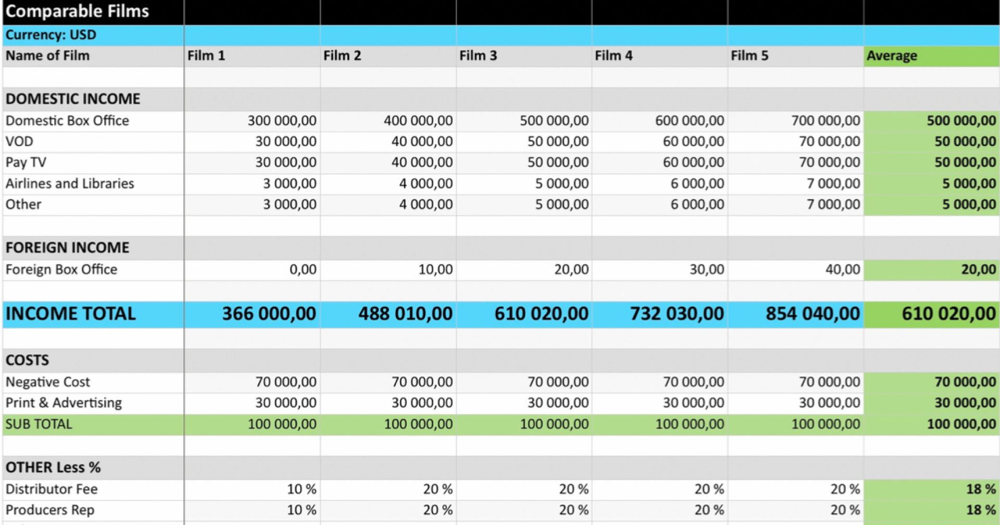

## Table of Contents

## What is the basic difference between the film and television industries?

The film industry and the television industry are different in some big ways. The film industry makes movies that are usually shown in theaters. These movies are often longer, and they can take a lot of time and money to make. People usually watch movies as a special event, and they might go to the cinema to see them. The stories in movies are often complete in one sitting, and they can be about anything from action to romance.

On the other hand, the television industry makes shows that are watched at home on TV or online. TV shows can be shorter, with episodes that last about 30 minutes to an hour. They are usually made faster and can be less expensive than movies. TV shows often have many episodes and seasons, so the stories can go on for a long time. People can watch TV shows regularly, and they might feel more connected to the characters because they see them more often.

Even though they are different, both industries tell stories and entertain people. They also work together sometimes, like when a movie is based on a TV show, or when a TV show is based on a movie. Both industries are important parts of the entertainment world.

## How is profitability measured in the film industry?

In the film industry, profitability is mainly measured by looking at how much money a movie makes compared to how much it cost to make and promote it. This is called the movie's "box office performance." If a movie makes more money than it cost, it is considered profitable. For example, if a movie costs $100 million to make and another $50 million to market, it needs to earn at least $150 million to break even. Any money made above that amount is profit. Box office numbers are usually reported from ticket sales in theaters around the world.

Another way to measure profitability in the film industry is through other sources of income, like home video sales, streaming rights, merchandise, and licensing deals. These are called "ancillary revenues." Sometimes a movie might not make a lot of money in theaters but can still be profitable because of these other sources. For instance, a movie might not do well at the box office but could become popular on a streaming service, bringing in money through subscriptions or ads. Studios look at all these different income sources to figure out if a movie was a good investment and if it made a profit.

## How is profitability measured in the television industry?

In the television industry, profitability is measured by looking at how much money a TV show makes compared to how much it costs to make and promote it. TV shows can make money from many places. They can earn money from ads that play during the show, from people paying to watch the show on a cable or streaming service, and from selling the show to other countries or companies. If a TV show makes more money than it costs, it is considered profitable. For example, if a show costs $2 million per episode to make and another $500,000 to market, it needs to earn at least $2.5 million per episode to break even. Any money made above that is profit.

Another way to measure profitability in TV is by looking at other sources of income, like selling merchandise or licensing the show for things like video games or books. Sometimes a TV show might not make a lot of money from ads or subscriptions right away but can still be profitable because of these other sources. For instance, a show might become very popular and sell a lot of merchandise, like t-shirts or toys, which adds to the show's overall profit. TV networks and streaming services look at all these different ways to make money to decide if a show was a good investment and if it made a profit.

## What are the typical revenue streams for films?

The main way films make money is through ticket sales at movie theaters. This is called the box office. When a movie is shown in theaters around the world, the money people pay for tickets adds up to the film's total box office earnings. If the box office earnings are more than what it cost to make and advertise the movie, the film is profitable. For example, if a movie costs $100 million to make and $50 million to advertise, it needs to earn at least $150 million at the box office to break even. Any money earned after that is profit.

Films can also make money in other ways. After the movie is no longer in theaters, it can be sold on DVD or Blu-ray, or people can rent or buy it online. These are called home video sales. Movies can also be shown on TV or streaming services like Netflix or Hulu, and the film's owners get money from those companies for the right to show the movie. Another way films make money is through merchandise like toys, clothes, or books that are based on the movie. Sometimes, movies can also make money from licensing deals, where other companies pay to use the movie's characters or story in their products. All these different ways of making money help decide if a movie was a good investment and if it made a profit.

## What are the typical revenue streams for television shows?

TV shows make money in different ways. One big way is through ads. When people watch TV, they see commercials, and companies pay the TV network to show those commercials. Another way TV shows make money is from people paying to watch them. This can be through cable TV subscriptions or streaming services like Netflix or Hulu, where people pay a monthly fee to watch shows. TV shows can also make money when they are sold to other countries or other companies. If a show is popular, other countries might want to show it on their TV channels or streaming services, and they pay for the right to do that.

Another way TV shows can make money is through selling things like merchandise. If a show is popular, people might want to buy t-shirts, toys, or other things that are based on the show. This can add a lot of money to the show's overall profit. TV shows can also make money from licensing deals. This is when other companies pay to use the show's characters or story in their products, like video games or books. All these different ways of making money help decide if a TV show was a good investment and if it made a profit.

## How do production costs impact profitability in both industries?

In the film industry, production costs play a big role in deciding if a movie will be profitable. These costs include everything from paying the actors and crew to renting equipment and building sets. If a movie costs a lot to make, it needs to earn a lot of money at the box office and through other ways like selling DVDs or streaming rights to make a profit. For example, if a movie costs $200 million to make and only makes $180 million at the box office, it won't be profitable unless it makes up the difference through other sources of income. High production costs can make it harder for a movie to be profitable, but a popular movie can still make a lot of money even if it was expensive to make.

In the television industry, production costs also affect whether a TV show will make money. These costs include paying the actors, writers, and crew, as well as the expenses for filming and editing the show. If a TV show is expensive to make, it needs to bring in enough money from ads, subscriptions, and other sources to cover those costs and make a profit. For instance, if an episode costs $3 million to make, the show needs to earn at least that much per episode to break even. Lower production costs can make it easier for a TV show to be profitable, but a show with high production costs can still be successful if it becomes very popular and earns a lot of money from different sources.

## What role does distribution play in the profitability of films versus television shows?

Distribution is really important for how much money movies and TV shows make. For movies, distribution means getting the film into theaters around the world. The more theaters a movie is shown in, the more people can watch it and the more money it can make from ticket sales. After the movie leaves theaters, it can be distributed on DVDs, streaming services, or TV channels. Good distribution deals can help a movie make a lot more money, even if it didn't do well in theaters at first. If a movie is distributed well, it can reach more people and make more profit.

For TV shows, distribution also matters a lot. TV shows can be distributed on different channels or streaming services, both in the home country and in other countries. The more places a TV show is available, the more people can watch it and the more money it can make from ads or subscriptions. Sometimes, a TV show might not be very popular in its home country but can become a big hit in another country through good distribution. This can really help the show's overall profit. So, just like with movies, good distribution can help TV shows make more money and be more successful.

## How do international markets affect the profitability of films and television?

International markets can really help movies and TV shows make more money. When a movie or TV show is popular in other countries, it can earn a lot from ticket sales, streaming rights, and other ways. For movies, doing well in places like China or Europe can make a big difference in how much profit the movie makes. If a movie is a hit in many countries, it can make up for high production costs and even make more money than it did in its home country. This is why movie studios try to make films that people all over the world will like.

TV shows also benefit a lot from being popular in other countries. When a show is sold to TV channels or streaming services in different countries, it can make money from ads or subscriptions in those places. Sometimes, a show might not be very popular at home but can become a big hit somewhere else. For example, a show from the U.S. might be very popular in South Korea or Germany. This extra money from international markets can help cover the costs of making the show and make it more profitable overall. That's why TV producers often try to create shows that can appeal to audiences around the world.

## What are the impacts of digital streaming platforms on the profitability of both industries?

Digital streaming platforms like Netflix, Amazon Prime, and Hulu have changed the way movies and TV shows make money. For movies, streaming platforms can be a big source of income after they leave theaters. Instead of waiting for DVDs to sell or for the movie to be shown on TV, movies can be available to watch online right away. This can help movies make more money because people all over the world can watch them easily. But, it can also mean less money from ticket sales if people choose to wait for the movie to be on a streaming service. Streaming platforms pay movie studios for the rights to show their films, and this can be a big part of a movie's total profit.

For TV shows, streaming platforms have also made a big difference. Shows can now be watched by people all over the world without having to be sold to different TV channels in each country. This can make it easier for shows to reach a bigger audience and make more money from subscriptions. Streaming services pay for the rights to show TV shows, and this can be a big part of a show's income. But, it can also mean less money from ads if people are watching shows on ad-free platforms. Overall, digital streaming has given both movies and TV shows new ways to make money and reach more people, but it has also changed how they make money in other ways.

## How do licensing and syndication deals influence television show profitability?

Licensing and syndication deals can really help TV shows make more money. When a TV show is licensed, it means other companies can use the show's characters or stories in things like video games or books. This can bring in extra money for the people who made the show. Syndication is when a show is sold to be shown on different TV channels or streaming services, often after it has finished its first run. This can help the show reach more people and make money from ads or subscriptions in different places. Both licensing and syndication can add a lot to a show's overall profit.

For example, if a TV show is popular, it might be sold to TV channels in other countries. This means the show can make money from ads or subscriptions in those places too. Sometimes, a show might not be very popular at home but can become a big hit somewhere else through syndication. Licensing deals can also be important. If a show's characters are used in toys or video games, that can bring in a lot of extra money. So, licensing and syndication deals are important ways for TV shows to make more money and be more successful.

## What advanced financial models are used to predict profitability in the film industry?

In the film industry, people use special financial models to guess how much money a movie will make. One common model is called the "Break-Even Analysis." This model looks at how much money a movie needs to make to cover all its costs, like making the movie and advertising it. It helps movie makers decide if a movie is a good idea to make. Another model is the "Discounted Cash Flow (DCF)" analysis. This model looks at all the money a movie might make over time, like from ticket sales, DVDs, and streaming rights. It then figures out if that money, when looked at in today's dollars, will be more than what it cost to make the movie.

Another useful model is the "Monte Carlo Simulation." This model uses a computer to run many different guesses about how well a movie might do. It looks at things like how many people might go to see the movie, how much money they might spend on tickets, and other ways the movie could make money. By running these guesses many times, the model can give a good idea of how likely it is that the movie will make a profit. These models help movie makers make smart choices about which movies to make and how to spend their money.

## How do economic cycles and consumer trends influence long-term profitability in both the film and television industries?

Economic cycles and consumer trends can really change how much money movies and TV shows make over time. When the economy is doing well, people have more money to spend on going to the movies or paying for streaming services. This can make it easier for movies and TV shows to make a profit. But, when the economy is not doing well, people might not have as much money to spend on entertainment. This can make it harder for movies and TV shows to make money. Also, if a movie or TV show is about something that is popular right now, like a superhero or a new technology, it might make more money because more people want to watch it.

Consumer trends can also affect what kinds of movies and TV shows people want to watch. For example, if people start watching more shows on streaming services instead of on regular TV, TV shows might need to change how they make money. They might need to focus more on getting deals with streaming services. Movies can also be affected by trends. If people start liking different kinds of stories, like more action movies or more romantic comedies, movie makers might need to make more of those kinds of movies to keep making money. Both economic cycles and consumer trends are important for the long-term success of movies and TV shows.

## What is the impact of algorithmic trading on media?

Algorithmic trading has become a transformative force in the media industry, applying complex data analytics to forecast success and optimize investments. By utilizing vast datasets, algorithmic models are adept at predicting audience behavior, thereby enhancing market strategies and profitability. These models typically take into account various factors such as viewer demographics, social media engagement, and historical viewing patterns to generate predictions.

For instance, consider a simplified algorithm used to predict audience engagement for a television show. The model might employ a linear regression to determine potential viewership based on historical data:

$$

V = \beta_0 + \beta_1x_1 + \beta_2x_2 + \ldots + \beta_nx_n + \epsilon 
$$

where $V$ represents the predicted viewership, $x_1, x_2, \ldots, x_n$ are the various influencing factors (like air time, genre popularity, etc.), $\beta_0, \beta_1, \ldots, \beta_n$ are the coefficients determining each factor's weight, and $\epsilon$ is the error term.

Additionally, the integration of Artificial Intelligence (AI) plays a crucial role in understanding consumer preferences. Machine learning algorithms analyze large-scale data to identify patterns and trends that manual analysis could overlook. For example, recommendation engines powered by AI personalize content delivery, potentially increasing viewer retention and subscription rates.

Python code for a basic recommendation system might look like this:

```python
from sklearn.feature_extraction.text import TfidfVectorizer
from sklearn.metrics.pairwise import cosine_similarity

# Sample data
titles = ["Movie A", "Movie B", "Movie C"]
descriptions = ["Action packed thriller", "Romantic comedy", "Sci-fi adventure"]

# Convert text to feature vectors
vectorizer = TfidfVectorizer()
tfidf_matrix = vectorizer.fit_transform(descriptions)

# Compute similarity
similarity_matrix = cosine_similarity(tfidf_matrix)

# Function to get recommendations
def recommend(title_index):
    similar_indices = similarity_matrix[title_index].argsort()[:-4:-1]
    recommendations = [(titles[i], similarity_matrix[title_index][i]) for i in similar_indices]
    return recommendations[1:]  # Exclude the input title itself

# Example usage
recommendations = recommend(0)  # Get recommendations for "Movie A"
```

Strategically deploying these algorithmic insights enables media companies to allocate resources more effectively, thus reducing risks and maximizing returns. For instance, before committing significant resources to a new film or series, companies can use predictive tools to determine the likelihood of its commercial success.

The competitive advantage in today's media landscape increasingly hinges on the strategic application of algorithmic insights. With the capability to adjust media content and strategies in alignment with consumer preferences, companies that effectively leverage these technologies can maintain and even expand their market position. As digital data continues to grow exponentially, the importance of algorithmic trading in media investment decisions will likely increase, creating a resilient pathway for sustained profitability.

## References & Further Reading

[1]: Motion Picture Association. (2019). ["THEME Report 2019."](https://www.motionpictures.org/research-docs/2019-theme-report/)

[2]: Cones, John W. (2008). ["The Business of Film: A Practical Introduction"](https://www.amazon.com/Business-Film-American-Market-Presents/dp/1032108746) Routledge.

[3]: Donaton, S. (2004). ["Madison & Vine: Why the Entertainment and Advertising Industries Must Converge to Survive"](https://www.amazon.com/Madison-Vine-Entertainment-Advertising-Industries/dp/0071462163) McGraw-Hill.

[4]: Lotz, Amanda D. (2014). ["The Television Will Be Revolutionized"](https://www.jstor.org/stable/j.ctt9qfwq5) New York University Press.

[5]: Elberse, Anita. (2013). ["Blockbusters: Hit-making, Risk-taking, and the Big Business of Entertainment"](https://www.hbs.edu/faculty/Pages/item.aspx?num=44790) Henry Holt and Co.

[6]: Hastings, R. & Meyer, E. (2020). ["No Rules Rules: Netflix and the Culture of Reinvention"](https://www.amazon.com/No-Rules-Netflix-Culture-Reinvention/dp/1984877860) Penguin Press.

[7]: Thompson, E. (2016). ["Media Industries: History, Theory, and Method"](https://www.wiley.com/en-us/Media+Industries%3A+History%2C+Theory%2C+and+Method-p-9781405163415) Wiley-Blackwell.

[8]: Iordanova, Dina. (2012). ["Digital Disruption: Cinema Moves Online"](https://archive.21global.ucsb.edu/research/media-culture/library/digital-disruption-cinema-moves-line) SAGE Publications Ltd.

[9]: Napoli, Philip M. (2011). ["Audience Evolution: New Technologies and the Transformation of Media Audiences"](https://archive.org/details/audienceevolutio0000napo) Columbia University Press.