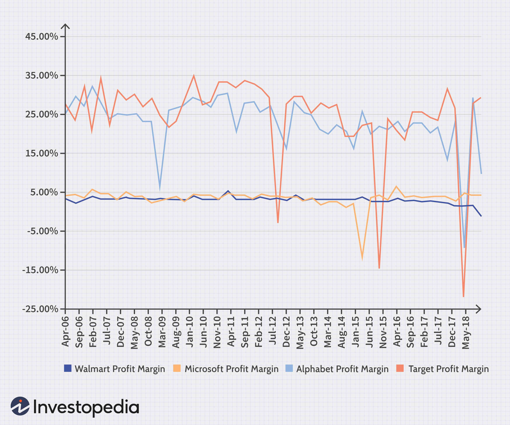

The media industry encompasses a broad spectrum of sectors, notably film, television, and digital media. Its evolution has been significantly influenced by advancements in digital technology, which have reshaped traditional business models. As these sectors undergo continuous transformation, understanding their profitability becomes imperative. This understanding not only benefits industry stakeholders but also provides insights into the dynamic nature of global media markets.

In recent years, the film and television industries have witnessed a substantial shift in revenue generation methods. The film industry's income, traditionally reliant on box office sales, has expanded to include home media sales and digital streaming rights. Similarly, the television industry, once dominated by cable networks, now thrives on subscription and licensing deals fostered by standalone streaming services.



This article aims to analyze the profitability of these two pivotal sectors while emphasizing the increasingly vital role of algorithmic trading in maximizing revenue. Algorithmic trading utilizes complex data analysis to forecast audience behaviors, providing stakeholders with actionable insights to optimize their investments.

Comparing film and television sectors reveals differing profitability mechanisms. The film industry, often associated with high-budget projects, continues to draw substantial profits from franchises despite inherent financial risks. Meanwhile, television, with its relatively lower production costs, achieves significant returns through successful series and emerging digital platforms.

As these industries navigate a rapidly evolving market, this article will provide a comprehensive comparison of their revenue mechanisms alongside anticipated future trends. By examining key revenue streams and technological advancements, such as algorithmic trading, we offer a detailed perspective on how these sectors are adapting to sustain profitability in an ever-changing landscape.

## Table of Contents

## Film Industry Profitability

The film industry, synonymous with the glitz and glamour of Hollywood, is a significant economic powerhouse, bolstering various fiscal segments and perpetually evolving through technological advancements. Central to its financial success are several key revenue streams.

Foremost among these are box office sales, which continue to be a primary source of income. According to the Motion Picture Association, the global box office revenue reached approximately $42.5 billion in 2019, emphasizing the scale of economic activity generated by theatrical releases. Films that excel in box office performance often transition successfully to secondary income sources, such as home media sales, which include DVDs, Blu-rays, and digital downloads. These platforms offer consumers permanent access to content, extending the revenue period long after theatrical releases have ended.

The surge of digital platforms has shifted traditional paradigms of movie revenue. Streaming giants like Netflix and Disney+ have pioneered subscription-based and transactional video-on-demand (TVOD) models, presenting studios with fresh avenues for monetization. This shift is significant, as streaming platforms often engage in licensing deals, which can be lucrative for content creators. As an example, Netflix's investment in original films and its licensing strategies with external studios have added substantial value to its subscriber base, which, as of 2021, exceeded 200 million globally.

In parallel, big-budget films and franchises, such as those produced by Marvel Studios or the Star Wars Saga, demonstrate substantial profit potential despite high production costs. These films typically benefit from robust global marketing campaigns, merchandise sales, and extensive theatrical and digital release windows. However, their profitability is not devoid of risk. Factors such as fluctuating market conditions, consumer preferences, and production setbacks can adversely impact financial outcomes.

Additionally, [algorithmic trading](/wiki/algorithmic-trading) has emerged as a novel tool for optimizing investment strategies within the film industry. By leveraging complex data analytics, stakeholders can forecast potential successes and strategically allocate resources. For instance, predictive models can analyze data on consumer preferences, market trends, and historical performance metrics to guide investment decisions. This method reduces potential risks and increases the probability of hitting box office targets and maximizing returns.

Overall, the film industry's adaptability to digital innovations and strategic financial planning, supported by technological advancements like algorithmic trading, remains crucial in its pursuit of profitability in an increasingly competitive media landscape.

## Television Industry Profits

The television industry derives its profitability primarily from three key sources: advertisement sales, subscriptions, and licensing deals. Each of these revenue streams plays a crucial role in sustaining the economic vitality of television networks.

Advertisement sales have long been the cornerstone of television industry profits. Broadcasters generate significant income by selling airtime to advertisers, who are keen to reach mass audiences during popular television broadcasts. The price of advertising slots is generally determined by viewership ratings, with prime-time slots fetching higher prices due to larger audience numbers. As audiences shift towards digital platforms, television networks have adapted by incorporating targeted advertising strategies, leveraging viewer data to enhance ad relevancy and effectiveness.

Subscription models have also proven lucrative, especially for cable networks such as HBO, which offer premium content to subscribers. By providing exclusive and high-quality programming, networks like HBO have historically maintained large profit margins. Subscription-based services offer a steady revenue stream, as consumers show willingness to pay for ad-free or premium content. This model has been further amplified by the expansion of standalone streaming services, which have reshaped traditional monetization strategies.

The advent of streaming services has revolutionized how television networks reach audiences and generate profits. Platforms such as Netflix, Hulu, and Disney+ have transformed consumer viewing habits, enabling on-demand content access. This shift has allowed television networks to monetize content through licensing agreements, where streaming platforms pay for rights to host shows. Licensing deals serve as a significant profit generator, especially for popular series with wide appeal.

Television series typically involve lower production costs compared to films, enabling television networks to achieve substantial profitability with successful shows. The episodic nature of television content allows for extended viewer engagement and opportunities for continuous advertising and subscription revenue. Successful series can be leveraged for syndication, further amplifying profitability by licensing previously aired content to other broadcasters.

The integration of emerging digital technologies presents new avenues for revenue enhancement within the television sector. Advanced data analytics and [machine learning](/wiki/machine-learning) facilitate improved audience targeting, content recommendation algorithms, and personalized viewing experiences. These technological innovations not only enhance viewer satisfaction but also optimize advertising strategies, leading to increased ad revenues. Additionally, digital distribution platforms enable global reach, allowing content to be monetized across various international markets.

In summary, the television industry's profitability is effectively sustained through a combination of advertisement sales, subscription models, and licensing agreements. The ongoing rise of digital platforms and technological advancements continues to offer novel profit opportunities, ensuring that television remains a robust and adaptable sector within the broader media industry.

## Media Industry Comparison

The film and television industries are pillars of the media landscape, each generating significant revenues through distinct mechanisms. While both sectors thrive financially, their paths to profitability differ markedly due to their respective business models and revenue streams.

The broader media industry includes various sectors such as gaming and publishing, each exhibiting unique profit margins influenced by digital innovations. For instance, the gaming industry has embraced microtransactions and in-game purchases, leading to diverse revenue streams beyond traditional sales. Similarly, digital platforms have redefined publishing, with e-[books](/wiki/algo-trading-books) and audiobooks gaining prominence alongside printed media. Such digital transformations have reshaped profit dynamics across these industries, highlighting the necessity for each sector to adapt its strategies to modern consumer behaviors.

Barriers to entry play a crucial role in determining profitability for media sectors. In the film industry, the substantial financial investment required for production, distribution, and marketing presents a significant barrier. Conversely, the television sector can achieve higher profitability with lower production costs, particularly through successful shows that attract advertisements and subscriptions. Meanwhile, the gaming and publishing sectors face different challenges, such as technological infrastructure for development and distribution in gaming, or access to distribution channels in publishing.

Market reach and consumer preferences are critical determinants of success in media sectors. The global distribution of films and television series, facilitated by streaming platforms, has expanded market reach, allowing content to find diverse international audiences. Gaming has similarly benefited from international markets, while publishing grapples with varying consumer preferences across regions. Understanding and catering to these preferences can significantly impact profitability and market share.

Technological advancements, such as algorithmic trading, have revolutionized investment strategies within the media industry. By utilizing complex data analytics, these tools offer predictive insights into market trends and consumer behavior, enabling media companies to optimize their investment allocations. Algorithmic trading assists in forecasting the potential success of media projects, allowing stakeholders to mitigate risks and capitalize on lucrative opportunities. This strategic application of technology enhances decision-making processes, fostering more efficient resource management and improved returns on investment.

Examining profit margins and emerging trends provides valuable insights into potential opportunities and risks within the media landscape. Stakeholders can leverage these insights to identify sectors with promising growth, streamline operations, and strategically invest in future endeavors. By navigating the evolving media environment with informed decisions, companies can ensure sustainable profitability in an increasingly competitive market.

## Impact of Algorithmic Trading on Media

Algorithmic trading has become a transformative force in the media industry, applying complex data analytics to forecast success and optimize investments. By utilizing vast datasets, algorithmic models are adept at predicting audience behavior, thereby enhancing market strategies and profitability. These models typically take into account various factors such as viewer demographics, social media engagement, and historical viewing patterns to generate predictions.

For instance, consider a simplified algorithm used to predict audience engagement for a television show. The model might employ a linear regression to determine potential viewership based on historical data:

$$

V = \beta_0 + \beta_1x_1 + \beta_2x_2 + \ldots + \beta_nx_n + \epsilon 
$$

where $V$ represents the predicted viewership, $x_1, x_2, \ldots, x_n$ are the various influencing factors (like air time, genre popularity, etc.), $\beta_0, \beta_1, \ldots, \beta_n$ are the coefficients determining each factor's weight, and $\epsilon$ is the error term.

Additionally, the integration of Artificial Intelligence (AI) plays a crucial role in understanding consumer preferences. Machine learning algorithms analyze large-scale data to identify patterns and trends that manual analysis could overlook. For example, recommendation engines powered by AI personalize content delivery, potentially increasing viewer retention and subscription rates.

Python code for a basic recommendation system might look like this:

```python
from sklearn.feature_extraction.text import TfidfVectorizer
from sklearn.metrics.pairwise import cosine_similarity

# Sample data
titles = ["Movie A", "Movie B", "Movie C"]
descriptions = ["Action packed thriller", "Romantic comedy", "Sci-fi adventure"]

# Convert text to feature vectors
vectorizer = TfidfVectorizer()
tfidf_matrix = vectorizer.fit_transform(descriptions)

# Compute similarity
similarity_matrix = cosine_similarity(tfidf_matrix)

# Function to get recommendations
def recommend(title_index):
    similar_indices = similarity_matrix[title_index].argsort()[:-4:-1]
    recommendations = [(titles[i], similarity_matrix[title_index][i]) for i in similar_indices]
    return recommendations[1:]  # Exclude the input title itself

# Example usage
recommendations = recommend(0)  # Get recommendations for "Movie A"
```

Strategically deploying these algorithmic insights enables media companies to allocate resources more effectively, thus reducing risks and maximizing returns. For instance, before committing significant resources to a new film or series, companies can use predictive tools to determine the likelihood of its commercial success.

The competitive advantage in today's media landscape increasingly hinges on the strategic application of algorithmic insights. With the capability to adjust media content and strategies in alignment with consumer preferences, companies that effectively leverage these technologies can maintain and even expand their market position. As digital data continues to grow exponentially, the importance of algorithmic trading in media investment decisions will likely increase, creating a resilient pathway for sustained profitability.

## Future Trends in Media Profitability

The integration of film and financial technology is creating new avenues for profitability in the media industry. Emerging technologies such as Virtual Reality (VR) and Augmented Reality (AR) are playing significant roles in reshaping content distribution and audience engagement. By offering immersive experiences, VR and AR not only enhance consumer interaction with media content but also open new revenue streams through innovative advertising opportunities and premium content offerings. For example, VR cinema experiences and AR-enhanced applications allow content creators to charge higher fees for enhanced viewing experiences.

The evolution of streaming services continues to disrupt traditional media profitability models. Companies like Netflix, Amazon Prime, and Disney+ are continually enhancing their services by leveraging data analytics to offer personalized content recommendations, thereby increasing viewer engagement and subscription renewals. This continuous evolution pressures traditional media outlets to adapt and explore hybrid offerings that combine linear broadcasting with digital streaming services to maintain competitive edges.

Blockchain technology presents another transformative opportunity, especially in the areas of rights management and royalty distribution. By providing transparent and immutable records of transactions and ownership, blockchain can streamline the complex process of managing intellectual property rights. This technology enables more efficient tracking of content usage and facilitates direct royalty payments to creators, reducing overhead costs and minimizing disputes over intellectual property.

The growing reliance on data-driven approaches is critical for addressing the challenges of a rapidly changing economic landscape within the media industry. Advanced data analytics and [artificial intelligence](/wiki/ai-artificial-intelligence) enable media companies to analyze consumer behavior patterns, predict content success, and optimize marketing strategies effectively. This data-centric approach fosters more precise targeting of audiences and allows for dynamic content creation that aligns with consumer preferences.

In summary, the future profitability of the media industry is being shaped by the convergence of film and financial technology, with VR, AR, streaming services, blockchain, and data analytics all contributing to transformative profit-making trends. As these technologies evolve, media companies must harness their potential to optimize operations and achieve sustained growth in a competitive environment.

## Conclusion

The media industry's profitability landscape is undergoing significant transformation, driven by ongoing digital advancements and the emergence of new technologies. Traditional revenue models, historically reliant on stable sources such as box office sales and television advertisements, are being challenged and redefined in response to changing consumer behaviors and technological innovations. Media stakeholders must actively seek adaptive strategies to remain competitive in this evolving market environment.

Algorithmic trading has emerged as a critical tool in enhancing investment decisions within the media sector. By leveraging complex data analytics, stakeholders can gain predictive insights into market trends, audience preferences, and content performance. This data-driven approach allows for more precise allocation of resources, optimizing revenue streams and minimizing financial risks. The integration of such innovative technologies with strategic decision-making processes is increasingly necessary for achieving sustained success.

As digital transformation continues to reshape traditional media landscapes, embracing technology-driven approaches becomes essential. Emerging technologies such as artificial intelligence, machine learning, virtual reality, and blockchain are offering new avenues for revenue generation and efficiency improvements. Whether through predictive modeling to understand audience engagement or innovative content distribution mechanisms, these technologies present substantial opportunities for media companies to enhance profitability.

The path forward for media stakeholders lies in the ability to blend technological advancements with strategic foresight, adapting quickly to market shifts while capitalizing on new opportunities. By fully integrating these modern tools and methodologies, the media industry can not only sustain but also amplify its profitability in the face of rapid technological changes.

## References & Further Reading

[1]: Motion Picture Association. (2019). ["THEME Report 2019."](https://www.motionpictures.org/research-docs/2019-theme-report/)

[2]: Cones, John W. (2008). ["The Business of Film: A Practical Introduction"](https://www.amazon.com/Business-Film-American-Market-Presents/dp/1032108746) Routledge.

[3]: Donaton, S. (2004). ["Madison & Vine: Why the Entertainment and Advertising Industries Must Converge to Survive"](https://www.amazon.com/Madison-Vine-Entertainment-Advertising-Industries/dp/0071462163) McGraw-Hill.

[4]: Lotz, Amanda D. (2014). ["The Television Will Be Revolutionized"](https://www.jstor.org/stable/j.ctt9qfwq5) New York University Press.

[5]: Elberse, Anita. (2013). ["Blockbusters: Hit-making, Risk-taking, and the Big Business of Entertainment"](https://www.hbs.edu/faculty/Pages/item.aspx?num=44790) Henry Holt and Co.

[6]: Hastings, R. & Meyer, E. (2020). ["No Rules Rules: Netflix and the Culture of Reinvention"](https://www.amazon.com/No-Rules-Netflix-Culture-Reinvention/dp/1984877860) Penguin Press.

[7]: Thompson, E. (2016). ["Media Industries: History, Theory, and Method"](https://www.wiley.com/en-us/Media+Industries%3A+History%2C+Theory%2C+and+Method-p-9781405163415) Wiley-Blackwell.

[8]: Iordanova, Dina. (2012). ["Digital Disruption: Cinema Moves Online"](https://archive.21global.ucsb.edu/research/media-culture/library/digital-disruption-cinema-moves-line) SAGE Publications Ltd.

[9]: Napoli, Philip M. (2011). ["Audience Evolution: New Technologies and the Transformation of Media Audiences"](https://archive.org/details/audienceevolutio0000napo) Columbia University Press.